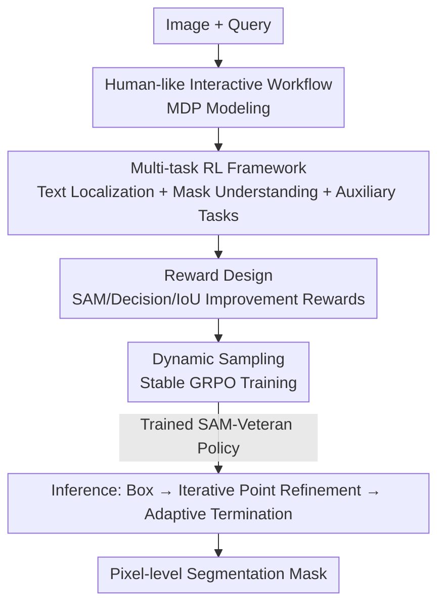

# SAM-Veteran: An MLLM-based Human-like SAM Agent for Reasoning Segmentation

**Conference**: ICLR 2026  
**OpenReview**: [https://openreview.net/forum?id=oN55r8iJJW](https://openreview.net/forum?id=oN55r8iJJW)  
**Code**: None  
**Area**: Multimodal VLM / Reasoning Segmentation / Reinforcement Learning  
**Keywords**: Reasoning Segmentation, SAM, MLLM, GRPO, Interactive Segmentation

## TL;DR
SAM-Veteran trains an MLLM to become a "seasoned SAM user" by imitating a human-like interactive segmentation workflow: "generating initial boxes $\rightarrow$ observing SAM masks for iterative refinement via points $\rightarrow$ adaptive termination." This behavior is learned through a multi-task reinforcement learning framework based on GRPO, achieving new SOTA on both in-distribution and out-of-distribution reasoning segmentation benchmarks.

## Background & Motivation
**Background**: Reasoning segmentation requires outputting pixel-level masks based on complex textual queries like "the object held by the person in red," necessitating logical reasoning. Current methods typically combine MLLMs (strong in reasoning and alignment) with SAM (strong in pixel-level understanding) via two routes: Supervised Fine-Tuning (SFT) to drive a learnable segmentation head using special tokens, or Reinforcement Learning (RL) where the MLLM generates boxes/points for a frozen SAM.

**Limitations of Prior Work**: SFT-based methods suffer from catastrophic forgetting of general reasoning and poor generalization to out-of-distribution (OOD) data. RL-based methods either decouple the MLLM from SAM during training (leading to sub-optimal inputs) or fail to utilize SAM's core strength—its capacity for **interactive, iterative mask refinement** as performed by human users. SegAgent, which attempts to mimic human behavior, relies on external MLLMs for initial boxes, lacks adaptive termination, and uses fixed point trajectories for supervision, which restricts the model from exploring optimal refinement strategies.

**Key Challenge**: Human interaction with SAM forms a closed loop—drawing a box, identifying mask errors, refining with positive/negative points, and stopping when the quality is sufficient. Existing methods only capture fragments of this loop (e.g., box generation only or point refinement without a stop condition), and no framework integrates "box generation + iterative refinement + adaptive termination" into a unified system.

**Goal**: Enable MLLMs to replicate the complete human-like SAM workflow without relying on manual point-trajectory supervision, allowing the model to discover effective refinement strategies directly through SAM's feedback.

**Key Insight**: Model this process as a Markov Decision Process (MDP) and employ reinforcement learning instead of imitation learning. This allows the model to use the "SAM output mask IoU" as a direct reward signal to learn SAM-friendly prompts rather than simply memorizing human trajectories.

**Core Idea**: Utilize a GRPO-based multi-task RL framework to instill "text localization (box generation)" and "mask understanding (judging quality + point refinement/termination)" capabilities, transforming the MLLM into an iterative, self-terminating "SAM Veteran."

## Method

### Overall Architecture
The inference workflow of SAM-Veteran is a human-like interactive loop: given image $I$ and query $Q$, the MLLM generates a bounding box $b\in\mathbb{R}^4$ using a localization prompt $Q_B$, which is fed to SAM for an initial mask $M$. Subsequently, the "image + current mask (visualized as a green translucent overlay)" is fed back to the MLLM. Using a refinement prompt $Q_P$, the MLLM outputs refinement points: positive points $p^+$ to recover missed foreground (false negatives) and negative points $p^-$ to remove extra background (false positives). The refined points and the previous mask are fed into SAM to obtain an updated mask $M'$. This refinement loop continues until the MLLM outputs `null` for both points (adaptive termination) or reaches the maximum step limit (forced termination).

The process is formalized as an MDP $(S,A,T,R)$: the state $s=(M,I,Q)$ is the current triplet; the initial action is a box $a=b$, followed by point pairs $a\in\{(p^+,p^-),(p^+,\text{null}),(\text{null},p^-),(\text{null},\text{null})\}$; the transition function $T$ is the SAM model; and the reward $R$ evaluates mask quality changes. The objective is to learn a policy $\pi_\theta(a|s)$ that maximizes the expected reward $\mathbb{E}_{a\sim\pi_\theta}[R(s',s,a)]$.

On the training side, the workflow is decomposed into three GRPO tasks accompanied by a dynamic sampling strategy to stabilize RL.

### Key Designs

**1. Human-like Interactive Workflow: Unifying "Box-Refinement-Stop" into an MDP**

Addressing the limitation that existing methods only capture fragments of the human SAM loop, this work models the entire process—initial box generation, iterative point refinement based on SAM feedback, and adaptive termination—within a single MDP solved via RL. Key to this is treating SAM as the environment's transition function $s'=T(s,a)$. Each MLLM action (box or point) is converted by SAM into a new mask, and the subsequent state $s'=(M',I,Q)$ is returned to the MLLM. Consequently, the MLLM does not view a static image but the actual mask produced by SAM after its previous operation, learning the logic of "adding a positive point where it missed and a negative point where it over-segmented." Unlike SegAgent's imitation of human trajectories, there is no fixed "standard sequence," allowing the model to explore optimal refinement paths and naturally support adaptive termination by outputting `(null,null)`.

**2. Multi-task RL Framework: Decoupling Localization and Mask Understanding via Three GRPO Tasks**

To execute the workflow, the MLLM requires two core capabilities: text localization (box generation) and mask understanding (quality judgment + refinement). The framework uses three GRPO-based tasks:

- **Task 1: Text Localization**: Given the image and query, the MLLM produces reasoning steps and box coordinates $b$. The reward encourages boxes to be both accurate (Box IoU/L1) and "SAM-friendly" (high IoU of the mask generated by SAM from that box).
- **Task 2: Mask Understanding**: Given the image and a green SAM mask overlay, the MLLM judges quality. It generates refinement points if unsatisfied or `(null,null)` to terminate if satisfied.
- **Task 3: Auxiliary Mask Understanding**: The authors found that with only the first two tasks, the MLLM would refine indefinitely even on perfect masks due to poor understanding of "overlapped masks." This task uses manually corrupted GT masks (adding/removing random polygons) and requires the MLLM to identify the center of the error regions. This specifically builds the capability to "see what is wrong with the mask," enabling adaptive termination.

**3. Case-Action Reward Design: Teaching When to Fix and When to Stop**

To address the challenge of knowing when to refine versus stop, a reward system based on "Case × Action" combinations was designed. Training masks are categorized into **Good Enough** (IoU $\ge 0.9$ using a modified IoU that excludes edge noise) or **Need Refinement** (IoU $< 0.9$).

- **Decision Reward $R^{DCS}$**: 1 point if the model refines when needed or stops when good enough; 0 otherwise.
- **IoU Improvement Reward $R^\Delta$**: If refinement is performed, points are awarded based on the specific IoU gain $\Delta = \text{IoU}(M',M^{GT})-\text{IoU}(M,M^{GT})$, with a maximum of 3 points for $\Delta > 0.5$.

Combining these (e.g., $R^{DCS}+3$ for correct termination on a Good Enough mask) ensures consistent training signals. Ablations show that removing any component or using a binary "hard" $R^\Delta$ degrades performance.

**4. Dynamic Sampling: Ensuring Rollout Diversity for GRPO**

GRPO advantages rely on reward differences among rollouts. To prevent gradient vanishing from homogeneous batch rewards, dynamic sampling is used. In the localization task, candidate boxes are **over-sampled** and de-duplicated to ensure multiple objects/locations are explored. In mask understanding, the system continues sampling rollouts until all four action types—$(null,null)$, $(p^+,null)$, $(null,p^-)$, and $(p^+,p^-)$—are represented, ensuring valid advantage estimation.

### Loss & Training
The base MLLM is Qwen2.5-VL-7B-Instruct, with SAM2-Large as the segmentation module. Training uses GRPO with a batch size of 16 and 8 rollouts per sample. AdamW optimizer is used ($lr = 10^{-6}$, weight decay $0.01$, KL coefficient $0.005$). REINFORCE++ global batch normalization is used to stabilize training. One episode takes ~30 hours on 8x 96GB GPUs. Training is conducted on RefCOCOg only, with a refinement limit of 3 during evaluation.

## Key Experimental Results

### Main Results
Using only RefCOCOg for training, the model was evaluated on ID (RefCOCO/+/g) and OOD (ReasonSeg) benchmarks against SFT and RL baselines (7B versions, IoU %):

| Dataset | Metric | SAM-Veteran | Prev. SOTA | Note |
|-------|------|------|----------|------|
| ReasonSeg val (OOD) | gIoU | **68.2** | 64.0 (SAM-R1) | Significant OOD lead |
| ReasonSeg val (OOD) | cIoU | **67.3** | 64.5 (POPEN) | |
| ReasonSeg test (OOD) | gIoU | **62.6** | 60.2 (SAM-R1) | |
| RefCOCO testA (ID) | cIoU | **80.8** | 80.3 (Seg-Zero) | Parity/Slightly better |
| RefCOCO+ testA (ID) | cIoU | **76.6** | 76.2 (Seg-Zero) | |
| RefCOCOg test (ID) | cIoU | 73.4 | 74.6 (SegAgent/POPEN) | Slightly lower but better generalization |

The OOD performance is the highlight: SAM-Veteran consistently outperforms all baselines on ReasonSeg. While SegAgent is higher on RefCOCOg test, its reliance on SFT trajectories leads to a crash in OOD scenarios (ReasonSeg val gIoU only 33.0).

### Ablation Study
Task-level ablation (Avg. across five benchmarks, IoU %):

| TG | MC | A | Avg. | Termination Behavior |
|----|----|---|------|---------|
| Qwen+SAM2 Baseline | | | 64.4 | Arbitrary |
| ✓ | | | 70.3 | Arbitrary |
| ✓ | ✓ | | 72.1 | Never stops |
| ✓ | ✓ | ✓ | **72.2** | Adaptive |

Removing $R^{SAM}$, $R^{DCS}$, or $R^\Delta$ results in performance drops to 71.3, 70.6, and 70.4 respectively.

### Key Findings
- **Auxiliary Task is Crucial for Termination**: Without Task 3, the model refines indefinitely. Correcting corrupted masks allows the model to "learn the stop condition," which is the most significant behavioral gain.
- **Refinement Benefits OOD Most**: As refinement steps increase, IoU on ReasonSeg val rises alongside the termination rate (63.5% $\rightarrow$ 80.5%). Original Qwen actually sees IoU decrease with iteration, showing it lacks valid mask understanding.
- **Graduated IoU Rewards**: Scoring based on the magnitude of improvement (0/1/2/3) is more effective than binary success scoring, encouraging substantial improvements over minor edits.

## Highlights & Insights
- **SAM as an RL Transition Function**: Learning from SAM's actual feedback rather than memorizing human trajectories is the fundamental reason for superior OOD generalization compared to SegAgent.
- **Heuristic Auxiliary Task**: Solving the "infinite refinement" problem by training on manually corrupted masks directly addresses the MLLM's pre-training weakness in mask perception, unlocking adaptive termination.
- **Case-Action Reward Table**: Explicitly encoding "when to fix vs stop" into the reward structure is more effective at shaping decision behavior than a monolithic IoU reward.

## Limitations & Future Work
- Training on a single dataset (RefCOCOg) limits validation for extremely complex queries (multi-object, compositional reasoning).
- The refinement limit of 3 is a trade-off; the stability of longer iterations was not deeply explored.
- SAM acts as a frozen upper bound; if SAM fails systematically on a specific object type, point refinement cannot easily compensate.
- High training costs and reliance on specific engineering details (modified IoU, class balancing) make reproduction non-trivial.

## Related Work & Insights
- **vs SegAgent**: Both mimic human SAM usage, but SegAgent relies on SFT for trajectories and lacks adaptive termination. SAM-Veteran's RL-based exploration in the SAM feedback loop yields much stronger OOD robustness.
- **vs SAM-R1**: SAM-R1 uses SAM for RL rewards but only generates boxes without iterative refinement.
- **vs Seg-Zero**: Seg-Zero uses RL for reasoning chains but does not include SAM outcomes in the reward loop. SAM-Veteran outperforms it by making the segmentation result an integral part of the reinforcement signal.

## Rating
- Novelty: ⭐⭐⭐⭐⭐ First SAM agent to unify box, iterative refinement, and adaptive termination in a single RL framework.
- Experimental Thoroughness: ⭐⭐⭐⭐ Strong OOD results and multi-dimensional ablations, though training data is limited.
- Writing Quality: ⭐⭐⭐⭐ Clear MDP modeling and intuitive reward design.
- Value: ⭐⭐⭐⭐⭐ OOD SOTA achievements; the "tool-feedback-driven iteration" paradigm is highly applicable to other agent-based tasks.

## Related Papers

- [\[NeurIPS 2025\] SAM-R1: Leveraging SAM for Reward Feedback in Multimodal Segmentation via Reinforcement Learning](../../NeurIPS2025/segmentation/sam-r1_leveraging_sam_for_reward_feedback_in_multimodal_segmentation_via_reinfor.md)
- [\[ICLR 2026\] SAM 3: Segment Anything with Concepts](sam_3_segment_anything_with_concepts.md)
- [\[ICLR 2026\] Urban Socio-Semantic Segmentation with Vision-Language Reasoning](urban_socio-semantic_segmentation_with_vision-language_reasoning.md)
- [\[ICLR 2026\] Detective SAM: Adaptive AI-Image Forgery Localization](detective_sam_adaptive_ai-image_forgery_localization.md)
- [\[AAAI 2026\] SAQ-SAM: Semantically-Aligned Quantization for Segment Anything Model](../../AAAI2026/segmentation/saq-sam_semantically-aligned_quantization_for_segment_anything_model.md)

<!-- RELATED:END -->

<!-- RELATED:START -->

## Related Papers

- [\[ICLR 2026\] Urban Socio-Semantic Segmentation with Vision-Language Reasoning](urban_socio-semantic_segmentation_with_vision-language_reasoning.md)
- [\[ICLR 2026\] SAM 3: Segment Anything with Concepts](sam_3_segment_anything_with_concepts.md)
- [\[NeurIPS 2025\] SAM-R1: Leveraging SAM for Reward Feedback in Multimodal Segmentation via Reinforcement Learning](../../NeurIPS2025/segmentation/sam-r1_leveraging_sam_for_reward_feedback_in_multimodal_segmentation_via_reinfor.md)
- [\[ICLR 2026\] Detective SAM: Adaptive AI-Image Forgery Localization](detective_sam_adaptive_ai-image_forgery_localization.md)
- [\[ICLR 2026\] Panoptic Pairwise Distortion Graph](panoptic_pairwise_distortion_graph.md)

<!-- RELATED:END -->
