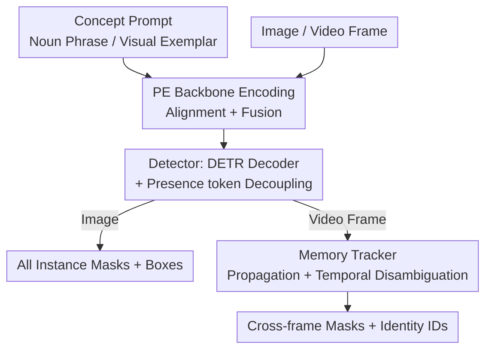

# SAM 3: Segment Anything with Concepts

**Conference**: ICLR 2026  
**OpenReview**: [https://openreview.net/forum?id=r35clVtGzw](https://openreview.net/forum?id=r35clVtGzw)  
**Paper**: [Meta AI SAM 3](https://ai.meta.com/sam3)  
**Code**: https://github.com/facebookresearch (Open-source SAM 3 weights, inference code, and SA-Co benchmark)  
**Area**: 3D Vision / Video Understanding / Segmentation  
**Keywords**: Promptable Concept Segmentation, Open-Vocabulary Detection, presence token, Data Engine, Video Tracking

## TL;DR
SAM 3 unifies "finding and segmenting all instances of a concept in images/videos" (Promptable Concept Segmentation, PCS) into a single model. By using noun phrases or visual exemplars as prompts, it outputs masks and cross-frame identities for all matching instances via a shared backbone + detector + memory tracker. Supported by a human-AI collaborative data engine producing a training set with 4M concept labels, SAM 3 doubles the accuracy of existing systems in both image and video PCS.

## Background & Motivation

**Background**: The SAM series (SAM 1/2) pioneered "Promptable Visual Segmentation" (PVS)—where a point, box, or mask prompt allows the model to segment a **single** object and track it in videos. This paradigm was breakthrough for interactive segmentation.

**Limitations of Prior Work**: PVS has a fundamental limitation—it processes only one object instance at a time. However, real-world needs often involve "segmenting **all** cats in a video" or "annotating **every** yellow school bus in an image." PVS cannot achieve such "all-instance concept segmentation." While existing open-vocabulary detectors (e.g., OWLv2, GroundingDINO, LLMDet) can detect via text, they suffer from low precision, poor segmentation quality, and severe degradation on diverse, long-tail concepts (baseline cgF1 scores on SA-Co are typically only 10~30).

**Key Challenge**: To perform "concept segmentation" effectively, a model must simultaneously solve two opposing tasks: **Recognition** (Is the concept in the frame? This requires global context) and **Localization** (Where is each specific instance? This is fundamentally local). Learning both on the same set of queries leads to task conflict. Furthermore, open-vocabulary tasks require massive training data with hard negatives, which simply does not exist.

**Goal**: (1) Formalize PCS as a promptable, interactive task unified across images and videos; (2) Design an architecture where recognition/localization and detection/tracking operate independently without mutual interference; (3) Generate a sufficiently large, challenging, and clean training dataset.

**Key Insight**: The authors observe that the conflict between recognition and localization can be eliminated through "decoupling": a dedicated global token answers "is the concept present," while proposal queries answer "am I a matching instance." The final score is the product of both. Similarly, the detector (identity-agnostic) and tracker (identity-distinct) are decoupled while sharing a backbone to avoid task conflict. Data issues are addressed by an "AI Annotator + AI Verifier" loop that focuses human effort on the most challenging failure cases.

**Core Idea**: A trio of "Presence token for decoupled recognition/localization + Decoupled detector/tracker on a shared backbone + Human-AI data engine" advances promptable segmentation from "single object" to "all matching instances with cross-frame identity."

## Method

### Overall Architecture

SAM 3 is a generalization of SAM 2, supporting both the original PVS (point/box/mask prompt for one object) and the new PCS (noun phrase / visual exemplar prompt for all instances of a concept). Given an image or short video (≤30s) and a concept prompt, the model detects, segments, and tracks all matching instances with unique IDs.

The inference pipeline is a **dual encoder-decoder transformer**. All visual and linguistic inputs pass through an aligned Perception Encoder (PE) backbone. A **Detector** (DETR-style, with a presence token) performs single-frame "all-instance discovery," while a **Memory Tracker** (inherited from SAM 2) propagates detections across video frames and maintains identity. The detector and tracker **share the PE backbone** but are decoupled—the detector focuses on frame-by-frame object discovery, while the tracker focuses on temporal identity separation. Text phrases are global to the video, while visual exemplars can be added iteratively as positive/negative boxes to refine results.

> Note: The Data Engine (Training side) is not in this inference diagram but serves as the other half of SAM 3's performance jump, detailed in Key Design 5.

### Key Designs

**1. Decoupled Detector and Tracker with Shared PE Backbone**

PCS requires finding all instances per frame and maintaining identities across the video. These goals conflict: detectors should be **identity-agnostic** (finding matches), while trackers must **distinguish identities** (separating instances over time). SAM 3 splits these into two modules sharing an aligned PE backbone. The detector uses a DETR paradigm where prompts are encoded into tokens; an image encoder cross-attends these prompt tokens, followed by a DETR decoder where learnable object queries cross-attend conditioned features to predict box deltas and binary match logits. The tracker uses a SAM 2-style architecture for propagation. Decoupling allows independent optimization and prevents task interference.

**2. Presence Token: Decoupling Recognition from Localization**

Forcing proposal queries to judge both "what" (global presence) and "where" (local instance) is contradictory. SAM 3 introduces a learnable **global presence token** solely responsible for predicting $p(\text{NP present in input})$. Each proposal query $q_i$ then only solves a pure localization problem: $p(q_i \text{ is a match} \mid \text{NP present})$. The final score for each query is the product:

$$\text{score}(q_i) = p(\text{NP present}) \cdot p(q_i \text{ is a match} \mid \text{NP present})$$

This significantly improves detection precision by offloading the global context judgment.

**3. Visual Exemplar Prompts and Interactive Refinement**

Text alone is sometimes insufficient for rare concepts or model errors. SAM 3 supports **visual exemplars**—pairs of "box + positive/negative label"—which can supplement or replace text. Unlike PVS, a single positive box on a dog causes the model to detect **all** dogs. Exemplars are encoded via an exemplar encoder (position + label embeddings + ROI-pooled features) and appended to the prompt tokens. Users can refine results by adding positive boxes for missed instances and negative boxes for false positives. Experiments show interactive PCS improves faster than PVS: after 3 clicks, it outperforms pure text by +21.6 cgF1 and PVS refinement by +2.0 because exemplars allow the model to **generalize** (detecting/suppressing similar objects).

**4. Memory Tracker and Temporal Disambiguation**

To handle ambiguity in crowded video scenes, the tracker utilizes a memory bank (past frames/conditioned frames). SAM 3 employs two **temporal disambiguation** strategies: (i) **masklet detection scores**—tracking the consistency of a masklet being matched by the detector over a time window to suppress "ghost" trajectories; (ii) **periodic detection re-prompting**—during occlusions where the tracker's prediction $\hat{M}_t$ might drift, it is periodically replaced by high-confidence detection masks $O_t$ to ensure reliable references in the memory bank.

**5. Human-AI Collaborative Data Engine (Training)**

SAM 3 utilizes a feedback loop involving SAM 3, human annotators, and AI agents to mine failure cases. Three innovations: (i) **Media Filtering**—diversifying sources; (ii) **Label Filtering**—using an ontology (22.4M nodes) + MLLMs as "AI Annotators" to generate phrases and **adversarial hard negatives**; (iii) **Label Verification**—fine-tuning Llama 3.2 as an "AI Verifier" for mask quality and exhaustivity verification. This achieves near-human accuracy while **doubling throughput**, focusing humans only on the hardest samples. The final SA-Co/HQ set contains 5.2M images, 4M unique phrases, and 52M masks.

### Loss & Training
Training proceeds in four stages: (1) PE backbone pre-training; (2) Detector pre-training; (3) Detector fine-tuning; (4) Frozen backbone training for the tracker. The detector uses dual supervision from DAC-DETR and Align loss, with layer-wise delta + box-region-positional bias for regression.

## Key Experimental Results

### Main Results

Image PCS (Text Prompt)—SAM 3 achieves new SOTA in both closed-vocabulary and open-vocabulary settings, at least doubling the performance of strong baselines:

| Task / Dataset | Metric | SAM 3 | Prev. Best | Description |
|--------|------|------|----------|------|
| LVIS Instance Seg | mask AP | 48.8 | 38.5 (DINO-X) | Zero-shot lead |
| LVIS Instance Seg | AP | 48.5 | 38.5 | — |
| SA-Co/Gold (Open-Vocab) | cgF1 | 54.1 | 24.6 (OWLv2⋆) | >2x Improvement |
| COCO Box Detection | AP | 53.6 | — | New Closed-Vocab SOTA |
| ADE-847 Semantic Seg | mIoU | 13.8 | 9.2 (APE-D) | vs. strong expert |
| PC-59 Semantic Seg | mIoU | 60.8 | 58.5 (APE-D) | — |

Visual Exemplar Prompting (Tab. 3, AP+)—SAM 3 significantly outperforms T-Rex2: COCO +18.3, LVIS +10.3, ODinW +20.5. Text+Image (T+I) is the strongest configuration.

Video PCS (Text Prompt, Tab. 5)—Advantages are particularly evident in benchmarks with many Noun Phrases:

| Benchmark | Metric | SAM 3 | Best Baseline | Description |
|--------|------|------|----------|------|
| SA-Co/VEval (SA-V) | pHOTA | 58.0 | 55.7 (Det+T-by-D) | 80%+ of Human performance |
| SA-Co/VEval (YT-Temp) | cgF1 | 50.8 | 47.6 | — |
| BURST | test HOTA | 44.5 | 33.3 (LLMDet+Tracker) | — |
| OVIS | val mAP | 60.5 | 55.1 | — |

PVS (Visual Prompt)—SAM 3 generally outperforms SAM 2 in VOS tasks, leading by 6.5 points on the difficult MOSEv2 dataset. It also excels in counting tasks (CountBench 93.8% accuracy), surpassing many 72B-scale MLLMs.

### Ablation Study

| Configuration | Effect | Description |
|------|---------|------|
| Full model | Optimal | Complete model |
| w/o presence head | Detection drop | Coupling recognition/localization hurts |
| w/o hard negatives | Open-Vocab drop | Vital for open-vocabulary recognition |
| Weaker backbone | Performance drop | PE backbone choice is significant |
| w/o AI Verifier | Half throughput | AI verifier doubles data engine speed |

### Key Findings
- The presence head, hard negatives, and backbone choice are critical for gains; the presence head's decoupling of recognition/localization is the core driver for detection accuracy.
- Interactive PCS improves faster than ideal PVS (after 3 clicks, +2.0 cgF1) because visual exemplars generalize to similar objects; however, it plateaus after 4 clicks as exemplars cannot fix fundamental mask quality issues.
- The paper demonstrates scaling laws for the PCS task regarding data volume and concept diversity.
- Inference is efficient: 30ms for 100+ objects in a single image on H200; video latency grows linearly with object count, achieving near real-time with ~5 concurrent objects.

## Highlights & Insights
- **The "Presence Token" decoupling is the most insightful design**: Extracting "Is it there?" (global) from "Where is it?" (local) and multiplying the scores addresses a major pain point in open-vocabulary detection.
- **Decoupled shared-backbone Detector/Tracker**: By separating orthogonal goals (identity-agnostic discovery vs. identity-aware tracking) while sharing representations, the model elegantly unifies image and video capabilities.
- **AI as Annotator/Verifier**: Using fine-tuned MLLMs as near-human accuracy verifiers to focus humans on difficult samples creates a "model-in-the-loop" data flywheel applicable to many large-scale annotation tasks.
- **Synergy with MLLMs**: While SAM 3 handles atomic noun phrases, it can be used as a visual tool for MLLMs to handle complex reasoning or long referring expressions.

## Limitations & Future Work
- **Concepts limited to simple noun phrases**: Does not natively support long referring expressions or reasoning-heavy queries (requires external MLLMs).
- **Inherent concept ambiguity**: Subjective descriptions ("cozy") or boundary issues ("mirror" frames) persist; addressed partially via oracle evaluation and ambiguity modules.
- **Video latency scaling**: Throughput is limited in extremely dense multi-target scenes.
- Highly specialized domains (e.g., RF-100VL) still require specific fine-tuning.

## Related Work & Insights
- **vs. SAM 1 / SAM 2 (PVS)**: While they segment one object per prompt, SAM 3 scales to all instances with cross-frame IDs, also outperforming SAM 2 on PVS tasks (+6.5 on MOSEv2).
- **vs. OWLv2 / GroundingDINO (Open-Vocab Detectors)**: These struggle with segmentation quality and open-vocabulary precision (cgF1 <30 on SA-Co); SAM 3 doubles this performance via the presence head and data engine.
- **vs. T-Rex2 (Exemplar Detection)**: SAM 3's exemplar encoding and interactive mechanism lead by +10~20 AP, unified within a single model.
- **vs. GLEE (Open-Vocab Video Seg)**: GLEE performs poorly on SA-Co/VEval (cgF1≈0), whereas SAM 3's decoupled architecture excels in complex video benchmarks.

## Rating
- Novelty: ⭐⭐⭐⭐⭐ PCS task formalization + presence token decoupling + Data Engine represent a paradigm shift.
- Experimental Thoroughness: ⭐⭐⭐⭐⭐ Comprehensive coverage across image/video/few-shot/counting with significant gains and scaling laws.
- Writing Quality: ⭐⭐⭐⭐⭐ Clear progression from task definition to architecture and data strategy.
- Value: ⭐⭐⭐⭐⭐ Open-source models and the SA-Co benchmark will deeply impact MLLMs, robotics, and AR.

<!-- RELATED:START -->

## Related Papers

- [\[AAAI 2026\] SAQ-SAM: Semantically-Aligned Quantization for Segment Anything Model](../../AAAI2026/segmentation/saq-sam_semantically-aligned_quantization_for_segment_anything_model.md)
- [\[ICLR 2026\] Matting Anything 2: Towards Video Matting for Anything](matting_anything_2_towards_video_matting_for_anything.md)
- [\[ICLR 2026\] SAM-Veteran: An MLLM-based Human-like SAM Agent for Reasoning Segmentation](sam-veteran_an_mllm-based_human-like_sam_agent_for_reasoning_segmentation.md)
- [\[AAAI 2026\] SAM-DAQ: Segment Anything Model with Depth-guided Adaptive Queries for RGB-D Video Salient Object Detection](../../AAAI2026/segmentation/sam-daq_segment_anything_model_with_depth-guided_adaptive_queries_for_rgb-d_vide.md)
- [\[AAAI 2026\] Segment Anything Across Shots: A Method and Benchmark](../../AAAI2026/segmentation/segment_anything_across_shots_a_method_and_benchmark.md)

<!-- RELATED:END -->
