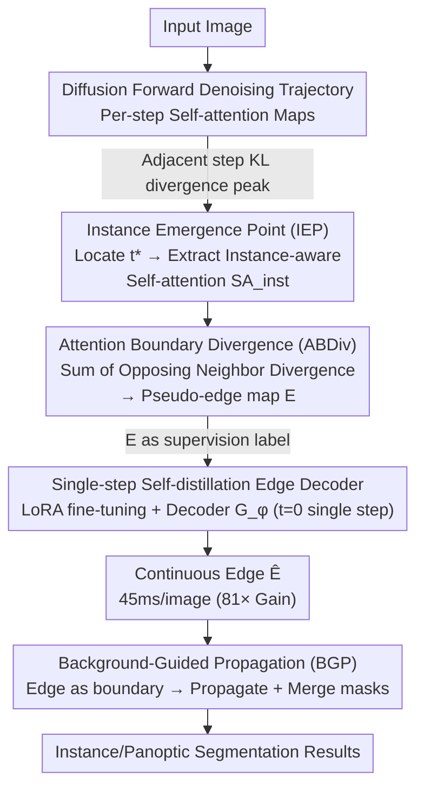

# TRACE: Your Diffusion Model is Secretly an Instance Edge Detector

**Conference**: ICLR 2026 Oral  
**arXiv**: [2503.07982](https://arxiv.org/abs/2503.07982)  
**Code**: [Project Page](https://shjo-april.github.io/TRACE)  
**Area**: Instance Segmentation / Panoptic Segmentation  
**Keywords**: Diffusion Models, Instance Edges, Self-Attention, IEP, Unsupervised Segmentation

## TL;DR

It is discovered that the self-attention of text-to-image diffusion models exhibits an "Instance Emergence Point" (IEP) during the denoising process, where the self-attention shows intense divergence at object boundaries. TRACE generates high-quality instance edges through IEP localization + ABDiv edge extraction + single-step distillation, achieving 81× inference acceleration. Without any instance annotations, it improves unsupervised instance segmentation by +5.1 AP, and its tag-supervised panoptic segmentation outperforms point-supervised methods by +1.7 PQ.

## Background & Motivation

**Background**: Instance and panoptic segmentation have long relied on dense annotations (mask/box/point), which are costly and inconsistent across annotators. Unsupervised solutions (e.g., MaskCut) cluster semantic features from ViT, but ViT is optimized for semantic similarity across images rather than intra-image instance separation, often merging adjacent objects of the same class or fragmented single instances. Weakly supervised solutions require at least point annotations to distinguish instances.

**Limitations of Prior Work**: (1) Unsupervised methods rely on self-supervised ViT features, which are insufficient at the instance level—merging adjacent same-class objects is a fundamental problem; (2) Depth estimation-aided solutions (such as CutS3D) fail on adjacent objects at similar depths; (3) Tag-level weak supervision has approached full-supervision accuracy in semantic segmentation (99% on VOC), but the leap from semantic to panoptic still requires point or box annotations.

**Key Challenge**: Semantic features are good at "knowing what" but poor at "distinguishing who"—instance separation requires a completely different signal source.

**Goal**: To find an annotation-free instance-level signal source to supplement the instance separation capability of semantic features.

**Key Insight**: Diffusion models evolve progressively from noise to instance structure and then to semantic content during the denoising process—at specific timesteps, self-attention briefly but clearly encodes instance boundaries.

**Core Idea**: The self-attention of diffusion models is a hidden instance edge annotator—the sharp divergence in attention distribution across boundaries serves as the instance boundary signal.

## Method

### Overall Architecture

TRACE addresses the problem of "reading out" instance boundaries from pre-trained text-to-image diffusion models in the total absence of instance annotations, supplementing the shortcoming where semantic features "know what but cannot distinguish who." The pipeline operates as follows: first, an input image undergoes the diffusion forward denoising trajectory, monitoring the progressive changes of self-attention maps; at the moment where the instance structure is most prominent—the Instance Emergence Point (IEP)—instance-aware self-attention $SA_{\text{inst}}$ is extracted; next, Attention Boundary Divergence (ABDiv) is used to convert this attention map into a pseudo-edge map $E$ without training or clustering; finally, the multi-step "denoising trajectory sweep" process is distilled into a single-step forward pass—using $E$ as the supervision label, the diffusion backbone is fine-tuned with LoRA and an edge decoder $\mathcal{G}_\phi$ is trained. At inference, a single-step forward pass at $t=0$ directly outputs continuous edges. The produced instance edges are integrated into downstream instance/panoptic segmentation as boundary priors through Background-Guided Propagation (BGP).

### Key Designs

**1. Instance Emergence Point (IEP): identifying the step with the most prominent instance structure**

Semantic features "know what but cannot distinguish who," while diffusion models evolve from noise → instance structure → semantic content. The key is to find the moment when instance boundaries are clearest. TRACE compares self-attention maps between adjacent timesteps along the denoising trajectory, using KL divergence to measure the difference and identifying the timestep where the divergence peaks as the IEP:

$$t^* = \arg\max_t D_{\text{KL}}(SA(X_{t_{\text{prev}}}) \| SA(X_t))$$

In early denoising, attention is mostly noise; in the middle, instance boundaries suddenly emerge (where divergence peaks); in late stages, it converges to stable semantics. The IEP is precisely at the "instance → semantic" transition point. In practice, a fixed step size of 100 yields stable results. KL divergence is used instead of L2/L1 because it is more sensitive to subtle differences in probability distributions—using L2 to locate the timestep would cause APmk to drop from 9.4 to 3.8.

**2. Attention Boundary Divergence (ABDiv): reading edges directly from attention geometry**

After obtaining the instance-aware self-attention $SA_{\text{inst}}$ at the IEP, it must be converted into an edge map. ABDiv compares the difference in attention distribution between pairs of opposing neighbors (top-bottom, left-right) for each pixel $(i,j)$, and sums them as the boundary strength:

$$\text{ABDiv}(SA)_{i,j} = D_{\text{KL}}(SA_{i+1,j} \| SA_{i-1,j}) + D_{\text{KL}}(SA_{i,j+1} \| SA_{i,j-1})$$

The attention distributions of adjacent pixels within the same instance are similar, resulting in small divergence. Crossing an instance boundary causes a sudden change in distribution and a spike in divergence, making the boundary emerge naturally. This process is non-parametric and extracted purely from the geometric properties of attention distributions.

**3. Single-step Self-distillation Edge Decoder: compressing inference and completing broken edges**

While IEP+ABDiv is effective, it is slow as it requires scanning the denoising trajectory (~3.7s per image). TRACE uses the pseudo-edge map $E$ from ABDiv as a supervision label—marking values $>\mu+\sigma$ as positive, $<\mu-\sigma$ as negative, and masking uncertain regions. At $t=0$, LoRA fine-tuning is applied to the diffusion backbone, and a lightweight edge decoder $\mathcal{G}_\phi$ is trained for single-step edge prediction. The training loss includes a reconstruction term:

$$\mathcal{L} = \|I-\hat{I}\|^2 + \text{DiceLoss}(E, \hat{E})$$

The reconstruction loss stabilizes training and helps complete broken edges. After distillation, inference drops from 3.7s to 45ms per image (81× acceleration), and predicted edges are more continuous than original ABDiv. Final edges are integrated into downstream segmentation via Background-Guided Propagation.

### Loss & Training

Distillation training: DiceLoss (edge prediction) + L2 reconstruction loss, excluding uncertain pixels. Trained only on the COCO training set, using LoRA to fine-tune the diffusion backbone. Single forward pass for inference, with SD3.5-L as the default backbone.

## Key Experimental Results

### Main Results

Unsupervised Instance Segmentation (COCO 2014, APmk):

| Method | VOC AP | COCO 2014 AP | COCO 2017 AP |
|------|:------:|:------------:|:------------:|
| MaskCut* | 5.8 | 3.0 | 2.3 |
| + TRACE | **9.7** | **7.9** | **7.5** |
| ProMerge* | 5.0 | 3.1 | 2.5 |
| + TRACE | **9.4** | **8.2** | **7.8** |
| CutLER* | 11.2 | 8.9 | 8.7 |
| + CutS3D (Depth) | - | 10.9 | 10.7 |
| + TRACE | **14.8** | **13.1** | **12.8** |

Weakly Supervised Panoptic Segmentation (VOC 2012 PQ):

| Method | Supervision | VOC PQ | COCO PQ |
|------|:-------:|:------:|:-------:|
| Mask2Former* | Full mask | 73.6 | 51.9 |
| EPLD | Point | 56.6 | 34.2 |
| EPLD (Swin-L) | Point | 68.5 | 41.0 |
| DHR+TRACE | **tag labels** | **56.9** | **32.8** |
| DHR+TRACE (Swin-L) | **tag labels** | **69.8** | **43.1** |

### Ablation Study

Component Ablation (COCO 2014, ProMerge baseline, APmk):

| Config | APmk | Description |
|------|:----:|------|
| Baseline | 3.1 | Without TRACE |
| + ABDiv (Semantic step) | 3.2 | ABDiv at semantic timestep is almost ineffective |
| + IEP + ABDiv | 4.8 | Effective when IEP locates the correct timestep |
| + IEP + ABDiv + Distil | **8.2** | Distillation completes broken edges ↑↑ |

Diffusion vs. Non-diffusion Backbone Comparison:

| Backbone | Type | Params | APmk |
|----------|:----:|:----:|:----:|
| DINOv2-G | Non-diff | 1.1B | 2.6 |
| Qwen2.5-VL | Non-diff | 72B | 4.1 |
| PixArt-α | Diffusion | 0.6B | 7.1 |
| SD3.5-L | Diffusion | 8.1B | 8.2 |
| FLUX.1 | Diffusion | 12B | 8.3 |

### Key Findings

1. **Unique Advantage of Diffusion**: PixArt-α with 0.6B (APmk 7.1) outperforms Qwen2.5-VL with 72B (4.1), showing instance edges are priors unique to generative models.
2. **Distillation Accelerates and Enhances Quality**: Inference reduced from 3.7s to 45ms; edges are more continuous and complete.
3. **Tag-Supervision Overcomes Point-Supervision**: DHR+TRACE (tag only) achieves PQ 69.8 on VOC > EPLD (point) 68.5.
4. **Traditional Edge Detectors are Inapplicable**: Canny achieves only 1.2 APmk vs TRACE 9.4—because traditional detectors find intensity changes rather than instance boundaries.

## Highlights & Insights

- **Discovery of the "Instance Emergence Point"**: The phased transition of self-attention from noise → instance → semantics is a novel observation.
- **Non-parametric Edge Extraction**: ABDiv requires no training or labels, purely utilizing the geometric properties of attention distributions.
- **Model-agnostic**: The optimal timesteps for IEP are highly consistent across five diffusion backbones.
- **Plug-and-play Value**: Can be combined with MaskCut/CutLER/ProMerge/DHR etc.

## Limitations & Future Work

- Relies on diffusion self-attention; experimental evidence shows it's inapplicable to non-diffusion architectures.
- IEP search still requires multi-step forward propagation (~3s/img), though not needed after distillation.
- Distillation was only performed on SD3.5-L; different backbones might require re-distillation.
- Edge quality in scenarios with small objects or heavy occlusion needs further assessment.
- Currently limited to static images; temporal consistency in video scenarios remains unexplored.

## Related Work & Insights

- **vs MaskCut/CutLER**: Based on DINO feature clustering—cannot separate same-class adjacent objects; TRACE's instance edges directly solve this.
- **vs CutS3D**: Uses depth estimation—fails when depths are similar; TRACE does not rely on depth and is 2.2 AP higher on COCO.
- **vs DiffCut/DiffSeg**: Uses diffusion attention for semantic segmentation (fixed timestep)—TRACE finds that locating IEP is much more effective.
- **Insight**: Generative models contain structural priors far beyond expectations—self-attention not only "knows where to look" but also "knows where the boundaries are."

## Rating

- Novelty: ⭐⭐⭐⭐⭐ The IEP+ABDiv discovery is highly novel, offering a fresh perspective on diffusion models as instance edge annotators.
- Experimental Thoroughness: ⭐⭐⭐⭐⭐ Dual tracks (unsupervised + weakly supervised), comparison across 10 backbones, complete ablation, and multi-benchmark verification.
- Writing Quality: ⭐⭐⭐⭐⭐ Fluent narrative with excellent illustrations; every design choice is backed by data.
- Value: ⭐⭐⭐⭐⭐ Paradigm-shifting contribution to unsupervised/weakly supervised segmentation; the result of tag supervision surpassing point supervision is profound.

<!-- RELATED:START -->

## Related Papers

- [\[CVPR 2026\] VidEoMT: Your ViT is Secretly Also a Video Segmentation Model](../../CVPR2026/segmentation/videomt_your_vit_is_secretly_also_a_video_segmentation_model.md)
- [\[CVPR 2025\] Your ViT is Secretly an Image Segmentation Model](../../CVPR2025/segmentation/your_vit_is_secretly_an_image_segmentation_model.md)
- [\[ICLR 2026\] Universal Multi-Domain Translation via Diffusion Routers](universal_multi-domain_translation_via_diffusion_routers.md)
- [\[ICML 2025\] FeatSharp: Your Vision Model Features, Sharper](../../ICML2025/segmentation/featsharp_your_vision_model_features_sharper.md)
- [\[AAAI 2026\] Text-guided Controllable Diffusion for Realistic Camouflage Images Generation](../../AAAI2026/segmentation/text-guided_controllable_diffusion_for_realistic_camouflage_images_generation.md)

<!-- RELATED:END -->
