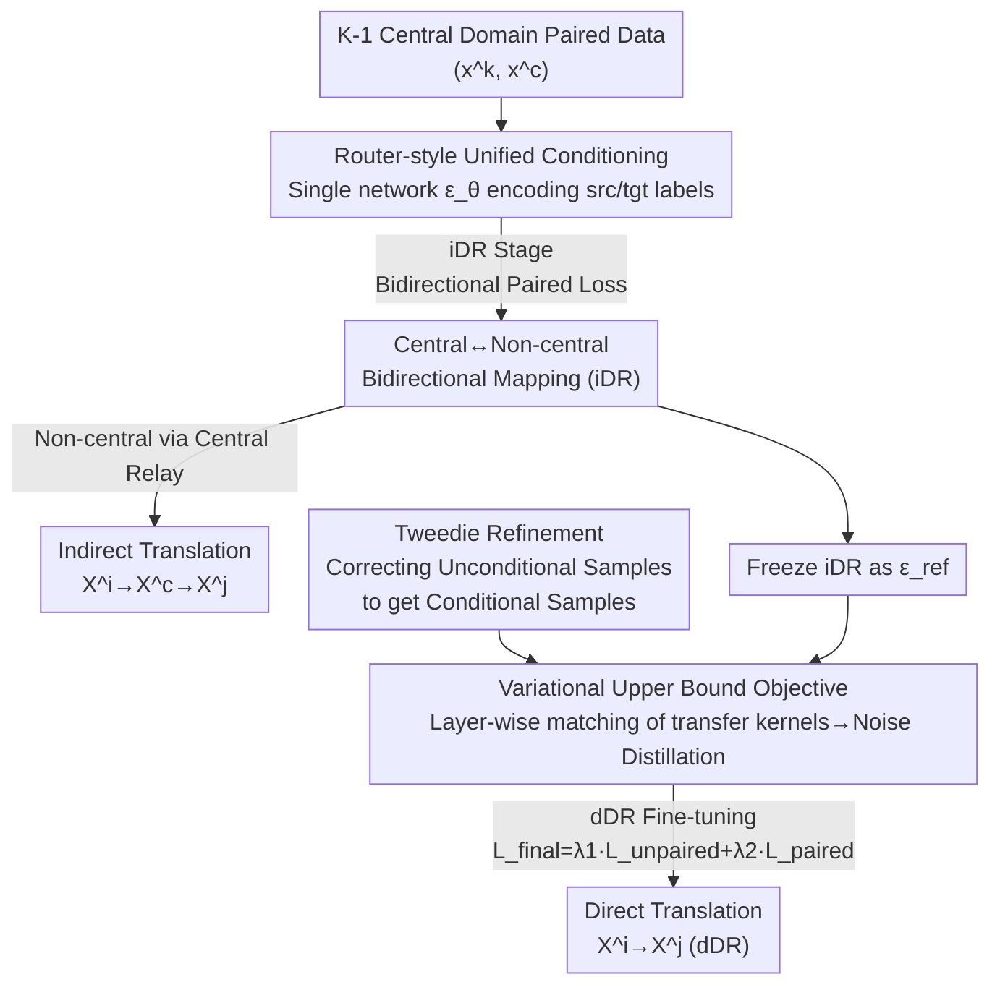

# Universal Multi-Domain Translation via Diffusion Routers

**Conference**: ICLR 2026  
**arXiv**: [2510.03252](https://arxiv.org/abs/2510.03252)  
**Code**: None  
**Area**: Image Segmentation  
**Keywords**: Multi-Domain Translation, Diffusion Models, Diffusion Router, Tweedie Refinement, Universal Translation

## TL;DR

This paper proposes the Diffusion Router (DR), which utilizes a single noise prediction network to implement all cross-domain mappings by conditioning on source/target domain labels. It supports indirect translation via a central domain as well as direct non-central domain translation based on a variational upper bound objective combined with Tweedie refinement, achieving SOTA performance on three large-scale UMDT benchmarks.

## Background & Motivation

**Background**: Multi-domain translation (MDT) aims to learn mapping relationships between multiple domains and is widely applied in fields such as image-to-image translation, image captioning, and text-to-speech synthesis. Existing MDT methods follow two primary paradigms: (1) training on fully-aligned tuples (which is difficult to scale as the number of domains grows); (2) training through paired data sharing a central domain (which only supports translation between the central domain and non-central domains).

**Limitations of Prior Work**:
1. **Fully-aligned tuple paradigm**: $K$ domains require $K$-tuple aligned data, and collection costs grow exponentially with the number of domains.
2. **Central domain paradigm**: Only supports central domain $\leftrightarrow$ non-central domain translation; cross-domain translation between non-central domains (e.g., sketch $\leftrightarrow$ segmentation) cannot be achieved directly.
3. **Model scalability**: Training independent models for every pair of domains requires $2(K-1)$ models, which becomes infeasible as the number of domains increases.
4. **Quality loss in indirect translation**: Two-stage sampling via a central hub is computationally expensive and sensitive to the quality of the intermediate sampling.

**Key Challenge**: In practical applications, fully-aligned multi-domain data is scarce, while paired data with a central domain is relatively abundant (e.g., image-text and text-audio each have large amounts of paired data). The challenge is how to achieve translation between arbitrary domain pairs under the condition of having only $K-1$ paired datasets.

**Goal**: This paper formalizes the Universal Multi-Domain Translation (UMDT) problem—achieving arbitrary translation among $K$ domains using $K-1$ paired datasets with a central domain. It proposes the Diffusion Router (DR), drawing on the source/destination addressing concept of network routers to handle all translation directions using a single noise prediction network $\epsilon_\theta(x_t^{tgt}, t, x^{src}, tgt, src)$.

## Method

### Overall Architecture

In the UMDT setting, $K$ domains $X^1, \ldots, X^K$ share a central domain $X^c$, but training data consists only of $K-1$ datasets paired with the central domain $\mathcal{D}_{k,c}=\{(x^k, x^c)\}$. The Diffusion Router first trains all bidirectional mappings for "central domain $\leftrightarrow$ non-central domain" (indirect translation, iDR) using a single noise prediction network; translations between non-central domains are initially completed via central domain mediation. Building on this, direct mappings for "non-central domain $\to$ non-central domain" (direct translation, dDR) are fine-tuned to bypass the mediation. The workflow is divided into two stages: the first stage trains a "router-style unified conditioning" network on paired data to obtain iDR, and the second stage freezes iDR as a reference to distill dDR using a "variational upper bound learning objective," where conditional samples required for training are efficiently generated via "Tweedie refinement."

### Key Designs

**1. Router-style Unified Conditioning: Single Network Covering All Directions**

The core scalability challenge of UMDT is that modeling each direction separately requires $2(K-1)$ models for $K$ domains, which is infeasible for large $K$. DR adopts the "source/destination address" logic of network routers by encoding both source and target domain labels directly into the noise prediction network $\epsilon_\theta(x_t^{tgt}, t, x^{src}, tgt, src)$. Thus, a single set of weights can navigate all translation paths by switching labels. During the iDR stage, the network is trained on paired data using a bidirectional noise prediction loss, with $\zeta$ balancing the weights: $\mathcal{L}_{paired}(\theta) = \mathbb{E}_{(x^k, x^c)} \big[ \zeta \|\epsilon_\theta(x_t^k, t, x^c, k, c) - \epsilon\|_2^2 + (1-\zeta)\|\epsilon_\theta(x_t^c, t, x^k, c, k) - \epsilon\|_2^2 \big]$. This design reduces the number of models from $O(K)$ to 1 and can naturally extend to spanning tree structures with multiple central domains.

**2. Variational Upper Bound Learning Objective: Enabling Learning Without Paired Data**

To train unpaired directions such as $X^i \to X^j$, the natural approach is to match the distribution $p_{ref}(x^j|x^c)$ based on the central domain. However, direct optimization faces two hurdles: high computational cost for sampling from $p(x'^c|x^i)$ and the lack of a closed-form solution for $p(x^j|x'^c)$. This paper decomposes the original KL divergence along the diffusion chain, deriving a variational upper bound consisting of the sum of KL divergences of transfer kernels at each time step: $\mathbb{E}_{\mathcal{D}_{i,c}}[D_{KL}(p_{ref}(x^j|x^c)\|p_\theta(x^j|x^i))] \le \sum_{t=1}^T \mathbb{E}[D_{KL}(p_{ref}(x_{t-1}^j|x_t^j, x^c)\|p_\theta(x_{t-1}^j|x_t^j, x^i))]$. Layer-wise matching of transfer kernels avoids end-to-end multi-step sampling and simplifies via standard reparameterization into a clean noise distillation loss $\mathcal{L}_{unpaired}(\theta) = \mathbb{E}[\|\epsilon_\theta(x_t^j, t, x^i, j, i) - \epsilon_{ref}(x_t^j, t, x^c, j, c)\|_2^2]$. Here, $\epsilon_{ref}$ is the frozen pre-trained iDR network, essentially distillation for the direct path to mimic the reference path "passing through the central domain." The final training uses $\mathcal{L}_{final} = \lambda_1 \mathcal{L}_{unpaired} + \lambda_2 \mathcal{L}_{paired}$, where the $\lambda_2$ term preserves established paired mappings to prevent catastrophic forgetting.

**3. Tweedie Refinement: Compressing Training Conditional Sampling**

The aforementioned loss requires sampling from the conditional distribution $p_{ref}(x_t^j|x^c)$. Standard methods require denoising from time $T$ to $t$, incurring heavy costs. The authors propose Tweedie refinement, performing lightweight iterative correction starting from unconditional samples: $x_{t,(n+1)}^j = x_{t,(n)}^j + \sigma_t(\epsilon - \epsilon_\theta(x_{t,(n)}^j, t, x^c, j, c))$. The initial $x_{t,(0)}^j$ is drawn directly from the unconditional marginal $p_{ref}(x_t^j)$, and the network's prediction residual for $x^c$ is used to "pull" it toward the conditional distribution. Experiments indicate that $n\le 7$ steps are sufficient, effectively replacing a full denoising trajectory with local refinement. This differs from existing refinement techniques as it aims to convert unconditional samples to conditional ones during training rather than inference.

## Key Experimental Results

### Main Results

Evaluated on three newly constructed UMDT benchmarks against StarGAN (GAN), Rectified Flow (flow), and UniDiffuser (diffusion) baselines.

**Shoes-UMDT (FID↓, format: A←B / A→B)**:

| Method | Edge↔Shoe | Gray↔Shoe | Edge↔Gray |
|------|:---:|:---:|:---:|
| StarGAN | 9.92/20.18 | 19.73/42.61 | 18.64/27.41 |
| Rectified Flow | 2.88/30.92 | 3.75/43.38 | 20.14/18.83 |
| UniDiffuser | 2.98/11.94 | 2.72/4.40 | 4.81/12.26 |
| iDR | **1.66/5.15** | **0.53/1.60** | 1.85/5.48 |
| dDR | 2.01/5.76 | 0.57/1.69 | **2.74/6.51** |

**COCO-UMDT-Star (FID↓)**:

| Method | Ske↔Color | Seg↔Color | Depth↔Color | Ske↔Seg | Ske↔Depth | Seg↔Depth |
|------|:---:|:---:|:---:|:---:|:---:|:---:|
| Rectified Flow | 23.18/80.80 | 54.00/142.15 | 17.32/112.64 | 64.47/75.58 | 78.41/28.69 | 79.20/35.53 |
| UniDiffuser | 15.39/40.93 | 35.81/89.58 | 12.64/59.72 | 39.62/38.44 | 28.12/15.72 | 38.39/23.41 |
| iDR | **10.72/21.73** | **21.64/29.28** | **7.25/24.19** | 22.77/22.96 | **17.88/8.63** | **23.19/12.00** |
| dDR | 10.12/20.94 | 21.23/28.32 | 7.00/23.20 | **26.73/23.64** | 20.75/9.42 | 24.91/14.87 |

DR consistently outperforms baselines in central domain translation and demonstrates competitive direct translation capabilities in non-central domain translation without paired data (marked in brown). iDR's indirect translation outperforms dDR's direct translation in most cases, indicating high quality of the intermediate representation.

### Ablation Study

**Ablation on Tweedie Refinement steps $n$ (Faces-UMDT-Latent)**:

| Refinement steps $n$ | Ske→Face FID↓ | Face→Ske FID↓ | Seg→Face FID↓ |
|:---:|:---:|:---:|:---:|
| 0 | Baseline (No Refinement) | — | — |
| 1 | Significant Improvement | Significant Improvement | Significant Improvement |
| 3 | Further Improvement | Further Improvement | Further Improvement |
| 5 | Near Optimal | Near Optimal | Near Optimal |
| 7 | **Optimal** | **Optimal** | **Optimal** |

Tweedie refinement gradually transforms unconditional samples into conditional ones starting from $n=0$; only 3-5 steps are needed for significant improvement, substantially reducing training sampling costs.

**Training from Scratch vs. Fine-tuning**: Fine-tuning pre-trained iDR performs better than training dDR from scratch, validating the two-stage strategy. Training from scratch is possible by treating $\epsilon_{ref}$ as an online frozen network, but convergence is slower.

## Highlights & Insights

### Value

1. **Practical Problem Definition**: UMDT captures real-world scenarios of "hub domain + sparse pairing," which is far more realistic than full-alignment assumptions.
2. **Elegant Architecture**: The router concept compresses $O(K^2)$ potential models into a single network, providing excellent scalability.
3. **Rigorous Theory**: The variational upper bound objective and the conditional independence assumptions are supported by full mathematical derivations.
4. **Novelty of Tweedie Refinement**: Effectively resolves the efficiency bottleneck for conditional sampling during training.
5. **Establishment of Three Benchmarks**: Provides a standardized evaluation platform for the new UMDT definition.

### Limitations & Future Work

1. The conditional independence assumption $X^i \perp X^j | X^c$ may not hold perfectly in practice, limiting indirect translation quality.
2. Experiments are primarily focused on intra-image domain translation; true cross-modal scenarios (e.g., image↔text↔audio) have not been verified.
3. dDR does not always outperform iDR in direct translation; the advantages of direct mapping require more analysis.

## Rating

⭐⭐⭐⭐ — The problem definition is novel and practical, the method design is clear and theoretically sound, and Tweedie refinement is a standout technical contribution. However, discussions on cross-modal verification and the conditional independence assumption could be further strengthened.

<!-- RELATED:START -->

## Related Papers

- [\[CVPR 2025\] Universal Domain Adaptation for Semantic Segmentation](../../CVPR2025/segmentation/universal_domain_adaptation_for_semantic_segmentation.md)
- [\[ICLR 2026\] VIRTUE: Visual-Interactive Text-Image Universal Embedder](virtue_visual-interactive_text-image_universal_embedder.md)
- [\[CVPR 2026\] Cross-Domain Few-Shot Segmentation via Multi-view Progressive Adaptation](../../CVPR2026/segmentation/cross-domain_few-shot_segmentation_via_multi-view_progressive_adaptation.md)
- [\[ICLR 2026\] TRACE: Your Diffusion Model is Secretly an Instance Edge Detector](trace_your_diffusion_model_is_secretly_an_instance_edge_detector.md)
- [\[ICLR 2026\] RegionReasoner: Region-Grounded Multi-Round Visual Reasoning](regionreasoner_region-grounded_multi-round_visual_reasoning.md)

<!-- RELATED:END -->
