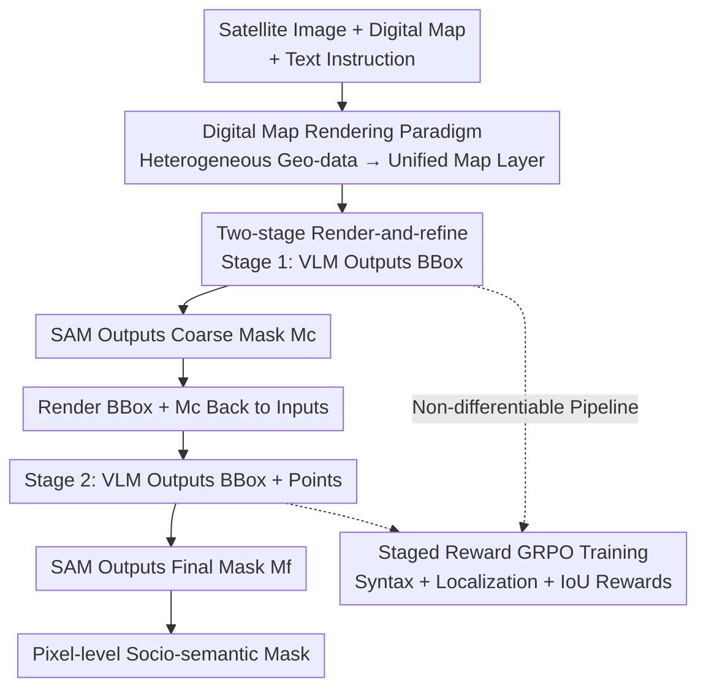

# Urban Socio-Semantic Segmentation with Vision-Language Reasoning

**Conference**: ICLR 2026  
**OpenReview**: [https://openreview.net/forum?id=sVN9K0BLQj](https://openreview.net/forum?id=sVN9K0BLQj)  
**Code**: https://github.com/AMAP-ML/SocioReasoner  
**Area**: Semantic Segmentation / Multimodal VLM / Remote Sensing / Reinforcement Learning  
**Keywords**: Socio-semantic segmentation, Remote sensing imagery, Vision-language reasoning, SAM, GRPO

## TL;DR
This paper defines a new task, "Urban Socio-Semantic Segmentation" (segmenting entities like schools and parks defined by social attributes rather than visual appearance from satellite imagery), constructs the SocioSeg dataset (unifying heterogeneous geospatial data into a single rendered digital map layer), and proposes the SocioReasoner framework. SocioReasoner mimics the human annotator's two-stage reasoning process of "localization, rendering feedback, and refinement" using a VLM, and optimizes this non-differentiable prompt generation pipeline end-to-end via GRPO reinforcement learning, outperforming SOTA models across three-level hierarchical tasks while demonstrating strong zero-shot generalization.

## Background & Motivation

**Background**: Urban surface semantic entities are categorized into two types. One is **physical semantic entities** (buildings, water bodies, roads), which have clear visual features and can be accurately segmented by existing models using high-resolution satellite imagery. The other is **socio-semantic entities** (schools, parks, residential areas), whose boundaries and identities are determined by social semantics rather than visual appearance, making them difficult to identify from satellite images alone.

**Limitations of Prior Work**: Previous methods for socio-semantic segmentation relied on introducing auxiliary multimodal geographic data (e.g., POI points of interest, road networks), using independent encoders to extract features followed by fusion and fully supervised training. This approach faces three bottlenecks: (i) raw geographic data is often difficult to obtain due to commercial or security restrictions; (ii) even when available, mismatched heterogeneous formats and spatial granularities require tedious preprocessing and alignment; (iii) models trained only on predefined categories cannot generalize to open social categories.

**Key Challenge**: Socio-semantics are inherently "diverse and complex," requiring sophisticated reasoning processes—a strength of VLMs. However, existing work applying VLMs to satellite imagery mostly focuses on physical attributes. Furthermore, current VLM reasoning for segmentation often follows a "single-stage" approach: the VLM outputs a bbox for a frozen SAM to generate the final mask, which lacks control over output quality and results in coarse boundaries.

**Goal**: (1) Define and provide a benchmark for socio-semantic segmentation; (2) design a framework that adapts reasoning without requiring restricted raw data.

**Key Insight**: Human annotators do not label social entities in one step; they localize roughly, observe the result, and then use points to refine boundaries. This serial interactive process is naturally suitable for simulation via multi-stage reasoning with visual feedback.

**Core Idea**: Unify heterogeneous geographic data by **rendering it into a digital map layer** (naturally aligned with satellite imagery and publicly available), converting the multimodal problem into a "visual reasoning" problem. Then, guide the VLM through a "localization-rendering-refinement" two-stage process, using GRPO reinforcement learning to directly optimize the non-differentiable IoU reward.

## Method

### Overall Architecture

SocioReasoner receives three inputs: a satellite image $I_s$, a digital map $I_m$, and a text instruction $t$ containing socio-semantic concepts, and outputs a pixel-level mask of the target entity. The pipeline mimics a human annotator’s serial workflow in two stages, connected by "rendering feedback" that feeds Stage-1 results back to the VLM:

- **Stage 1 (Localization)**: The VLM $F$ reads $(I_s, I_m, t_b)$ and outputs a set of 2D bounding boxes $B$ to localize candidate regions; $B$ is fed as prompts to a frozen SAM $S$ to obtain a preliminary **coarse mask** $M_c$.
- **Rendering Feedback**: A rendering function $D$ overlays the bounding boxes $B$ and coarse mask $M_c$ onto the satellite image and map, generating a pair of annotated rendered images $(I_{s,r}, I_{m,r})$.
- **Stage 2 (Refinement)**: Conditioned on the rendered images and a new instruction $t_p$, the VLM simultaneously outputs bounding boxes $B$ and a set of **point prompts** $P$. Both boxes and points are fed back into SAM to produce the high-fidelity **final mask** $M_f$.

The entire pipeline is **non-differentiable** (involving SAM calls, JSON parsing, and rendering), making direct gradient training impossible. Thus, GRPO reinforcement learning is used to optimize the VLM's prompt generation policy, with the same VLM policy weights shared across both stages.

### Key Designs

**1. Digital Map Rendering Paradigm: Replacing restricted raw multimodal data with a publicly available, naturally aligned map layer**

The difficulty of socio-semantic entities lies in the fact that satellite images cannot distinguish between a school and a hospital without geospatial information (POI, road networks). However, raw POI/road data is often restricted or heterogeneous. The core innovation of the SocioSeg dataset is to **render these into a digital map layer**. Images are retrieved from public APIs (containing basic rendering of road networks and POIs in bilingual versions). This solves three issues: (i) public map layers bypass data access hurdles; (ii) the map layer is inherently registered with satellite imagery; (iii) by merging into a single visual modality, the "multimodal fusion" problem is converted into a "visual reasoning" problem, leveraging the VLM’s visual understanding directly. The dataset is organized into three hierarchical levels: Socio-name (e.g., "A Certain University", 5000+ names) → Socio-class (e.g., "College", 90+ classes) → Socio-function (e.g., "Educational Land", 10+ functions), with increasing abstraction and reasoning difficulty across 13k+ samples (6:1:3 split).

**2. Two-stage Render-and-refine Reasoning: Using "rendering feedback" to allow the model to correct its own initial results**

Existing VLM reasoning for segmentation is single-stage—VLM outputs bboxes once for a frozen SAM. The model cannot see intermediate masks or correct itself, and planning both boxes and points in one long structured output has a high failure rate. SocioReasoner splits this into "localization" and "refinement" steps with visual feedback. In Stage 1, the VLM focuses on localization, producing $B$ to get a coarse mask $M_c=S(I_s, \text{prompt}=B)$. Crucially, a rendering function $D$ overlays $B$ and $M_c$ back onto the input images $I_{s,r}=D(I_s,B,M_c)$ and $I_{m,r}=D(I_m,B,M_c)$. In Stage 2, the VLM observes "how well it sliced" and outputs $\{B,P\}=F(I_{s,r},I_{m,r},t_p)$, using additional point prompts to refine boundaries for the final $M_f=S(I_s,\text{prompt}=\{B,P\})$. This decomposes the complex segmentation problem, improving accuracy and making the reasoning chain explicit and interpretable. Ablations show that removing the refinement stage (w/o refinement) drops cIoU from 47.9 to 46.4, and further to 44.0 without reflection (w/o reflection).

**3. Staged-reward GRPO End-to-end RL: Directly optimizing non-differentiable IoU rather than supervised imitation**

The pipeline includes SAM calls, JSON parsing, and rendering, making it non-differentiable and unsuitable for standard gradient methods beyond SFT. This work uses GRPO (Group Relative Policy Optimization) to optimize both stages. For an input $x$, the policy $\pi_\theta$ samples $G$ completions $\{y^{(g)}\}$. The environment parses prompts, runs SAM, and returns scalar rewards. Advantages $A^{(g)}$ are calculated using the group mean as a baseline, followed by a PPO-style clipped objective update with KL regularization. Rewards are customized: $R_1$ = Binary syntax reward + Box localization accuracy + Matching target count; $R_2$ = Binary syntax reward + Pixel-level IoU of final mask + Point count penalty (where hyperparameter $\mu$ controls the number of points). Within one RL step, Stage-1 rollouts update $L_1$, and their outputs construct Stage-2 inputs to update $L_2$, aligning the optimization sequence with the "localization-refinement" workflow. Directly optimizing the non-differentiable IoU is a key advantage of RL over SFT, as it learns a more generalized geometric reasoning strategy rather than memorizing training distributions, significantly enhancing robustness in OOD scenarios (cross-map styles, cross-geographic regions).

### Loss & Training

The Stage-1 objective is a clipped PPO surrogate loss with KL regularization:

$$L_1(\theta) = -\frac{1}{G}\sum_{g=1}^{G}\sum_{t}\min\!\Big(r_{1,t}^{(g)} A_1^{(g)},\ \text{clip}(r_{1,t}^{(g)}, 1-\epsilon, 1+\epsilon)A_1^{(g)}\Big) + \beta\,\text{KL}\big(\pi_\theta \,\|\, \pi_{\text{ref}}\big)$$

where $r_{1,t}^{(g)}$ is the token-level importance ratio, $\epsilon$ is the PPO clipping parameter, and $\beta$ controls the KL constraint against the frozen reference policy $\pi_{\text{ref}}$. Stage 2 $L_2$ follows the same GRPO sampling and optimization but uses reward $R_2$. Both stages are updated sequentially in each RL step.

## Key Experimental Results

### Main Results

Comparison against SOTA on the SocioSeg test set across three task levels (cIoU / gIoU / F1). SocioReasoner leads consistently across all levels and metrics. Selected "All dataset" summary:

| Method | Type | cIoU | gIoU | F1 |
|------|------|------|------|-----|
| UNet | Standard Seg | 11.7 | 10.7 | 10.0 |
| Segformer | Standard Seg | 22.1 | 20.5 | 18.7 |
| SegEarth-OV | RS Open-Vocabulary | 3.7 | 3.7 | 0.0 |
| RSRefSeg | RS Referring Seg | 29.0 | 28.3 | 32.8 |
| SegEarth-R1 | RS Reasoning Seg | 38.3 | 44.1 | 48.4 |
| RemoteReasoner | RS Reasoning Seg | 43.2 | 47.7 | 53.3 |
| Seg-R1 | Natural Reasoning Seg | 41.0 | 45.0 | 45.2 |
| VisionReasoner | Natural Reasoning Seg | 44.0 | 48.5 | 54.3 |
| **SocioReasoner (Ours)** | — | **47.9** | **52.8** | **59.7** |

Standard segmentation models (UNet/Segformer) fail to handle multimodal inputs, effectively performing binary classification; they rank lowest due to the lack of visual features in social categories. SegEarth-OV, which freezes the CLIP encoder, is nearly ineffective (F1=0). Ours improves F1 by approximately 5.4 points over the strongest baseline, VisionReasoner.

### Ablation Study

| Configuration | cIoU | gIoU | F1 | Description |
|------|------|------|-----|------|
| w/o reflection | 44.0 | 48.5 | 54.3 | Single-stage bbox+point (eq. VisionReasoner) |
| w/o refinement | 46.4 | 50.8 | 57.5 | Two-stage training but only using Stage-1 output |
| **Ours (Full)** | **47.9** | **52.8** | **59.7** | Rendering feedback + Two-stage |
| 1-point refinement | 47.6 | 51.2 | 58.0 | Single point often fails to cover target |
| **2-point refinement** | **47.9** | **52.8** | **59.7** | Final choice |
| 3-point refinement | 48.9 | 52.3 | 58.8 | Difficult to learn stable distribution; marginal gain |

OOD Generalization (RL vs. SFT):

| Method | ID F1 | OOD Map Style F1 | OOD New Region F1 |
|------|-------|----------------|---------------|
| Ours (SFT) | 57.8 | 46.9 | 31.5 |
| **Ours (RL)** | **59.7** | **57.7** | **42.9** |

OOD New Regions include Tokyo, New York, São Paulo, London, and Nairobi (3200 samples, 80 classes, including 24 unseen classes).

### Key Findings
- **Refinement stage contributes most**: Removing reflection (dropping to single-stage) causes the largest F1 drop (5.4 points), confirming that observing intermediate results is core. Training curves show Stage-1 gIoU leads early (localization learned first), while Stage-2 overtakes later (refinement learned).
- **Point count "sweet spot"**: 2 points balance coverage and stability. 1 point is insufficient, and 3 points make it harder for the VLM to learn a stable distribution (controlled by hyperparameter $\mu$).
- **RL significantly outperforms SFT on OOD data**: Cross-map style F1 increases 46.9 → 57.7; Cross-region F1 increases 31.5 → 42.9. Directly optimizing non-differentiable IoU helps the model learn transferable geometric reasoning strategies.
- **Error propagation is a failure mode**: If Stage-1 localization deviates significantly from the ground truth, Stage-2 points tend to amplify rather than correct the bias (observed in Business Office and Residential categories).

## Highlights & Insights
- **"Rendering Unified Representation" is the most clever move**: Converting inaccessible/unaligned heterogeneous geo-data into a public digital map reduces "multimodal fusion" to "visual reasoning." This bypasses data bottlenecks and leverages VLM visual capabilities directly—a paradigm applicable to any task where auxiliary modalities can be visually rendered.
- **Self-correction via "Rendering Feedback"**: Re-painting intermediate masks onto inputs to feed back into the model is a lightweight way to give VLMs visual closed-loop feedback. It achieves "look then fix" without altering model architecture or adding modules, using only prompt engineering and RL.
- **Non-differentiable Pipeline + GRPO for Direct IoU Optimization**: When the pipeline includes SAM, parsing, and rendering, RL is the natural choice to bridge the final metric as a reward end-to-end, avoiding the limitations of SFT in imitating single-step labels.

## Limitations & Future Work
- **High Latency**: The multi-step human-like reasoning process makes inference significantly longer than single-stage methods.
- **Error Propagation**: Stage 2 can worsen results if Stage 1 localization is poor; it lacks an "abort/re-localize" mechanism.
- **Dependency on Map Quality**: The upper bound of the rendering paradigm is constrained by map API coverage and information density; missing POIs in the map layer may lead to degradation.
- **Fixed Point Count**: Points are fixed at 2 via hyperparameter $\mu$; there is no adaptive strategy for point counts based on target scale or shape.
- **Future Directions**: Introduce confidence estimation for re-localization triggers; develop adaptive refinement point counts based on target geometry.

## Related Work & Insights
- **vs. VisionReasoner / Seg-R1 / SAM-R1 (Natural Image Reasoning Seg)**: These are single-stage frameworks where the VLM outputs prompts once. This work adds "rendering feedback + two-stage refinement" for reflection. SAM-R1 fails when it outputs excessive points; this work constrains points to 2 using rewards.
- **vs. SegEarth-R1 / RemoteReasoner (RS Reasoning Seg)**: These focus on physical attributes; SegEarth-R1 supports only single satellite images. This work targets socio-semantics using dual-image (satellite + map) inputs and achieves higher precision through localization-refinement.
- **vs. SegEarth-OV (RS Open-Vocabulary)**: It freezes the CLIP encoder, limiting recognition to pre-trained categories. It nearly fails on new social categories in SocioSeg (F1≈0). This work relies on VLM reasoning rather than fixed vocabularies.
- **vs. Traditional Land Use Classification**: Those works target fixed closed-set categories using independent encoders for raw data. This work is open-vocabulary/referring/reasoning segmentation, where every name can be an independent class (5000+ names).

## Rating
- Novelty: ⭐⭐⭐⭐⭐ First to define Urban Socio-Semantic Segmentation; original "digital map rendering" paradigm + VLM two-stage reasoning.
- Experimental Thoroughness: ⭐⭐⭐⭐ Three task levels, 10 baselines, extensive ablations, and OOD tests; latency analysis is brief in the appendix.
- Writing Quality: ⭐⭐⭐⭐⭐ Clear formulation of motivation, paradigm, and workflow.
- Value: ⭐⭐⭐⭐⭐ Opens a practical direction for "VLM reasoning + rendering paradigm" in geospatial analysis; dataset and code are released under Apache 2.0.

<!-- RELATED:START -->

## Related Papers

- [\[ICLR 2026\] SAM-Veteran: An MLLM-based Human-like SAM Agent for Reasoning Segmentation](sam-veteran_an_mllm-based_human-like_sam_agent_for_reasoning_segmentation.md)
- [\[ECCV 2024\] VISA: Reasoning Video Object Segmentation via Large Language Models](../../ECCV2024/segmentation/visa_reasoning_video_object_segmentation_via_large_language_models.md)
- [\[CVPR 2026\] PixDLM: A Dual-Path Multimodal Language Model for UAV Reasoning Segmentation](../../CVPR2026/segmentation/pixdlm_uav_reasoning_segmentation.md)
- [\[ICLR 2026\] QPrompt-R1: Real-Time Reasoning for Domain-Generalized Semantic Segmentation via Group-Relative Query Alignment](qprompt-r1_real-time_reasoning_for_domain-generalized_semantic_segmentation_via_.md)
- [\[AAAI 2026\] InfoCLIP: Bridging Vision-Language Pretraining and Open-Vocabulary Semantic Segmentation via Information-Theoretic Alignment Transfer](../../AAAI2026/segmentation/infoclip_bridging_vision-language_pretraining_and_open-vocab.md)

<!-- RELATED:END -->
