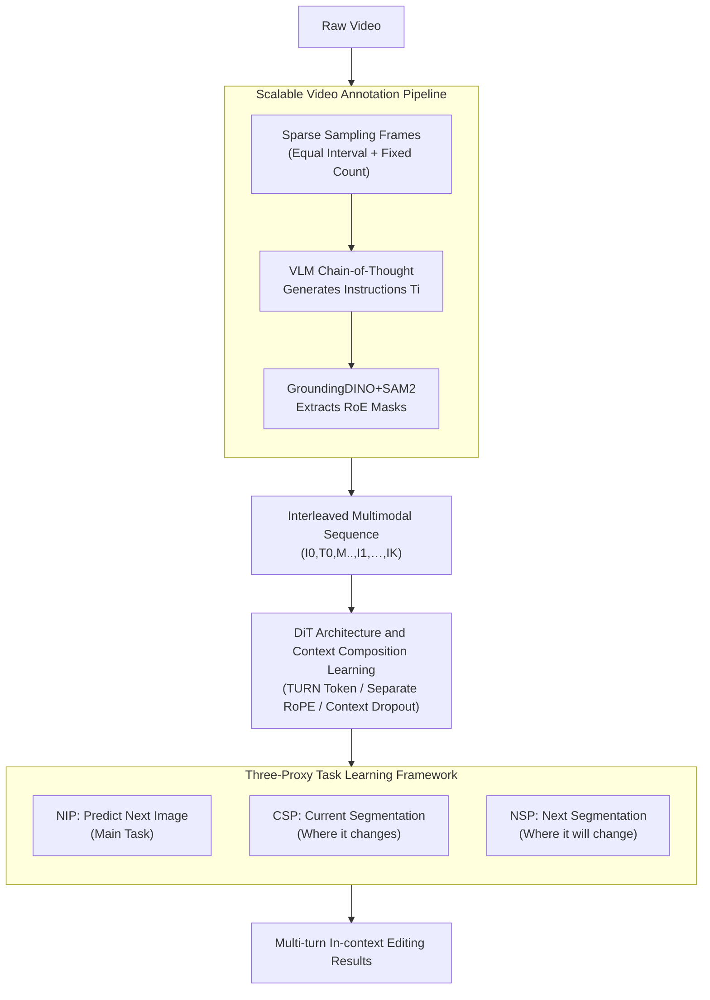

# VINCIE: Unlocking In-context Image Editing from Video

**Conference**: ICLR 2026  
**arXiv**: [2506.10941](https://arxiv.org/abs/2506.10941)  
**Code**: [vincie2025.github.io](https://vincie2025.github.io/)  
**Area**: Image Segmentation  
**Keywords**: in-context editing, video learning, multi-turn editing, DiT, segmentation prediction

## TL;DR

The VINCIE framework is proposed, demonstrating for the first time that in-context image editing models can be learned entirely from native video data. By annotating videos as interleaved multimodal sequences and designing three proxy tasks (NIP/CSP/NSP), it reaches SOTA on multi-turn editing benchmarks, increasing the 5-turn editing success rate from <2% to 25% compared to baselines.

## Background & Motivation

**Background**: In-context image editing allows users to modify images iteratively through multi-turn interactions. Existing methods rely on task-specific pipelines and expert models (segmentation, inpainting, etc.) to construct paired training data.

**Limitations of Prior Work**: (1) Constructing high-quality paired data for multi-turn editing is extremely difficult; existing methods can only mine single-turn editing pairs. (2) Reliance on task-specific pipelines limits data universality and scalability. (3) Issues with consistency and error accumulation in multi-turn editing are severe.

**Key Challenge**: The contradiction between the scarcity of high-quality multi-turn editing training data and the model's requirement to learn long-range context dependencies.

**Goal**: Whether a meaningful in-context image editing model can be learned solely from video data, without any independent image pairs.

**Key Insight**: Videos naturally contain rich visual dynamics (objects entering/leaving, pose changes, camera movement), which implicitly provide learning signals for editing operations.

**Core Idea**: Construct interleaved multimodal sequences (frames + transformation descriptions + segmentation masks) from native video data to train a DiT model to learn context-aware image editing via three proxy tasks.

## Method

### Overall Architecture

The core challenge VINCIE addresses is the lack of high-quality "paired editing" training data for multi-turn in-context image editing, as constructing such data is labor-intensive. Its breakthrough lies in transferring this data problem to naturally massive video data—where object dynamics, pose variations, and camera movements in a video segment essentially constitute a sequence of "edits." The process starts with a **video annotation pipeline** that transforms raw video into an interleaved multimodal sequence (frames + editing instructions + segmentation masks). Subsequently, a **DiT model** is trained on this sequence for generative tasks based on history, optimized by **three proxy tasks**. The sequence takes the form $S=(I_0, T_0, M_{00}, M_{01}, I_1, \ldots, I_K)$, where $T_i$ represents the editing instruction between adjacent frames and $M$ marks the masks for the "Region of Editing" (RoE). The model ultimately outputs a sequence of iteratively modified editing results.

### Key Designs

**1. Scalable Video Annotation Pipeline: Automatically transforming videos into training data**

The scarcity of multi-turn editing data stems from the difficulty of acquiring "paired editing images" at scale. This step bypasses the bottleneck by mining editing signals from natural video. A hybrid sampling strategy is used: equal-interval sampling captures fine-grained object-level changes, while fixed-frame-count sampling covers large-scale changes like camera movement and scene switching. During annotation, the VLM performs Chain-of-Thought (CoT) reasoning—first describing differences between two frames across multiple aspects, then summarizing these into an executable instruction $T_i$ to avoid missing details. GroundingDINO and SAM2 are then used to extract RoE masks, providing an explicit spatial grounding signal. This automated pipeline can run on approximately 10M sessions, converting massive video volume into training data scale.

**2. DiT Architecture and Context Composition Learning: Learning to utilize historical information flexibly**

The essence of editing is "generating the current frame while observing all previous turns," so the modeling objective is formulated autoregressively:

$$\log p(S) = \sum_{i=1}^{M} \log p(I_i \mid I_0, T_0, \ldots, T_{i-1}, I_{i-1})$$

Each frame is conditioned on all previous images and instructions. Learnable `<TURN>` tokens separate different turns in the sequence. For positional encoding, text uses 1D RoPE and images use 3D RoPE to match their respective dimensional structures and avoid conflicts. Attention mechanisms include both full attention and block-level causal attention variants, the latter ensuring the model does not "peek" into the future when generating frame $i$. A critical technique is applying random dropout to the context—current frames, current RoE masks, and next RoE masks are dropped with probabilities of 20%, 70%, and 70% respectively (applied independently per turn). This prevents the model from memorizing fixed input combinations and encourages robustness under incomplete contexts during inference. The model is initialized with weights from a video foundation model.

**3. Three-Proxy Task Learning Framework: Using "what changed/what will change" to boost quality**

Relying solely on the Next Image Prediction (NIP) task often results in imprecise localization of editing regions. Therefore, two additional segmentation tasks are included for joint training. Current Segmentation Prediction (CSP) requires the model to explicitly predict "where is the region to be modified in the current frame," strengthening grounding capabilities for local additions/deletions. Next Segmentation Prediction (NSP) asks the model to predict "what the layout will look like after editing," assisting it with pose changes and object movements where layouts adjust dynamically. All three tasks share the same generative framework and use flow matching MSE diffusion loss. CSP (where it changed) and NSP (where it will change) inject spatial information into NIP, ensuring edits are both accurate and clean.

### Loss & Training

The three tasks are jointly optimized using a unified flow matching MSE diffusion loss. RoE masks are included in training with an 80% probability, combined with context dropout to enhance generalization. Inference utilizes 50-step sampling with a CFG scale of 10. In terms of scale, the 3B model was trained on 256×H100s for 15k steps (approx. 30h), and the 7B model for 40k steps (approx. 150h), using about 10M session instances.

## Key Experimental Results

### Main Results

| Dataset | Metric | Ours (7B+SFT) | Prev. SOTA/Comp. | Note |
|--------|------|------|------|------|
| MagicBrush Turn-1 | DINO | 0.891 | 0.886 (Nano Banana) | Surpasses all academic methods |
| MagicBrush Turn-3 | DINO | 0.775 | 0.773 (Nano Banana) | Multi-turn advantage is more evident |
| MSE-Bench Turn-1 | Success Rate | 0.950 | 0.937 (Step1X-Edit) | Second only to Bagel |
| MSE-Bench Turn-5 | Success Rate | 0.487 | 0.413 (Bagel) | Significantly better than open-source methods |
| MSE-Bench Turn-5 | Success Rate | 0.210→0.487 | 3B→7B+SFT | Scaling effects are significant |

### Ablation Study

| Configuration | Metric | Note |
|------|------|------|
| w/o Seg. vs w/ Seg. | MSE Turn-1: 0.847→0.887 | Segmentation tasks improve editing capability |
| CS→I | MagicBrush DINO Turn-1: 0.797 | Current segmentation improves consistency |
| CS→NS→I | MagicBrush DINO Turn-3: 0.679 | Chain-editing strategy is optimal |
| pairwise vs sequence | MSE Turn-5: 0.010→0.220 | Sequence data far superior to paired data |
| Data Scale 0.25M→10M | MSE Turn-5: 5%→22% | Approximate log-linear scaling |

### Key Findings

- Video-only training can match SOTA methods using paired editing data, with video pre-training followed by SFT yielding the best results.
- In-context editing effectively mitigates artifact accumulation during multi-turn edits.
- The model exhibits emergent capabilities not explicitly trained: multi-concept composition, story generation, and chain editing.

## Highlights & Insights

- Demonstrates for the first time the feasibility of learning in-context image editing from pure video data, providing a new perspective on data sources. The massive scale of video offers a natural scalability advantage.
- The design of three proxy tasks is clever: CSP understands the "changed region" while NSP predicts "future changes," collaboratively enhancing NIP editing quality. This decomposition approach is highly referenceable.

## Limitations & Future Work

- Video training introduces a "position shift" of subjects; while partially mitigated by segmentation prediction, it is not fully resolved.
- A significant gap still exists compared to commercial models (GPT-4o 62.7%, Nano Banana 64.3%) on MSE-Bench Turn-5.
- Lack of human satisfaction or preference assessments; reliance on GPT-4o for automated evaluation.

## Related Work & Insights

- **vs InstructPix2Pix**: IP2P relies on GPT-3+SD generated paired data and only supports single-turn edits; VINCIE utilizes video to naturally support multi-turn.
- **vs OmniGen/OmniGen2**: OmniGen uses paired editing data, and its success rate drops sharply in multi-turn scenarios (MSE Turn-5 at only 8.3%); VINCIE’s context modeling is more robust.
- **vs UES/RealGeneral**: These methods only utilize two frames from a video, ignoring long-range context; VINCIE utilizes full multi-frame sequences.

## Rating

- Novelty: ⭐⭐⭐⭐⭐ First to learn in-context editing from video data; paradigm shift with emergent capabilities.
- Experimental Thoroughness: ⭐⭐⭐⭐ Proposed new MSE-Bench benchmark; comprehensive ablations and scalability analysis.
- Writing Quality: ⭐⭐⭐⭐ Clear motivation; systematic method description; well-presented experiments.
- Value: ⭐⭐⭐⭐⭐ Opened a New Video→Editing paradigm; data scalability addresses core field bottlenecks.

<!-- RELATED:START -->

## Related Papers

- [\[ICCV 2025\] VEGGIE: Instructional Editing and Reasoning Video Concepts with Grounded Generation](../../ICCV2025/segmentation/veggie_instructional_editing_and_reasoning_video_concepts_with_grounded_generati.md)
- [\[ICCV 2025\] CAVIS: Context-Aware Video Instance Segmentation](../../ICCV2025/segmentation/cavis_context-aware_video_instance_segmentation.md)
- [\[ICLR 2026\] Matting Anything 2: Towards Video Matting for Anything](matting_anything_2_towards_video_matting_for_anything.md)
- [\[CVPR 2026\] RobotSeg: A Model and Dataset for Segmenting Robots in Image and Video](../../CVPR2026/segmentation/robotseg_a_model_and_dataset_for_segmenting_robots_in_image_and_video.md)
- [\[CVPR 2025\] The Power of Context: How Multimodality Improves Image Super-Resolution](../../CVPR2025/segmentation/the_power_of_context_how_multimodality_improves_image_super-resolution.md)

<!-- RELATED:END -->
