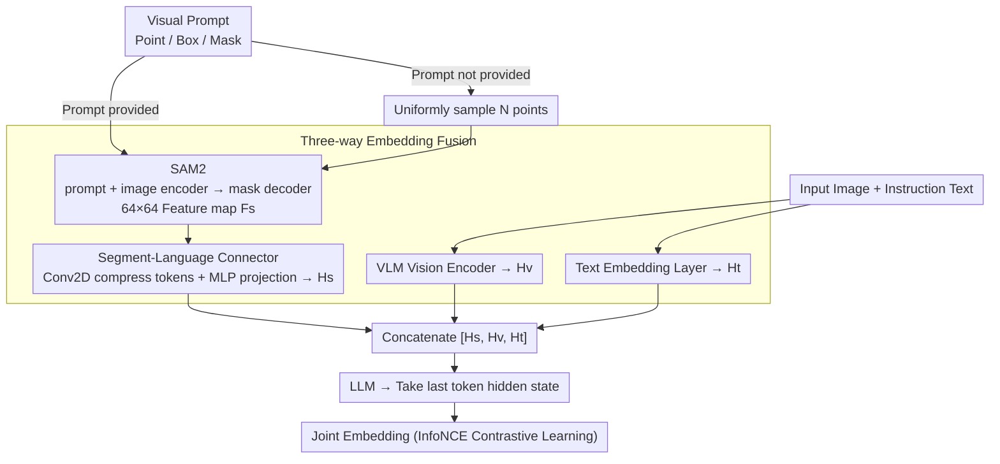

# VIRTUE: Visual-Interactive Text-Image Universal Embedder

**Conference**: ICLR 2026  
**arXiv**: [2510.00523](https://arxiv.org/abs/2510.00523)  
**Code**: [GitHub](https://github.com/sony/virtue)  
**Area**: Image Segmentation (Multimodal Embedding/Visual Interaction)  
**Keywords**: visual prompt, embedding model, SAM2, VLM, visual-interactive, retrieval

## TL;DR

Ours proposes VIRTUE, which combines the segmentation model SAM2 with a VLM to construct a visual-interactive universal embedder. It allows users to specify regions of interest via points/boxes/masks to generate joint entity-level and global-level embeddings. A million-scale SCaR benchmark is constructed to evaluate visual-interactive retrieval capabilities. Ours achieves SOTA on 36 MMEB tasks (+3.1%-8.5%) and 5 SCaR tasks (+15.2%-20.3%).

## Background & Motivation

**Interaction limitations of embedding models**: Existing VLM embedding models (VLM2Vec/GME/LamRA) only support text instruction interaction and lack visual interaction capabilities (visual prompts such as points/boxes/masks).

**Value of visual prompts**: Widely used in generative models (SAM, GroundingDINO), but yet to be explored in embedding models. Visual prompts provide precise spatial localization for fine-grained understanding.

**Inadequacy of cropping**: Intuitive ROI cropping schemes lose global scene context—cropping a "salad fork on the table" loses the "table" information, leading to failure in retrieval requiring compositional reasoning.

**Diverse entity requirements for the same image**: A dog and a cat in the same image require different embeddings, but a global embedding cannot distinguish between them.

**Lack of evaluation benchmarks**: There is no public benchmark for evaluating visual-interactive embedding capabilities.

## Method

### Overall Architecture

VIRTUE addresses the problem where embedding models "can only listen to text, but cannot see selections": it allows users to circle entities of interest using points/boxes/masks, and the model provides an embedding that both recognizes the entity and remembers the global scene. The overall workflow is as follows: an image and visual prompts are fed into the segmentation model SAM2 (if prompts are not provided, they are replaced by automatically sampled uniform points). SAM2 outputs entity-level segmentation features, which are projected into a segmentation embedding $H_s$ through a segment-language connector. In parallel, the full image enters the visual encoder of a VLM (Qwen2-VL) to obtain a global visual embedding $H_v$, and the instruction text enters the text embedding layer to obtain $H_t$. The three embeddings are concatenated as $[H_s, H_v, H_t]$ and fed into an LLM. The hidden state of the last token is taken as the joint embedding, trained using InfoNCE contrastive learning. This ensures that both precise entity localization and global scene context are preserved.

### Key Designs

**1. Three-way embedding fusion: Coexistence of entity-level signals and global context**

Existing VLM embedding models only process text instructions. An intuitive approach to circle a local ROI is to crop the image, but cropping "a salad fork on the table" also removes the "table," causing compositional retrieval to fail. VIRTUE adopts a three-way parallel approach: the segmentation embedding $H_s$ is generated by SAM2's prompt encoder processing visual prompts and its image encoder processing the full image, followed by a mask decoder producing a $64\times64$ feature map $F_s = f(E_p(P), E_i(I))$. Finally, a segment-language connector (Conv2D compressing into tokens and an MLP projecting to LLM dimension $d$) encodes "what this entity is." The visual embedding $H_v$ comes from the VLM's vision encoder, preserving global context. The text embedding $H_t$ is processed by the LLM's text embedding layer. Concatenating them as $[H_s, H_v, H_t]$ into the LLM allows a dog and a cat in the same image to receive different embeddings based on different visual prompts without sacrificing background information—something cropping cannot achieve.

**2. Automatic sampling without visual prompts: Maintaining performance on traditional tasks**

Many MMEB retrieval tasks do not provide visual prompts. If the segmentation branch were idle, its entity-level capability would be wasted. When no user prompt is provided, VIRTUE uniformly samples $N$ points as alternative inputs for the SAM2 prompt encoder, utilizing its automatic segmentation capability to extract multi-entity level feature maps. This treats SAM2 as a structural prior that provides entity-level cues even in non-interactive scenarios, resulting in a 3.1%–8.5% improvement on traditional MMEB tasks rather than being useful only for interactive tasks.

**3. SCaR benchmark: Filling the evaluation gap in visual-interactive retrieval**

There was previously no public benchmark for visual-interactive embeddings to measure whether a model can retrieve corresponding descriptions after an entity is circled. The task definition of SCaR (Segmentation-and-Scene Caption Retrieval) is: given an image and an ROI bounding box as a query, retrieve the caption describing that entity within the global scene. Data is sourced from RefCOCO+, RefCOCOg, VisualGenome, COCO-Stuff, and ADE20K (unified into COCO format, with at most 5 objects per image), totaling 957K training and 47K evaluation samples. The difficulty lies in the quality of distractors—for each sample, GPT-4V replaces one of three elements ("object," "relationship," or "scene") in the caption to generate 9 distractors (rather than random negatives). This is followed by multi-stage filtering involving heuristic rules, GPT-4V verification, and human audit to ensure negatives are both realistic and incorrect.

### Loss & Training

The concatenated $[H_s, H_v, H_t]$ passes through the LLM to get the last token's hidden state for InfoNCE contrastive learning. To control costs, SAM2 and the vision encoder are frozen throughout, and only LoRA (rank=8) and the newly initialized segment-language connector are trained on 20 MMEB training sets with a batch size of 1024.

## Key Experimental Results

### Main Results

**MMEB Overall (36 tasks)**

| Model | Parameters | IND | OOD | Overall |
|------|------|-----|-----|---------|
| VLM2Vec-2B | 2B | 60.7 | 57.3 | 59.7 |
| **VIRTUE-2B (Ours)** | 2B | **69.7** | **58.8** | **64.8** |
| VLM2Vec-7B | 7B | 71.4 | 58.1 | 65.5 |
| UniME-7B | 7B | 68.4 | 57.9 | 66.6 |
| **VIRTUE-7B (Ours)** | 7B | **74.4** | **61.4** | **68.6** |

**SCaR (5 visual-interactive tasks)**

| Model | RefCOCOg | RefCOCO+ | COCO-Stuff | VG | ADE20K |
|------|---------|----------|-----------|-----|--------|
| VLM2Vec-7B | 56.2 | 52.1 | 45.3 | 42.8 | 38.1 |
| **VIRTUE-7B (Ours)** | **75.1** | **70.8** | **62.5** | **59.4** | **55.9** |

### Ablation Study

| Configuration | MMEB Overall | SCaR Avg | Description |
|------|-------------|---------|------|
| W/o Segment Embedding | 65.5 | 52.1 | VLM2Vec Baseline |
| + ROI Cropping | 65.8 | 54.3 | Limited help from cropping |
| + Full SAM2 Features | 67.1 | 63.2 | Entity-level info is effective |
| **+ Full VIRTUE** | **68.6** | **68.2** | Best |

### Key Findings

- Segmentation embeddings provide entity-level information gains even in non-interactive scenarios (via uniform sampling).
- A 3.1%-8.5% gain is observed even on traditional MMEB tasks (without visual prompts).
- SAM2 as a structural prior captures entity semantics more accurately than cropping (avoiding background inclusion or cross-entity issues).

## Highlights & Insights

- **New Interaction Paradigm**: For the first time, visual prompts (points/boxes/masks) are introduced into embedding models, defining a new problem space.
- **SCaR Benchmark**: Million-scale data + high-quality distractors from GPT-4V + multi-stage filtering make it a reliable evaluation tool.
- **Versatility**: The automatic point sampling strategy ensures competitiveness in traditional tasks when visual prompts are absent.
- **High Practicality**: Frozen SAM2 and LoRA fine-tuning keep training costs manageable.

## Limitations & Future Work

- SAM2 increases inference computational overhead (additional segmentation forward pass).
- SCaR only evaluates I2T retrieval and does not cover I2I visual-interactive scenarios.
- The automated strategy for uniform point sampling might not be the optimal way for entity discovery (automated object detection could be considered).
- The segment-language connector must be trained from scratch, increasing training complexity.

## Related Work & Insights

- **VLM2Vec/GME/LamRA**: VLM embedding model baselines that only support text interaction.
- **CLIP/SigLIP/OpenCLIP**: Dual-tower embedding models with global matching but no region awareness.
- **SAM2**: Introduced into embedding learning as an entity-level feature extractor.

## Rating

- Novelty: ⭐⭐⭐⭐⭐ Visual-interactive embedding = New problem definition + new benchmark.
- Experimental Thoroughness: ⭐⭐⭐⭐⭐ 36+5 tasks + extensive ablations + two model scales.
- Writing Quality: ⭐⭐⭐⭐ Clear and systematic; benchmark construction process is transparent.
- Value: ⭐⭐⭐⭐⭐ Opens a new direction for visual-interactive embeddings + high-quality benchmark.

<!-- RELATED:START -->

## Related Papers

- [\[CVPR 2026\] The Missing Point in Vision Transformers for Universal Image Segmentation](../../CVPR2026/segmentation/the_missing_point_in_vision_transformers_for_universal_image_segmentation.md)
- [\[CVPR 2026\] Live Interactive Training for Video Segmentation](../../CVPR2026/segmentation/live_interactive_training_for_video_segmentation.md)
- [\[ICLR 2026\] Universal Multi-Domain Translation via Diffusion Routers](universal_multi-domain_translation_via_diffusion_routers.md)
- [\[ICCV 2025\] TAViS: Text-bridged Audio-Visual Segmentation with Foundation Models](../../ICCV2025/segmentation/tavis_text-bridged_audio-visual_segmentation_with_foundation_models.md)
- [\[NeurIPS 2025\] Panoptic Captioning: An Equivalence Bridge for Image and Text](../../NeurIPS2025/segmentation/panoptic_captioning_an_equivalence_bridge_for_image_and_text.md)

<!-- RELATED:END -->
