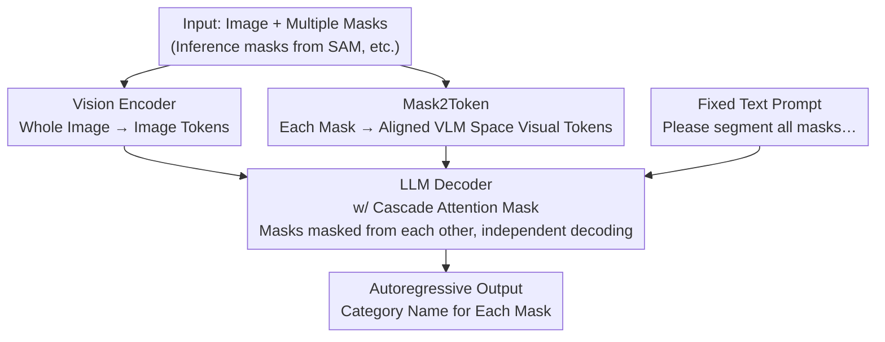

# WOW-Seg: A Word-Free Open World Segmentation Model

**Conference**: ICLR 2026  
**Paper**: [OpenReview](https://openreview.net/) (ICLR 2026 accepted paper, arXiv ID TBA, ⚠️ subject to original text)  
**Code**: https://github.com/AAwcAA/WOW-Seg-Meta  
**Area**: Open World Segmentation / Multimodal VLM  
**Keywords**: Open World Segmentation, Visual Prompt, Vision Large Language Models, Attention Mask, Region Recognition

## TL;DR
WOW-Seg reformulates the task of "assigning category names to segmented regions" from a classification problem with fixed heads into an autoregressive "image captioning" generation problem for VLLMs. By using Mask2Token to encode arbitrary masks into visual prompts within the VLM feature space and Cascade Attention Mask to prevent interference between multiple masks during parallel training/inference, it achieves new SOTA results on LVIS / PACO with only 1B parameters.

## Background & Motivation
**Background**: Image segmentation has long evolved towards "improving accuracy and efficiency," mainly following three paths: closed-set segmentation (pixel-wise classification with fixed category heads), open-vocabulary segmentation (matching pixel regions with text category embeddings), and VLM-based segmentation (driven by text instructions, such as LISA).

**Limitations of Prior Work**: The output capabilities of the first two categories are strictly constrained by predefined classes, failing when encountering the "infinitely open" object categories in the real world. While the third category leverages the cognitive abilities of VLLMs, its results are highly dependent on user-provided text prompts; without appropriate text, it cannot perform segmentation. Even strong foundational models like SAM / SAM2 can only segment regions in a class-agnostic manner and cannot provide region semantics.

**Key Challenge**: There is a disconnect between segmentation capability and semantic understanding—SAM-like models are skilled at "cutting" but not "recognizing," while VLLM-type models can "recognize" but require text inputs. Previous approaches to integrating masks into VLLMs (e.g., VP-MLLM, DAM, PAM) suffer from two hidden issues: ① tokens generated by specialized mask encoders fall outside the pre-trained feature distribution of the VLLM, requiring extensive alignment training; ② training/inference can only handle a single mask at a time, limiting speed in multi-instance scenarios, or supporting multiple masks while ignoring inter-mask interference (as in VP-MLLM).

**Goal**: To develop a **word-free** open-world segmentation model that requires no text input, takes visual prompts (masks) in any form, and outputs the category name for each mask. Additionally, the goal is to implement multi-mask parallel training correctly and efficiently while providing a benchmark with a sufficiently rich set of categories to truly test open-world understanding.

**Key Insight**: The authors redefine "region category recognition" as a **vision-driven text generation** problem. Since VLLMs are inherently capable of next-token prediction, the model is designed to autoregressively "speak" the name of each mask based on its visual tokens, fundamentally bypassing the limitations of fixed category heads.

**Core Idea**: Utilizing "mask visual tokens within the VLM feature space + Cascade Attention Mask" allows a single VLLM to independently identify all masks in an image in one forward pass without cross-interference.

## Method

### Overall Architecture
WOW-Seg is built on an encoder-decoder framework using a VLLM (InternVL3-1B) as the backbone. Given an image and a set of masks, the model autoregressively generates category names for each mask. The pipeline consists of four modules: a **Vision Encoder** that encodes the entire image into image tokens to provide context; **Mask2Token**, which maps each input mask into mask tokens within the VLM embedding space; these mask tokens, along with image tokens and a fixed text prompt ("Please segment all masks…"), are fed into the LLM decoder. The decoder incorporates the **Cascade Attention Mask** to ensure that predictions for each mask are independent and leak no information to others. Finally, all category names are "spoken" simultaneously via standard next-token prediction. During training, ground-truth masks are used as inputs, while during inference, masks can be flexibly sourced from any **Mask Generator** like SAM.

### Key Designs

**1. Mask2Token: Encoding Masks as "Native" Visual Prompts in VLM Feature Space**

Previous works encoded binary masks into tokens using specialized modules. Although information was preserved, these tokens fell outside the VLLM's pre-trained embedding space, creating a distributional gap that required significant retraining for alignment. The ingenuity of Mask2Token lies in **not building a separate encoder**, but reusing the same shared-weight vision encoder used for the entire image. For each mask, the model crops a "mask region image" including context (default context scale = 2, where the crop side length is 2× the mask's maximum dimension), resizes it to the standard $448 \times 448$ input, and passes it through the vision encoder to obtain a $16 \times 16$ grid of image tokens. Simultaneously, the binary mask is downsampled to $16 \times 16$ and used as a "selector" to extract mask-covered tokens from the feature grid, discarding irrelevant background tokens. Because a **shared-weight encoder** is used, the produced mask tokens naturally reside in the same embedding space as the global image features, eliminating the need for alignment training. Mask2Token also handles **multiple masks in parallel**, allowing features of different objects to be fed into the LLM simultaneously.

**2. Cascade Attention Mask: Ensuring "No Inter-Instance Interference" During Parallel Training**

Training with single masks (SM) per sample is far less efficient than multi-mask (MM) training, as MM can process all instances in an image in one forward pass, better aligning with the "multi-object per image" nature of the open world. However, MM introduces a critical problem: **inter-instance interference**, where the model might incorrectly correlate features of different objects. This occurs because of the LLM's inherent causal attention mask; when predicting the $i$-th object, the model refers to the mask prompts and outputs of objects $0$ to $i-1$:

$$P(O_1,\dots,O_K \mid \text{Image}; T; M) = \prod_{i=1}^{K} P\big(O_i \mid \text{Image}; T; M; O_0,\dots,O_{i-1}\big)$$

However, the goal is for the $i$-th name to be **determined solely by its own $i$-th mask**. The Cascade Attention Mask rearranges the attention structure: image tokens and text prompt tokens are globally visible to all tokens, but mask tokens of different instances are **masked from each other**. For example, when generating "traffic sign," the model can only attend to its own mask tokens and its generated prefix (e.g., "traffic"), and must not see the "fire truck" mask tokens, and vice versa. It follows three principles: mask independence, object independence, and decoupling of each (mask, object) pair. When predicting the $i$-th object, visible information is restricted to image tokens, text tokens, and the $i$-th mask tokens. Thus, object predictions become conditionally independent:

$$P(O_1,\dots,O_K \mid \text{Image}; T; M) = \prod_{i=1}^{K} P(O_i \mid \text{Image}; T; M),\quad P(O_i \mid \text{Image}; T; M) = P(O_i \mid \text{Image}; T; m_i)$$

This preserves the parallel efficiency of MM while avoiding semantic crosstalk between unrelated masks. The authors devised variants (satisfying either "mask independence" or "object independence"), and ablations show that "simultaneous decoupling of mask region features + output object names" yields the best performance.

**3. RR-7K: A 7,662-Class Open World Benchmark via a Three-Stage Pipeline**

Most existing evaluations use common categories (ranging from dozens to a thousand), which fail to truly test open-world understanding. RR-7K's images and mask annotations are taken from SA-1B. The challenge lies in **assigning correct categories to each mask**, which the authors solve via a three-stage pipeline: ① **Mask patch category inference**: Removing meaningless small masks from SA-1B (improving quality and efficiency), then using tools like Qwen2.5VL-72B and Grounded SAM to infer categories; ② **Hallucination filtering**: The resulting mask-category pairs exhibit a long-tail distribution with LLM hallucinations. For **head categories**, InternVL-78B is used to re-verify ("Is the region circled by the red outline/mask a {category}? Answer yes/no"), filtering out incorrect data (tail categories are skipped due to lower LLM cognitive reliability); ③ **Human screening**: Manual verification is performed on all tail categories and filtered head categories. Since each mask already has a candidate name, humans only need to delete inconsistent samples, keeping costs low. RR-7K contains 80k+ images, 200k+ instances, and 7,662 categories, making it the most category-rich region recognition dataset to date.

### Loss & Training
The base model is a pre-trained InternVL3-1B, trained on 8 NVIDIA H100 GPUs using the AdamW optimizer with a learning rate of $1\times 10^{-5}$ and a batch size of 32. The final reported model was trained for 2 epochs on LVIS, PACO, and COCO Stuff. The default upper limit for masks per sample is 30 to ensure load balancing across GPUs. The training objective is standard autoregressive next-token prediction (generating category names for each mask).

## Key Experimental Results

### Main Results: Open World Region Recognition (LVIS / PACO / RR-7K)

| Model | Params | LVIS Sem.Sim. | LVIS Sem.IoU | PACO Sem.IoU | RR-7K Sem.IoU |
|------|--------|---------------|--------------|--------------|---------------|
| Osprey | 7B | 65.2 | 38.2 | 52.7 | 32.5 |
| VP-SPHINX | 13B | 87.1 | 62.9 | 51.3 | 17.5 |
| DAM | 8B | 89.0 | 77.7 | 73.2 | - |
| PAM | 3B | 88.6 | 78.3 | 74.9 | 13.4 |
| **WOW-Seg** | **1B** | **89.7** | **82.4** | **79.2** | **44.8** |

With only 1B parameters, the model demonstrates comprehensive leadership: on LVIS, it uses 9× fewer parameters than the previous SOTA DAM while exceeding it by 0.7 in Semantic Similarity and 4.1 in Semantic IoU compared to PAM (despite having 3× fewer parameters). On RR-7K, all prior methods drop significantly (e.g., PAM-3B at only 13.4), whereas WOW-Seg reaches 44.8, confirming that RR-7K is more challenging and better at verifying open-world capabilities.

### Open-Vocabulary Panoptic/Semantic Segmentation (Cityscapes / ADE20K)

| Method | Params | Cityscapes PQ | Cityscapes mIoU | ADE20K-150 mIoU |
|------|------|---------------|-----------------|-----------------|
| Osprey | 7B | 50.64 | 49.78 | 29.63 |
| **WOW-Seg** | **1B** | **65.76** | **66.40** | **37.77** |

Without any text input (using Sentence-BERT to compare region embeddings with category embeddings during inference), it outperforms Osprey-7B by +15.12 PQ / +16.62 mIoU on Cityscapes.

### Ablation Study

| Training | Region Decoupling | Output Decoupling | LVIS Sem.IoU | PACO Sem.IoU | Notes |
|------|:----------:|:----------:|--------------|--------------|------|
| SM | - | - | 74.70 | 66.04 | Single mask training, weakest |
| MM | - | - | 80.10 | 75.49 | Multi-mask without cascade mask |
| MM | ✓ | - | 82.18 (+2.08) | 78.38 (+2.89) | Region decoupling only |
| MM | - | ✓ | 81.94 (+1.84) | 77.42 (+1.93) | Output decoupling only |
| MM | ✓ | ✓ | **82.35 (+2.25)** | **79.22 (+3.73)** | Full Cascade Attention Mask |

Mask2Token variants comparison (LVIS Sem.IoU): Fore2Token (white background) 72.54, Blur2Token (Gaussian blur) 71.28, **Mask2Token 74.70**—proving that "selecting tokens from shared feature grids via downsampled masks" is significantly superior to "modifying background and re-encoding." Region scale ablations show that scale=2 is chosen for efficiency and performance balance.

### Key Findings
- **MM > SM is the main factor**: Under the same training steps, multi-mask training yields ~5.4 higher IoU (LVIS 74.70 → 80.10) because more data is learned per step.
- **Simultaneous decoupling is optimal**: Decoupling either the input regions or output names alone is inferior to doing both, indicating that "instance non-interference" must be guaranteed on both sides.
- **RR-7K is the true test**: Prior methods collapse on RR-7K (e.g., PAM at 12–13 IoU), showing that open-world generalization gaps only emerge when scaling from 1k to 7k categories.

## Highlights & Insights
- **Eliminating Distribution Gaps via Shared Vision Encoders**: Mask2Token avoids creating new encoders, instead using a shared-weight encoder with downsampled mask selectors to keep mask tokens within the VLM space—an elegant shortcut that avoids alignment training and is transferable to any region-based VLLM task.
- **Achieving Efficiency and Independence via Attention Masking**: Cascade Attention Mask solves the crosstalk issue of causal masking without changing the model architecture or adding parameters. It effectively factorizes the joint distribution into conditionally independent products—a key innovation.
- **Word-free Paradigm**: By reformulating classification into generation, the model can flexibly interface with any mask generator and can revert to open-vocabulary classification via Sentence-BERT if needed.

## Limitations & Future Work
- **Dependency on External Mask Generators**: The model is responsible for "recognizing" but not "cutting"; inference quality hinges on upstream masks (e.g., from SAM). End-to-end errors in real deployment require further discussion.
- **30-Mask Limit per Sample**: This is a hard limit for load balancing; performance and strategy in hyper-dense scenarios (objects > 30) are not deeply explored.
- **RR-7K Labeling Pipeline Issues**: Although hallucination filtering and human screening are used, tail categories lack verification, and category names rely on LLM inference. The precision ceiling of long-tail annotations merits attention (⚠️ see original appendix for annotation quality details).
- **Future Directions**: Exploring end-to-end joint training of mask generation and recognition, or supporting dynamic instance counts in Cascade Attention Mask to improve speed and quality.

## Related Work & Insights
- **vs SAM / SAM2**: These provide class-agnostic segments; WOW-Seg complements them with recognition capability. They can be cascaded (SAM for masks → WOW-Seg for categories).
- **vs LISA / Text-driven VLM Segmentation**: LISA requires user text; WOW-Seg is entirely word-free, using visual prompts to generate names autoregressively.
- **vs VP-MLLM**: While both support multiple masks, VP-MLLM ignores inter-mask correlation; direct multi-mask training causes interference. WOW-Seg uses Cascade Attention Mask for explicit decoupling.
- **vs DAM / PAM**: These are limited to single-mask processing and range from 1.5B–8B parameters; WOW-Seg is parallel-capable, only 1B parameters, and superior in IoU.

## Rating
- Novelty: ⭐⭐⭐⭐⭐ "Reformulating recognition as generation + attention decoupling" is a clean and original combination.
- Experimental Thoroughness: ⭐⭐⭐⭐⭐ Multi-task benchmarks + full ablations + a new 7K-category benchmark.
- Writing Quality: ⭐⭐⭐⭐ Clear methodology and mathematical derivations; some appendix details require cross-referencing.
- Value: ⭐⭐⭐⭐⭐ 1B model exceeding 7–8B SOTA; both the word-free paradigm and RR-7K benchmark are highly practical.

<!-- RELATED:START -->

## Related Papers

- [\[CVPR 2026\] PCA-Seg: Revisiting Cost Aggregation for Open-Vocabulary Semantic and Part Segmentation](../../CVPR2026/segmentation/pca-seg_revisiting_cost_aggregation_for_openvocabulary_semantic_and_part_segmentat.md)
- [\[CVPR 2025\] V-CLR: View-Consistent Learning for Open-World Instance Segmentation](../../CVPR2025/segmentation/v-clr_view-consistent_learning_for_open-world_instance_segmentation.md)
- [\[ICLR 2026\] LiFR-Seg: Anytime High-Frame-Rate Segmentation via Event-Guided Propagation](lifr-seg_anytime_high-frame-rate_segmentation_via_event-guided_propagation.md)
- [\[CVPR 2026\] The Power of Prior: Training-Free Open-Vocabulary Semantic Segmentation with LLaVA](../../CVPR2026/segmentation/the_power_of_prior_training-free_open-vocabulary_semantic_segmentation_with_llav.md)
- [\[ICCV 2025\] Open-World Skill Discovery from Unsegmented Demonstration Videos](../../ICCV2025/segmentation/open-world_skill_discovery_from_unsegmented_demonstration_videos.md)

<!-- RELATED:END -->
