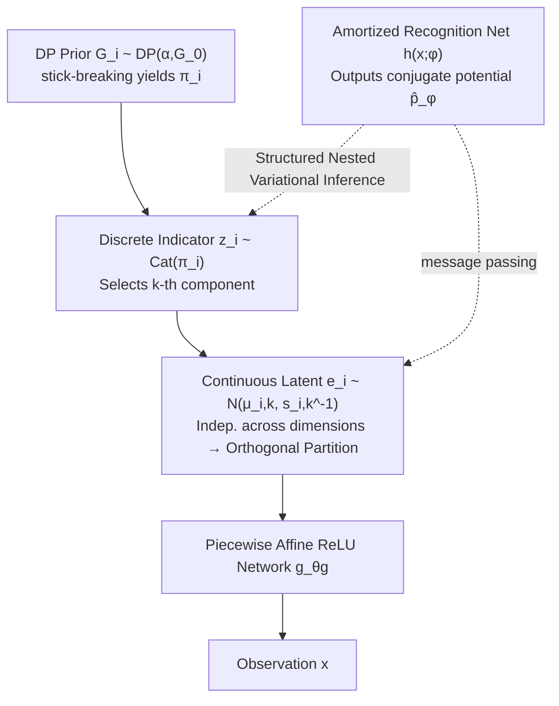

# A Bayesian Nonparametric Framework for Learning Disentangled Representations

**Conference**: ICLR 2026  
**OpenReview**: [https://openreview.net/forum?id=GVOLiaENgU](https://openreview.net/forum?id=GVOLiaENgU)  
**Code**: TBD  
**Area**: Representation Learning / Disentangled Representations / Bayesian Nonparametrics  
**Keywords**: Disentangled representations, identifiability, Dirichlet process, hierarchical mixture prior, structured variational inference, amortized inference  

## TL;DR
This paper replaces the common isotropic Gaussian prior in VAEs with a **Bayesian nonparametric hierarchical mixture prior**. While preserving provable identifiability, it allows the number of mixture components for each generative factor to grow adaptively with the data, learning modular and compact disentangled representations without any additional regularization terms.

## Background & Motivation
- **Background**: Unsupervised disentangled representation learning requires uniquely recovering the true latent structure from purely observational data, which is essentially an **identifiability** problem. Theoretically, a simple isotropic Gaussian prior combined with a nonlinear generative function leads to infinitely many equivalent observational distributions with entangled factors; thus, inductive biases must be injected.
- **Limitations of Prior Work**: ① Mainstream methods ($\beta$-VAE, $\beta$-TCVAE, etc.) rely on **heuristic inductive biases + strong regularization** to force disentanglement, lacking theoretical guarantees of identifiability. ② There is an **inherent trade-off** between regularization strength and latent capacity—stronger regularization improves disentanglement but compresses representation capacity, making it difficult to express complete patterns of variation. ③ Quantization methods like QLAE/Tripod use a **fixed-size codebook** to limit the number of discrete modes per factor. When the true number of modes exceeds the codebook capacity, information is truncated or split, harming interpretability.
- **Key Challenge**: The **structural constraints required for identifiability** are difficult to reconcile with the **unbounded capacity required to faithfully represent all patterns of variation**. Adding constraints limits capacity, while releasing capacity destroys the constraints.
- **Goal**: Construct a unified generative model that is **provably identifiable**, **adaptively capacity-unbounded**, and **naturally biased toward disentanglement**, removing reliance on auxiliary regularization and meticulous hyperparameter tuning.
- **Core Idea**: **[Nonparametric Hierarchical Mixture Prior]** Based on the mixture prior identifiability theorem by Kivva et al. (2022), the prior for each factor is replaced with an independent **Dirichlet Process (DP) mixture**. The hierarchical mixture structure provides the discrete index constraints needed for identifiability, while the nonparametric formulation allows the number of components for each factor to grow with its intrinsic complexity. These are integrated through factorized orthogonal partitions.

## Method

### Overall Architecture
The model (named **Bayes-QLAE**) is a hierarchical latent variable generative model: observations $x$ are generated from continuous latent variables $e\in\mathbb{R}^d$ via a piecewise affine ReLU network $g_{\theta_g}$. Each dimension $e_i$ is selected from the mixture components of that factor by a discrete indicator $z_i$, and the number of mixture components for each factor is determined nonparametrically by independent DP priors. To perform feasible inference under infinite mixtures, the authors design a **structured nested variational family** combined with an **amortized recognition network** to maintain the hierarchical dependencies between global variables (stick-breaking proportions $\beta$, component parameters $\theta$) and local variables $(e_i, z_i)$, using a greedy component expansion process for on-demand capacity growth.

### Key Designs

**1. Factorized hierarchical mixture prior, "welding" identifiability into the structure:** The authors inherit the conclusion from Kivva et al. (2022)—when latent marginals follow a Gaussian Mixture Model (GMM) and the generative function is piecewise affine and satisfies weak injectivity, the model is identifiable up to affine transformations. By introducing discrete variables to index mixture components and imposing a maximality condition (P3), it further identifies permutations, scaling, shifts, and even latent dimensions and discrete variable cardinality. Building on this, the authors **factorize** the multivariate discrete variables into statistically independent components $Z=Z_1\times\cdots\times Z_d$, where each $z_i$ indexes the discrete variation modes of one factor. This factorized prior forces the continuous latent space to be partitioned into $d$ **non-overlapping factor-specific subspaces** ($e_i\perp e_j\mid z$), making observations a **compositional synthesis** of mixture components from each factor, thereby encoding "disentanglement" directly into the generative structure rather than relying on posterior regularization.

**2. Dirichlet Process for adaptive capacity growth per factor:** To break the representation bottleneck of fixed codebook cardinalities, the authors place an independent DP mixture prior $G_i\sim\mathrm{DP}(\alpha,G_0)$ on each dimension $e_i$. Infinite mixture weights are constructed via stick-breaking $\pi_{i,k}=\beta_{i,k}\prod_{j<k}(1-\beta_{i,j})$, where $\beta_{i,k}\sim\mathrm{Beta}(1,\alpha)$. Component parameters follow a Normal-Gamma conjugate prior $G_0=\mathrm{NG}(m_0,\kappa_0,\nu_0,w_0)$ for closed-form posterior updates. A Gamma prior is added to the concentration $\alpha$ to satisfy the maximality condition, biasing the model to **use the minimum number of active components** to explain the data, thus selecting the unique representative within the equivalence class. Since the DP is applied independently to each dimension, each factor can freely expand its variation space without destroying the orthogonal partitions of other factors, providing universal approximation for discrete distributions.

**3. Structured nested variational family + greedy expansion for inferring infinite mixtures:** Traditional DPMM variational inference relies on **truncation** (fixed $T$) and **mean-field** approximations. However, mean-field breaks hierarchical dependencies, and variational families for different truncation levels $T$ are **not nested** ($T$-level is not a subset of $T{+}1$). Blindly increasing $T$ may not improve the approximation and can destroy sparse inductive biases. The authors instead use the **structured** variational family from Hoffman & Blei (2015) to preserve $\beta_i$–$z_i$–$\theta_i$–$e_i$ dependencies and adopt the **nested** variational family from Kurihara et al. (2006)—allowing only the first $T$ components to have free parameters, while remaining components are **tied to the prior**:

$$q_{\nu_\beta}(\beta_i)=\prod_{k=1}^{T}q_{\nu_{\beta_{i,k}}}(\beta_{i,k})\prod_{k=T}^{\infty}p(\beta_{i,k}\mid\alpha)$$

This supports infinite components while only optimizing $T$ sets of parameters. Combined with an analytically computable total probability of "assignment to all prior-tied components" $q(z_i>T\mid\beta_i)=(1-\sum_{k=1}^T\pi_{i,k})\cdot\exp\{\mathbb{E}_{p(\theta\mid\lambda)}\log\hat p_\phi(x_i\mid\theta)\}$ as a stopping criterion, the model begins with $T{=}1$ and **greedily** adds components only when they significantly improve the ELBO. Meaningless components automatically collapse back to the prior during training.

**4. Amortized inference with conjugate potentials, balancing flexible decoders with closed-form updates:** Neural network decoders $p_{\theta_g}$ are non-conjugate, making latent inference expensive. Following Johnson et al. (2016), the recognition network $h(x;\phi)$ **does not directly output the variational distribution** but instead outputs local **conjugate likelihood potentials** $\hat p_\phi(e_i\mid x)=\exp\{\langle h_i(x;\phi),t_e(e_i)\rangle\}$ as data-dependent proxies for the intractable likelihood, combined with the structured prior via message passing. The factorized structure of the recognition network mirrors the factorized prior, allowing each dimension $(e_i, z_i)$ to be inferred independently. The ELBO decomposes into a sum of local contributions $L_i$. Under conjugacy, the local optimal $q(e_i\mid z_i, \theta_i)$ follows an exponential family closed-form solution, whose natural parameter $\eta_e=\sum_k \mathbb{1}[z_i{=}k]\,\eta_\theta(\theta_{i,k})+h_i(x_i;\phi)$ explicitly fuses the structured prior and recognition network signals.

## Key Experimental Results

### Main Results Table (3DShapes, InfoMEC + DCI, higher is better, 5 random seeds)

| Model | InfoM | InfoC | InfoE | D | C | I |
|-------|-------|-------|-------|---|---|---|
| $\beta$-VAE | 0.62 | 0.44 | 0.93 | 0.58 | 0.42 | 0.97 |
| $\beta$-TCVAE | 0.65 | 0.56 | 0.91 | 0.56 | 0.46 | 0.95 |
| BioAE | 0.58 | 0.42 | 0.90 | 0.48 | 0.39 | 0.91 |
| QLAE | 0.84 | 0.49 | 0.97 | 0.79 | 0.56 | 0.97 |
| Tripod | 0.91 | 0.58 | 0.96 | 0.80 | 0.63 | 0.97 |
| **Bayes-QLAE** | **0.91** | **0.61** | 0.95 | **0.84** | **0.65** | 0.97 |

### MPI3D Dataset (Factor variation follows power-law distribution)

| Model | InfoM | InfoC | InfoE | D | C | I |
|-------|-------|-------|-------|---|---|---|
| $\beta$-VAE | 0.41 | 0.40 | 0.68 | 0.24 | 0.19 | 0.80 |
| $\beta$-TCVAE | 0.48 | 0.46 | 0.62 | 0.27 | 0.24 | 0.79 |
| BioAE | 0.44 | 0.38 | 0.61 | 0.26 | 0.14 | 0.77 |
| QLAE | 0.52 | 0.43 | 0.68 | 0.38 | 0.34 | 0.81 |
| Tripod | 0.59 | 0.54 | 0.74 | 0.47 | 0.45 | 0.84 |
| **Bayes-QLAE** | **0.60** | **0.56** | 0.71 | **0.48** | **0.47** | 0.81 |

### Key Findings
- **Most significant Gain in Compactness (InfoC / C)**: Compared to QLAE, Bayes-QLAE improves InfoC from 0.49 to 0.61 and C from 0.56 to 0.65 on 3DShapes, confirming that nonparametric priors adapt to factor complexity without sacrificing modularity.
- **On par with or better than Tripod, but more efficient**: Tripod achieves high scores via Normalized Hessian Penalty, requiring multiple forward passes of the generative network and sensitivity to quantization level hyperparameters. Bayes-QLAE relies solely on structural inductive bias to **automatically learn quantization levels from data**, reaching comparable performance without extra regularization or tuning.
- **Distribution shape affects gains**: The improvement is more pronounced on 3DShapes (approximately uniform, fewer variations) than on MPI3D (power-law distribution). The authors suggest that replacing DP with a **Pitman–Yor process**, which can model power laws, could further enhance performance.

## Highlights & Insights
- **Moving "Disentanglement" into the Prior Structure**: By using a factorized hierarchical mixture prior to carry identifiability constraints directly, the unified ELBO objective inherits a disentanglement bias, moving away from the old trade-off of "regularization strength vs. capacity."
- **Nonparametric = Adaptive Capacity**: The infinite support of the DP allows each factor to grow its number of components as needed. It neither truncates highly variable factors like fixed codebooks nor looses sparsity, automaticity selecting a unique representative within the identifiability equivalence class via the maximality bias of Gamma-on-$\alpha$.
- **Engineering Value of Nested Variational Families**: Optimizing only the first $T$ parameter sets while supporting infinite components—combined with an analytical "overflow probability" stopping criterion—turns greedy capacity expansion into a practical algorithm where useless components automatically collapse to the prior.
- **Amortized Conjugate Potentials**: This allows flexible neural decoders to coexist with conjugate closed-form local updates without changing the generative model, balancing expressivity and inference efficiency.

## Limitations & Future Work
- **Limited Benchmark Scale**: Validated only on 3DShapes and MPI3D (synthetic/semi-real datasets). Performance on natural images or higher-dimensional, more complex real-world scenes remains unproven.
- **Shortcomings on Power-Law Factors**: DP is insufficient for characterizing the clustering structure of power-law distributions. Gains narrowed on MPI3D; the authors acknowledge the need for more flexible processes like Pitman–Yor.
- **Inference Complexity and Hyperparameters**: Although regularization tuning is removed, new design choices are introduced, such as concentration $\alpha$, base distribution $G_0$ hyperparameters, greedy expansion thresholds, and truncation level $T$. Stability of Monte Carlo gradient estimation and step size remains empirically dependent.
- **Assumptions of Identifiability**: Theoretical guarantees depend on conditions like piecewise affine maps and weak injectivity. Whether real decoders strictly satisfy these and whether factors are truly statistically independent is difficult to fully verify in practice.

## Related Work & Insights
- **Identifiability Theory**: Directly built on the mixture prior identifiability theorem of Kivva et al. (2022), specializing its hierarchical discrete structure into factorized DP mixtures. It aligns with nonlinear ICA (Hyvärinen, Khemakhem, etc.) but follows a "structural inductive bias" route rather than "auxiliary variables/weak supervision."
- **Quantization-based Disentanglement**: QLAE / Tripod / FactorQLAE use vector quantization to create grid-like latent spaces. This paper identifies the bottleneck of fixed codebook cardinalities and solves it with nonparametric priors, making it a Bayesian nonparametric upgrade of QLAE (hence Bayes-QLAE).
- **Structured/Amortized Variational Inference**: Merges structured variational inference (Hoffman & Blei, 2015), nested variational families (Kurihara et al., 2006), and amortized conjugate potentials (Johnson et al., 2016). It serves as an exemplar for stitching classical Bayesian nonparametrics with deep generative models.
- **Insights**: For downstream tasks requiring interpretability, controllable generation, or causal/fairness separation, "writing structural constraints into priors and using nonparametrics for capacity" is a design paradigm worth following. Extending DP to Pitman–Yor, hierarchical DPs, or dependent processes may further cover power-law or hierarchical factor distributions.

## Rating
- **Novelty**: ⭐⭐⭐⭐ Systematically stitches together identifiability theorems, DP nonparametric priors, and structured nested variational inference for disentangled learning. The approach is coherent with theoretical support, representing a substantial Bayesian nonparametric upgrade rather than an incremental change.
- **Experimental Thoroughness**: ⭐⭐⭐ Comparison against 5 strong baselines on two standard benchmarks with ablation studies. However, the datasets are synthetic and limited in scale; natural images and larger-scale validation are missing.
- **Writing Quality**: ⭐⭐⭐⭐ The logic chain from motivation to theory, method, and inference is rigorous. Formulas and assumptions are well-documented, though the nonparametric inference section has a high barrier to entry for non-Bayesian readers.
- **Value**: ⭐⭐⭐⭐ Provides a unified framework for disentangled learning that is provably identifiable and adaptively capacity-unbounded without auxiliary regularization. It has practical significance for interpretable representations and controllable generation.

<!-- RELATED:START -->

## Related Papers

- [\[ICLR 2026\] Mechanistic Independence: A Principle for Identifiable Disentangled Representations](mechanistic_independence_a_principle_for_identifiable_disentangled_representatio.md)
- [\[ICLR 2026\] Disentangled representation learning through unsupervised symmetry group discovery](disentangled_representation_learning_through_unsupervised_symmetry_group_discove.md)
- [\[ICLR 2026\] Midway Network: Learning Representations for Recognition and Motion from Latent Dynamics](midway_network_learning_representations_for_recognition_and_motion_from_latent_d.md)
- [\[ICLR 2026\] GUIDE: Gated Uncertainty-Informed Disentangled Experts for Long-tailed Recognition](guide_gated_uncertainty-informed_disentangled_experts_for_long-tailed_recognitio.md)
- [\[ICLR 2026\] OrthoRF: Exploring Orthogonality in Object-Centric Representations](orthorf_exploring_orthogonality_in_object-centric_representations.md)

<!-- RELATED:END -->
