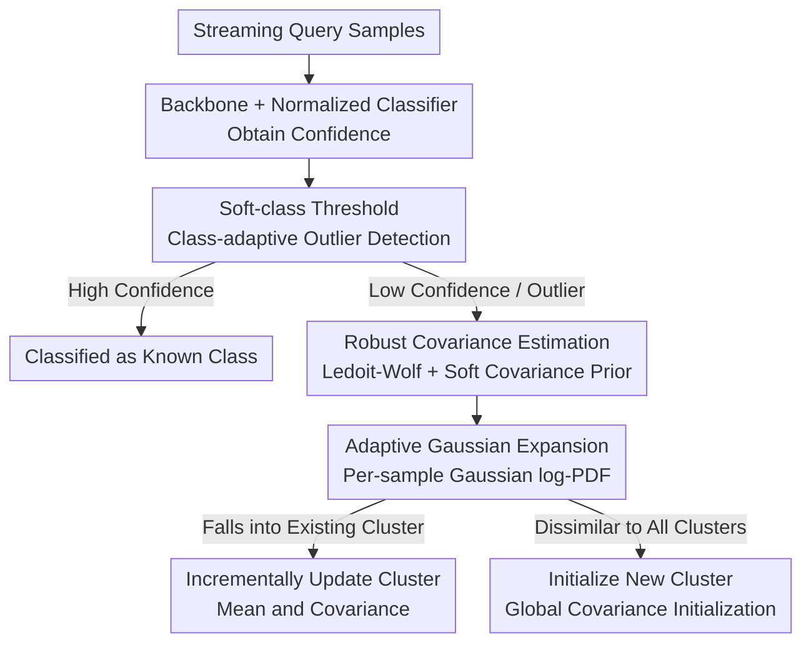

# Adaptive Gaussian Expansion for On-the-fly Category Discovery

**Conference**: ICLR2026  
**OpenReview**: [https://openreview.net/forum?id=Y59JeAbM3j](https://openreview.net/forum?id=Y59JeAbM3j)  
**Code**: https://github.com/Ashengl/AGE  
**Area**: Self-Supervised / Representation Learning  
**Keywords**: On-the-fly Category Discovery, Open-Set Recognition, Gaussian Density Estimation, Online Incremental Clustering, Covariance Shrinkage

## TL;DR
This paper demonstrates that the "On-the-fly Category Discovery" (OCD) task possesses a performance lower bound overlooked by existing hashing methods. It subsequently decomposes OCD into two sub-tasks: "Open-Set Recognition + Real-time New Category Discovery." By employing soft thresholds to categorize known classes directly and utilizing Adaptive Gaussian Expansion (AGE)—based on multivariate Gaussian density—for online incremental clustering of new classes, the authors improve overall accuracy by approximately 10% across multiple datasets.

## Background & Motivation
**Background**: Category Discovery aims to enable models to automatically discover new categories beyond annotated data, with established branches in NCD (Novel Class Discovery) and GCD (Generalized Category Discovery). However, these rely on transductive learning, where the entire test set is processed in batch or overlapping train/test categories are assumed—far from the ideal "one sample at a time" scenario in the open world. Consequently, the more challenging On-the-fly Category Discovery (OCD) was proposed: during training, only a labeled support set is provided; during testing, samples arrive in a **streaming** fashion and must be classified in real-time, potentially as previously unseen categories.

**Limitations of Prior Work**: Current OCD methods (e.g., SMILE, PHE) mostly follow the "hashing" route, decomposing features into signs and magnitudes, using the sign as a proxy for category identity. This approach has two fundamental flaws: first, hashing functions are extremely sensitive, and the model's "perceived category boundaries" often misalign with human semantic understanding, potentially splitting new classes based on irrelevant features; second, hashing is highly unfriendly to downstream tasks—even for mature old classes with sufficient training data, the model must "guess" which cluster a sample resembles via hashing rather than recognizing it directly and accurately as a known class.

**Key Challenge**: The authors highlight this issue through an counter-intuitive experiment. OCD uses the Strict-Hungarian matching evaluation, which takes the optimal assignment across all "predicted cluster ↔ ground-truth class" pairs. Under this evaluation, given a standard closed-set classifier that **discovers no new classes at all**, Hungarian matching can still yield a remarkably high score (Close-set I in Table 1). If one assumes new classes exist and maximizes matching, a closed-set classifier can even rival SOTA (Close-set II). This suggests that hashing-based methods do not effectively utilize information from labeled data; a significant portion of their performance is contributed by the evaluation lower bound itself.

**Goal / Key Insight**: Since this lower bound exists and hashing fails to accurately identify even old classes, the key to OCD is "first identifying known classes cleanly and then focusing on discovering truly new categories." The authors thus reconstruct OCD into two sub-problems: **Open-Set Recognition** (classifying known classes directly and treating others as outliers) + **Real-time New Category Discovery** (performing online clustering only on outliers).

**Core Idea**: Drawing inspiration from the Chinese Restaurant Process (CRP) in Dirichlet Process Gaussian Mixture Models (DPGMM), the authors propose Adaptive Gaussian Expansion (AGE). This method models distributions using the multivariate Gaussian Probability Density Function (PDF) of each class, using Mahalanobis distance in a streaming fashion to either merge new samples into existing clusters or create new ones without pre-specifying the number of categories.

## Method

### Overall Architecture
The input to AGE is a stream of query samples, and the output is the category decision for each sample (either a specific known class ID or an online-discovered new category). The pipeline consists of two stages: **First, Open-Set Recognition**—samples are encoded by a backbone and passed through a normalized classifier to obtain confidence scores. A class-adaptive soft threshold determines if a sample is a "high-confidence known class" or a "low-confidence outlier." High-confidence samples are directly assigned known class labels, while only low-confidence samples enter AGE. **Second, New Category Discovery**—AGE uses Ledoit-Wolf shrinkage and a soft covariance prior to estimate robust class covariances. For each outlier feature, the Gaussian log-PDF is calculated for all known/discovered clusters. If the maximum posterior falls within an existing cluster, the mean and covariance of that cluster are updated incrementally; otherwise, it is treated as a seed for a new cluster, initialized with the global covariance. This "greedy, posterior-based" assignment rule allows the model to adaptively grow new clusters during streaming inference.

### Key Designs

**1. OCD Performance Lower Bound and Task Reconstruction: Recognize Old Classes First, Then Discover New Ones**

This is the starting point of the paper. The authors point out that the Strict-Hungarian evaluation selects the optimal "prediction ↔ truth" matching, meaning a model that only performs closed-set classification and discovers zero new classes can still achieve substantial scores (Close-set I/II in Table 1 even rival SOTA). Therefore, they **formally define this score as the performance lower bound for OCD**. This observation negates the premise that "hashing is a good solution"—if hashing cannot accurately identify even old classes, it is naturally not a robust real-time new class detector. Based on this, the authors reconstruct OCD into two decoupled sub-tasks: Open-Set Recognition (direct, explicit recognition of known classes) + Real-time New Class Recognition (identifying only the remaining outlier samples). This step replaces "hashing everything together" with a "divide and conquer" strategy for known/unknown data, serving as the foundation for subsequent designs.

**2. Soft-class Threshold: Class-adaptive Separation of Known Classes from Outliers**

Using a global confidence threshold for all classes causes low-confidence small classes to be submerged; however, calculating individual thresholds for each class can lead to noise explosion if the validation set is small. The authors propose a compromise—the soft threshold: for each sample in validation set $D_V$, confidence is defined as $\gamma_i = \max(\mathrm{Softmax}(p_i))$. For class $k$, the mean $\mu_k$ and standard deviation $\sigma_k$ (tightened by a factor of 0.8) are computed. The final threshold fuses "intra-class" and "global" terms proportionally:

$$\tau_c = \beta\,(\mu_c-\sigma_c) + (1-\beta)\,\frac{1}{|Y_S|}\sum_{k\in Y_S}(\mu_k-\sigma_k).$$

Here $\beta$ is the fusion ratio (0.5 in experiments). During inference, $\tau_c$ is applied to each sample in the query set: if confidence exceeds the threshold, it is identified as a known class; otherwise, its $\ell_2$-normalized feature is sent to AGE. Compared to traditional OOD methods relying on OSCR/H-score and manual tuning, this threshold is calculated directly from intra-class statistics, mitigating distortions from class imbalance and inter-class covariance, making both known class identification and outlier detection more robust.

**3. Robust Covariance Estimation: Ledoit-Wolf Shrinkage + Soft Covariance Prior for Small-sample Gaussian Density**

The core of AGE is fitting a multivariate Gaussian for each class and calculating the PDF, but in the early stages of streaming inference, samples per class are scarce. Empirical covariance matrices are unstable or singular, crippling PDF calculations. The authors apply three layers of robustness: ① **Ledoit-Wolf Shrinkage**—shrinking the empirical covariance $S$ toward a stable target $F = \frac{1}{d}\mathrm{tr}(S)I$, $\hat\Sigma_{LW} = (1-\lambda^*)S + \lambda^* F$, where the shrinkage coefficient $\lambda^*$ is determined automatically by unbiased estimation, proving more stable in high-dimensional low-sample regimes; ② **Soft Covariance Prior**—weighting the class covariance with the global covariance $\Sigma_{all}$ based on sample size: $\Sigma_k = (1-\alpha_k)\Sigma^k_{LW} + \alpha_k\Sigma_{all} + \varepsilon I$, where $\alpha_k = \frac{s}{N_k+s}$ is the soft prior weight—smaller samples rely more on the global prior; ③ **Numerical Stability Term $\varepsilon I$**—to prevent singularity, though an excessively large $\varepsilon$ would regress the covariance to an identity matrix, reducing the model to Euclidean distance ($\varepsilon = 10^{-2}$ almost degrades to SLC). Additionally, a fixed-size FIFO sliding window stores samples to prevent memory bloat.

**4. Adaptive Gaussian Expansion: Greedy Online Incremental Clustering Based on Posterior PDF**

With robust class Gaussians, AGE can "expand" the category set in a streaming manner. For each feature identified as an outlier $f_{od}$, it is first initialized using the global covariance $\Sigma_{all}$, and its density is calculated under all known/discovered Gaussian clusters. To prevent underflow in high dimensions, the log form is used:

$$\log p_k = -\tfrac{1}{2}\big(d\log(2\pi)+\log|\Sigma_k|+(f_{od}-\mu_k)^\top\Sigma_k^{-1}(f_{od}-\mu_k)\big).$$

If the maximum posterior falls within an existing cluster, the cluster's mean and covariance are updated incrementally based on the Dirichlet Process concentration parameter; if it is dissimilar to all clusters, it is treated as a new class seed, initialized with the global background covariance. This greedy, sample-by-sample local optimal decision rule mirrors the "sit at an existing table or start a new one" intuition of CRP without a predefined class count. The authors provide theoretical support: Lemma 1 proves that after whitening, semantically related unseen class C is geometrically closer to training class A than to unrelated class B; Proposition 1 further shows that when using the Gaussian of training class A as a background model for "not B," samples of C are more likely to be correctly identified as "not B"—providing a basis for "using known class distributions as background priors for unknown classes." Finally, features are reduced to 42 dimensions via PCA before PDF calculation to avoid instability (PDF values collapse numerically when dimensions exceed 128).

### Loss & Training
Training utilizes only the support set $D_S$. Unlike hashing methods, it does not perform sign/magnitude decoupling, operating directly in the feature space. The loss is the sum of a Supervised Contrastive Loss $L_{sup}$ (pulling same-class projections $z_i = H(E(x_i))$ together and pushing different classes apart) and standard Cross-Entropy $L_{cls}$: $L = L_{cls} + L_{sup}$. The backbone is a ViT-B/16 pre-trained via DINO self-supervision, trained for 100 epochs with a batch size of 128 and a learning rate of 0.005. A 20% validation split is used to estimate soft thresholds. Features are reduced to 42 dimensions via PCA, with a sliding window size of 20, soft prior $s=2$, and fusion ratio $\beta=0.5$.

## Key Experimental Results

### Main Results
Comparison with SOTA on 5 standard datasets (Strict-Hungarian ACC, All/Old/New):

| Dataset | Metric | AGE (Ours) | PHE | DiffGRE | Note |
|---------|--------|-----------|-----|---------|------|
| CIFAR-100 | All | 60.8 | 55.9 | - | Coarse-grained |
| ImageNet-100 | All | 48.2 | 34.1 | - | Coarse-grained, largest gain |
| ImageNet-100 | New | 28.6 | 10.8 | - | ~3x improvement in New |
| CUB-200 | All | 46.3 | 36.4 | 42.5 | Fine-grained |
| Scars | All | 34.8 | 31.3 | 27.7 | Fine-grained |
| Herbarium19 | All | 30.9 | 22.5 | - | Fine-grained long-tail |

On coarse-grained sets (CIFAR-100/ImageNet-100), overall accuracy is 9.5% higher than PHE on average; on fine-grained sets (CUB-200/Scars/Herbarium19/Pets), it is 8.8% higher than PHE. Across six datasets, the **New** class accuracy improves by 16.7% on average, indicating that gains primarily stem from superior discovery capabilities. On the more difficult iNaturalist, AGE averages 5.3% higher than PHE (+8.6% on Fungi).

### Ablation Study
Component Ablation (Table 4, OSR=Open Set Recognition / PDF=Gaussian Density / LW=Ledoit-Wolf / SC=Soft Covariance):

| Configuration | CUB-200 All | ImageNet-100 All | Note |
|---------------|-------------|------------------|------|
| Full (OSR+PDF+LW+SC) | 46.3 | 48.2 | Complete Model |
| w/o SC (Soft Covariance) | 27.0 | 35.8 | Largest drop; unstable early cov |
| w/o LW (Ledoit-Wolf) | 45.0 | 47.8 | Minor drop; weaker discovery |
| w/o OSR (Open Set Recognition)| 38.8 | 20.9 | Collapses to 20.9 on ImageNet |

Numerical stability term $\varepsilon$ (Table 6): $10^{-5}$ is optimal; at $\varepsilon = 10^{-2}$, covariance becomes overly diagonalized, degrading to SLC and dropping CUB-200 from 46.3 to 30.9. Dimensionality reduction (Table 5): PCA is most stable overall, while RP performs better on coarse-grained ImageNet (preserving global structure) but damages local details in fine-grained CUB-200.

### Key Findings
- **Soft Covariance (SC) contributes most**: Removing it drops CUB-200 from 46.3 to 27.0 and ImageNet-100 from 48.2 to 35.8. Since samples per class are scarce in early streaming, unstable covariance cripples the PDF; pulling it toward the global covariance via soft priors is critical.
- **OSR is indispensable**: Without open-set recognition, known classes are treated as background, causing ImageNet-100 to collapse to 20.9 (Old moves to 0.1). This validates the strategy of using known distribution as a background prior.
- **Dimensionality and Granularity Coupling**: As dimensionality increases, ImageNet-100 improves steadily, while CUB-200 peaks and then declines—noise and overfitting are more severe in high-dimensional fine-grained data. PCA reduction to 42 dimensions is used throughout.
- **Optimal Hyperparameter $s=2$** controls the relative importance of the soft covariance prior.

## Highlights & Insights
- **Falsifying the mainstream route via "Performance Lower Bound"**: By revealing that a closed-set classifier can rival SOTA under Strict-Hungarian evaluation, the authors demonstrate that hashing methods essentially benefit from evaluation artifacts. This is a sharp and persuasive contribution.
- **Reintroducing generative probabilistic modeling to OCD**: Compared to discriminative approaches that only look at logits (relative distance), multivariate Gaussian PDFs explicitly estimate class parameters, allowing for generative likelihood calculation, better distribution characterization, and improved uncertainty estimation.
- **Triple covariance stabilization as a key for deployment**: The combination of Ledoit-Wolf shrinkage, soft priors, and $\varepsilon$ regularization solves the most difficult engineering hurdle—unstable Gaussian density estimation in low-sample streaming—which is transferable to any online density task.
- **Engineering CRP/DPGMM ideas**: The "sit at a table or open a new one" logic is realized as greedy incremental clustering based on log-PDF, naturally supporting streaming expansion without a predefined $K$.

## Limitations & Future Work
- **Reliance on clean Open-Set Recognition**: The authors admit the discovery effectiveness depends on the assumption that known classes and outliers can be separated—if OSR fails, errors propagate to AGE.
- **Fine-grained + High-dimension trade-off**: PDF calculation collapses above 128 dimensions, necessitating PCA to 42, which may be a bottleneck for tasks requiring high-dimensional fine-tuned discrimination.
- **Approximation from greed and sliding windows**: Local optimal decisions are not revisited; early misassignments cannot be corrected. FIFO windows discard early samples, potentially losing long-term distribution information.
- **Strong theoretical assumptions**: Lemma 1 and Proposition 1 rely on assumptions like shared covariance and whitening, which may not hold for actual features; the theory primarily provides intuitive support.

## Related Work & Insights
- **vs SMILE / PHE (Hashing OCD)**: These treat feature sign bits as class proxies; AGE operates in the feature space without decoupled projection heads. AGE significantly outperforms them in **New** class accuracy (+16.7%).
- **vs DiffGRE**: While DiffGRE relies on multi-modal and generative large models, AGE achieves comparable performance using only DINO ViT and statistical modeling, proving more lightweight and deployable.
- **vs SLC (Incremental Clustering)**: SLC relies purely on distance thresholds. AGE differs by using Gaussian PDF under robust covariance rather than raw distance, capturing intra-class distribution structure.
- **vs Traditional OSR/OOD**: Unlike MSP or Energy which require manual threshold tuning via OSCR/H-score, AGE's soft threshold is automatically derived from intra-class statistics.

## Rating
- Novelty: ⭐⭐⭐⭐⭐ Decoupling OCD via performance lower bound + OSR+Discovery reconstruction is highly novel.
- Experimental Thoroughness: ⭐⭐⭐⭐⭐ Covers coarse/fine-grained and large-scale iNaturalist; comprehensive ablations on components/dimensionality/hyperparameters.
- Writing Quality: ⭐⭐⭐⭐ Logically clear, balancing theory and engineering, though some formulas are dense.
- Value: ⭐⭐⭐⭐⭐ Avg +10% overall accuracy and +16.7% for new classes; easier to deploy than complex generative models.

<!-- RELATED:START -->

## Related Papers

- [\[CVPR 2026\] Assignment-Driven Hash Learning in a Hyper-Semantic Space for On-the-Fly Category Discovery](../../CVPR2026/self_supervised/assignment-driven_hash_learning_in_a_hyper-semantic_space_for_on-the-fly_categor.md)
- [\[ICCV 2025\] Generate, Refine, and Encode: Leveraging Synthesized Novel Samples for On-the-Fly Fine-Grained Category Discovery](../../ICCV2025/self_supervised/generate_refine_and_encode_leveraging_synthesized_novel_samples_for_on-the-fly_f.md)
- [\[ECCV 2024\] PromptCCD: Learning Gaussian Mixture Prompt Pool for Continual Category Discovery](../../ECCV2024/self_supervised/promptccd_learning_gaussian_mixture_prompt_pool_for_continual_category_discovery.md)
- [\[ICLR 2026\] Bures-Isotropy Alignment: Manifold Learning of Generalized Category Discovery](bures-isotropy_alignment_manifold_learning_of_generalized_category_discovery.md)
- [\[CVPR 2026\] Decouple Your Discovery and Memory in Continual Generalized Category Discovery](../../CVPR2026/self_supervised/decouple_your_discovery_and_memory_in_continual_generalized_category_discovery.md)

<!-- RELATED:END -->
