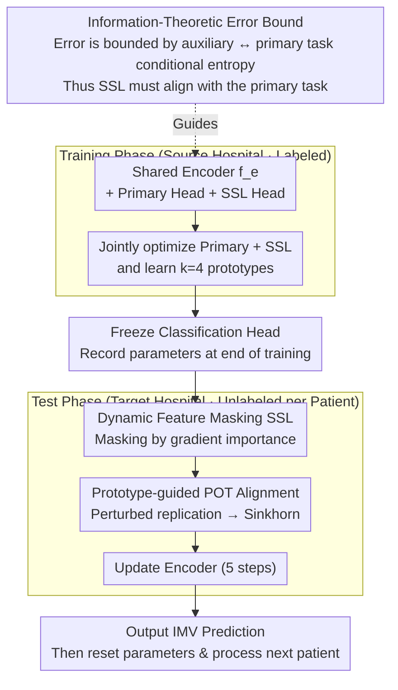

# Adaptive Test-Time Training for Predicting Need for Invasive Mechanical Ventilation in Multi-Center Cohorts

**Conference**: ICLR 2026  
**arXiv**: [2512.06652](https://arxiv.org/abs/2512.06652)  
**Code**: To be released  
**Area**: Medical Imaging / EHR Clinical Prediction  
**Keywords**: Test-Time Training, Domain Shift, Invasive Mechanical Ventilation Prediction, Dynamic Feature Masking, Partial Optimal Transport  

## TL;DR
The AdaTTT framework is proposed, achieving robust test-time adaptation on multi-center ICU EHR data through dynamic feature-aware self-supervised learning (adaptive masking strategy) and prototype-guided partial optimal transport alignment, utilized for predicting invasive mechanical ventilation (IMV) needs 24 hours in advance.

## Background & Motivation

**Background**: Predicting invasive mechanical ventilation (IMV) in the ICU is critical for timely clinical intervention. EHR-based ML models (e.g., VentNet, Composer) have shown potential, but deployment across different hospitals faces severe domain shift issues.

**Limitations of Prior Work**: Differences in patient populations, clinical workflows, and EHR systems across hospitals lead to distribution shifts, causing model AUC to drop by as much as 12% across institutions. Existing methods either require labeled target domain data for fine-tuning or are computationally expensive, making them unsuitable for real-time clinical deployment.

**Key Challenge**: Test-Time Training (TTT) enables unlabeled adaptation during the inference phase. However, directly applying existing TTT methods to EHR scenarios faces three problems: (a) unstable BN statistics under small batches (single encounter); (b) highly non-uniform importance of EHR features, where random masking SSL tasks fail to align with the primary task; (c) instance-level SSL updates are prone to overfitting noisy samples.

**Goal**: Design a framework optimized specifically for EHR-TTT scenarios, ensuring high alignment between the SSL auxiliary task and the primary task while preventing overfitting during test-time.

**Key Insight**: An information-theoretic derivation of the upper and lower bounds for test-time prediction error (Theorem 2) proves that the error is constrained by the conditional uncertainty between the auxiliary and primary tasks $H(Y_m'|Y_s')$, providing theoretical guidance for designing highly aligned SSL tasks.

**Core Idea**: Use dynamic feature importance-driven adaptive masking to tightly align SSL with clinical prediction tasks, combined with prototype-based partial optimal transport for flexible distribution matching during test-time.

## Method

### Overall Architecture
AdaTTT addresses the drop in performance when an IMV prediction model trained at a source hospital is deployed elsewhere without target labels or time for fine-tuning. It attaches a self-supervised (SSL) auxiliary task to the model, allowing the model to perform a few steps of unlabeled local updates for each new patient during inference before making a prediction. The network consists of a shared encoder $f_e$, a primary task classification head $h_c$, and an SSL head $h_s$. During the training phase, all three are jointly optimized (primary task loss + SSL loss + prototype learning loss). During the test phase, the classification head is frozen, and only the SSL loss plus an optimal transport (OT) alignment loss are used to update the encoder. After 5 steps of updates per sample, the prediction is made, and parameters are immediately reset to the training endpoint before processing the next patient. The two main components—what kind of SSL task is effective and how to flexibly align distributions at test-time—are addressed by dynamic masking and prototype OT, both derived from the information-theoretic analysis.

### Key Designs

**1. Information-Theoretic Error Bound: Formulating SSL design as a derivable problem**

The core premise of TTT is that "optimizing an auxiliary task drives improvement in the primary task." This section proves when this holds. Assuming test-time primary labels $Y_m'$, representations $Z'$, and SSL labels $Y_s'$ form a Markov chain $Y_s' \to Z' \to Y_m'$, Lemma 1 gives $I(Z';Y_m') \geq I(Y_s';Y_m')$, and Theorem 2 derives the bounds for test prediction error $p(e)$:

$$H_{\text{err}}^{-1}\big(H(Y_m'|Y_s')\big) \leq p(e) \leq \frac{1}{2}H(Y_m'|Y_s')$$

This bound defines the design objective: the error is constrained by the conditional entropy $H(Y_m'|Y_s')$. Therefore, the SSL task should ensure "knowing the SSL label almost implies knowing the primary task label" (high correlation). It also serves as a warning—overfitting the auxiliary task distribution on the test domain can pull the model away from the primary task. Dynamic masking is designed to minimize this conditional entropy.

**2. Dynamic Feature Masking SSL: Focusing on clinically significant features**

EHR feature importance is highly non-uniform (e.g., respiratory rate is far more critical for IMV prediction than peripheral lab values). Standard random masking in TTT wastes adaptation capacity on irrelevant features, leading to poor SSL-primary task alignment. This work employs two pretext tasks (feature reconstruction + masked feature modeling), where masking probabilities are dynamically assigned based on feature gradient importance relative to the primary task. The importance $I_j$ for feature $j$ is estimated by averaging the absolute value of the input gradient multiplied by the feature value across samples:

$$I_j = \frac{1}{n_s}\sum_n \left| \frac{\partial Y_m^{(n)}}{\partial x_j^{(n)}} \cdot x_j^{(n)} \right|$$

Normalized values yield masking probabilities $p_{m,j}$, where more important features are more likely to be masked, forcing the model to reconstruct critical signals. This follows a two-stage schedule: a warmup period using fixed prior importance (from a pre-trained respiratory failure model), followed by real-time updates based on the model's own gradients once it becomes reliable.

**3. Prototype-guided Partial Optimal Transport (POT) Alignment: Flexible per-patient matching**

During test-time, patients arrive individually. Direct distribution matching is unstable and might force a sample toward an irrelevant group. AdaTTT learns $k=4$ prototypes during training to summarize source distribution modes using a prototype loss $\mathcal{L}_{\text{proto}} = \|z_i - p_{\mathcal{A}(z_i)}\|_2^2$ (where $\mathcal{A}(z_i)$ is the nearest prototype assignment), with a balance regularizer to avoid collapse. At test-time, Partial Optimal Transport (POT) is used to match a test sample only with relevant prototype subsets. This is implemented by perturbing and replicating a single test representation $z'$ into $k$ copies (using inter-prototype variance for the perturbation), transforming POT into standard OT solvable via Sinkhorn. The alignment loss is $\sum_{i,j} \gamma_{ij}C_{ij}$. Compared to rigid full OT, partial matching allows test samples to align only with relevant prototypes.

### Loss & Training
- Training phase joint loss: $\mathcal{L} = \sum_i [\mathcal{L}_{\text{main}} + \mathcal{L}_{\text{ssl}} + \lambda_{\text{proto}}\mathcal{L}_{\text{proto}}] + \lambda_{\text{reg}}\mathcal{L}_{\text{reg}}$
- Test-time: 5 gradient update steps per input, followed by resetting encoder parameters (reset protocol).
- OT solved via Sinkhorn algorithm with entropy regularization $\varepsilon=0.1$ and 1000 max iterations.

## Key Experimental Results

### Main Results
Comparison with 9 baselines across 3 test cohorts (AUC, mean ± standard error over 20 runs):

| Method | Site A | Site B | MIMIC-IV |
|------|--------|--------|----------|
| TEST (No Adaptation) | 84.01 | 83.75 | 75.28 |
| TTT | 82.55±0.09 | 82.81±0.05 | 76.45±0.07 |
| TTT++ | 82.50±0.06 | 82.85±0.10 | 76.24±0.08 |
| SAR | 84.30±0.04 | 83.20±0.10 | 75.72±0.04 |
| CoTTA | 83.12±0.02 | 83.81±0.04 | 76.60±0.05 |
| **AdaTTT (Ours)** | **85.02±0.05** | **84.10±0.05** | **77.17±0.08** |

AdaTTT also achieved the best Brier scores (Site A: 0.086, Site B: 0.085, MIMIC-IV: 0.106).

### Ablation Study

| Configuration | Site A AUC | Site B AUC | MIMIC-IV AUC |
|------|-----------|-----------|-------------|
| PriTTT (Dynamic Masking only) | 84.61 | 83.98 | 76.84 |
| DynTTT (OT Alignment only) | 84.54 | 83.84 | 76.79 |
| AdaTTT (Full) | **85.02** | **84.10** | **77.17** |

### Key Findings
- Standard TTT and TTT++ perform **worse** than the no-adaptation baseline on EHR (Site A: 82.55 vs 84.01), indicating that EHR scenarios require specifically designed TTT methods.
- Dynamic masking and OT alignment each contribute approximately 0.5-1% AUC gain independently, with the combination providing the most stable and optimal results.
- Each test sample requires only 5 gradient updates (avg. 0.29s/step). Increasing prototypes from 4 to 16 has negligible impact on runtime.
- Sequential updates (without resetting parameters) lead to performance degradation over long-term deployment, proving the importance of the reset protocol.

## Highlights & Insights
- **Information-Theory Guided Design**: Theorem 2 formalizes the TTT design problem as "minimizing auxiliary-primary task conditional entropy," a framework applicable to other TTT/TTA auxiliary task designs.
- **Domain-Specific Wisdom**: Recognizing the non-uniform importance of EHR features and using gradient-driven masking probabilities is simple yet highly effective.
- **Partial OT via Perturbation**: The trick of transforming POT into standard OT via perturbed replication is clever and practical, avoiding the need for specialized POT solvers.

## Limitations & Future Work
- Small experimental scale (MIMIC-IV downsampled to ~2,000 encounters) with low positive rates (5-15%), indicating significant class imbalance.
- Only binary classification (IMV/non-IMV) was validated; generalization to multi-class or other clinical tasks is unknown.
- The choice of $k=4$ prototypes lacks a strong theoretical basis for large-scale heterogeneous populations.
- Insufficient robustness to conditional shift $p(Y|X)$ (e.g., label shift due to changing clinical practices).
- The reset protocol precludes the use of adaptation information from previous patients, leaving the issue of knowledge accumulation in long-term deployment unresolved.

## Related Work & Insights
- **vs TTT/TTT++**: Standard TTT uses fixed SSL tasks; AdaTTT uses dynamic feature-aware SSL, preventing the performance drop seen in the former on EHR data.
- **vs TENT**: Entropy minimization in TENT is unstable under single-instance batches and may produce overconfident incorrect predictions.
- **vs SAR**: SAR’s sharpness-aware updates perform close to AdaTTT on Site A but are unstable elsewhere and rely on BN layers.
- **vs T3A**: Adjusting the classifier alone cannot fix domain shift in the representation space.

## Rating
- Novelty: ⭐⭐⭐⭐ Combination of information-theoretic bounds, dynamic masking, and POT is creative, though technical components are somewhat standard.
- Experimental Thoroughness: ⭐⭐⭐⭐ Extensive multi-site evaluation and ablation, though dataset size remains a limitation.
- Writing Quality: ⭐⭐⭐⭐ Clear theoretical derivation and clinical motivation.
- Value: ⭐⭐⭐⭐ Directly addresses practical pain points of TTT in EHR scenarios with implications for clinical ML deployment.

<!-- RELATED:START -->

## Related Papers

- [\[ICLR 2026\] Test-Time Efficient Pretrained Model Portfolios for Time Series Forecasting](test-time_efficient_pretrained_model_portfolios_for_time_series_forecasting.md)
- [\[ICLR 2026\] Architecture-Agnostic Test-Time Adaptation via Backprop-Free Embedding Alignment](architecture-agnostic_test-time_adaptation_via_backprop-free_embedding_alignment.md)
- [\[ICLR 2026\] ZeroSiam: An Efficient Asymmetry for Test-Time Entropy Optimization without Collapse](zerosiam_an_efficient_asymmetry_for_test-time_entropy_optimization_without_colla.md)
- [\[ICML 2025\] Test-Time Training Provably Improves Transformers as In-Context Learners](../../ICML2025/self_supervised/test-time_training_provably_improves_transformers_as_in-context_learners.md)
- [\[ICLR 2026\] NEO — No-Optimization Test-Time Adaptation through Latent Re-Centering](neo_no-optimization_test-time_adaptation_through_latent_re-centering.md)

<!-- RELATED:END -->
