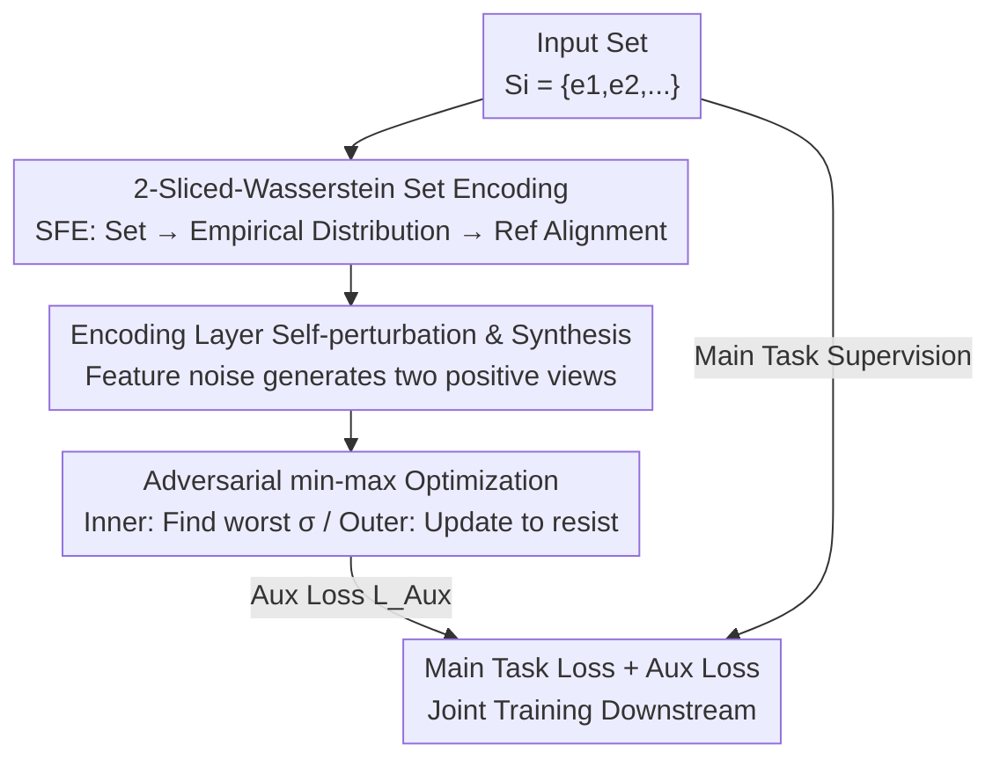

# Adversarial Encoding Perturbation and Synthesis for Set Representation Auxiliary Learning

**Conference**: ICLR 2026  
**OpenReview**: [https://openreview.net/forum?id=13r06yROEZ](https://openreview.net/forum?id=13r06yROEZ)  
**Code**: TBD  
**Area**: Self-supervised / Representation Learning (Set Representation Learning)  
**Keywords**: Set representation, Optimal Transport, Sliced-Wasserstein, Adversarial perturbation, self-supervised auxiliary learning

## TL;DR
SRAL treats each set as an empirical distribution and uses 2-Sliced-Wasserstein distance to encode "distribution-aware" representations. It injects adversarial perturbations at the **feature/encoding layer rather than the input layer** and employs min-max optimization to force the model to resist worst-case perturbations. This serves as a plug-and-play self-supervised auxiliary objective for various downstream tasks. Theoretically, this objective is equivalent to optimizing the Sliced-Wasserstein distance between sets in expectation. It consistently outperforms existing set encoders across four tasks: set similarity ranking, bundle recommendation, point cloud classification, and topic set expansion.

## Background & Motivation
**Background**: Sets are fundamental data structures that are unordered and variable-length—social groups, item bundles, point clouds, and document keyword sets are all examples. The goal of set representation learning is to map an arbitrary set $S_i$ into a fixed-length vector $v_i$ for downstream uses like retrieval or classification. Mainstream deep methods (DeepSet, Set Transformer/SAtt, RepSet, and Optimal Transport-based methods like PoT/OTKE/PSWE/FSW) focus on ensuring **intra-set** properties: permutation invariance and cardinality independence.

**Limitations of Prior Work**: These methods focus almost exclusively on intra-set attributes and lack explicit modeling of **inter-set correlation**—exactly how similar two sets are and where they differ. However, many tasks essentially require fine-grained set-to-set comparisons: similarity retrieval seeks the nearest neighbor of a query set, while in bundle recommendation, "camping kits" and "picnic kits" attract similar users due to overlapping items. Encoding each set individually does not automatically capture these relative relationships.

**Key Challenge**: Intra-set invariance constrains "how a single set aggregates internally," while inter-set correlation constrains "how different sets are arranged in the embedding space." The latter is not inherited for free from the former, leading to a gap in representation capability.

**Goal**: Design a **task-agnostic, plug-and-play** auxiliary learning objective that maintains the main task performance while learning discriminative representations that reflect distributional differences between sets.

**Key Insight**: By viewing sets as high-dimensional empirical distributions, "inter-set difference" can naturally be quantified using distribution distances—specifically the Wasserstein distance from Optimal Transport (OT). For representations to be truly "discriminative," they should resist **worst-case** perturbations rather than just random ones.

**Core Idea**: Utilize 2-Sliced-Wasserstein distance to encode sets into distribution-aware representations (SFE module), inject **adversarial perturbations at the encoding feature layer**, and train the model using min-max optimization to be robust against worst-case perturbations. It is theoretically proven that this adversarial self-supervised objective optimizes the Sliced-Wasserstein distance between sets in expectation.

## Method

### Overall Architecture
SRAL (Set Representation Auxiliary Learning) is not a standalone model but an **auxiliary learning framework**. The total loss is a weighted sum of the scenario-specific main task loss $L_{\text{Main}}$, the auxiliary loss $L_{\text{Aux}}$, and an L2 regularization term:

$$L = L_{\text{Main}} + \lambda_1 L_{\text{Aux}} + \lambda_2 \|\Xi\|_2^2$$

where $\Xi$ represents all trainable parameters. The pipeline works as follows: the input set is processed by the **SFE encoder**, which treats the set as an empirical distribution, aligns it with a learnable reference distribution using Sliced-Wasserstein, and produces a distribution-aware set embedding $v_i$. **Self-perturbation** is applied to set features to generate two positive views, which are pulled together (and pushed away from other sets) via InfoNCE. This is then upgraded to an **adversarial min-max** optimization: first, a shared worst-case perturbation $\sigma$ is found along the gradient (inner maximization), then the model parameters are updated to resist it (outer minimization).

### Key Designs

**1. 2-Sliced-Wasserstein Set Feature Encoder (SFE): Converting "Set Similarity" to Differentiable Distribution Distance**

To address the inability of existing encoders to capture inter-set correlation, SFE treats each set $S_i$ as an empirical distribution $P_i$ defined by element features $V_i = [z_{i,k}]_{k=1}^{|S_i|}$. It introduces a **learnable reference distribution** $O$ (characterized by $H$ trainable embeddings $V_O=[z_h]_{h=1}^H$, acting as a learnable "origin" in embedding space) and encodes sets using the distribution distance to this reference. Since high-dimensional Wasserstein is intractable, 2-Sliced-Wasserstein is used: high-dimensional distributions are projected onto random unit vectors $w\in\mathbb{S}^{d-1}$ via $\theta(x)=w^\top x$ into 1D, where OT has a closed-form solution $g^+(x^\theta\mid V_i^\theta)=F^{-1}_{P_i^\theta}\!\big(F_{O^\theta}(x^\theta)\big)$.

Intuitively, this is a **rank matching** process: $F_{O^\theta}(x^\theta)$ calculates the rank percentile of $x^\theta$ in the reference slice, and $F^{-1}_{P_i^\theta}$ finds the value at the same rank percentile in the set slice, i.e.,
$$g^+(x^\theta\mid V_i^\theta)=\arg\min_{x'\in V_i^\theta}\Big\{\tau(x'\mid V_i^\theta)\ge \tfrac{|S_i|}{H}\cdot \tau(x^\theta\mid V_O^\theta)\Big\}$$
where $\tau(\cdot)$ is the sorted rank. To approximate the infinite projections required theoretically, $R$ Monte Carlo random projections are used. Results for all projections and reference points are concatenated into the set embedding $\mathrm{SFE}(V_i,V_O\mid\Theta)=\mathrm{Concat}_{r,h}\big[g^+(w_r^\top z_h\mid V_i^{\theta_r})\big]$. Linear interpolation is used when $|S_i|\neq H$.

**2. Encoding Layer Self-perturbation & Synthesis: Creating Positive Samples at the Feature Level**

To solve the difficulty of set data augmentation (input-level addition/deletion is often too coarse), SRAL moves perturbations to the **feature/encoding layer**. For set features $V_i=[z_{i,k}]$, a small random noise constrained by norm $\pi$ is added to each element embedding $z'_{i,k}=z_{i,k}+\epsilon'_{i,k},\ \|\epsilon\|_2\le\pi$. These are fed into SFE to get $v'_i=\mathrm{SFE}(V'_i,V_O\mid\Theta)$. Two views $v'_i, v''_i$ are generated as a positive pair for InfoNCE:
$$L_{wd}=\sum_{S_i}-\log\frac{\exp(-\|v'_i-v''_i\|_2/\psi)}{\sum_{S_j}\exp(-\|v'_i-v''_j\|_2/\psi)}$$

**Remark 1** proves that the Euclidean distance of perturbed embeddings is **positively correlated with the 2-Sliced-Wasserstein distance between the underlying perturbed distributions in expectation**. Thus, minimizing $L_{wd}$ in the embedding space implicitly aligns the distribution distances between sets.

**3. Adversarial min-max Optimization: Forcing Representations to Resist "Worst-case" Perturbations**

SRAL seeks the **worst-case perturbation** proactively. It adds a **shared adversarial increment** $\sigma$ to the features. The goal is for $\sigma$ to maximize the contrastive loss while model parameters minimize this worst-case loss:
$$\min_{\Xi}\max_{\ $\|\sigma\|_2\le\pi}L_{wd}(\{v_i^\sigma\}),\quad v_i^\sigma=\mathrm{SFE}(V'_i+\sigma,V_O\mid\Theta)$$
Using a first-order Taylor expansion at $\sigma=0$, the direction of perturbation is the gradient direction. The process alternates between **Inner Maximization** (calculating $g_\sigma=\nabla_\epsilon L_{wd}|_{\epsilon=0}$ and taking a step $\hat\sigma=\eta\cdot g_\sigma$ projected onto the $\ell_2$ ball) and **Outer Minimization** (updating parameters $\Xi$ with the adversarial loss and main task loss). **Remark 2** interprets this as implicit regularization of the local **Lipschitz continuity** of SFE.

### Loss & Training
The total objective is $L=L_{\text{Main}}+\lambda_1 L_{\text{Aux}}+\lambda_2\|\Xi\|_2^2$, where $L_{\text{Aux}}=\max_{\|\sigma\|_2\le\pi}L_{wd}(\Xi,\sigma)$. The framework is compatible with various SSL losses (e.g., Set Triplet, Barlow Twins). Final hyperparameters are set to $H=32, R=128$.

## Key Experimental Results

### Main Results
Evaluation across four downstream tasks covering inter-set sensitivity (Tasks 1/2) and intra-set processing (Tasks 3/4).

| Task | Dataset | Metric | SRAL | Best Baseline | Gain |
|------|--------|------|------|----------|------|
| Task 1 Set Sim. Ranking | Friendster | R@20 | 91.57 | 83.58 (FSW) | +9.56%* |
| Task 1 Set Sim. Ranking | LIVEJ | R@20 | 87.56 | 85.36 (FSPool) | +2.58%* |
| Task 2 Bundle Rec. | Youshu | R@20 | 26.92 | 26.41 (CrossCBR) | +1.93%* |
| Task 2 Bundle Rec. | NetEase | R@20 | 7.37 | 7.21 (CrossCBR) | +2.22%* |
| Task 3 Point Cloud Class. | ModelNet40 (ISAB) | ACC | 87.31 | 86.93 (FSW) | +0.44%* |
| Task 4 Topic Set Expansion | LDA-3k | AUC | 87.93 | 79.67 (FSW) | +10.37%* |

(*Significantly better at 95% confidence via Wilcoxon test). Tasks sensitive to inter-set relations (1 and 4) saw the largest gains (6%-10%).

### Ablation Study
(Results for Friendster/Youshu/LDA-3k)

| Configuration | Task1 R@20 | Task4 AUC | Description |
|------|-----------|-----------|------|
| Full SRAL | 91.57 | 87.93 | Full model |
| w/o SFE | 67.02 (-26.81%) | 73.39 (-16.54%) | SFE replaced by Mean Pooling |
| w/o LI | 75.45 (-17.60%) | 72.44 (-17.62%) | Linear interpolation replaced by 2-layer MLP |
| w/o AEPO | 77.13 (-15.77%) | 66.21 (-24.70%) | InfoNCE remained, min-max removed |
| w/o AL | 87.38 (-4.58%) | 83.53 (-5.00%) | Entire auxiliary learning removed |

### Key Findings
- **SFE is the Foundation**: Replacing SFE with Mean Pooling causes the sharpest drop (26.81% on Task 1), proving distribution-aware encoding is fundamental.
- **The Adversarial Step is Critical**: Removing AEPO (adversarial optimization) led to a 24.70% drop in AUC on Task 4, which is more severe than removing the entire auxiliary objective (w/o AL). Finding the "worst-case" is the primary source of discriminative power.
- **Sensitivity to R**: With $H=32$, increasing Monte Carlo projections $R$ from 4 to 32 improved Recall@20 from 41.23% to 91.57%. Beyond $R=32$, gains diminish.
- **Faster and Deeper Convergence**: Despite the complexity of adversarial training, SRAL converges faster and reaches optimal validation performance earlier than non-adversarial versions.

## Highlights & Insights
- **Theoretical Link between Contrastive Learning and OT**: Remark 1 provides a "why it works" by showing that contrastive loss on perturbed embeddings is equivalent to optimizing Sliced-Wasserstein distances.
- **Encoding Layer Perturbation**: By perturbing the encoding process rather than raw inputs, SRAL avoids the difficulty of augmenting sets (which is often discrete and semantic-breaking) and provides fine-grained enhancements.
- **Plug-and-Play**: SRAL does not bind to a specific downstream model or SSL loss function, making it highly versatile in practice.
- **Learnable Reference $O$ as an Origin**: Using a shared learnable reference avoids the quadratic cost of $N \times N$ OT computations between all set pairs.

## Limitations & Future Work
- **Computational Overhead**: SFE based on Sliced-Wasserstein has higher training time per epoch compared to simple metrics like KL/JS divergence.
- **Marginal Gains in Specific Scenarios**: In bundle recommendation (Task 2), the gain is small because collaborative signal modeling in baselines like CrossCBR is already very strong.
- **First-order Approximation**: The min-max objective is solved via a single-step gradient ascent; the impact of multi-step PGD or the approximation error was not extensively discussed.
- **Theoretical Bounds**: Remark 1/2 are based on expectations; the bias under finite projection numbers $R$ is not quantified.

## Related Work & Insights
- **vs DeepSet / Set Transformer / RepSet**: While these focus on intra-set invariant aggregation, SRAL explicitly models inter-set distributional correlations through OT distances and adversarial auxiliary learning.
- **vs OT Encoders (PoT / OTKE / PSWE / FSW)**: SRAL differs by incorporating the **adversarial perturbation and min-max optimization** mechanism rather than just changing the distance metric.
- **vs Traditional Adversarial Training**: Standard methods perturb input data; SRAL perturbs the **encoding process itself**, interpreted through the lens of Lipschitz regularization.

## Rating
- Novelty: ⭐⭐⭐⭐ Perturbing the encoding layer and linking contrastive loss to Sliced-Wasserstein is a novel perspective.
- Experimental Thoroughness: ⭐⭐⭐⭐ Eight datasets across four tasks, sensitivity analysis for $R/H$, and convergence analysis.
- Writing Quality: ⭐⭐⭐⭐ Clear motivation and solid theoretical remarks, though some derivations are moved to the appendix.
- Value: ⭐⭐⭐⭐ A plug-and-play auxiliary framework that is broadly applicable to structured set data.

<!-- RELATED:START -->

## Related Papers

- [\[CVPR 2026\] PAF: Perturbation-Aware Filtering for Open-Set Semi-Supervised Learning](../../CVPR2026/self_supervised/paf_perturbation-aware_filtering_for_open-set_semi-supervised_learning.md)
- [\[ICLR 2026\] Boosting Open Set Recognition Performance through Modulated Representation Learning](boosting_open_set_recognition_performance_through_modulated_representation_learn.md)
- [\[ICLR 2026\] FedOpenMatch: Towards Semi-Supervised Federated Learning in Open-Set Environments](fedopenmatch_towards_semi-supervised_federated_learning_in_open-set_environments.md)
- [\[ICLR 2026\] Spatially Informed Autoencoders for Interpretable Visual Representation Learning](spatially_informed_autoencoders_for_interpretable_visual_representation_learning.md)
- [\[ICLR 2026\] Unsupervised Representation Learning - An Invariant Risk Minimization Perspective](unsupervised_representation_learning_-_an_invariant_risk_minimization_perspectiv.md)

<!-- RELATED:END -->
