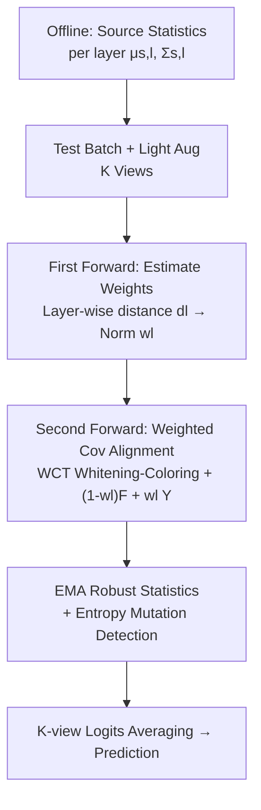

# Architecture-Agnostic Test-Time Adaptation via Backprop-Free Embedding Alignment

**Conference**: ICLR2026  
**OpenReview**: [https://openreview.net/forum?id=7kLNGaAHaw](https://openreview.net/forum?id=7kLNGaAHaw)  
**Code**: https://github.com/TheMaXiao/PEA_TTA  
**Area**: Test-Time Adaptation / Domain Shift / Efficient Inference  
**Keywords**: Test-Time Adaptation, Backprop-Free, Covariance Alignment, Domain Shift, Edge Devices

## TL;DR
PEA decomposes "domain shift" into three geometric distortions in the embedding space: translation (mean shift), scaling (variance shift), and rotation (covariance shift). It utilizes a **backprop-free and architecture-agnostic** layer-wise covariance alignment process. By performing only two forward passes per batch, it pulls shifted intermediate features back to the source domain distribution. It achieves SOTA accuracy on ImageNet-C / CIFAR-C with a memory footprint of only ~900MB, enabling direct deployment on Jetson Orin Nano edge devices.

## Background & Motivation
**Background**: Test-Time Adaptation (TTA) allows deployed models to perform online fine-tuning on unlabeled test batches during the inference stage to counteract the domain shift between the training distribution and the real-world distribution. Mainstream approaches fall into two categories: entropy minimization (e.g., TENT, EATA, SAR, which encourage confident predictions) and pseudo-label self-supervision (e.g., mean-teacher, CMF).

**Limitations of Prior Work**: Both categories rely on backpropagation, necessitating backward passes and the storage of gradients for multi-layer intermediate activations, which incur massive memory and computational overhead. The paper provides intuitive data: methods like SPA and CMF consume over 10GB of VRAM on ImageNet-C, while TENT/EATA require over 6GB, making them impossible to fit into edge devices with only 3.5GB of available memory. Subsequent "efficient" methods have their own drawbacks: MECTA relies on pruning to reduce gradients, EcoTTA uses lightweight meta-networks, and L-TTA only updates shallow stems, but all still utilize backpropagation. FOA, which completely removes backpropagation using derivative-free prompt search, requires 27 forward passes to reach competitive accuracy, resulting in a high latency of 3.33s/batch.

**Key Challenge**: Existing efficient TTA methods are trapped in a dilemma—they either still rely on backpropagation (high memory and computation) or suffer from explosive latency. Furthermore, most are tied to specific architectures: FOA's prompt tuning is limited to ViTs, while EcoTTA/MECTA depend on BatchNorm, restricting them to ResNet-style CNNs. A unified, efficient, and architecture-agnostic solution is lacking.

**Key Insight**: Instead of treating domain shift as a black box, the authors investigate the embedding space. By performing t-SNE visualization of a ViT trained on CIFAR10 and tested on CIFAR10-C (Fog), they observe three structural distortions in intermediate embeddings relative to the source domain: (i) **Translation**—the global centroid of target embeddings is shifted (mean shift); (ii) **Scaling**—the feature cloud expands or contracts, altering inter-class distances (variance shift), with varying degrees across layers that global normalization cannot fix; (iii) **Rotation**—changes in cross-channel covariance rotate or shear the feature cloud, rearranging the relative orientation of class clusters (covariance shift). While the first two are commonly addressed in TTA, "rotation" is the most critical observation of this work.

**Core Idea**: Given that shift equals geometric distortions of translation, scaling, and rotation, the authors propose **performing a layer-wise geometric inverse transform (covariance alignment) to pull target features back to the source domain distribution** instead of modifying model parameters. This naturally eliminates the need for backpropagation and ensures architecture-agnosticism.

## Method

### Overall Architecture
The core mechanism of PEA (Progressive Embedding Alignment) is to keep all model parameters frozen and geometrically align shifted intermediate features back to the source domain block-by-block during the forward pass. It consists of two stages: **Offline stage**, where source domain statistics (mean $\mu_{s,l}$, covariance $\Sigma_{s,l}$) are precomputed for each block (ViT-Base requires only ~30MB, and source data is no longer needed after deployment); **Online stage**, which runs two forward passes for each incoming batch—the first pass estimates the shift magnitude to determine alignment strength, and the second pass performs weighted alignment using the Whitening-Coloring Transform (WCT).

To address practical implementation, three components are introduced: distance-aware weighted covariance alignment (to prevent over-correction), EMA + mutation detection (to stabilize statistics for small batches), and lightweight data augmentation (to enrich distribution and ensemble predictions).

### Key Designs

**1. Distance-Aware Weighted Covariance Alignment: Alignment Only When and Where Needed**

This design specifically targets the accumulation of shallow errors and the risk of over-correction. In the first forward pass, the test batch passes through the network. For each block $l$, intermediate features $F_l \in \mathbb{R}^{B\times N\times D}$ are extracted to calculate the batch mean $\mu_{b,l}$ and variance $\sigma^2_{b,l}$. A statistical distance quantifies the shift magnitude:

$$d_l = \|\mu_{s,l} - \mu_{b,l}\|_2 + \|\sigma^2_{s,l} - \sigma^2_{b,l}\|_2$$

This captures centroid drift (translation) and scale mismatch (scaling). Alignment weights $w_l \in [0,1]$ are derived via min-max normalization of $d_l$ across layers: layers with small shifts have weights near 0 (skipping alignment), while those with large shifts are prioritized. In the second forward pass, WCT whitens target features (removing domain-specific variation using target inverse covariance root) and "colors" them using source statistics to restore source geometry:

$$Y_l = (F_l - \mu_{t,l})\,\Sigma_{t,l}^{-1/2}\,\Sigma_{s,l}^{1/2} + \mu_{s,l}$$

The "weighted" aspect involves interpolating between original and aligned features:

$$F'_l = (1-w_l)F_l + w_l Y_l$$

This ensures the model "only acts when necessary." Efficient computation of $\Sigma^{1/2}$ and $\Sigma^{-1/2}$ is achieved via eigendecomposition $\Sigma = V\Lambda V^\top$ for symmetric semi-positive definite matrices. The process is fully forward-pass based and architecture-agnostic.

**2. EMA Robust Statistical Estimation + Entropy Mutation Detection: Accurate Target Distribution for Small Batches**

Alignment performance relies heavily on target statistics $(\mu_{t,l}, \Sigma_{t,l})$ estimation. However, edge device batches are often small, making single-batch statistics noisy. PEA maintains an Exponential Moving Average (EMA) to accumulate historical statistics:

$$\mu^{(i)}_{t,l} = (1-m)\mu^{(i-1)}_{t,l} + m\,\mu_{b,l}, \quad \Sigma^{(i)}_{t,l} = (1-m)\Sigma^{(i-1)}_{t,l} + m\,\Sigma_{b,l}$$

To counter the EMA's slow response to rapid domain shifts, entropy-based mutation detection is used. If the current batch's instantaneous entropy $H_t$ significantly exceeds the historical entropy EMA $E_{ema}$ ($H_t > E_{ema} + \theta_{ent}$), a mutation is detected, and EMA statistics are reset to the current batch. This maintains stability during gradual shifts and agility during sudden changes.

**3. Lightweight Data Augmentation for Enrichment: Stabilizing Statistics and Ensembling**

To further improve target distribution estimation in small batches, PEA generates $K$ augmented views (e.g., horizontal flips, random crops). The first forward pass uses the enriched batch to stabilize $d_l$ estimation. The second pass applies WCT alignment to all $K$ views, and the final prediction is an ensemble average:

$$\text{pred}_{final} = \frac{1}{K}\sum_{k=1}^{K}\text{logits}_k$$

This stabilizes statistics and improves accuracy via multi-view integration without requiring additional parameters or backward passes.

### Loss & Training
PEA **has no training loss and no parameter updates**. The authors emphasize that existing TTA methods often update affine parameters to fit shifted domains, which can cause embedding drift and catastrophic forgetting due to the lack of labels. PEA avoids this by keeping original model parameters fixed and only aligning shifted embeddings back to the source domain. The only "training" is the one-time offline statistics collection, which requires only 10% of the source training data.

## Key Experimental Results

Experiments were conducted on CIFAR10-C, CIFAR100-C, and ImageNet-C (15 corruption types, severity=5, batch size=64) using **lifelong continual TTA**. Backbones included ResNet-50 (CNN) and ViT-Base/Tiny (Transformer).

### Main Results
On ImageNet-C, PEA achieves the best balance of accuracy, memory, and latency:

| Backbone | Method | Avg. Accuracy (%) | Memory (MB) | Latency (s/batch) | Backprop? |
|------|------|------|------|------|------|
| ViT-Base | No Adapt | 55.5 | 858 | 0.18 | — |
| ViT-Base | EATA | 60.7 | 6108 | 0.31 | ✓ |
| ViT-Base | FOA (F=27) | 66.1 | 870 | 3.33 | ✗ |
| ViT-Base | SPA | 64.6 | 10902 | 0.50 | ✓ |
| ViT-Base | **PEA** | 64.5 | **887** | **0.31** | ✗ |
| ViT-Base | **PEA + Aug** | **66.5** | 1867 | 0.59 | ✗ |
| ResNet-50 | CMF | 43.7 | 10413 | 0.38 | ✓ |
| ResNet-50 | **PEA** | 42.7 | **983** | 0.36 | ✗ |
| ResNet-50 | **PEA + Aug** | **44.8** | 2397 | 0.56 | ✗ |

On Jetson Orin Nano (3.5GB available RAM), all backprop-based methods (Tent/EATA/MECTA/SAR/EcoTTA) and CMF/SPA failed due to memory exhaustion (OOM), while FOA suffered from high latency (98.9s/batch). PEA ran successfully with ~1000MB memory and ~4s latency.

### Ablation Study
ViT-Base, cumulative components:

| Configuration | CIFAR100-C (%) | ImageNet-C (%) | Description |
|------|------|------|------|
| No Adapt | 61.6 | 55.5 | Base performance |
| Cov Align Only | 67.0 | 25.2 | Performance drops on ImageNet due to over-correction |
| + Weighting | 68.3 | 52.9 | Weighting restores stability |
| + Weighting, EMA | 75.7 | 64.5 | EMA provides major accuracy gains |
| + Weighting, EMA, Aug | 77.0 | 66.5 | Full framework |

### Key Findings
- **Weighting is essential for stability**: Without weighting, ImageNet-C performance collapsed from 55.5% to 25.2%; however, adding distance-aware weighting recovered it to 52.9%, proving that selective alignment is necessary.
- **EMA is the primary performance driver**: Improvements from 52.9% to 64.5% on ImageNet-C highlight the value of stable historical statistics in small-batch scenarios.
- **Small-batch robustness**: When batch size was reduced from 64 to 4, PEA's accuracy drop was minimal (only 3.2% on ImageNet-C).
- **Superiority in mixed domains**: When 15 corruptions were mixed in a single batch, PEA outperformed Tent/EATA by a significant margin (72.0% vs 61.2% for ViT).

## Highlights & Insights
- **Geometric Interpretation**: Decomposing domain shift into translation/scaling/rotation is an elegant insight that transforms a black-box problem into a series of geometric inverse operations.
- **Solving Forgetting by Non-Modification**: By aligning features instead of parameters, the method solves catastrophic forgetting at its root, which is more robust than regularization-based approaches.
- **Flexible Weighted Paradigm**: The use of "shift magnitude → normalized weight → soft interpolation" is a generalizable paradigm for layer-wise interventions.
- **Stability vs. Agility**: The entropy mutation detection creates a balanced system that remains stable under gradual shifts but reacts quickly to sudden domain changes.

## Limitations & Future Work
- **Source Statistics Dependency**: PEA requires precomputing statistics from the source training data. While 10% of the data suffices, this information may not be accessible in all deployment scenarios.
- **Linear Assumption**: WCT assumes shifts are linear geometric distortions. Highly non-linear distortions or semantic shifts might limit its effectiveness.
- **Computational Overhead**: Although efficient, multi-view augmentation and multiple forward passes incur a 2× or higher latency cost compared to standard inference.
- **Scalability of Statistics**: The storage for covariance matrices increases with model depth and width; the study primarily validated up to Base-sized models.

## Related Work & Insights
- **vs FOA**: FOA also avoids backprop but relies on prompt optimization and high forward pass counts (27 passes). PEA is statistics-driven and requires only 2 passes.
- **vs Tent / EATA / SAR**: These update model parameters via backprop, incurring high memory costs and potential collapse in mixed domains. PEA keeps parameters fixed and is more stable.
- **vs EcoTTA / MECTA**: These reduce backprop overhead but remain tied to BatchNorm and ResNet. PEA is truly architecture-agnostic.
- **vs CMF / SPA**: These achieve high accuracy through pseudo-labels/heavy augmentation but require >10GB VRAM, making them unsuitable for edge deployment.

## Rating
- Novelty: ⭐⭐⭐⭐⭐ Decomposing shift into geometric transforms for backprop-free TTA is a fresh and consistent perspective.
- Experimental Thoroughness: ⭐⭐⭐⭐⭐ Comprehensive testing across datasets, architectures, batch sizes, and physical edge devices.
- Writing Quality: ⭐⭐⭐⭐ Clear logical chain from motivation to method; however, discussion on the storage scaling for massive models is somewhat brief.
- Value: ⭐⭐⭐⭐⭐ High practical value as the first unified, backprop-free TTA method compatible with 3.5GB memory edge devices.

<!-- RELATED:START -->

## Related Papers

- [\[ICLR 2026\] Bayesian Test-Time Adaptation via Dirichlet feature projection and GMM-Driven Inference for Motor Imagery EEG Decoding](bayesian_test-time_adaptation_via_dirichlet_feature_projection_and_gmm-driven_in.md)
- [\[ICLR 2026\] NEO — No-Optimization Test-Time Adaptation through Latent Re-Centering](neo_no-optimization_test-time_adaptation_through_latent_re-centering.md)
- [\[CVPR 2026\] Energy Waveify and Redistribution for Test-Time Adaptation: A Control System Perspective](../../CVPR2026/self_supervised/energy_waveify_and_redistribution_for_test-time_adaptation_a_control_system_pers.md)
- [\[ICLR 2026\] ZeroSiam: An Efficient Asymmetry for Test-Time Entropy Optimization without Collapse](zerosiam_an_efficient_asymmetry_for_test-time_entropy_optimization_without_colla.md)
- [\[ICLR 2026\] Test-Time Efficient Pretrained Model Portfolios for Time Series Forecasting](test-time_efficient_pretrained_model_portfolios_for_time_series_forecasting.md)

<!-- RELATED:END -->
