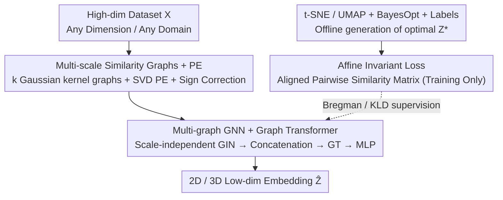

# AutoDV: An End-to-End Deep Learning Model for High-Dimensional Data Visualization

**Conference**: ICLR 2026  
**OpenReview**: [https://openreview.net/forum?id=vaflHrZhlY](https://openreview.net/forum?id=vaflHrZhlY)  
**Code**: https://github.com/DryDew/AutoDV (Available)  
**Area**: Self-Supervised / Representation Learning (Dimensionality Reduction and High-Dimensional Data Visualization)  
**Keywords**: High-dimensional data visualization, dimensionality reduction, Graph Transformer, end-to-end, affine invariant loss

## TL;DR
AutoDV transforms traditional visualization (t-SNE / UMAP), which requires "per-dataset parameter tuning + iterative optimization," into a one-time trained, plug-and-play end-to-end model. It first converts datasets of arbitrary dimensions into multi-scale similarity graphs, then utilizes a multi-graph GNN + Graph Transformer to directly output 2D/3D embeddings, trained with an affine invariant loss. It achieves 89.37% relative accuracy to t-SNE and 91.05% to UMAP on unseen CIFAR-10 data, and even outperforms t-SNE/UMAP themselves on genomics and UCI tabular data.

## Background & Motivation
**Background**: High-dimensional data visualization (HDV) is a special case of dimensionality reduction (DR) that projects $d$-dimensional data into 2D/3D to allow intuitive observation of cluster structures, widely used in genomics, remote sensing, finance, etc. Dominant methods are non-linear approaches like t-SNE, UMAP, and PaCMAP, which explicitly optimize low-dimensional embeddings to preserve both local neighborhoods and global structures.

**Limitations of Prior Work**: These methods face three unavoidable challenges. First, they are **extremely sensitive to hyperparameters**—incorrect choices for t-SNE's perplexity or UMAP's n_neighbors can result in meaningless spherical visualizations or incorrect clusters, yet unsupervised tasks lack labels for tuning (Paper Figure 1 shows that fixed/default hyperparameters are far from optimal). Second, they require **iterative optimization (re-training) from scratch for every new dataset**, which leads to explosive computational costs as the number of datasets grows. Third, existing parametric models (Parametric UMAP, inductive t-SNE) attempt to use a function $f_\theta$ for a single forward pass to avoid re-training, but they **fail in cross-domain and cross-dimensional generalization** and tend to overfit the training set, making it impossible to reuse historical low-dimensional representations.

**Key Challenge**: Current parametric models are restricted by the assumption of "neural networks with fixed input dimensions"—they cannot process datasets with different feature counts $d_i \neq d_j$ or sample sizes $N_i \neq N_j$ (Challenge C1). Additionally, dimensionality reduction has a **one-to-many** problem, where $Z^*$ is visually equivalent under translation, rotation, and scaling ($Z^*$ and $Z^*Q$ are both correct for orthogonal $Q$). Directly aligning outputs makes training convergence difficult (Challenge C2).

**Goal**: To train an end-to-end model $f_\phi$ from a collection of "historical datasets + their optimal low-dimensional embeddings" $\{(X_i, Z_i^*)\}$, such that it can directly produce embeddings close to the optimal for any new dataset $X_{new}$ in a single forward pass—without tuning or re-training during inference, regardless of dimension or domain.

**Key Insight**: The authors view dimensionality reduction as a **meta-learning** problem. Since high-quality low-dimensional representations have already been produced historically for many labeled datasets using t-SNE/UMAP (with optimal hyperparameters found via Bayesian optimization), the model should learn the mapping from data structure to good embeddings. The key is to find a **cross-dimensionally unified input representation**, leading to the use of graphs: any dataset can be converted into a pairwise similarity graph. The number of nodes varies with the dataset, but GNNs naturally handle variable node counts.

**Core Idea**: Use "multi-scale similarity graphs + Graph Neural Networks" to unify inputs of arbitrary dimensions and "affine invariant loss" to eliminate the degradation caused by one-to-many mappings, turning HDV into a one-time training, zero-tuning end-to-end forward inference process.

## Method

### Overall Architecture
AutoDV aims to train a model $f_\phi$ that directly outputs 2D/3D embeddings for new datasets. The pipeline is: **Any-dimensional dataset → Multi-scale similarity graphs + Positional Encoding → Multi-graph GNN + Graph Transformer → MLP head → Low-dimensional embedding**. The step "Any-dimensional data → Graph" is the root of its generalization capability, as graphs eliminate the "$d$-dimensional features" and preserve only pairwise similarity structures, allowing the same network to process data from any domain or feature count. During training, a "teacher" branch is added: t-SNE/UMAP + Bayesian optimization + labels are used offline to find the optimal embedding $Z_i^*$ for each historical dataset as a supervisory signal. An affine invariant loss then aligns the geometric structure of the model output $\hat Z_i$ with $Z_i^*$; this branch is not needed during inference.

### Key Designs

**1. Multi-scale Similarity Graphs + Positional Encoding: Feeding arbitrary dimensions into the same network**

This step addresses Challenge C1. Instead of feeding features directly, AutoDV converts dataset $X_i$ into **pairwise similarity graphs**. Adjacency matrices are calculated using Gaussian kernels with $k$ different bandwidths $\gamma^{(j)}$ to capture structures at various granularities:

$$S_i^{(j)}[u,v] = \exp\!\left(-\frac{\|X_i[u]-X_i[v]\|_2^2}{2\,\gamma^{(j)}}\right),\quad j=1,\dots,k$$

Thus, a dataset in $\mathbb{R}^{N_i\times d_i}$ becomes weighted adjacency matrices in $\mathbb{R}^{N_i\times N_i}$—the **dimension $d_i$ is eliminated**, leaving only the sample size $N_i$. GNNs naturally handle variable $N_i$. To provide node features for GNN aggregation, the authors extract **Graph Positional Encodings** (PE) $P_i = h(S_i^{(j)})$ from the adjacency matrix using SVD. To address the **sign ambiguity** of spectral methods (where $v$ and $-v$ are both valid), a lightweight "sign counting" strategy is used—flipping the sign of an entire column in $P$ if negative values are in the majority.

**2. Multi-graph GNN + Graph Transformer Backbone: Reading low-dim coordinates from multi-scale graphs end-to-end**

AutoDV uses a GIN + Graph Transformer backbone to fuse structures into coordinates. **Each scale's graph is assigned an independent GIN** to extract features. These $k$ sets of node embeddings are concatenated and fed into a Graph Transformer to model global relationships, followed by an MLP head for 2D/3D output:

$$f_\phi\big((P_i^{(j)},S_i^{(j)})_{j=1}^k\big) = \mathrm{MLP}\Big(\mathrm{GT}\big(\mathrm{GIN}_1(P_i^{(1)},S_i^{(1)}) \oplus \cdots \oplus \mathrm{GIN}_k(P_i^{(k)},S_i^{(k)})\big)\Big)$$

The independent GINs ensure local structures at different bandwidths are encoded without interference, while the Graph Transformer's self-attention captures long-range relationships that GINs struggle with—mirroring t-SNE/UMAP's need for both local neighborhoods and global layout.

**3. Affine Invariant Loss: Eliminating one-to-many degradation from translation/rotation/scaling**

Addressing Challenge C2, the authors align **geometric structure rather than coordinates**. Outputs $\hat Z_i$ and teacher embeddings $Z_i^*$ are converted into pairwise similarity matrices $\hat\Delta_i$ and $\Delta_i^*$ and aligned via Bregman divergence:

$$\mathcal{L} = \frac{1}{L}\sum_{i=1}^{L}\sum_{u=1}^{N_i}\sum_{v=1}^{N_i} K_\psi\big(\hat\Delta_i[u,v],\,\Delta_i^*[u,v]\big)$$

where $K_\psi(x,y)=\psi(x)-\psi(y)-\langle\nabla\psi(y),x-y\rangle$. Distance matrices are naturally invariant to translation and rotation, and z-score normalization on $Z_i^*$ adds scaling invariance. This makes the loss affine invariant. Specific forms of $\psi$ vary by teacher: KLD loss is used for t-SNE, while for UMAP, the loss includes local and global consistency terms with a decaying coefficient $\lambda(t)=1-t/T$ to prioritize local structure over time.

### Loss & Training
Training data is prepared by randomly sampling subgraphs (max 3000 points). For each subset, Bayesian optimization uses ground truth labels to find optimal t-SNE perplexity or UMAP n_neighbors to generate $Z_i^*$. Subsets with NMI $< 10\%$ are discarded to ensure quality. For inference on large datasets, an **anchor-based batching extension** is proposed: the dataset is partitioned, and each partition is processed alongside a set of "anchor points" $A$ to calibrate and stitch outputs together, scaling to 20,000 points. A Lipschitz robustness theorem (Theorem 1) is provided to show that similar inputs lead to similar visualizations.

## Key Experimental Results

### Main Results
Metrics include NMI (with ground truth labels), Silhouette Coefficient (SC), and **Relative Accuracy** $M(\hat Z;y)/M(Z^*;y)$ (where $t\text{-}SNE^*$ / $UMAP^*$ represent the Bayesian-optimized "teacher upper bound").

| Dataset | Metric | AutoDV-tSNE | AutoDV-UMAP | Strongest Parametric Baseline |
|--------|------|------|------|----------|
| CIFAR-10 (Image, Unseen) | Test NMI Prec. | 89.37±7.8 | **91.05±5.3** | p-UMAP 18.54 |
| Mouse Retina (Gene, Unseen) | Test NMI Prec. | 102.7±36.7 | **111.9±60.2** | p-UMAP 93.38 |
| UCI Tabular (Unseen) | Test NMI Prec. | 121.3±40.3 | **129.0±93.2** | p-UMAP 57.08 |

Key takeaway: In cross-domain/cross-dimensional settings, **almost all baselines fail**. AutoDV achieves ~90% relative accuracy on CIFAR-10, representing an **86.65% gain** over previous parametric models. On genomic and tabular data, relative accuracy exceeds 100%, indicating it captures more useful information than t-SNE/UMAP themselves.

### Runtime
The runtime for visualizing a new $\mathbb{R}^{3000\times512}$ dataset (single CPU core):

| Method | AutoDV | AutoDV (Precomputed PE) | t-SNE | UMAP |
|------|--------|------|------|------|
| Time (s) | 101.71±10.1 | 92.67±6.2 | 763.30±7.01 | 103.32±9.63 |

AutoDV is ~7.5x faster than t-SNE. While UMAP is fast for a single run, it requires multiple re-trainings for hyperparameter search, making its total actual cost much higher.

### Key Findings
- **Graph representation is the key to generalization**: Converting data to similarity graphs eliminates fixed input dimensions.
- **Deep baselines often show "high SC, low NMI"**: Methods like Autoencoders or p-UMAP appear compact (high SC) but fail to separate clusters (low NMI) due to optimization collapse.
- **Performance drops as class count increases**: Relative accuracy decreases on datasets with many categories, likely due to the current small training set size.

## Highlights & Insights
- **HDV as Meta-learning**: AutoDV reuses "sunk costs" from millions of previously optimized t-SNE/UMAP runs as supervisory signals.
- **Multi-scale Graph as a Universal Interface**: Using graphs to reduce $d$ dimensions to $N\times N$ is a critical trick for cross-dimensional representation learning.
- **Aligning Structure over Coordinates**: Building affine equivalence into the loss via pairwise similarity matrices is a robust strategy for "one-to-many" regression problems.
- **Engineering heuristic for Sign Ambiguity**: The "sign counting and flipping" strategy for spectral PE is simple yet effective.

## Limitations & Future Work
- **Dependency on High-quality Metadata**: Creating the training set requires offline Bayesian optimization for t-SNE/UMAP, which is computationally expensive initially.
- **Scaling with Class Counts**: Potential bottlenecks in Graph Transformer capacity or multi-scale graph resolution.
- **Quadratic Complexity $O(N_i^2)$**: Still scales quadratically; anchor batching is an approximation and might not be optimal for extremely large datasets.
- **Teacher Ceiling**: The model essentially mimics existing methods; it hasn't yet defined a "better" visualization beyond what t-SNE/UMAP provide.

## Related Work & Insights
- **vs. Parametric UMAP / inductive t-SNE**: These fail cross-domain due to fixed input dimensions and lack of affine invariance treatments. AutoDV improves relative accuracy from <20% to nearly 90%+.
- **vs. t-SNE / UMAP**: AutoDV offers zero-tuning inference and reduces complexity by eliminating the iteration count $T$.
- **vs. Geometric AE / Autoencoders**: AE-based methods also struggle with cross-domain generalization; AutoDV's graph-based structural alignment is more robust.

## Rating
- Novelty: ⭐⭐⭐⭐⭐ Reframes HDV as an end-to-end meta-learning task.
- Experimental Thoroughness: ⭐⭐⭐⭐ Coverage of multiple domains and robustness theory, though very high class counts remain a challenge.
- Writing Quality: ⭐⭐⭐⭐ Clear logical flow mapping challenges to designs.
- Value: ⭐⭐⭐⭐ Provides a viable path for plug-and-play visualization in bioinformatics and tabular analysis.

<!-- RELATED:START -->

## Related Papers

- [\[ICLR 2026\] Exploiting Low-Dimensional Manifold of Features for Few-Shot Whole Slide Image Classification](exploiting_low-dimensional_manifold_of_features_for_few-shot_whole_slide_image_c.md)
- [\[ICLR 2026\] Equivariant Splitting: Self-supervised learning from incomplete data](equivariant_splitting_self-supervised_learning_from_incomplete_data.md)
- [\[ICLR 2026\] Mini-cluster Guided Long-tailed Deep Clustering](mini-cluster_guided_long-tailed_deep_clustering.md)
- [\[CVPR 2026\] Nonparametric Deep Fine-grained Clustering with Low-Rank Guided Vision-Language Model](../../CVPR2026/self_supervised/nonparametric_deep_fine-grained_clustering_with_low-rank_guided_vision-language_.md)
- [\[NeurIPS 2025\] TabSTAR: A Tabular Foundation Model for Tabular Data with Text Fields](../../NeurIPS2025/self_supervised/tabstar_a_tabular_foundation_model_for_tabular_data_with_text_fields.md)

<!-- RELATED:END -->
