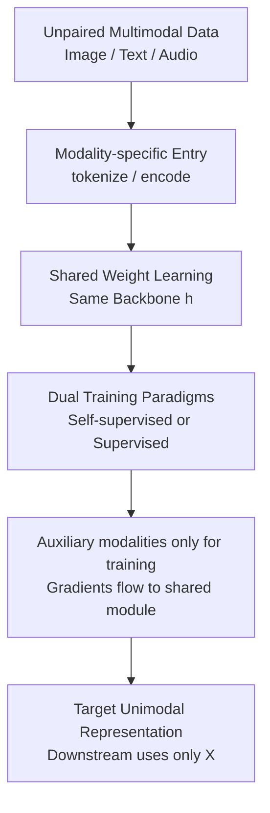

# Better Together: Leveraging Unpaired Multimodal Data for Stronger Unimodal Models

**Conference**: ICLR2026  
**OpenReview**: [https://openreview.net/forum?id=5OIgg5YkC3](https://openreview.net/forum?id=5OIgg5YkC3)  
**论文**: [Project Page](https://unpaired-multimodal.github.io/)  
**Code**: Not disclosed  
**Area**: Self-supervised / Representation Learning  
**Keywords**: Unpaired multimodal learning, unimodal enhancement, weight sharing, self-supervised representation, cross-modal transfer  

## TL;DR

This paper proposes Unpaired Multimodal Learner (UML): it requires no sample-level pairing (e.g., image-text, audio-image). As long as the auxiliary modality shares semantic structure with the target modality, training signals from unpaired text, images, or audio are channeled into a unified representation via cross-modal weight sharing. This enhances the classification performance and robustness of models that ultimately use only the single target modality.

## Background & Motivation

**Background**: Multimodal representation learning typically assumes that "pairing" is a core resource. Architectures like CLIP, ImageBind, FLAVA, and MultiMAE are powerful because correspondences exist between images, text, audio, or video for the same entity. With sample-level pairs like $(x, y)$, models can directly pull different projections of the same object into a shared space and transfer this cross-modal alignment to retrieval, classification, and generation tasks.

**Limitations of Prior Work**: Paired data is expensive and often limited by domain. While the internet contains vast amounts of images, text, audio, medical records, and sensor data, they are usually stored in separate siloes without sample-to-sample correspondences. To train a better image classifier, the traditional approach is to collect more images; to train a better audio classifier, one collects more audio. This ignores the reality that another modality, though not aligned with the current samples, might cover semantic directions that are unclear in the target modality.

**Key Challenge**: Target modality data is merely a "projection of reality," containing both shared semantics and modality-specific noise or blind spots. Images show appearance but lack complete linguistic descriptions; audio captures event sounds but lacks visual context; text specifies categorical attributes but lacks spatial detail. If all modalities originate from the same underlying world $Z^*$, the problem is no longer "finding which sentence corresponds to which image," but rather "utilizing the marginal distribution of another modality to reduce uncertainty in estimating shared reality factors."

**Goal**: The authors aim to answer a narrower yet more challenging question than traditional multimodal alignment. First, whether an auxiliary modality $Y$ can improve the representation of target modality $X$ without any sample-level pairing. Second, if so, why this brings information gain theoretically rather than just adding training noise. Third, whether a simple training paradigm exists that does not rely on pseudo-matching, optimal transport, or pre-aligned embeddings.

**Key Insight**: The paper starts from "shared reality factors," viewing different modalities as different linear projections of the same latent variable. From this perspective, unpaired samples do not provide instance-level information about "which image matches which sentence," but they provide statistical curvature regarding the shared parameters $\theta_c$. As long as the auxiliary modality covers blind spots of the target modality, it increases the Fisher information of the shared factors, thereby reducing estimation variance.

**Core Idea**: Use cross-modal shared weights instead of explicit pair alignment, allowing training gradients from different modalities to act on the same shared module. This transforms semantic information from unpaired auxiliary modalities into gains for the target unimodal representation.

## Method

### Overall Architecture

The core of UML is restrained: each modality is first converted into sequence/vector representations using its own tokenizer, patch embedding, or pre-trained encoder, and then fed into a single shared network $h$. Finally, it connects to modality-specific decoders or a shared classification head. During training, batches of images, text, and audio can be completely random and unpaired. During inference, the auxiliary modality paths are discarded, and only the target modality representation $r_X=h(f_X(x))$ is retained for linear probing or downstream classification. Thus, this is not a "multimodal input model," but a training paradigm to "train better unimodal models using unpaired multimodal data."

From theory to algorithm, the logical chain is: first prove that unpaired auxiliary modalities can increase the Fisher information of shared factors, then implement this "information summation" via shared parameters. In linear theory, both $X$ and $Y$ depend on a common parameter $\theta_c$, while having modality-specific parts like $\theta_x$ and $\theta_y$. In practice, the shared backbone $h$ acts as the shared parameter block. Since losses from images, text, and audio all generate gradients for it, it accumulates curvature contributions from different modalities.

### Key Designs

**1. Unpaired Multimodal Learning: Reframing the problem from sample alignment to shared factor estimation**

Traditional multimodal learning defines critical resources as $(x_i, y_i)$, i.e., "this image corresponds to this sentence." This work deliberately removes this condition, keeping only two marginal datasets $D_X=\{x_i\}_{i=1}^{N_X}$ and $D_Y=\{y_j\}_{j=1}^{N_Y}$. This step is crucial as it shifts the task from instance-level alignment to distribution-level shared structure learning: the model does not need to know which sentence describes which image, only that both modalities reflect the same world $Z^*$ in certain directions.

The authors use a linear generative model to explain why this setup is feasible. The target and auxiliary modalities are expressed as $X_i=A_{c,i}\theta_c+A_{x,i}\theta_x+\epsilon_{X,i}$ and $Y_j=B_{c,j}\theta_c+B_{y,j}\theta_y+\epsilon_{Y,j}$. Here, $\theta_c$ is the reality factor observed by both modalities, while $\theta_x$ and $\theta_y$ are modality-specific. Even without correspondence between $X_i$ and $Y_j$, as long as $Y$ provides non-zero observations in certain directions of $\theta_c$, it can complement the weak observations or blind spots of $X$ in those directions.

**2. Fisher information Perspective: Auxiliary modalities provide variance shrinkage in shared directions**

The theoretical contribution is not proving that UML necessarily optimizes better, but proving that "unpaired auxiliary data has informational value." Under the conditional independence linear Gaussian setup, the Fisher information of the two modalities regarding shared parameters is additive: $(I_X+I_Y)_{\theta_c,\theta_c} \succ (I_X)_{\theta_c,\theta_c}$, provided the auxiliary modality provides non-degenerate information in the shared subspace. This implies that the uncertainty ellipsoid for estimating $\theta_c$ shrinks, allowing the target modality representation to more accurately approach the underlying reality.

More specific conclusions are directional. If there exists a direction $v$ such that $B_{c,j}v \neq 0$, then $Y$ strictly increases the Fisher information in that direction. When $v$ is originally outside the observable range of $X$, the variance of $X$ estimating that direction alone is approximately infinite, but it becomes finite after adding unpaired $Y$. This explains the counter-intuitive conclusion: under certain fixed budgets, a $Y$ sample may be more valuable than an additional $X$ sample because it covers $X$'s blind spots rather than repeating what $X$ has already seen.

**3. Shared Weight Learning: No pseudo-pairing, no explicit distribution matching**

The execution of UML relies almost entirely on weight sharing. Given $x\sim P_X$ and $y\sim P_Y$, the model extracts $z_X=f_X(x)$ and $z_Y=f_Y(y)$, which then pass through the shared module $h$ to yield $r_X=h(z_X)$ and $r_Y=h(z_Y)$. Since $h$ is updated by both modalities jointly, the gradients from the auxiliary modality modify the same set of parameters the target modality passes through, thereby injecting cross-modal shared structures into $r_X$.

This design differs from many "unpaired multimodal" methods in that it does not attempt to guess which $y$ matches which $x$, nor does it assume the two encoders are already in an aligned space. In self-supervised scenarios, image patch embeddings and text token embeddings enter a shared Transformer, and respective decoders perform next token/patch embedding prediction. In supervised scenarios, images and text carry their own category labels, and the model uses a shared classification head to classify both modalities; labels are intra-modal supervision and do not require one-to-one cross-modal sample correspondence.

**4. Training post-processing back to unimodal: Auxiliary modality is a training resource, not an inference burden**

The ultimate goal of UML remains enhancing the target unimodal model. During the training phase, batches of images, text, and audio can be fed alternately to let the shared module learn broader semantic boundaries. During the inference phase, auxiliary modalities are discarded, and only the target modality's encoder and the shared representation are used. This makes it different from VQA, image-text retrieval, or multimodal fusion models, which often require multimodal inputs at inference time; UML's gains manifest in unimodal downstream tasks.

The paper also extends this idea to trimodality. If the goal is audio classification, images and text can be used as two unpaired auxiliary modalities. Theoretically, for more than two modalities, Fisher information continues to sum by modality. In practice, experiments on ImageNet-ESC show that adding a second auxiliary modality typically continues to bring benefits.

### Loss & Training

The self-supervised version uses modality-specific reconstruction objectives. Images or text are projected into a shared dimension, pass through a shared Transformer, and then their respective decoders predict the next patch/token embedding. The objective can be written as $L_{UML-SSL}=\mathbb{E}_{x\sim P_X}\ell(g_X(h(f_X(x))),x)+\mathbb{E}_{y\sim P_Y}\ell(g_Y(h(f_Y(y))),y)$. Continuous embeddings use MSE, while discrete tokens can use cross-entropy.

The supervised version uses a shared classification head. If image samples have labels $c_X$ and text samples have labels $c_Y$, the loss is $L_{UML-Sup}=\mathbb{E}_{(x,c_X)}\ell_{CE}(c(h(f_X(x))),c_X)+\mathbb{E}_{(y,c_Y)}\ell_{CE}(c(h(f_Y(y))),c_Y)$. In main experiments, the text encoder is typically frozen, while the visual encoder is frozen in linear probe settings and trainable during full finetuning. The authors also searched hyperparameters for learning rate, weight decay, batch size, cosine schedule, warmup, and modality-specific logit scaling. In MultiBench self-supervised experiments, they used a curriculum step by training on $X$ alone for several epochs before joint training.

## Key Experimental Results

### Main Results

The paper covers three types of main experiments. First, self-supervised UML, measuring the linear probe accuracy of the target modality on MultiBench and standard vision-text benchmarks. Second, supervised UML, using unpaired text to enhance image classification, covering full finetuning and few-shot linear probing. Third, trimodal extensions (audio-image-text) and cross-modal weight transfer, verifying the idea is not limited to image-text classification.

| Setting | Dataset / Task | Unimodal | UML / Ours | Main Conclusions |
|------|---------------|----------|------------|----------|
| Self-supervised | MUSTARD | 59.66 | 63.28 | Sarcasm semantics in text complement the target representation, showing the most significant gain |
| Self-supervised | MIMIC | 55.16 | 57.10 | Gains observed across multi-source features (medical tables/time-series) |
| Self-supervised | MOSEI | 70.62 | 71.98 | Cross-modal shared structure brings stable improvement in sentiment tasks |
| Self-supervised | MOSI | 56.17 | 58.16 | Auxiliary modalities remain effective on small-scale sentiment data |
| Self-supervised | Oxford Pets | 85.04 | 86.32 | Unpaired text enhances image representations in standard visual classification |
| Self-supervised | UCF101 | 79.86 | 80.98 | Slight gains in action recognition related visual tasks |
| Self-supervised | DTD | 78.13 | 78.49 | Texture task gain is small but consistent in direction |

| Setting | Average Metric / Representative Task | Unimodal | UML / Ours | Gain |
|------|----------------------|----------|------------|------|
| Full finetuning, DINOv2 ViT-S/14 + OpenLLaMA | Avg of 9 Image Classif. | 81.54 | 83.99 | +2.45 |
| Few-shot 1-shot linear probe | Avg of 9 Image Classif. | 45.52 | 51.36 | +5.84 |
| Few-shot 2-shot linear probe | Avg of 9 Image Classif. | 56.33 | 60.85 | +4.52 |
| Few-shot 4-shot linear probe | Avg of 9 Image Classif. | 65.84 | 68.53 | +2.69 |
| Full finetuning, Stanford Cars | Fine-grained Image Classif. | 79.45 | 86.39 | +6.94 |
| Few-shot 1-shot, Oxford Pets | Fine-grained Image Classif. | 63.51 | 73.59 | +10.08 |
| Few-shot 1-shot, Caltech101 | Low-shot Classification | 76.66 | 84.52 | +7.86 |

### Ablation Study

| Ablation / Analysis | Comparison Setting | Key Numbers | Description |
|-------------|----------|----------|------|
| Semantic relevance | SUN397 Image + Stanford Cars Text | 1-shot 35.27 vs unimodal 34.15; 16-shot 67.25 vs 67.35 | Irrelevant text brings no stable gain, suggesting enhancement is not mere regularization |
| Semantic relevance | SUN397 Image + SUN397 relevant Text | 1-shot 41.79; 16-shot 69.19 | Relevant text is significantly better than visual-unimodal across all shots |
| Trimodal Audio Classif. | ESC-27, 1-shot | Audio-only 25.65; Audio+Image+Text 44.68 | Audio classification improves by 74.2% relative gain with unpaired image and text |
| Trimodal Image Classif. | ESC-19, 1-shot | Image-only 60.28; Image+Audio+Text 90.55 | Largest gain occurs when two auxiliary modalities are stacked |
| Modality batch ratio | SUN397, text:image ratio $r\in\{0.25,0.5,1,2,4\}$ | UML(init) 2-shot ~52.81-53.15 | Performance is insensitive to alternating frequency; key is the presence of auxiliary semantics |
| Frozen text encoder | Stanford Cars / SUN397 | Frozen: 84.87 / 66.72; Unfrozen: 84.23 / 65.80 | Frozen text encoder is more stable and better isolates the effect of auxiliary semantics |
| Modality exchange rate | Oxford Pets | CLIP: 1 image ≈ 228 words; DINOv2+OpenLLaMA: 1 image ≈ 1034 words | Aligned encoders increase text utilization efficiency; non-aligned encoders require more text |

### Key Findings

- Maximum gains occur in low-shot and fine-grained classification scenarios. In these cases, target modality samples are insufficient to stably define category boundaries, and auxiliary modalities like text descriptions can supplement categorical attributes.
- Unpaired data must be semantically relevant at the distribution level; when SUN397 images are paired with Stanford Cars text, UML is not meaningfully better than the unimodal baseline.
- Trimodal experiments show that contributions from auxiliary modalities are additive; Audio+Image+Text and Image+Audio+Text both outperform unimodal or most bimodal settings.
- Weight analysis reveals that unpaired text expands the functional margin, increases the silhouette score, reduces the DB-index, and leads to a clearer diagonal alignment between classification head weights and corresponding category text embeddings.
- Transfer learning experiments using BERT to initialize ViT Transformer layers show that weights from language models serve as useful initializations for visual models even without joint training, supporting the view that different modalities share underlying structures.

## Highlights & Insights

- The most valuable point is moving the question of "whether unpaired multimodal data can help unimodal models" from an empirical observation back to an information-theoretic problem. The Fisher information analysis explains that auxiliary modalities are not magic: they are useful only when covering shared semantic directions, and the benefit is essentially the reduction in variance for shared factor estimation.
- The UML approach is remarkably simple, almost "anti-engineering intuition." It avoids constructing pseudo-captions, does not perform optimal transport, and does not learn explicit matching matrices. It simply shares a segment of the network; this focuses the experimental conclusion on "whether the unpaired data itself is useful."
- The improvement in low-shot fine-grained classification is enlightening. For many visual tasks, text descriptions are not for VQA or retrieval but can directly shape the category prototypes of the classification head. This provides practical ideas for few-shot medical imaging, scientific observation, remote sensing, and robotic perception.
- The "how many words is an image worth" exchange rate, while coarse, provides a scale for discussing data value. It reminds us that sample counts from different modalities cannot simply be added; alignment degree, text granularity, and semantic coverage all affect the marginal value of each auxiliary sample.
- Negative results are crucial. Irrelevant auxiliary modalities do not improve performance, indicating that UML is not an unconditional multimodal regularizer; it relies on shared reality structures rather than "feeding more data is always better."

## Limitations & Future Work

- The theoretical part is based on linear Gaussians and Fisher information. While it explains the conditions for "information gain," it does not address optimization stability, gradient interference, or modality competition in deep networks.
- Experiments primarily evaluate classification tasks, particularly image and audio classification. It has not fully demonstrated whether unpaired images or audio can conversely stabilize and improve text generation, classification, or reasoning tasks.
- The paper does not systematically construct a large-scale missing-modality benchmark, only touching upon the issue in several controlled settings. Future work could explicitly combine multiple unimodal data siloes to study how category overlap, semantic shift, and modality missing ratios affect UML.
- UML requires semantic relevance in auxiliary modalities. Current work only validates "relevant" versus "independent/irrelevant" cases, lacking a rigorous definition of negative correlation, adversarial correlation, or fine-grained domain mismatch.
- While there is no auxiliary modality cost during inference, training requires maintaining multiple encoders, batch loaders, and modality-specific heads. Managing VRAM, batch schedules, modality sampling ratios, and data quality in ultra-large-scale training remains an engineering challenge.
- In real-world applications, auxiliary text descriptions might come from LLM generation templates. If these descriptions contain bias, hallucinations, or label leakage, they might bake incorrect priors into classification boundaries, necessitating finer quality control.

## Related Work & Insights

- **vs CLIP / LiT / ImageBind**: These methods rely on image-text or multimodal pairs, weak pairs, or pre-aligned spaces to learn unified embeddings. UML investigates whether marginal data from another modality can still enhance the target unimodal model when no sample correspondence exists.
- **vs MultiMAE / 4M / Omnivore**: These works typically train a unified model to handle multi-task multimodality, aiming for generalization across various inputs and outputs. UML’s goal is narrower, emphasizing that auxiliary modalities are used only for training, with the final evaluation focusing on the target unimodal representation.
- **vs Lin et al.'s multimodality helps unimodality**: Related work also utilizes text to assist visual few-shot learning, but usually operates on aligned embeddings like CLIP. This paper further demonstrates that encoders not pre-aligned (e.g., DINOv2 + OpenLLaMA) can also benefit from weight sharing.
- **vs Unpaired cross-domain matching / optimal transport methods**: These methods often infer coarse-grained or fine-grained correspondences. UML does not infer correspondence; it absorbs cross-modal statistical structures through shared parameters. The mechanism is simpler but relies more heavily on the shared semantics hypothesis.
- **vs Studies on modality conflict and collapse**: Those works explain why paired multimodal training might be dominated by a strong modality or produce negative transfer. This paper acknowledges these optimization issues may still exist but focuses on providing existential evidence that unpaired modalities are helpful at the information level.
- **Insight**: In fields lacking paired data, prioritize finding "semantically relevant but correspondence-free" auxiliary resources—such as medical report text, experimental metadata, robot operation logs, sensor sounds, or category descriptions. These can be used to train a model that remains unimodal at inference time via shared heads or trunks.

## Rating

- Novelty: ⭐⭐⭐⭐☆ Using unpaired auxiliary modalities to enhance unimodal representation with Fisher information explanation is a clear and inspiring problem setting, though weight sharing itself is not a complex new architecture.
- Experimental Thoroughness: ⭐⭐⭐⭐☆ Covers self-supervised, supervised, few-shot, full finetuning, trimodality, and several ablations; the evidence chain is relatively complete, though primarily focused on classification.
- Writing Quality: ⭐⭐⭐⭐☆ The main path from theory to UML to experiments is smooth, though some appendix experiments are voluminous, and the main text compresses many specific training details.
- Value: ⭐⭐⭐⭐⭐ Highly practical for scenarios with massive unpaired multi-source data, especially suitable for low-shot fine-grained classification, medical/scientific data, and robotics.

<!-- RELATED:START -->

## Related Papers

- [\[ICLR 2026\] Disentanglement of Variations with Multimodal Generative Modeling](disentanglement_of_variations_with_multimodal_generative_modeling.md)
- [\[NeurIPS 2025\] Hybrid Autoencoders for Tabular Data: Leveraging Model-Based Augmentation in Low-Label Settings](../../NeurIPS2025/self_supervised/hybrid_autoencoders_for_tabular_data_leveraging_model-based_augmentation_in_low-.md)
- [\[ACL 2026\] LLMSurgeon: Diagnosing Data Mixture of Large Language Models](../../ACL2026/self_supervised/llmsurgeon_diagnosing_data_mixture_of_large_language_models.md)
- [\[CVPR 2026\] Is Parameter Isolation Better for Prompt-Based Continual Learning?](../../CVPR2026/self_supervised/is_parameter_isolation_better_for_prompt-based_continual_learning.md)
- [\[ICML 2025\] Towards Benchmarking Foundation Models for Tabular Data With Text](../../ICML2025/self_supervised/towards_benchmarking_foundation_models_for_tabular_data_with_text.md)

<!-- RELATED:END -->
