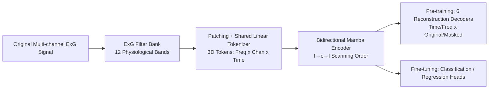

# Beyond Hearing: Learning Task-Agnostic ExG Representations from Earphones via Physiology-Informed Tokenization

**Conference**: ICLR 2026  
**OpenReview**: [https://openreview.net/forum?id=s79tJrxDmt](https://openreview.net/forum?id=s79tJrxDmt)  
**Code**: TBD  
**Area**: Self-Supervised Representation Learning / Physiological Signal Foundation Models  
**Keywords**: ExG, wearable sensing, ear-EEG, multi-band tokenization, self-supervised pre-training, task-agnostic representation  

## TL;DR
Fifty hours of free-living ExG data were collected using lightweight earphone-style hardware. A "Physiology-Informed Multi-band Tokenization (PiMT)" is proposed to decompose signals into 12 sub-band tokens with explicit physical meanings. Combined with reconstructive self-supervised pre-training, a set of task-agnostic ExG representations applicable across five sensory tasks (visual, auditory, gustatory, tactile, olfactory) was learned.

## Background & Motivation
- **Background**: ExG signals (EEG/EMG/EOG/ECG) reflect neural, muscular, ocular, and cardiac activities, forming the basis for applications like gaze tracking, emotion recognition, and sleep staging. Recently, deep learning has excelled in single-task ExG analysis, and the foundation model paradigm aims to replicate the success of "large-scale data → universal representation" in daily ExG analysis.
- **Limitations of Prior Work**: Few ExG foundation models exist due to two roadblocks. First, **insufficient data diversity**—most ExG data is collected in controlled lab environments using bulky, expensive equipment (EEG headsets costing $10,000–$50,000), leaving a void in free-living data. Second, **highly task-specific model design**—different tasks depend on specific frequency bands (e.g., 0.1–15 Hz for gaze tracking, 8–30 Hz for emotion recognition), causing pipelines and architectures to be customized for fixed bands.
- **Key Challenge**: Universality requires full-spectrum coverage, but simple broadband filtering (0–100 Hz) blurs physiological features across modalities, loses fine-grained information, and fails to adapt to specific tasks. There is a fundamental tension between **"broadband coverage with blurred features" and "narrowband clarity without universality."** Furthermore, different hardware generates varying gains/attenuations across bands, making it unwise to pre-suppose which band or electrode is most important.
- **Goal**: Develop a **scalable, task-agnostic, in-the-wild** ExG monitoring solution through the co-design of hardware, datasets, and training methods.
- **Core Idea**: **[Hardware for Data Bottleneck]** Integrate ExG sensing into an earphone form factor (NeuroBuds) for low-cost, long-term wear to collect free-living data. **[Physical Priors for Task Agnosticism]** Instead of pre-defining task bands, signals are decomposed into 12 sub-band tokens based on established physiological knowledge, allowing the model to select task-relevant features from the full spectrum. **[Reconstructive Self-Supervision]** Utilize unlabelled free-living data for multi-objective reconstruction pre-training to learn transferable universal representations.

## Method

### Overall Architecture
PiMT follows a pipeline of "band-wise tokenization → bidirectional Mamba encoding → reconstruction pre-training → downstream fine-tuning." Original multi-channel ExG signals are first decomposed by a fixed physiological filter bank into 12 sub-bands. Each band is partitioned into patches and projected into tokens via a shared linear tokenizer. These tokens, ordered by "frequency → channel → time," are fed into a bidirectional Mamba encoder to obtain contextual representations. During pre-training, six reconstruction tasks (time/frequency domains, original/masked versions) jointly optimize the encoder, which is then fine-tuned with task-specific heads.

### Key Designs
**1. Physiology-Informed Multi-band Tokenization (PiMT): Converting "Which Band to Use" from a Hyperparameter to a Structure.** Rather than customizing narrowbands for specific tasks or forcing a single broadband, PiMT pre-defines 12 canonical sub-band filters based on established physiological knowledge. These cover key rhythms across modalities: EEG delta (0.5–4 Hz)/theta (4–8 Hz)/alpha (8–13 Hz)/beta (13–30 Hz)/gamma (30–100 Hz), EMG low/mid/high frequencies (15–45 / 45–95 / 95–100 Hz), overall EOG (0.1–20 Hz), and ECG low/high frequencies (0.03–0.12 / 0.12–0.488 Hz) plus the QRS complex (8–50 Hz). For a channel signal $X_c \in \mathbb{R}^T$, all $N_F$ filters are applied in parallel to obtain sub-band signals $X_{f,c} \in \mathbb{R}^T$, each containing components only within band $f$. This provides the model with 12 "physically meaningful homologous views" instead of a blurred broadband signal, ensuring fine-grained access to the full spectrum.

**2. 3D Patch Tokenization + Frequency-First Scanning Order.** Each sub-band signal $X_{f,c}$ is split into non-overlapping patches $p_{f,c,l} \in \mathbb{R}^w$. Thus, each patch is localized by three dimensions—frequency $f$, channel $c$, and time $l$—forming a structured 3D representation. A linear tokenizer shared across all tokens projects them into $e_{f,c,l} \in \mathbb{R}^d$. Since multi-band decomposition lengthens the sequence, the **Bidirectional Mamba** is chosen as the encoder for its linear complexity relative to sequence length, compared to the quadratic complexity of Transformers. Embeddings are flattened in the empirically optimal $(f \times c \times l)$ order (Frequency → Channel → Time) before being fed into the encoder.

**3. Six-Task Reconstructive Self-Supervised Pre-training: Extracting Robust Representations from Unlabelled Free-living Data.** Following the principle that "reconstruction is superior to contrastive learning" for physiological foundation models, six reconstruction tasks are designed with separate lightweight MLP decoders and a shared encoder: (i) **Autoencoding**—reconstructing original patches to capture temporal features and denoise; (ii) **Masked Reconstruction**—partially masking inputs $p_{\text{mask}}$ across time/channel/frequency dimensions to force contextual inference; (iii–iv) **Frequency Domain Magnitude/Phase Reconstruction**—reconstructing $p_A$ and $p_P$ obtained via FFT from $z$; (v–vi) **Masked Frequency Domain Reconstruction**—repeating magnitude/phase reconstruction on masked inputs to improve spectral inference from incomplete data. Each task uses MAE loss, summed with weights $\lambda$: $\mathcal{L} = \sum_t \lambda_t \mathcal{L}_t$.

**4. Co-design of NeuroBuds Hardware + DailySense Dataset.** The efficacy of this method relies on hardware capable of collecting in-the-wild data. NeuroBuds is an ear-hook ExG prototype integrating amplification, digitization, onboard storage, and wireless transmission into a lightweight (20 g, $80) PCB. Periauricular electrodes capture near-ear EEG (T7–T10 equivalents), auricular EMG, and lateral EOG, covering cognitive, muscular, and ocular activities. Using this, the authors collected DailySense: 50 hours of unlabelled free-living recordings from 22 subjects, plus 20 hours of labelled data across five senses (vision, hearing, taste, touch, smell) including six benchmark tasks. Preprocessing is kept minimal (50/60 Hz notch + Butterworth bandpass + 200 Hz resampling + normalization + 4s window) to avoid task-specific assumptions.

## Key Experimental Results

### Main Results (DailySense, F1↑ for classification, Angular Error↓ for Gaze)

| Method | Video | Audio | Taste | Touch | Smell | Class Avg. | Gaze |
|---|---|---|---|---|---|---|---|
| SVM | 0.665 | 0.610 | 0.556 | 0.554 | 0.510 | 0.579 | 6.60° |
| EEGNet | 0.753 | 0.712 | 0.709 | 0.643 | 0.669 | 0.697 | 6.52° |
| DeepConvNet | 0.680 | 0.706 | 0.633 | 0.638 | 0.636 | 0.659 | 7.04° |
| TST | 0.773 | 0.705 | 0.731 | 0.669 | 0.667 | 0.709 | 6.54° |
| PatchTST | 0.771 | 0.749 | 0.731 | 0.686 | 0.681 | 0.724 | 6.47° |
| EEGConformer| 0.738 | 0.752 | 0.688 | 0.678 | 0.670 | 0.705 | 6.53° |
| Bidirectional-Mamba | 0.820 | 0.858 | 0.733 | 0.762 | 0.722 | 0.779 | 6.53° |
| **PiMT (No Pre-training)** | 0.858 | 0.885 | 0.790 | 0.807 | 0.753 | **0.819** | **6.11°** |
| PatchTST (With Pre-training) | 0.807 | 0.786 | 0.697 | 0.700 | 0.670 | 0.732 | 6.42° |
| **PiMT (With Pre-training)** | **0.964** | **0.961** | **0.801** | **0.860** | **0.793** | **0.876** | **6.00°** |

Even without pre-training, PiMT outperforms all baselines with 81.9% average F1 and 6.11° gaze error. With pre-training on free-living data, PiMT's average F1 improves to 87.6%, whereas PatchTST only improves from 72.4% to 73.2%, demonstrating that the PiMT-reconstructive pre-training synergy effectively leverages in-the-wild data.

### Ablation Study (Number of Bands, DailySense)

| Tokenization Strategy | Classification F1 Trend | Gaze Error |
|---|---|---|
| 1-band (0.1–75 Hz) | Lowest | Highest |
| 2-band | ↑ | ↓ |
| 4-band | ↑↑ | ↓↓ |
| **12-band (Ours)** | **Highest (+4.6% F1 over fewer bands)** | **Lowest** |

Performance scales monotonically with the number of bands. 12-band decomposition yields a 4.6% increase in F1 over coarser splits, verifying that fine-grained physical band decomposition extracts subtle but physiologically significant spectral cues.

### Key Findings
- **Public Benchmarks**: PiMT consistently outperforms PatchTST and Bidirectional-Mamba on DREAMER (0.910), SEED (0.820), Sleep-EDF (0.822), and BCI Competition IV 2b (0.693), proving generalization beyond self-collected datasets.
- **Saliency Analysis Confirms Physical Priors**: Gaze/video tasks show strong activation in low-frequency bands (aligned with eye movements), while taste/touch/smell/audio interest tasks activate high-frequency bands (aligned with somatosensory beta-low gamma and periauricular EMG). This task-related frequency focus emerges **unsupervised**.
- **Data Scalability**: Test loss decreases as pre-training data increases; downstream classification performance saturates at approximately 30% of the pre-training data, showing reasonable diminishing returns.

## Highlights & Insights
- **Domain Knowledge as Structure, Not Hyperparameter**: Instead of having the model learn "where to look" from scratch, the architecture explicitly decomposes signals into 12 physical bands. This is an elegant way to inject priors while maintaining full-spectrum granularity.
- **Hardware-Data-Algorithm Trinity**: The actual contribution isn't just an algorithm but the completion of the "in-the-wild ExG data" void using an $80 earphone prototype, realized through PiMT and self-supervision.
- **Strategic Use of Mamba**: Explicit multi-band expansion increases sequence length, which is naturally offset by Mamba's linear complexity. This motivation for switching backbones is more robust than "innovating for innovation's sake."
- **DailySense Fills "Five Senses" Benchmark Gap**: The first dataset enabling ExG analysis across vision, hearing, taste, touch, and smell has independent value for the community.

## Limitations & Future Work
- **Dataset Availability**: DailySense is undergoing IRB/legal processes; public or conditional release is TBD, making replication difficult.
- **Scale Constraints**: Included only 22 subjects with a max of 7 per task; cross-subject generalization and long-tail population coverage (age/physiology) are limited.
- **Hand-crafted 12-band Split**: While physiologically grounded, band boundaries are fixed. Exploring learnable adaptive band partitioning across various hardware/tasks is a promising direction.
- **Task Complexity**: Tasks are primarily binary (e.g., sweet vs. sour, smooth vs. rough), which is still far from complex real-world daily scenarios.
- **In-the-wild Robustness**: The impact of motion artifacts, electrode displacement, and contact impedance changes over long durations requires further stress testing.

## Related Work & Insights
- **ExG Method Taxonomy**: Legacy frameworks (EEGNet/DeepConvNet using spatial-temporal convolutions) → Transformer-based (EEGConformer, PatchTST, Medformer for long-range dependencies) → Self-supervised (BrainBERT for intracranial EEG, BIOT for cross-dataset, BrainWave for clinical foundation models). This work builds on the third category but shifts from "lab-controlled" to "free-living."
- **Inspiration for Wearable Foundation Models**: When data diversity is the bottleneck, "smarter hardware" and "encoding physical priors into token structures" are more effective than purely algorithmic tweaks for achieving strong generalization.
- **Reconstruction vs. Contrastive**: This paper reinforces the empirical finding that reconstruction-based learning is superior for physiological signals, providing a template for multi-objective temporal-spectral reconstruction.

## Rating
- **Novelty**: ⭐⭐⭐⭐ — The synergy of physiology-informed 12-band tokenization, earphone hardware, and free-living data is a rare systematic innovation in ExG foundation models.
- **Experimental Thoroughness**: ⭐⭐⭐⭐ — Covers six self-collected tasks, four public benchmarks, band ablation, saliency analysis, and scalability curves. Points deducted for limited dataset scale and binary task focus.
- **Writing Quality**: ⭐⭐⭐⭐ — Clear motivation-contradiction-method logic; figures effectively explain the pipeline and dataset relations.
- **Value**: ⭐⭐⭐⭐ — Pushes ExG towards "in-the-wild, task-agnostic, wearable" paradigms. DailySense and NeuroBuds carry long-term value for the community.

<!-- RELATED:START -->

## Related Papers

- [\[ICLR 2026\] CARL: Camera-Agnostic Representation Learning for Spectral Image Analysis](carl_camera-agnostic_representation_learning_for_spectral_image_analysis.md)
- [\[CVPR 2025\] Task-Agnostic Guided Feature Expansion for Class-Incremental Learning](../../CVPR2025/self_supervised/task-agnostic_guided_feature_expansion_for_class-incremental_learning.md)
- [\[ICLR 2026\] Spatially Informed Autoencoders for Interpretable Visual Representation Learning](spatially_informed_autoencoders_for_interpretable_visual_representation_learning.md)
- [\[ICLR 2026\] A Bayesian Nonparametric Framework for Learning Disentangled Representations](a_bayesian_nonparametric_framework_for_learning_disentangled_representations.md)
- [\[ICLR 2026\] Midway Network: Learning Representations for Recognition and Motion from Latent Dynamics](midway_network_learning_representations_for_recognition_and_motion_from_latent_d.md)

<!-- RELATED:END -->
