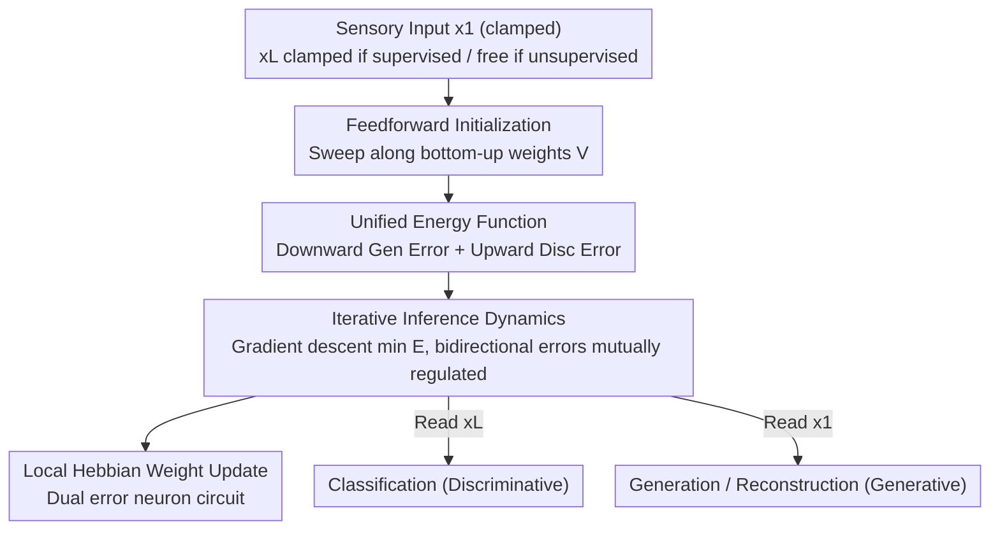

# Bidirectional Predictive Coding

**Conference**: ICLR2026  
**OpenReview**: [https://openreview.net/forum?id=HbRihpurRr](https://openreview.net/forum?id=HbRihpurRr)  
**Code**: To be confirmed  
**Area**: Self-supervised / Representation Learning (Brain-inspired Computing)  
**Keywords**: Predictive Coding, Generative-Discriminative Unification, Energy Function, Local Hebbian Learning, Brain-inspired Visual Inference

## TL;DR
This paper proposes bidirectional Predictive Coding (bPC), which employs a single energy function to accommodate both "top-down generative" and "bottom-up discriminative" inference. This allows the same biologically plausible local circuit to perform accurate classification like discPC and generation/reconstruction like genPC, outperforming existing unidirectional or hybrid PC models in brain-inspired tasks such as cross-modal association and occlusion completion.

## Background & Motivation
**Background**: Predictive Coding (PC) is a mainstream computational model for explaining visual learning and inference in the brain because it relies only on local computation and Hebbian plasticity, satisfying biological constraints. It exists in two mature forms: generative PC (genPC), which uses neural activity to predict sensory input top-down and excels at associative memory and image generation; and discriminative PC (discPC), which uses sensory input to predict high-level activity bottom-up, with classification performance approaching backpropagation.

**Limitations of Prior Work**: Experimental neuroscience evidence suggests that the brain utilizes both generative and discriminative inference—the discriminative pathway is responsible for rapid feature extraction, while the generative pathway handles the Bayesian integration of noisy inputs with priors. However, existing PC models are locked into a single inference direction: genPC performs poorly in classification, while discPC cannot perform unsupervised learning or generation due to the non-uniqueness of its inference dynamics. Existing hybrid solutions like hybridPC merely add an extra feedforward network for neural activity initialization; after initialization, this pathway no longer participates in the dynamics, resulting in supervised performance that still lags significantly behind discPC.

**Key Challenge**: Generation and discrimination are modeled in PC as two prediction flows with opposite directions, and their energy functions are mutually incompatible. To achieve both capabilities simultaneously, previous approaches either trained two separate models (doubling neurons, which is biologically unrealistic) or sacrificed performance in one of the tasks.

**Goal**: To find a single PC model that supports both generative and discriminative inference while maintaining a biologically plausible circuit, without compromising performance on either task.

**Key Insight**: The authors noted that the energy in both genPC and discPC is the "sum of squared prediction errors between adjacent layers," differing only in the prediction direction. Given this isomorphic form, both prediction flows can be integrated into a single energy function, allowing neurons to emit both upward and downward predictions simultaneously.

**Core Idea**: Use a unified energy function to encode both top-down (generative) and bottom-up (discriminative) prediction errors, allowing the same set of latent neurons to be "mutually constrained" by both predictions. This cultivates an energy landscape in a shared circuit that is neither overconfident nor collapsed to class means.

## Method

### Overall Architecture
bPC is a hierarchical Gaussian model with $L$ layers, where the neural activity of each layer is denoted as $x_l$. Here, $x_1$ is the sensory input, and $x_L$ can be clamped to a label (supervised) or allowed to evolve freely (unsupervised). Unlike genPC or discPC which predict in only one direction, each neuron in bPC simultaneously performs downward prediction (predicting the current layer using the layer above, with top-down weights $W$) and upward prediction (predicting the current layer using the layer below, with bottom-up weights $V$). The process consists of: a feedforward sweep along bottom-up weights to rapidly initialize activity; neural activity iteration via gradient descent to minimize the unified energy; and a final Hebbian weight update. After inference, labels are read from $x_L$ for classification, and inputs are read from $x_1$ for generation/reconstruction.

This mechanism has a clear serial structure (initialization → inference dynamics → weight update), and the two prediction flows are coupled within the same energy function, as illustrated in the following diagram:

### Key Designs

**1. Unified Energy Function: Merging Upward Discrimination and Downward Generation into One Objective**

The energy of genPC $E_{gen}=\sum_{l=1}^{L-1}\frac{1}{2}\lVert x_l-W_{l+1}f(x_{l+1})\rVert_2^2$ only penalizes downward prediction errors, while the energy of discPC $E_{disc}=\sum_{l=2}^{L}\frac{1}{2}\lVert x_l-V_{l-1}f(x_{l-1})\rVert_2^2$ only penalizes upward prediction errors. bPC directly combines them into a single energy function:

$$E(x,W,V)=\sum_{l=1}^{L-1}\frac{\alpha_{gen}}{2}\lVert x_l-W_{l+1}f(x_{l+1})\rVert_2^2+\sum_{l=2}^{L}\frac{\alpha_{disc}}{2}\lVert x_l-V_{l-1}f(x_{l-1})\rVert_2^2.$$

Here, $W$ represents top-down weights, $V$ represents bottom-up weights, and $\alpha_{gen}$, $\alpha_{disc}$ are scalar constants used to balance the magnitude differences between upward and downward errors (viewed as learnable precision parameters in Friston's sense, though fixed in this paper for simplicity). Because downward errors are larger in magnitude, $\alpha_{disc}$ must be set higher than $\alpha_{gen}$. This summation ensures neurons in the same layer are constrained by both levels, forming the basis for all subsequent capabilities.

**2. Feedforward Initialization + Inference Dynamics Driven by Bidirectional Prediction Errors**

In each learning session, a feedforward sweep using bottom-up weights initializes layer activities (e.g., $x_2=V_1 f(x_1)$, $x_3=V_2 f(V_1 f(x_1))$), corresponding to the "fast amortized inference" of the brain upon initial stimulus contact. Subsequently, neural activity follows gradient descent to approach the energy minimum:

$$\frac{dx_l}{dt}\propto-\nabla_{x}E=-\epsilon_l^{gen}-\epsilon_l^{disc}+f'(x_l)\odot\left(W_l^\top\epsilon_{l-1}^{gen}+V_l^\top\epsilon_{l+1}^{disc}\right)+N(0,\sigma^2 I),$$

where $\epsilon_l^{gen}=\alpha_{gen}(x_l-W_{l+1}f(x_{l+1}))$ and $\epsilon_l^{disc}=\alpha_{disc}(x_l-V_{l-1}f(x_{l-1}))$ are the downward and upward prediction errors of the layer, respectively. Setting $\sigma^2=0$ yields deterministic dynamics for MAP estimation; $\sigma^2=1$ results in stochastic dynamics for posterior sampling. Crucially, each latent layer is pulled by both upward and downward errors. Unlike hybridPC, where the feedforward path exits after initialization, bPC's bottom-up weights $V$ continuously feed sensory information into latent layers throughout the iteration, which explains its superiority over genPC with limited steps and hybridPC on complex inputs (CIFAR).

**3. Local Hebbian Implementation: Dual Error Neuron Circuits**

Weight updates use a single step of gradient descent: $\Delta W_l\propto\epsilon_{l-1}^{gen}f(x_l)^\top$ and $\Delta V_l\propto\epsilon_{l+1}^{disc}f(x_l)^\top$, representing the outer product of presynaptic activity and postsynaptic error in a strictly Hebbian form. The network consists of value neurons (encoding $x_l$), error neurons (encoding prediction errors), and synaptic weights. All calculations rely solely on the local activity of adjacent neurons. The only difference from unidirectional PC is that each value neuron in bPC is paired with two error neurons (upward and downward). Notably, bPC achieves dual capabilities while using only half the value neurons of a combined unidirectional model, making it more energy-efficient.

**4. Energy Landscape Shaped by Shared Latents: Why Both Tasks Succeed**

This is the interpretative core of the paper. The authors visualize the energy landscape using the XOR toy problem: an ideal landscape should have sharp local minima only at valid "input-label" pairs. discPC produces large low-energy plains, exhibiting overconfidence in unreasonable or out-of-distribution (OOD) inputs. genPC collapses each class into a single mean, losing internal structure. bPC learns sharp, class-specific minima centered on valid inputs. Mechanistically, downward generative predictions anchor minima to specific data points (rejecting OOD), while upward discriminative predictions sharpen the minima (preserving discrimination accuracy). In MNIST sampling, bPC achieves an Inception Score of 6.05 vs. 3.62 for concatenated models and an FID of 44.4 vs. 140.5.

### Loss & Training
Training involves minimizing the unified energy $E$: feedforward initialization, iterative neural activity updates (inference), and a final Hebbian weight update. bPC naturally supports three settings—supervised (clamping $x_1$ and $x_L$), unsupervised (clamping $x_1$, $x_L$ is free), and hybrid (clamping some neurons in $x_L$ to labels while others are free). Activity decay is added to the representation layer $x_L$ during unsupervised/hybrid settings to stabilize learning.

## Key Experimental Results

### Main Results
The model was compared with discPC, genPC, hybridPC, and their backpropagation (BP) equivalents on MNIST, Fashion-MNIST, and CIFAR-10/100 using identical architectures.

| Task Setting | Metric | bPC Performance | Comparison |
|--------|------|------|------|
| Supervised: Classification + Generation | Accuracy | Comparable to discPC / discBP | genBP, hybridPC perform worse |
| Supervised: Classification + Generation | Generation RMSE | Comparable to genPC / hybridPC / genBP | discPC error is significantly higher |
| Unsupervised (8 steps) | Reconstruction RMSE / Linear Probe / FID | Consistently better than genPC, matches hybridPC; significantly beats hybridPC on CIFAR | genPC drops significantly with limited steps |
| Joint Supervised + Unsupervised | Accuracy | Comparable to BP; 45%+ higher than hybridPC on CIFAR-10 | hybridPC classification collapses in joint settings |

### Ablation Study

| Config / Scenario | Key Finding | Description |
|------|---------|------|
| XOR Energy Landscape | bPC learns sharp class-specific minima | discPC is overconfident; genPC collapses to means |
| MNIST Energy Sampling | IS 6.05 vs 3.62, FID 44.4 vs 140.5 | bPC vs. concatenated discPC+genPC model |
| Bimodal Architecture | Cross-modal classification and reconstruction exceed bimodal genPC | bPC is natively bimodal without structural changes |
| Occlusion Robustness | Maintains high accuracy with 80% pixel loss | genPC is lower; discPC/discBP collapse beyond 50% |

### Key Findings
- **Shared Latents are the source of performance**: Removing bidirectional coupling leads back to "overconfident plains" or "mean collapse." bPC's advantage stems from mutual regularization between prediction flows.
- **Upward path is more than initialization**: bPC outperforms hybridPC because bottom-up weights continue to supply sensory information throughout the iteration, rather than just for one-time initialization.
- **Occlusion completion relies on generative priors**: When pixels are occluded, bPC uses top-down priors to actively reconstruct missing inputs and integrate them with observations, maintaining stability at 80% loss.
- **Known Flaws**: CIFAR-10 reconstruction shows grid-like artifacts due to max-pooling in the discriminative pathway. Removing max-pooling fixes this but degrades classification.

## Highlights & Insights
- **Unification through Isomorphism**: Discovering that genPC and discPC energies are simply reflections of direction and can be summed is a simple but profound unification of two previously split paths.
- **Visual Explanation with Landscapes**: Using XOR to visualize "why discPC cannot generate and genPC cannot classify" makes the intuition highly accessible.
- **Neuronal Efficiency**: Achieves dual capabilities with the same number of error neurons and half the value neurons, all while remaining local and Hebbian.
- **Transferable Strategy**: The design of using opposing prediction flows to anchor and sharpen minima could be adapted to other Energy-Based Models (EBMs).

## Limitations & Future Work
- **Limited Dataset Scale**: Experiments are limited to MNIST and CIFAR; the stability of bidirectional coupling in deeper networks or larger natural images remains unverified.
- **Max-pooling Artifacts**: There is a structural trade-off between classification accuracy and artifact-free generation when using max-pooling.
- **Hand-tuned Weight Constants**: $\alpha_{gen}$ and $\alpha_{disc}$ are currently fixed hyperparameters; learning these as precision parameters is words the next step.
- **Qualitative Biological Comparison**: While the paper argues bPC is "more like" the brain, quantitative comparisons with specific neural recordings remain limited.

## Related Work & Insights
- **vs. discPC**: Discriminative PC is accurate but overconfident and cannot perform unsupervised learning; bPC adds a downward flow to anchor the minima.
- **vs. genPC**: Generative PC can generate but collapses classes into means; bPC adds an upward flow to sharpen the minima.
- **vs. hybridPC**: hybridPC uses feedforward only for initialization; its supervised performance is inferior, especially in joint settings where bPC outperforms it by 45%+ on CIFAR-10.
- **vs. Weight-sharing PC (Qiu et al. 2023)**: That model shares weights between directions, which is biologically unlikely; bPC uses independent $W$ and $V$.
- **vs. ML models (VAE, U-Net, etc.)**: These require non-local signals; bPC achieves similar integration using purely local Hebbian rules.

## Rating
- Novelty: ⭐⭐⭐⭐⭐ Successfully unifies generative and discriminative PC with a mechanistic landscape explanation.
- Experimental Thoroughness: ⭐⭐⭐⭐ Covers multiple scenarios including bimodal and occlusion, though dataset scale is small.
- Writing Quality: ⭐⭐⭐⭐⭐ Clear progression from motivation to explanation to verification.
- Value: ⭐⭐⭐⭐ Significant contribution to brain-inspired computing; ML application currently limited by scale and artifacts.

<!-- RELATED:START -->

## Related Papers

- [\[ICLR 2026\] Contrastive Predictive Coding Done Right for Mutual Information Estimation](contrastive_predictive_coding_done_right_for_mutual_information_estimation.md)
- [\[ICLR 2026\] Self-Predictive Representations for Combinatorial Generalization in Behavioral Cloning](self-predictive_representations_for_combinatorial_generalization_in_behavioral_c.md)
- [\[ICLR 2026\] Two-Way is Better Than One: Bidirectional Alignment with Cycle Consistency for Exemplar-Free Class-Incremental Learning](two-way_is_better_than_one_bidirectional_alignment_with_cycle_consistency_for_ex.md)
- [\[ICLR 2026\] Temporal Slowness in Central Vision Drives Semantic Object Learning](temporal_slowness_in_central_vision_drives_semantic_object_learning.md)
- [\[ICLR 2026\] Unified and Efficient Multi-view Clustering from Probabilistic Perspective](unified_and_efficient_multi-view_clustering_from_probabilistic_perspective.md)

<!-- RELATED:END -->
