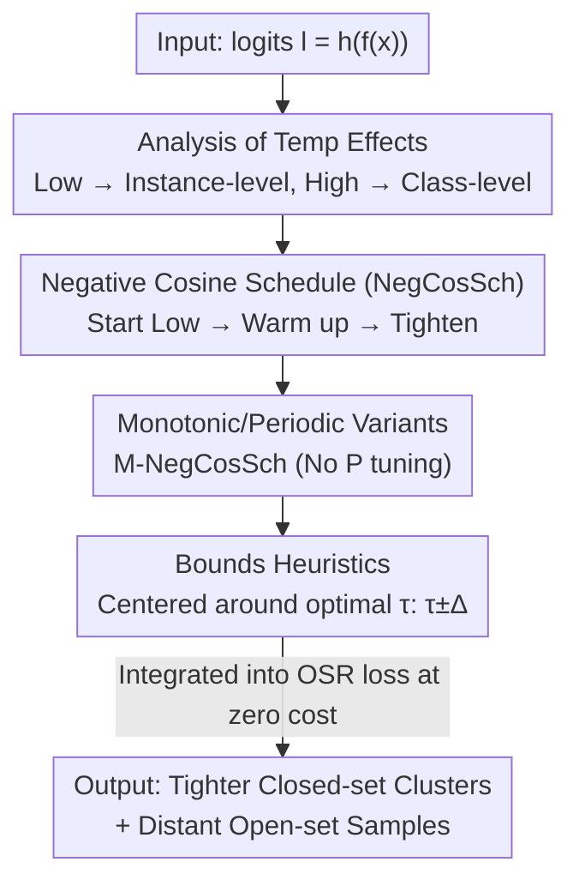

# Boosting Open Set Recognition Performance through Modulated Representation Learning

**Conference**: ICLR2026  
**OpenReview**: [https://openreview.net/forum?id=vpBKry7kL5](https://openreview.net/forum?id=vpBKry7kL5)  
**Code**: https://github.com/amit31416/NegCosSch/  
**Area**: Self-Supervised / Representation Learning / Open Set Recognition  
**Keywords**: Open Set Recognition, Temperature Scheduling, Representation Learning, Contrastive Loss, Negative Cosine Schedule

## TL;DR
This paper points out that nearly all Open Set Recognition (OSR) methods employ a **fixed temperature** $\tau$ for logits, restricting the model to a single point on the spectrum between "instance-level" and "class-level" features. The authors propose **temperature scheduling** (centering on a novel Negative Cosine Schedule, NegCosSch), allowing the model to initially define coarse decision boundaries at low temperatures and subsequently tighten intra-class samples as temperature increases. This improves both open-set and closed-set performance without additional computational overhead, particularly yielding the highest gains on the challenging Semantic Shift Benchmark (SSB).

## Background & Motivation
**Background**: Open Set Recognition (OSR) requires models to accurately classify known classes (closed set) during testing while flagging unseen semantic classes (open set). Early methods generally fall into three categories: modeling unknowns as a long-tail distribution, synthesizing "pseudo-unknowns" via generative models or mix-up, or training auxiliary models with reconstruction objectives (e.g., VAE). Vaze et al. (2022) shifted this perspective, suggesting that a sufficiently trained closed-set classifier inherently achieves strong OSR performance (as unknown samples have lower max-logits), directing research toward "learning better representations."

**Limitations of Prior Work**: Synthetic sample methods generalize poorly. Generative, auxiliary model, and mix-up approaches incur high computational and memory costs, making them impractical for the large-scale Semantic Shift Benchmark (SSB) introduced by Vaze et al. (defined on fine-grained datasets like CUB, Aircraft, and Stanford Cars with Easy/Hard splits). Consequently, most recent works omit SSB results. Another branch of work uses regularization to tighten decision boundaries, hoping unknown representations fall into the vacated space—but this fails to address the core issue: hard unknown samples are **semantically similar** to known classes, and simply "squeezing" the space is insufficient.

**Key Challenge**: Both Cross-Entropy (CE) and contrastive losses rely on a temperature coefficient $\tau$ to adjust the "sharpness" of the softmax output. Existing research indicates that **low temperatures encourage instance-specific features**, while **high temperatures encourage class-specific features**. Fixing $\tau$ throughout training traps the model at one end of this learning spectrum. Being too class-specific makes new classes easily misclassified as known ones; being too instance-specific prevents the model from confidently assigning samples to known classes. A fixed temperature is inherently suboptimal.

**Goal**: To allow the model to **simultaneously acquire** robust class-level representations and intra-class instance-level discriminative power during training without introducing extra computational or memory overhead, thereby enhancing both open-set and closed-set performance, particularly on the challenging SSB.

**Key Insight**: Since temperature acts as the switch controlling this spectrum, it should not be fixed. By **dynamically scheduling temperature** during training, the model can traverse the spectrum to learn coarse structures followed by fine-grained details. While Kukleva et al. (2023) utilized cosine temperature scheduling for closed-set long-tail self-supervised learning, the impact of temperature scheduling on **novel classes** and various loss functions has not been systematically investigated.

**Core Idea**: Replace fixed temperatures with a set of temperature schedules, specifically the novel **Negative Cosine Schedule (NegCosSch)**. Training **starts at a low temperature** (to define coarse boundaries and push open-set samples away) and **gradually increases** (to tighten intra-class samples and smooth boundaries). this mechanism integrates seamlessly into existing OSR losses with zero additional cost.

## Method

### Overall Architecture
The method is extremely lightweight: it requires no changes to network architecture, no additional samples, and no auxiliary models. It merely replaces the **constant temperature $\tau$ in the loss function with a function $T(e)$** that varies with the training epoch. The model consists of an encoder $f(\cdot)$ (mapping input $x$ to representation $z=f(x)$) and a head $h(\cdot)$ (a classification layer for CE or a projection layer for contrastive loss), outputting logits $l=h(z)$. The only modification is changing $l/\tau$ in the softmax to $l/T(e)$. The authors analyze "why temperature controls open/closed-set representations" to design the scheduling curve $T(e)$ and provide heuristics for selecting temperature bounds $(\tau^+,\tau^-)$.

### Key Designs

**1. Analysis of Temperature Effects: Explaining Why Scheduling Works**

This forms the foundation of the method. Using SupCon loss as an example, the authors derive the gradient for a negative logit $l_j$:

$$\frac{\partial L_{\text{SupCon}}}{\partial l_j} = \frac{1}{\tau}\big[\text{softmax}_{a\in I\setminus\{i\}}(\text{sim}(l_i,l_a)/\tau)\big]_j \times \frac{\partial \text{sim}(l_i,l_j)}{\partial l_j}$$

**Low temperature** ($\tau$ is small) amplifies differences in scaled similarities, causing the **nearest negative samples to receive the largest gradients**. The model aggressively pushes them away, learning features suitable for instance-level discrimination where representations fill the space. However, intra-class positive samples do not cluster tightly because only a few neighbors are prioritized, resulting in sharper decision boundaries and pushing open-set samples far from known clusters due to heavy penalties for slight dissimilarities. **High temperature** ($\tau$ is large) distributes the repulsive force across more negative neighbors, encouraging class-level features, tighter clusters, and smoother boundaries—at the cost of open-set samples being more likely to approach known clusters. The CE loss follows a similar logic. This analysis demonstrates that **no fixed temperature can satisfy both requirements**, necessitating movement during training.

**2. Negative Cosine Schedule (NegCosSch): Coarse Boundaries Followed by Tightening**

The authors use a generalized cosine schedule to describe various curves:

$$T_{\text{GCosSch}}(e;\tau^+,\tau^-,P,k) = \begin{cases} \tau^- + \frac{1}{2}(\tau^+-\tau^-)\big(1+\cos(\frac{2\pi e}{P}-k\pi)\big), & e\le E-\frac{kP}{2}\\ \tau^+, & \text{otherwise} \end{cases}$$

where $P$ is the period and $k\in[0,1]$ controls the phase delay. When $k=0$, it reduces to the standard cosine schedule (CosSch) from Kukleva et al. (working from high $\tau^+$ to low $\tau^-$). The authors found **the inverse to be superior**: setting $k=1$, the temperature **starts low at $\tau^-$ and rises toward high $\tau^+$**. The curve resembles an inverted cosine wave, hence the name NegCosSch. The intuition matches the analysis: starting low allows the model to prioritize few neighbors, building a **coarse representation skeleton** and pushing open-set samples away. As temperature rises, the model pulls in more neighbors to tighten intra-class clusters, smoothing boundaries while preserving the core separation established early on. The second half of the cycle (cooling down) serves as a refinement for instance-level features and provides a smooth transition for the next cycle; the final epochs maintain a high temperature for stable convergence.

**3. Monotonic Variant: M-NegCosSch for Parameter-Free Scheduling**

NegCosSch introduces the period $P$ as a hyperparameter. The authors further discovered that **using only the first rising half-cycle** (setting $P=2E$) is sufficiently effective, termed the Monotonic Negative Cosine Schedule (M-NegCosSch):

$$T_{\text{M-NegCosSch}}(e;\tau^+,\tau^-) = \tau^- + 0.5(\tau^+-\tau^-)\big(1-\cos(e\pi/E)\big),\quad \forall e$$

This eliminates the need to tune $P$. In experiments, it often outperformed the periodic version, suggesting that the "monotonic increase" itself is the primary driver of gain. Even linear or exponential increases perform better than fixed baselines.

**4. Heuristics for Bounds $(\tau^+,\tau^-)$: Reducing Tuning Effort**

Scheduling requires upper and lower temperature bounds. The authors provide a structured heuristic: first identify a good fixed temperature $\tau$ via standard tuning, then **place it at the center of the range**. For SupCon, $\tau^+=\tau+\Delta$ and $\tau^-=\tau-\Delta$ (or $\tau^+=\tau+\Delta, \tau^-=\tau$), with $\Delta\approx0.1\sim0.2$. For CE, as temperature scales logits rather than similarities, $\tau^+=2\tau$ and $\tau^-=\tau/2$. $\Delta$ should not be too large, as excessively low $\tau^-$ can disrupt early semantic structure and excessively high $\tau^+$ can erase instance-level discrimination.

### Loss & Training
No new loss terms are added; scheduling directly affects existing temperatures. Models use standard inference; for SupCon, the projection layer is removed, and a linear classifier is trained for evaluation. OSR scoring consistently uses the **max-logit** rule. TinyImageNet uses a VGG32-like model, while SSB uses ResNet50 pre-trained on Places365.

## Key Experimental Results

### Main Results
Benchmarks: TinyImageNet + three SSBs (CUB / FGVC-Aircraft / Stanford Cars) with Easy/Hard splits. Metrics: Accuracy (%), AUROC (%), and OSCR (%) (area under the CCR-FPR curve). The table below compares different schedules for CE loss (SSB columns show Easy/Hard):

| Schedule (CE Loss) | CUB Acc | CUB AUROC | CUB OSCR | Aircraft Acc | Aircraft AUROC | Aircraft OSCR |
|---|---|---|---|---|---|---|
| Constant (Baseline) | 84.43 | 83.55 / 74.98 | 70.49 / 63.34 | 90.88 | 90.35 / 81.48 | 82.05 / 74.25 |
| P-CosSch | 84.63 | 84.5 / 74.24 | 71.51 / 62.93 | 90.8 | 90.04 / 81.81 | 81.76 / 74.51 |
| Linear increase (Ours) | 86.22 | 86.54 / 78.01 | 74.58 / 67.32 | 90.97 | 91.11 / 83.25 | 82.87 / 76 |
| P-NegCosSch (Ours) | **86.3** | **86.85 / 77.6** | **74.89 / 67.01** | **91.33** | **91.41 / 83.15** | **83.43 / 76.14** |
| M-NegCosSch (Ours) | 86.12 | 86.79 / 78.08 | 74.7 / 67.3 | 91.15 | 91.15 / 83.23 | 82.99 / 76 |

### Ablation Study
The authors compared "with vs. without NegCosSch" across CE, SupCon, ARPL, and BackMix losses:

| Configuration | Key Conclusion |
|---|---|
| Any OSR loss + NegCosSch | Consistent improvement: 18/20 cases showed gains in both closed/open-set metrics. |
| P-NegCosSch vs M-NegCosSch | M was generally better, indicating gains stem from monotonic heating. |
| Linear/Exponential increase | Still outperformed fixed baselines. |
| Random / Linear decrease | Unstable or detrimental, proving the "heating up" process is vital. |

Maximum observed gains: Accuracy +1.87%, AUROC Easy/Hard +3.3%/+3.1%, OSCR +4.4%/+3.96%, all with **zero extra computation**.

### Key Findings
- **Direction is more important than waveform**: Reversing the cosine schedule (low to high) is the key. Standard CosSch (high to low) is mediocre, and random/cooling schedules are detrimental.
- **Monotonic increase drives primary gains**: M-NegCosSch exceeds the periodic version in most cases, showing that the core mechanism is monotonic heating.
- **Better on harder tasks**: As the number of training classes increases or the task difficulty for the baseline grows, the relative improvement of this method increases.
- **Orthogonal to label smoothing (LS)**: In most cases, it can be combined with LS for further gains.

## Highlights & Insights
- **Turning hyperparameters into scheduling variables**: Instead of carefully tuning a fixed $\tau$, the authors treat its **temporal trajectory** as a new degree of freedom.
- **Zero overhead is the true selling point**: Compared to mix-up/generative methods that double computation, this modifies one line of code, making it the **only category of OSR improvement capable of scaling to large SSB benchmarks**.
- **Theoretical-design loop**: The derivation from SupCon gradients ($ \propto 1/\tau$) directly informs the "low start → heating" curve design.
- **User-friendly heuristics**: The $\tau \pm \Delta$ rule centered around a known good $\tau$ minimizes deployment costs.

## Limitations & Future Work
- **Dependence on a good baseline temperature $\tau$**: The heuristics rely on an initially well-tuned fixed $\tau$.
- **$\Delta$ safety range**: If $\Delta$ is too large, it may disrupt semantic construction via excessively low $\tau^-$ or erase discrimination via excessively high $\tau^+$.
- **Unexplained edge cases**: Minimal gains were noted in specific configurations (e.g., Aircraft with SupCon+LS), potentially due to max-logit suppression in LS.
- **Future Directions**: Developing data-adaptive temperature scheduling (deciding heating rates based on cluster compactness).

## Related Work & Insights
- **vs. Vaze et al. (2022)**: Confirmed their "good closed-set = good OSR" thesis but improved upon it by replacing fixed temperatures with schedules.
- **vs. CosSch (Kukleva et al. 2023)**: Proved that for **open-set** scenarios, the reverse direction (low to high) is significantly more effective than their high-to-low approach.
- **vs. Generative/Regularization methods (ARPL, BackMix)**: These methods are computationally heavy; the proposed scheduling is zero-cost and can be layered on top for orthogonal gains.

## Rating
- Novelty: ⭐⭐⭐⭐ 
- Experimental Thoroughness: ⭐⭐⭐⭐⭐ 
- Writing Quality: ⭐⭐⭐⭐ 
- Value: ⭐⭐⭐⭐⭐ 

<!-- RELATED:START -->

## Related Papers

- [\[ICLR 2026\] FedOpenMatch: Towards Semi-Supervised Federated Learning in Open-Set Environments](fedopenmatch_towards_semi-supervised_federated_learning_in_open-set_environments.md)
- [\[ICLR 2026\] Disentangled representation learning through unsupervised symmetry group discovery](disentangled_representation_learning_through_unsupervised_symmetry_group_discove.md)
- [\[ICLR 2026\] Adversarial Encoding Perturbation and Synthesis for Set Representation Auxiliary Learning](adversarial_encoding_perturbation_and_synthesis_for_set_representation_auxiliary.md)
- [\[CVPR 2026\] PAF: Perturbation-Aware Filtering for Open-Set Semi-Supervised Learning](../../CVPR2026/self_supervised/paf_perturbation-aware_filtering_for_open-set_semi-supervised_learning.md)
- [\[AAAI 2026\] Let the Void Be Void: Robust Open-Set Semi-Supervised Learning via Selective Non-Alignment](../../AAAI2026/self_supervised/let_the_void_be_void_robust_open-set_semi-supervised_learning_via_selective_non-.md)

<!-- RELATED:END -->
