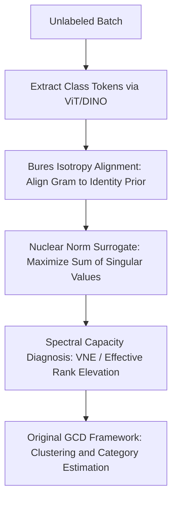

# Bures-Isotropy Alignment: Manifold Learning of Generalized Category Discovery

**Conference**: ICLR 2026  
**OpenReview**: [https://openreview.net/forum?id=nfVKTJ1MJ3](https://openreview.net/forum?id=nfVKTJ1MJ3)  
**Code**: https://github.com/lytang63/BIA  
**Area**: Self-Supervised Representation Learning / Generalized Category Discovery / Representation Manifold Learning  
**Keywords**: Generalized Category Discovery, Bures Distance, Isotropy, Dimensional Collapse, Category Number Estimation  

## TL;DR
BIA treats the class token representation in Generalized Category Discovery (GCD) as a manifold geometry problem requiring repair. It aligns the mini-batch class-token Gram matrix with an isotropic prior using Bures distance and achieves lightweight regularization through equivalent nuclear norm maximization. This enhances clustering accuracy and the stability of category number estimation without modifying the underlying GCD framework.

## Background & Motivation
**Background**: Generalized Category Discovery (GCD) aims to cluster unlabeled samples that contain both known and novel classes, given that only a subset of classes is labeled. Mainstream methods typically follow paths of contrastive learning, prototypical classification, mean-shift, or pseudo-label self-distillation: samples of known classes are pulled together, while unlabeled samples gradually form clusters via similarity, prototypes, or neighborhood relationships, finally evaluated by matching clusters for old/new/all accuracy.

**Limitations of Prior Work**: This paradigm assumes that "tighter clustering is better." However, the paper points out that in open-world scenarios, blindly compressing features squeezes the representation manifold of class tokens into a few principal directions. While known classes appear more compact, the fine-grained differences within novel classes are suppressed. Spectrally, this manifests as highly non-uniform eigenvalues of the feature Gram or autocorrelation matrix, reduced effective rank, and energy concentration in a few dimensions. This induces two common GCD errors: different novel classes being incorrectly merged and category number estimation deviating from the ground truth.

**Key Challenge**: GCD requires both "separability" and "completeness." Separability requires samples of the same class to be close and different classes to be far apart; completeness requires each category, especially unknown novel classes, to retain enough semantic directions for clustering. Traditional compact clustering primarily optimizes the former but lacks explicit constraints on the geometric quality of the representation space, causing the model to increasingly rely on low-dimensional shortcuts under pseudo-label noise and class imbalance.

**Goal**: The authors aim to introduce not a new clusterer, but a geometric regularization term that can be embedded into existing GCD frameworks. It identifies whether class-token representations are excessively collapsed at the mini-batch level, redistributes spectral energy from dominant directions to more dimensions, and ensures this repair serves both clustering accuracy and category number estimation.

**Key Insight**: The paper approaches the problem via Bures distance. Originating from quantum information geometry, Bures distance is often used to compare positive definite matrices or density matrices. Here, the authors treat the Gram matrix of a batch of class tokens as the "state" of representation geometry and use the isotropic matrix as the target prior. The advantage of this perspective is its natural focus on spectral structure rather than just coordinate-level decorrelation.

**Core Idea**: Use Bures distance to push the class-token Gram matrix toward isotropy. When the trace is approximately fixed, this is transformed into nuclear norm maximization, ensuring that GCD representations do not collapse into fewer dimensions without requiring changes to the model architecture.

## Method

### Overall Architecture
The input to BIA is the class tokens of a batch of unlabeled images encoded by ViT/DINO. The output is not a new category prediction head but a geometric regularization attached to the original GCD loss. It stacks the class tokens of each sample in a batch to construct a sample Gram matrix, then uses Bures distance to measure the gap between this Gram matrix and the identity matrix. During training, the authors utilize trace constraints to convert this objective into maximizing the nuclear norm of the class-token matrix, which can be added as a plug-and-play loss to frameworks like SimGCD, CMS, SPTNet, and SelEx using a single SVD.

In this diagram, ViT/DINO and the original GCD framework serve as the scaffolding. The real contributions are Bures isotropy alignment, the nuclear norm surrogate, and spectral capacity diagnosis. BIA does not replace contrastive or prototypical learning; instead, it prevents the aggregation process from crushing the class-token space into a low-rank shape once semantic aggregation trends are formed.

### Key Designs
**1. Bures Isotropy Alignment: Reformulating GCD Failure as a Spectral Geometry Problem**

The paper denotes the class token of each sample as a row, forming $Z \in \mathbb{R}^{B \times d}$, and constructs the batch Gram matrix $\Sigma_B = ZZ^\top \in \mathbb{R}^{B \times B}$. After row normalization or LayerNorm, the diagonal of $\Sigma_B$ is roughly stable, and $(\Sigma_B)_{ij}$ can be understood as the cosine similarity between two samples' class tokens. Its eigenvalue distribution describes whether the representation energy in the batch is dispersed across multiple semantic directions or concentrated on a few principal components.

BIA uses the identity matrix $I$ as the isotropic target and minimizes the squared Bures distance:

$$
d_B^2(\Sigma_B, I) = \operatorname{tr}(\Sigma_B) + B - 2\operatorname{tr}(\Sigma_B^{1/2}).
$$

The meaning of this objective is direct: if $\Sigma_B$ approximates the identity matrix, samples are not squeezed into a few similarity directions, and the token subspace within the batch is closer to full rank with a uniform spectrum. Unlike simply continuing to compress intra-class distance, BIA does not require all similar samples to be infinitely close but requires the entire token manifold to retain sufficient geometric capacity. Thus, it acts more like "repairing flattened representation space" rather than adding another layer of compact clustering.

**2. Nuclear Norm Surrogate: Converting the Bures Objective into Plug-and-Play Training Code**

Optimizing the Bures distance in its matrix square root form is complex, but the authors provide a key equivalence: when the row norm or trace is approximately fixed, $\operatorname{tr}(\Sigma_B)$ is essentially constant, and minimizing $d_B^2(\Sigma_B, I)$ is equivalent to maximizing $\operatorname{tr}(\Sigma_B^{1/2})$. Since the non-zero eigenvalues of $\Sigma_B = ZZ^\top$ are equal to the squares of the singular values of $Z$, it follows that:

$$
\operatorname{tr}(\Sigma_B^{1/2}) = \sum_j \sqrt{\mu_j} = \sum_j s_j(Z) = \|Z\|_*.
$$

Thus, BIA can be written as $L_{\text{BIA}} = d_B^2(\Sigma_B, I)$, or more practically as $L_{\text{nuc}} = -\|Z\|_*$. The total objective is $L = L_{\text{GCD}} + \lambda L_{\text{BIA}}$. Using the nuclear norm version, the code implementation simply involves taking class tokens from an unlabeled batch, passing them through a projection head, and subtracting the sum of singular values from the loss after SVD. This design is crucial because GCD methods vary significantly; some rely on contrastive learning, others on prototypical classification or mean-shift. If BIA required changes to classifiers or post-processing, it would be difficult to prove it is a universal geometric repair; since the nuclear norm regularization acts only on the representation matrix, it can be directly attached to multiple baselines.

Nuclear norm maximization is also gentler than Frobenius whitening, which rigidly pulls the covariance toward an identity matrix. It prefers more uniform singular values without requiring every direction to be exactly equal to a fixed value; this is important in GCD's mixed known/novel batches, as some anisotropy might stem from actual semantic structures. BIA's goal is to lift collapsed small eigenvalues and moderate overly strong principal directions rather than flattening all semantic structures.

**3. Spectral Capacity Diagnosis: Explaining Stable Category Discovery via Von Neumann Entropy**

To demonstrate that BIA is not just mathematically elegant, the paper introduces the autocorrelation matrix of all-data class tokens $A = \text{CLS}^\top\text{CLS}/N$ and uses Von Neumann Entropy (VNE) and effective rank to measure representation capacity. If the eigenvalues of $A$ are more uniform, VNE is higher, indicating that information is not concentrated in a few dimensions. If the largest eigenvalues absorb most of the energy, VNE and effective rank will be low—the spectral manifestation of dimensional collapse.

This diagnosis aligns with GCD's mission. Unknown categories usually lack label supervision, and the model must rely on fine-grained differences between unlabeled samples to form clusters. Once the token space becomes low-rank, these differences are suppressed first, and even the best clustering algorithms are forced to make decisions on impoverished geometry. BIA improves local spectral uniformity via mini-batch nuclear norm objectives, resulting in increased VNE and effective rank in the global $A$, making novel classes less likely to be merged into a single large cluster and preventing category number estimation from being misled by low-dimensional shortcuts.

The authors also distinguish BIA from isotropy regularizers like VICReg, CorInfoMax, Iso-Frob, and Iso-Ent. VICReg focuses more on coordinate-level variance/covariance constraints, CorInfoMax focuses on mutual information, Iso-Frob is similar to rigid whitening, and Iso-Ent is overly sensitive to small eigenvalues near zero. BIA acts directly on the batch class-token Gram matrix that GCD decisions rely on and reshapes the eigenvalue distribution gently through a square-root spectral function. This explains its greater stability under pseudo-label noise, class imbalance, and fine-grained novel class mixtures.

### Loss & Training
The BIA training strategy is concise: retain the network, optimizer, data augmentation, pseudo-labels, and clustering process of the original GCD baseline and add a geometric regularization with weight $\lambda$ to the unlabeled batch class tokens. The paper uses pre-trained DINO ViT-B/16 as the image encoder and follows the original settings of the baselines for comparison.

The core training formula is:

$$
L = L_{\text{GCD}} + \lambda L_{\text{BIA}},
$$

where $L_{\text{GCD}}$ can come from SimGCD's prototypical classification and self-distillation, CMS's contrastive mean-shift, or other GCD frameworks. If using the nuclear norm surrogate, SVD is applied to the unlabeled class-token embedding $Z$ to obtain singular values $s_j$, and $-\sum_j s_j$ is added to the loss. The PyTorch-style implementation provided in the appendix basically involves: fetching class tokens, projection, SVD, and subtracting $\lambda$ times the singular value sum from the loss.

Regarding hyperparameters, BIA has only one primary coefficient $\lambda$. Sensitivity experiments show it improves clustering accuracy across a wide range. In contrast, methods like VICReg in GCD require tuning variance/covariance weights separately, and optimal points vary across datasets. Computational overhead is minimal: the overhead of SVD relative to the ViT backbone forward-backward pass is approximately 0.37% to 1.47% for batch sizes between 64 and 256, with the total training time increase usually below 1%.

## Key Experimental Results

### Main Results
The paper evaluates BIA on coarse-grained and fine-grained GCD datasets, including CIFAR100, ImageNet100, CUB, Stanford Cars, FGVC Aircraft, and Herbarium19. Evaluation is conducted under two settings: one assuming ground-truth category number $K$ is given during clustering, and another where $K$ is unknown and must be estimated. Selected results illustrating the performance:

| Setting | Baseline | Dataset | All | Old | New | Change after BIA |
|------|----------|--------|-----|-----|-----|------------|
| Given Ground-truth $K$ | SelEx | CUB | 78.7 → 80.6 | 81.3 → 81.0 | 77.5 → 80.4 | New +2.9, All +1.9 |
| Given Ground-truth $K$ | SimGCD | ImageNet100 | 83.3 → 86.7 | 92.1 → 93.1 | 78.9 → 83.6 | New +4.7, All +3.4 |
| Given Ground-truth $K$ | CMS | CUB | 67.1 → 71.1 | 74.9 → 74.1 | 63.2 → 66.9 | All +4.0, New +3.7 |
| Given Ground-truth $K$ | SPTNet | Stanford Cars | 56.2 → 58.8 | 70.3 → 75.4 | 46.6 → 50.8 | Significant improvement in all three |
| Unknown Ground-truth $K$ | CMS | CUB | 66.2 → 68.7 | 69.7 → 74.1 | 64.4 → 66.0 | Old +4.4, All +2.5 |
| Unknown Ground-truth $K$ | CMS | CIFAR100 | 77.8 → 79.5 | 84.0 → 84.7 | 65.3 → 69.1 | New +3.8 |

The general trend is that BIA's benefit to New accuracy is usually more pronounced than for Old categories, which is consistent with its motivation to restore intra-class completeness and avoid over-merging unknown classes. On fine-grained datasets with given $K$, BIA yields gains for SimGCD, CMS, SPTNet, and SelEx. In settings where $K$ is unknown, it also improves CMS performance on All/New metrics for most datasets.

### Ablation Study
| Ablation / Analysis | Key Metrics | Description |
|-------------|----------|------|
| Sensitivity to $\lambda$ and dimension $D$ | CUB / Cars / Aircraft clustering accuracy | BIA is insensitive to $\lambda$; simply reducing dimension $D$ to avoid collapse is sub-optimal as it loses useful semantic dimensions. |
| Category Number Estimation | ImageNet100: CMS estimates $K=98$, BIA estimates $K=100$ | BIA improves category number estimation, achieving ground-truth on ImageNet100; error decreases on CUB and Cars. |
| Comparison with SSL isotropy regs | SimGCD + BIA (CUB All 62.1) | Higher than most VICReg/CorInfoMax configs. These offer partial gains but are more hyperparameter-dependent. |
| Comparison with Iso-Frob / Iso-Ent | CUB BS 128: BIA All 62.1 vs Iso-Frob 61.5, Iso-Ent 61.8 | BIA is more stable across batch sizes; advantages are clearer at small batch sizes. |
| Computational Overhead | SVD vs Backbone: ~0.37%--1.47% | Total epoch time increase <1%. Minimal cost mostly from batch SVD. |

### Key Findings
- BIA's gains primarily stem from spectral structure repair rather than stronger classification heads or post-processing. Its effectiveness across multiple baselines suggests it addresses a common deficiency in GCD representation spaces.
- Improvements in New accuracy are more significant, especially on datasets requiring fine-grained differentiation or category estimation like CUB and ImageNet100, aligning with the "restoring semantic capacity of unknown classes" explanation.
- Gains on CIFAR100 and Herbarium19 are relatively limited. The paper suggests this is due to limited underlying embedding quality: CIFAR100 has low resolution, lacking high-frequency details for ViT, while Herbarium19 has many classes and deviates significantly from the pre-training distribution.
- BIA is more stable than rigid whitening or entropy regularization. It encourages higher effective rank via the nuclear norm without forcing equal weights on every direction, mitigating collapse while retaining semantic anisotropy.

## Highlights & Insights
- **Interpreting GCD "clustering inaccuracy" as insufficient geometric capacity**: While many GCD works focus on pseudo-labels and clustering strategies, BIA reminds us that if the class-token space is already collapsed into a low-rank form, subsequent decisions are merely remedies for impoverished representations. This perspective is enlightening for open-world learning analysis.
- **Clean derivation from Bures distance to nuclear norm**: The paper does not stop at quantum information terminology; it provides the relationship between $d_B^2(\Sigma_B, I)$ and $\|Z\|_*$ under trace constraints. This transforms a complex matrix geometry objective into a few lines of code.
- **Precise targeting**: Rather than performing general decorrelation on coordinate covariance, BIA acts on the batch class-token Gram matrix. This Gram matrix is precisely the sample relationship space that GCD clustering, prototype updates, and category estimation care about, making the regularization signal task-relevant.
- **Value for other tasks**: This approach can be applied to any task where "over-compressing representations for the sake of discrimination" exists, such as open-vocabulary classification, cross-domain unsupervised clustering, and continual category discovery. The key is not the Bures name but checking if spectral energy is monopolized by a few directions.

## Limitations & Future Work
- BIA relies on the underlying embedding having some degree of semantic quality. If the pre-trained model has poor coverage or input resolution loses key details, spectral regularization alone cannot create separable semantics.
- The paper primarily validates BIA on vision GCD and ViT class tokens. While claimed to be architecture-agnostic, token pooling and batch semantic structures in text, audio, or multi-modal GCD may differ and require separate validation.
- The explanation of BIA's effect on class imbalance and pseudo-label noise is based on spectral analysis. While showing stability experimentally, further research is needed on when isotropy might weaken authentic hierarchical class structures.
- Current loss only uses mini-batch level Gram matrices. Spectral estimation noise is higher at small batch sizes. Although BIA is more stable than Iso-Frob/Iso-Ent, future work could explore memory banks or cross-batch statistics for more reliable geometric estimation.
- Improvements in category number estimation are mainly shown through the CMS framework. A more systematic analysis of how BIA affects different K-estimation strategies, rather than just final error, is needed.

## Related Work & Insights
- **vs SimGCD / CMS**: These methods form compact clusters via prototypes, self-distillation, or mean-shift. BIA is a complementary plug-in that maintains class-token spectral capacity during their semantic aggregation processes.
- **vs VICReg**: VICReg uses variance/invariance/covariance terms to avoid collapse in self-supervised representations but focuses on coordinate-level statistics. BIA directly regularizes the batch class-token Gram matrix, which is more relevant to the sample-relationship space of GCD.
- **vs CorInfoMax**: CorInfoMax emphasizes mutual information maximization, but this might reinforce incorrect correlations under pseudo-label noise. BIA does not seek more information per se but ensures that semantic directions learned by existing GCD objectives do not collapse.
- **vs Whitening / Iso-Frob**: Whitening methods push the covariance rigidly toward the identity matrix, potentially erasing useful semantic anisotropy. BIA uses nuclear norm maximization to balance spectral energy more gently.
- **vs Bures metric related works**: Previous uses of the Bures metric often focused on comparing distributions, quantum states, or domain adaptation. This work differs by adopting it as a GCD training objective and solving implementation issues via a nuclear norm surrogate.

## Rating
- Novelty: ⭐⭐⭐⭐☆ The entry point from Bures geometry to GCD class-token isotropy is distinctive, especially combining the nuclear norm surrogate with GCD representation collapse.
- Experimental Thoroughness: ⭐⭐⭐⭐☆ Covers multiple baselines, datasets, given/unknown $K$, comparisons with SSL regularization, and analysis of batch size and overhead. Could be extended to cross-modal and more complex category estimation.
- Writing Quality: ⭐⭐⭐⭐☆ Clear narrative flow and complete derivations. Some experimental tables are dense, requiring the reader to extract patterns from many figures.
- Value: ⭐⭐⭐⭐☆ Lightweight, plug-and-play, and highly interpretable. It offers practical reference value for GCD and open-world representation learning as a low-cost geometric enhancement.

<!-- RELATED:START -->

## Related Papers

- [\[NeurIPS 2025\] Consistent Supervised-Unsupervised Alignment for Generalized Category Discovery](../../NeurIPS2025/self_supervised/consistent_supervised-unsupervised_alignment_for_generalized_category_discovery.md)
- [\[AAAI 2026\] GOAL: Geometrically Optimal Alignment for Continual Generalized Category Discovery](../../AAAI2026/self_supervised/goal_geometrically_optimal_alignment_for_continual_generalized_category_discover.md)
- [\[CVPR 2026\] Learning Like Humans: Analogical Concept Learning for Generalized Category Discovery](../../CVPR2026/self_supervised/learning_like_humans_analogical_concept_learning_for_generalized_category_discov.md)
- [\[CVPR 2026\] Seeing Through the Shift: Causality-Inspired Robust Generalized Category Discovery](../../CVPR2026/self_supervised/seeing_through_the_shift_causality-inspired_robust_generalized_category_discover.md)
- [\[CVPR 2026\] Decouple Your Discovery and Memory in Continual Generalized Category Discovery](../../CVPR2026/self_supervised/decouple_your_discovery_and_memory_in_continual_generalized_category_discovery.md)

<!-- RELATED:END -->
