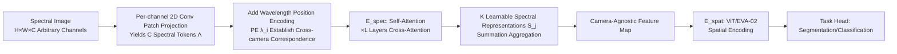

# CARL: Camera-Agnostic Representation Learning for Spectral Image Analysis

**Conference**: ICLR 2026  
**OpenReview**: [https://openreview.net/forum?id=TpbhS1yfz0](https://openreview.net/forum?id=TpbhS1yfz0)  
**Code**: [https://github.com/IMSY-DKFZ/CARL](https://github.com/IMSY-DKFZ/CARL)  
**Area**: Self-Supervised Representation Learning / Spectral Imaging / Cross-Camera Generalization  
**Keywords**: Spectral imaging, camera-agnostic representation, wavelength position encoding, self-supervised pre-training, I-JEPA, cross-domain generalization  

## TL;DR
CARL uses "wavelength position encoding + self-attention-cross-attention spectral encoder" to distill spectral images with arbitrary channel counts (RGB/MSI/HSI) into camera-agnostic feature representations. Combined with a feature-level spatio-spectral self-supervised strategy (CARL-SSL), it achieves cross-camera spatio-spectral joint representation learning for the first time, outperforming camera-specific and channel-independent baselines in medical, autonomous driving, and satellite domains.

## Background & Motivation
**Background**: Spectral imaging (RGB, multispectral MSI, hyperspectral HSI) is increasingly important in medical diagnosis, urban scene perception, and remote sensing. Each channel records reflection information of a specific wavelength, with channel counts ranging from a few to hundreds. Data-driven models have become mainstream, but spectral cameras from different manufacturers **vary significantly in channel dimensions and covered wavelengths**, creating "camera-specific data islands."

**Limitations of Prior Work**: Traditional CNNs/ViTs assume a fixed number of channels and cannot be used across different cameras, leading to "one model per camera" where knowledge cannot be transferred between islands, wasting large amounts of data. Existing channel-independent methods have flaws—Spectral Adapter uses 1D convolution to eliminate channels but ignores wavelength information; DOFA/Hyve and others rely on spatial operations for channel-adaptive projection layers and do not explicitly encode spectral salience, making them non-robust on spectral heterogeneous data; fusion methods require all modalities to be present during both training and inference, which is unrealistic in medical/industrial scenarios with diverse and unknown sensors.

**Key Challenge**: The effectiveness of self-supervised pre-training scales with the volume of data and should ideally aggregate massive unlabeled data across islands; however, current SSL strategies are not camera-agnostic, locking pre-training within single-camera islands. Furthermore, no SSL framework achieves "camera-agnostic + feature-level + joint spatio-spectral encoding."

**Goal**: Construct a backbone model capable of converting spectral images with any channel count into a unified camera-agnostic representation, coupled with a self-supervised framework that can digest large-scale unlabeled data across islands.

**Core Idea**: **[Wavelength as Position]** Apply the position encoding concept from Transformers (which encodes discrete token positions) to the "continuous wavelengths of channels" to establish channel correspondences across cameras. Then, use a set of **learnable spectral representations** to distill salient information from a variable number of spectral tokens via cross-attention, obtaining fixed-dimension, camera-agnostic patch representations.

## Method

### Overall Architecture
CARL splits spectral image processing into two sequential stages: first, a **spectral encoder $E_{\text{spec}}$** distills camera-dependent variable-channel spectral information into camera-agnostic patch representations. Next, a standard **spatial encoder $E_{\text{spat}}$** (such as ViT/EVA-02) captures geometric relationships between patches, followed by a task head for segmentation or classification. Spectral representations can be learned implicitly driven by downstream task losses or explicitly via the self-supervised CARL-SSL loss.

### Key Designs

**1. Wavelength Position Encoding: Enabling the model to "recognize" the color of each channel.** A spectral image $I\in\mathbb{R}^{H\times W\times C}$ is first projected channel-wise into $D$-dimensional features by a shared 2D convolution (kernel=stride=patch size $P$), turning each patch into $C$ spectral tokens $\Lambda=(\Lambda_1,\dots,\Lambda_C)$. To align channels across cameras, it is crucial for the model to know the physical wavelength $\lambda_i$ corresponding to each channel. The authors use sinusoidal Fourier Features for encoding: $\text{PE}(\lambda_i)=[\cos(2\pi\alpha\lambda_i B),\ \sin(2\pi\alpha\lambda_i B)]^T\in\mathbb{R}^D$, where $B\sim\mathcal{N}(0,\sigma^2 I)$, and the scaling factor $\alpha$ and bandwidth $\sigma$ are hyperparameters. By adding $\text{PE}(\lambda)$ to the spectral tokens, the model can map channels of the "same wavelength" from different cameras to similar encodings—this serves as the physical anchor for cross-camera knowledge transfer. Ablations show that removing PE causes mIoU to plummet from 61.5 to 18.3; $\sigma=3$ is optimal.

**2. Self-Attention-Cross-Attention Spectral Encoder: Distilling variable channels into fixed representations.** The channel count $C$ varies by camera, but downstream tasks require fixed-dimension, camera-agnostic representations. The authors initialize $K$ learnable $D$-dimensional **spectral representations** $(S_j)_{j\le K}$ (truncated normal distribution). First, self-attention is applied to the spectral tokens $(\Lambda_i)_{i\le C}$ for mutual interaction. Then, the $K$ spectral representations "absorb" the most salient spectral information via cross-attention ($S_j$ as queries, $\Lambda_i$ as keys/values). This self-attention-cross-attention module iterates $L$ times. Finally, a summation readout function aggregates $(S_j)_{j\le K}$ into a single camera-agnostic patch representation. Since $K$ is decoupled from $C$, the output dimension remains consistent regardless of whether the input is 3 channels or hundreds. Ablations indicate $K=8$ is sufficient to distill all channels (mIoU 63.9), and summation outperforms concatenation, max-pooling, or attention-pooling.

**3. CARL-SSL Feature-Level Spatio-Spectral Self-Supervision: Mining unlabeled gold mines across islands.** To digest large-scale unlabeled data across cameras, the authors designed end-to-end dual self-supervision, performed entirely in **feature space** rather than pixel space (spectral pixel values are highly sensitive to atmosphere/lighting; feature-level is more stable). A student-teacher structure is adopted, with the teacher updated via the student's exponential moving average (EMA). **Spectral Self-Supervision**: A spectral mask $M\subseteq\{1,\dots,C\}$ is sampled. The student $E_{\text{spec}}$ sees only unmasked tokens to generate $(S_j)_{j\le K}$. A predictor $\phi_{\text{spec}}$ then uses the wavelength position encodings of the masked wavelengths to predict the masked spectral tokens $(\tilde\Lambda_i)_{i\in M}$ generated by the teacher from the full input. **Spatial Self-Supervision**: The aggregated camera-agnostic representations are fed into an I-JEPA style spatial mask prediction, where a predictor $\phi_{\text{spat}}$ predicts masked features of the teacher's spatial encoder. Both use the VICReg loss (including invariance, variance, and covariance terms to prevent feature collapse), with the total objective $\mathcal{L}=\mathcal{L}_{\text{spat}}+\mathcal{L}_{\text{spec}}$. Ablations show that spatial SSL alone yields only 22.1 OA, while adding spectral SSL jumps to 32.6, proving spectral self-supervision is the core incremental value of this framework.

## Key Experimental Results

### Main Results

Cross-domain real-world evaluations cover medical, autonomous driving, and satellite scenarios:

| Experiment | Data/Setting | Key Baselines | CARL | Conclusion |
|------|-----------|----------|------|------|
| Autonomous Driving (HSICity Seg, mIoU) | RGB+HSI Joint Training | Camera-Specific 44.6 / Spectral Adapter 43.4 / DOFA 48.0 | **CARL 48.6, CARL-SSL 50.1** | Outperforms all camera-specific and channel-independent baselines |
| Medical (Synthetic MSI from Real HSI, IoU) | Synthetic MSI(4S,2F)+Real HSI | Hyve 47.7 / DOFA 49.2 | **60.3** | As filters become complex, baselines fail; CARL leads by ~10+ stably |
| Satellite (Sentinel-2 Linear Probe, Avg Rank across 11 datasets) | 800K Images Pre-trained | DOFA 3.2 / Copernicus-FM 2.6 / SMARTIES 2.6 | **1.6** | Highest in 3 out of 4 datasets, ranked first on average |
| Satellite OOD Sensors (Linear Probe) | RGB/LandSat-8/Orbita/Gaofen-5 | SMARTIES et al. | **Best in 3/4** (e.g., WHU-OHS 21.7 vs 1.5) | Significant lead in cross-domain generalization on unseen sensors |

### Ablation Study

| Dimension | Configuration | mIoU/OA |
|------|------|---------|
| (a) Wavelength Position Encoding | No PE / σ=1 / **σ=3** / σ=10 | 18.3 / 55.1 / **61.5** / 57.2 |
| (b) Aggregation Method | **Sum** / Concat / Max / Attn Pool | **62.7** / 61.8 / 61.8 / 60.0 |
| (c) Number of Spectral Reps K | 1 / 4 / **8** / 16 | 57.8 / 58.2 / **63.9** / 62.2 |
| (d) Feature Dimension D | 384 / **768** | 64.4 / **66.2** |
| (e) SSL Components | Spatial Only Lspat / +Spectral Lspec | 22.1 / **32.6** |

### Key Findings
- **Wavelength Position Encoding is the lifeline**: Performance nearly collapses without it (61.5 → 18.3), proving cross-camera transfer relies on physical wavelength anchoring rather than simple channel dimension alignment.
- **Unique robustness to spectral heterogeneity**: In medical experiments, when training HSI is gradually replaced by MSI, all baseline mIoU scores drop significantly with increased heterogeneity and exhibit prediction noise; only CARL maintains high mIoU on the hyperspectral test set.
- **Genuine cross-modal knowledge transfer**: The HSICity training set lacks "pole" labels; camera-specific models fail to identify poles entirely. CARL successfully transfers knowledge from Cityscapes RGB "pole" labels to HSI predictions. The IoU drop when removing "traffic light/sign" classes (-24.5/-26.7) was also much smaller than Hyve/DOFA (-37.5 to -50.4).
- **Stable on unseen sensors**: On 4 OOD sensors not involved in pre-training (ranging from RGB 3-channel to Gaofen-5 116-channel), CARL achieved 21.7 in linear probing on WHU-OHS (32-channel Orbita), while DOFA/Copernicus-FM/SMARTIES only hit 1.5. This demonstrates that transfer capability from wavelength anchoring remains effective for extreme channel differences.
- **Universal Hyperparameters**: $\sigma=3, K=8$ remained optimal across medical, autonomous driving, and satellite domains, reflecting the universality of the design.

## Highlights & Insights
- **Generalizes "position encoding" from discrete token positions to "continuous physical wavelengths"**, a simple yet powerful conceptual transfer that provides a common semantic coordinate system for different cameras, removing channel count as a barrier.
- **Decoupled spectral and spatial encoding**: $E_{\text{spec}}$ handles camera heterogeneity and outputs standardized feature maps, while $E_{\text{spat}}$ can reuse any existing vision backbone like ViT/EVA-02, making it easy to integrate into current spatial-geometric ecosystems.
- **First camera-agnostic feature-level SSL combining spatio-spectral dimensions**: Fills the gap in Table 1 by possessing all four properties: wavelength awareness, channel invariance, spatio-spectral encoding, and spatio-spectral SSL pre-training, paving the way for spectral foundation models.
- **Choice of feature-level (rather than pixel-level) SSL**: Addresses a pain point in spectral imaging where pixel values are highly sensitive to atmosphere and light calibration; feature-space reconstruction is more robust.

## Limitations & Future Work
- **Fixed number of spectral representations K=8**: The paper does not deeply discuss whether fixed-capacity distillation loses fine-grained spectral discriminative information for cameras with extremely high channel counts or complex spectral structures.
- **Wavelength information dependency**: The method assumes central wavelengths for each channel are known and accurate. For cheap or legacy equipment with missing or drifting wavelength labels, the physical anchoring of PE may fail.
- **Synthetic MSI for medical validation**: Medical multispectral images were synthesized from hyperspectral data via Gaussian or real filters. While controlling variables, a gap remains with the noise characteristics of real multispectral camera acquisition.
- **Future direction points to "Spectral Foundation Models"**: The authors position CARL as a scalable backbone. The next steps involve larger-scale cross-domain pre-training and zero-shot adaptation to unknown wavelength configurations.

## Related Work & Insights
- **Channel-Adaptive Remote Sensing Models** (DOFA, Copernicus-FM, SMARTIES, Hyve, HyperFree): These use wavelength-conditioned projection layers for channel invariance but remain focused on spatial operations without explicitly modeling spectral salience—CARL fills this gap with a dedicated spectral encoder.
- **Spectral Adapter (Braham et al. 2024)**: Uses 1D convolution/pooling to eliminate channels but ignores wavelength relationships; it serves as a "wavelength-unaware" baseline compared to CARL.
- **I-JEPA (Assran et al. 2023) / VICReg (Bardes et al. 2021)**: CARL-SSL directly draws from their spatial self-supervision and loss functions, extending the success of feature-level SSL to the spectral dimension.
- **Insight**: The paradigm of "variable-length input → fixed-quantity learnable query distillation" (similar to the latent bottleneck in DETR/Perceiver) is a general framework for handling heterogeneous modalities. CARL elegantly applies this to the channel dimension. Mapping any "dimension-variable physical quantity" to position encodings based on its physical coordinates may be a path toward unified multi-sensor/multi-modal representations.
- **Significance for Deployment**: Medical and industrial spectral devices are diverse, with few samples per device. CARL allows these "data islands" to be jointly pre-trained by the same model for the first time, marking a key step from "one camera, one model" to "one model, many cameras."

## Rating
- **Novelty**: ⭐⭐⭐⭐⭐ — The combination of wavelength position encoding, spectral distillation queries, and joint spatio-spectral feature-level SSL is a field-first, filling a significant technical gap.
- **Experimental Thoroughness**: ⭐⭐⭐⭐⭐ — Solid validation across three domains (medical, driving, satellite), including synthetic and real cross-camera variations, 11 satellite benchmarks, OOD sensors, and complete ablations.
- **Writing Quality**: ⭐⭐⭐⭐ — Clear motivation, precise positioning in Table 1, and effective illustrations; however, formulas and symbols are slightly dense, requiring cross-referencing with the appendix for method details.
- **Value**: ⭐⭐⭐⭐⭐ — Directly addresses the "camera island" bottleneck in spectral imaging deployment. Open-sourced code and weights provide high potential for CARL to serve as a spectral foundation model backbone.

<!-- RELATED:START -->

## Related Papers

- [\[ICLR 2026\] Beyond Hearing: Learning Task-Agnostic ExG Representations from Earphones via Physiology-Informed Tokenization](beyond_hearing_learning_task-agnostic_exg_representations_from_earphones_via_phy.md)
- [\[CVPR 2026\] Spectral Mixture-of-Experts for Continual Learning](../../CVPR2026/self_supervised/spectral_mixture-of-experts_for_continual_learning.md)
- [\[CVPR 2025\] Spectral State Space Model for Rotation-Invariant Visual Representation Learning](../../CVPR2025/self_supervised/spectral_state_space_model_for_rotation-invariant_visual_representation_learning.md)
- [\[ICML 2026\] A Refined Generalization Analysis for Extreme Multi-class Supervised Contrastive Representation Learning](../../ICML2026/self_supervised/a_refined_generalization_analysis_for_extreme_multi-class_supervised_contrastive.md)
- [\[CVPR 2026\] D2Dewarp: Dual Dimensions Geometric Representation Learning Based Document Image Dewarping](../../CVPR2026/self_supervised/d2dewarp_dual_dimensions_geometric_representation_learning_based_document_image_.md)

<!-- RELATED:END -->
