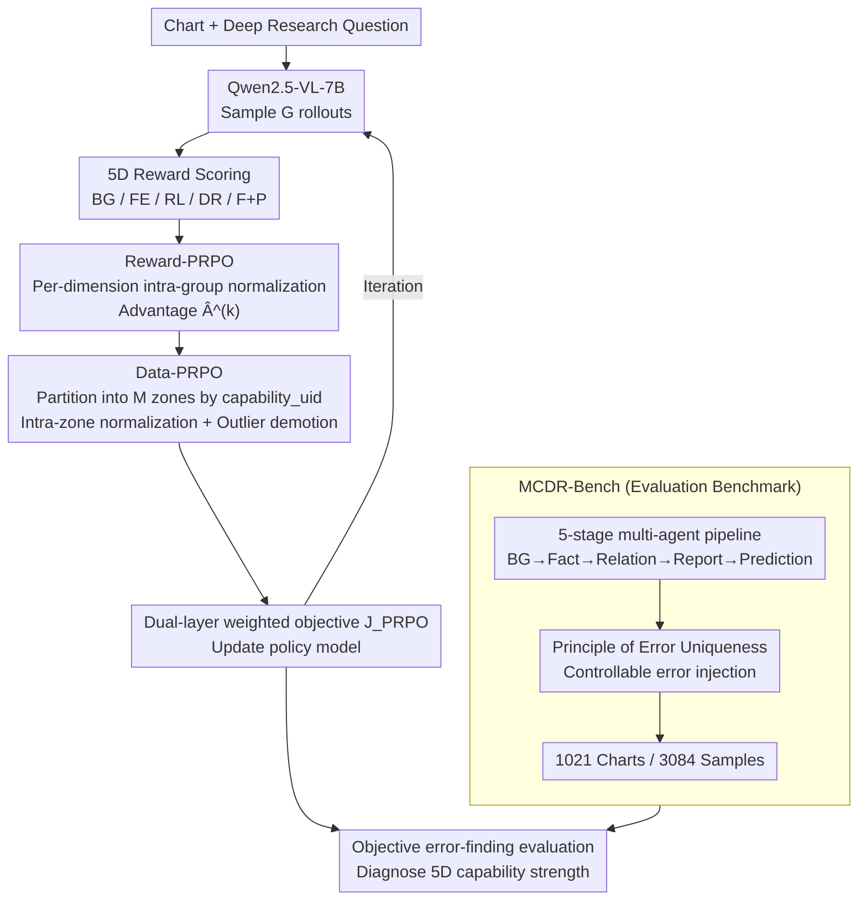

# Chart Deep Research in LVLMs via Parallel Relative Policy Optimization

**Conference**: ICLR2026  
**arXiv**: [2603.06677](https://arxiv.org/abs/2603.06677)  
**Code**: To be confirmed  
**Area**: Others  
**Keywords**: chart understanding, deep research, RLHF, policy optimization, benchmark

## TL;DR
Proposes PRPO (Parallel Relative Policy Optimization) to resolve training bottlenecks in GRPO caused by multi-dimensional reward signal interference and heterogeneous data gradient conflicts through parallel decoupling at both reward and data levels. Simultaneously, constructs MCDR-Bench to transform subjective generation evaluation into objective error identification based on the "Principle of Error Uniqueness," enabling quantitative assessment of chart deep research capabilities.

## Background & Motivation

**Background**: Chart understanding has evolved from simple data extraction to complex reasoning and analysis. Existing methods (e.g., ChartQA, PlotQA) primarily handle shallow tasks—visual recognition and factual Q&A—while capabilities for genuine "deep research" (trend analysis, causal reasoning, strategic suggestions) remain severely insufficient.

**Limitations of Prior Work**: (a) **Training Bottleneck**—Deep research on charts requires simultaneous mastery of multi-dimensional capabilities such as background knowledge integration, fact extraction, relationship construction, deep reasoning, and predictive planning. However, GRPO compresses multi-dimensional rewards into a single scalar, leading to signal interference and mutual cancellation; gradient conflicts in heterogeneous data result in simple tasks dominating the training. (b) **Evaluation Bottleneck**—Existing benchmarks evaluate only factoid QA and fail to assess end-to-end analytical reasoning capabilities; subjective generation tasks incur high annotation costs and suffer from large answer diversity.

**Key Challenge**: The conflict between the synergistic development of multi-dimensional capabilities versus a single optimization objective—GRPO aggregates rewards across all dimensions into a scalar, compressing variance and weakening the discriminative power of optimization signals, which prevents balanced growth across all dimensions.

**Goal**: (a) How to achieve balanced training under multi-dimensional rewards and heterogeneous data? (b) How to objectively evaluate chart deep research capabilities?

**Key Insight**: Introduce the concept of "parallelism" into policy optimization—parallel optimization of reward dimensions + parallel optimization of data capability zones—to decouple the sources of conflict. On the evaluation side, introduce controllable error injection to convert subjective generation into objective classification.

**Core Idea**: Perform two layers of parallel decoupling based on GRPO (Reward-PRPO to decompose reward dimensions and Data-PRPO to partition data types) to eliminate signal interference and gradient conflicts in multi-dimensional training.

## Method

### Overall Architecture
The goal of PRPO is to enable a 7B vision-language model to simultaneously learn five capabilities for chart deep research: background knowledge integration, fact extraction, relationship construction, deep reasoning, and predictive planning. The challenge is that GRPO compresses these five reward dimensions into a single scalar and normalizes samples of vastly different difficulty together, resulting in signal cancellation and simple tasks dominating the gradient. PRPO applies "parallel decoupling" to both areas: in the reward component, Reward-PRPO calculates an advantage for each dimension independently; in the data component, Data-PRPO normalizes samples for each capability within their own partitions. Finally, a dual-layer weighted objective is formed. The accompanying MCDR-Bench addresses the evaluation challenge by changing "scoring subjective reports" into "finding errors in reports with an injected mistake," turning end-to-end analysis into an objectively decidable classification task.

### Key Designs

**1. Reward-PRPO: Enabling each reward dimension to retain its own optimization signal**

The approach in GRPO is to sum the five-dimensional rewards into a scalar $R_i = \sum_k R_i^{(k)}$ before calculating the advantage. Consequently, an advantage in one dimension can be offset by a disadvantage in another, providing the model with an averaged gradient reflecting weak discriminative power. Reward-PRPO decouples this step: it performs intra-group normalization for each of the $K$ reward dimensions independently, $\hat{A}_i^{(k)} = (R_i^{(k)} - \bar{R}^{(k)}) / \sigma^{(k)}$, ensuring each dimension obtains a clean advantage estimation before being combined into the objective based on weights:

$$J_{\text{Reward-PRPO}} = \sum_{k=1}^K \lambda_k \, \mathbb{E}\big[\cdots L_{\text{clip}}(r_{i,t}, \hat{A}_i^{(k)})\big]$$

This allows the model to receive independent signals for improvement in specific dimensions like "background knowledge" or "reasoning depth" rather than being driven by a compressed total score.

**2. Data-PRPO: Allowing samples of varying difficulty to compete within their respective scales**

The second conflict arises from data. Simple visual recognition and complex causal reasoning have reward distributions with vastly different means and variances. If normalized using global statistics, simple tasks with high variance dominate the gradient, drowning out signals from complex tasks. Data-PRPO introduces `capability_uid` to partition samples into $M$ capability-based zones $\{P(Q^{(m)})\}_{m=1}^M$. Each zone performs normalization using only its internal statistics $\hat{A}_i^{(m)} = (R_i - \bar{R}^{(m)}) / \sigma^{(m)}$, ensuring each capability type is only compared with similar samples and competes within its own scale. To prevent outliers from skewing partition statistics, an outlier demotion mechanism iteratively detects samples where $|\hat{A}_i^{(t)}| > \tau$, removing them from the partition and demoting them to rollout-level individual optimization—creating soft partitions with individual safeguards.

**3. MCDR-Bench: Transforming subjective generation evaluation into objective error identification**

Deep research reports are open-ended generation tasks, making direct scoring both annotation-heavy and difficult to reproduce. MCDR-Bench bypasses this through a two-phase construction. Phase 1 produces high-quality annotations via a five-stage multi-agent pipeline—background acquisition → fact extraction → relationship construction → deep research report → predictive planning—followed by human auditing. Phase 2 applies controllable error injection into correct reports based on the "Principle of Error Uniqueness," embedding only one known error per report. This transforms the task from "how well it is written" to "whether the error can be identified." This is objectively decidable and, because errors are precisely tied to capability dimensions, allows for direct diagnosis of model weaknesses in specific areas. The resulting benchmark contains 1,021 high-complexity charts and 3,084 difficult samples covering the aforementioned five capability dimensions.

### Loss & Training
The two layers of decoupling are merged into a unified PRPO objective: for partition $m$ and reward dimension $k$, the advantage is dual-standardized "within-zone + within-dimension" as $\hat{A}_i^{(k,m)} = (R_i^{(k)} - \bar{R}^{(k,m)}) / \sigma^{(k,m)}$. The total objective is a dual-layer weighted sum:

$$J_{\text{PRPO}} = \sum_m \lambda_m \sum_k \lambda_k \, \mathbb{E}\big[\cdots L_{\text{clip}}(r_{i,t}, \hat{A}_i^{(k,m)})\big]$$

The training backbone is Qwen2.5-VL-7B-Instruct.

## Key Experimental Results

### Main Results (MCDR-Bench)

| Model | BG | FE | RL | DR | F/P | Overall |
|------|-----|-----|-----|-----|-----|---------|
| GPT-4o | 27.2 | 21.9 | 41.0 | 47.5 | 60.0 | 35.8 |
| Claude-3.7 Sonnet | 68.8 | 57.3 | 89.5 | 85.0 | 87.0 | 75.0 |
| Gemini-2.5-Pro | 81.2 | 87.3 | 91.4 | 93.8 | 93.0 | **89.3** |
| Qwen2.5-VL-7B (base) | 23.4 | 39.4 | 51.0 | 37.6 | 45.6 | 40.0 |
| + GRPO | 41.2 | 51.7 | 75.4 | 66.1 | 77.4 | 61.7 |
| + PRPO | **50.7** | **61.4** | **81.8** | **72.8** | **84.0** | **69.6** |
| + PRPO Think | **62.9** | **65.2** | **88.9** | **80.9** | **87.2** | **76.3** |

### Ablation Study (ChartQAPRO Cross-validation)

| Configuration | Factoid | MCQ | Conv. | FactChk | Hypo. | Overall |
|------|---------|-----|-------|---------|-------|---------|
| Qwen2.5-VL-7B base | 27.5 | 37.9 | 55.2 | 46.7 | 44.4 | 36.3 |
| + ChartReasoner-GRPO | - | - | - | - | - | 40.0 |
| + PRPO | **36.2** | **50.5** | 49.6 | **53.3** | **53.7** | **43.0** |

### Key Findings
- **PRPO consistently outperforms GRPO**: On MCDR-Bench, PRPO exceeds GRPO by +7.91% (direct) and +13.26% (Think), with improvements across all 5 dimensions.
- **Think mode amplifies gains**: PRPO + Think improves over standard PRPO by +6.64%, indicating that models trained with PRPO unleash more potential under chain-of-thought reasoning.
- **7B model approaches commercial LLMs**: The 76.3% achieved by PRPO Think surpasses Claude-3.7 Sonnet (75.0%) and nears Gemini-2.5-Pro (only a 13-point gap), despite being 10-100x smaller.
- **Cross-benchmark generalization**: PRPO also outperforms GRPO by +6.64% on ChartQAPRO, proving it is not overfitting to MCDR-Bench.
- **FE (Fact Extraction) sees the largest gain**: Increasing from 39.4 to 61.4 (+22.0) demonstrates that PRPO's per-dimension optimization is particularly effective for information extraction.

## Highlights & Insights
- **"Parallel Decoupling" is a general strategy for multi-dimensional optimization conflicts**: Decoupling at the reward dimension (Reward-PRPO) and data type (Data-PRPO) levels—this design philosophy can be migrated to any multi-objective RL scenario (e.g., code generation correctness vs. efficiency vs. safety).
- **Ingenious Error-Injection Evaluation Paradigm**: Converting subjective generation into objective classification reduces annotation costs while enabling fine-grained diagnosis. This evaluation approach can be extended to any long-context generation task (e.g., RAG accuracy, report quality).
- **Practicality of the Outlier Demotion Mechanism**: Data-PRPO does not use "hard" partitions; it automatically detects samples unsuited for current partitions and demotes them to individual optimization, balancing partition efficiency with individual fairness.

## Limitations & Future Work
- **Single Backbone Model**: All experiments were based on Qwen2.5-VL-7B. Effectiveness on larger models (72B+) or different architectures has not been verified.
- **Manual Definition of Capability Partitions**: The `capability_uid` in Data-PRPO requires pre-defined categories; automated discovery of capability partitions is a future direction.
- **Selection of Reward Dimension Weights $\lambda_k$**: The paper does not discuss weight sensitivity in detail. Adaptive adjustment of weights (e.g., based on convergence speed) might yield further improvements.
- **Limited to Chart Domain**: While the parallel optimization idea of PRPO is general, experiments were limited to charts; validation in general VLM multi-task training is warranted.

## Related Work & Insights
- **vs GRPO/DAPO**: GRPO uses group-level normalization but a single reward scalar. DAPO addresses entropy collapse but fails to handle multi-dimensional conflicts. PRPO’s core addition is "dual-layer parallelism"—dimension + data type.
- **vs ChartReasoner**: ChartReasoner uses SFT+GRPO for structured reasoning. PRPO does not change the reasoning structure but modifies the optimization strategy—making it more lightweight and general.
- **vs PPO/DPO**: PPO requires an additional value model; DPO avoids reward models but handles multi-dimensional rewards unnaturally. PRPO provides native multi-dimensional support within the GRPO framework.

## Rating
- Novelty: ⭐⭐⭐⭐ Dual innovation in parallel decoupled training and error-injection evaluation, though Reward-PRPO is essentially a multi-objective optimization decomposition.
- Experimental Thoroughness: ⭐⭐⭐⭐ Dual validation on MCDR-Bench and ChartQAPRO with comprehensive commercial/open-source comparisons, though lack of varied backbone experiments.
- Writing Quality: ⭐⭐⭐⭐ Clear problem analysis and rigorous math, though Sections 3-4 are slightly dense.
- Value: ⭐⭐⭐⭐ PRPO's parallel optimization philosophy is a general reference for multi-dimensional RLHF training, and MCDR-Bench fills the gap in chart deep research evaluation.

<!-- RELATED:START -->

## Related Papers

- [\[NeurIPS 2025\] M-GRPO: Stabilizing Self-Supervised Reinforcement Learning for Large Language Models with Momentum-Anchored Policy Optimization](../../NeurIPS2025/self_supervised/m-grpo_stabilizing_self-supervised_reinforcement_learning_for_multimodal_underst.md)
- [\[ICLR 2026\] Samples Are Not Equal: A Sample Selection Approach for Deep Clustering](samples_are_not_equal_a_sample_selection_approach_for_deep_clustering.md)
- [\[CVPR 2026\] Scaling Parallel Sequence Models to Vision Foundation Models](../../CVPR2026/self_supervised/scaling_parallel_sequence_models_to_vision_foundation_models.md)
- [\[ICLR 2026\] Mini-cluster Guided Long-tailed Deep Clustering](mini-cluster_guided_long-tailed_deep_clustering.md)
- [\[ICLR 2026\] ZeroSiam: An Efficient Asymmetry for Test-Time Entropy Optimization without Collapse](zerosiam_an_efficient_asymmetry_for_test-time_entropy_optimization_without_colla.md)

<!-- RELATED:END -->
