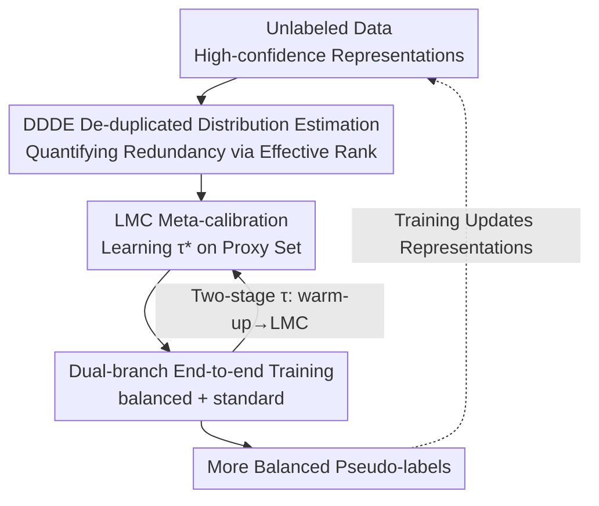

# CoLA: Co-Calibrated Logit Adjustment for Long-Tailed Semi-Supervised Learning

**Conference**: ICLR2026  
**OpenReview**: [https://openreview.net/forum?id=pI9n8wAR80](https://openreview.net/forum?id=pI9n8wAR80)  
**Code**: TBD  
**Area**: Semi-supervised Learning / Long-tailed Recognition / Logit Adjustment  
**Keywords**: Long-tailed Semi-supervised, Logit Adjustment, Effective Rank, Meta-learning, Pseudo-labeling

## TL;DR
To address two weaknesses of Logit Adjustment in long-tailed semi-supervised learning—"over-suppression of head classes caused by frequency counting" and "the global adjustment intensity $\tau$ being a fixed hyperparameter decoupled from class-level adjustment"—CoLA introduces De-duplicated Distribution Estimation (DDDE) using effective rank and learns the optimal $\tau$ (LMC) via meta-learning on a proxy validation set mirroring the estimated distribution, achieving SOTA results across four long-tailed benchmarks.

## Background & Motivation

**Background**: The core challenge of Long-Tailed Semi-Supervised Learning (LTSSL) is the "vicious cycle of confirmation bias"—models initially learn biases from skewed labeled data and then apply these biases to generate pseudo-labels for large amounts of unlabeled data. This amplifies the bias, making head classes over-confident while tail classes are marginalized. The current mainstream solution is Logit Adjustment (LA), which subtracts an offset related to the class prior from the predicted logits to suppress head classes and encourage tail classes, thereby producing more balanced pseudo-labels.

**Limitations of Prior Work**: LA consists of two components: **class-level adjustment** (determining relative suppression/encouragement based on class priors) and **global adjustment** (a scalar $\tau$ controlling the overall magnitude of the offset). Accurate adjustment is difficult because the true distribution of unlabeled data is unknown. One class of methods (CPE, Meta-Expert) uses pre-defined anchor distributions as proxies, which fail when the real distribution falls outside the anchors. Another more granular class (ACR, TCBC) dynamically estimates the unlabeled distribution but encounters two new issues.

**Key Challenge**: First, dynamic estimation typically relies on "frequency counting of high-confidence predictions," but head classes are filled with redundant samples that are visually similar. Simple counting **overestimates the actual proportion of head classes**, leading to over-suppression of head logits and performance degradation. Second, and more overlooked, these methods **treat the global intensity $\tau$ as a fixed hyperparameter**, ignoring its coupling with class-level adjustment. The authors' empirical findings are counter-intuitive: the optimal $\tau$ is highly sensitive to the estimated distribution and the number of classes, and it does not vary monotonically with the imbalance ratio $\gamma_l$ (e.g., on CIFAR-10-LT, the optimal $\tau$ for $\gamma_l=100$ is larger than for $\gamma_l=150$). A hard-coded $\tau$ cannot adapt.

**Goal**: To **co-design** the class-level and global components of LA—providing accurate class priors by removing redundancy bias from frequency counting while allowing $\tau$ to be learned adaptively with theoretical guarantees.

**Key Insight**: The redundancy of head classes stems from the fact that although there are many samples, the effective information is repetitive. This corresponds to the concept of "effective number of samples" by Cui et al., which can be quantified by the **effective rank** of the class representation matrix. Once a de-duplicated accurate distribution is obtained, $\tau$ can be optimized directly via meta-learning on a proxy validation set that "looks like" the unlabeled distribution.

**Core Idea**: Use effective rank for De-duplicated Distribution Estimation (DDDE) instead of frequency counting to resolve over-suppression, and transform global intensity $\tau$ into a learnable parameter via Learned Meta-Calibration (LMC) on a mirrored proxy set, allowing the class-level and global adjustments to be co-calibrated.

## Method

### Overall Architecture
CoLA is built upon the standard LTSSL framework of FixMatch with a dual-branch structure (balanced branch / standard branch). Its purpose is to generate more balanced pseudo-labels for unlabeled data. The process involves two sequential steps fed back into training: first, **DDDE** provides a de-duplicated estimate of the unlabeled class distribution $\hat{P}_{Y_u}(y)$; then, this distribution is fed into **LMC** to construct a proxy validation set and meta-learn the optimal global intensity $\tau^\ast$. Finally, this calibrated logit offset is used to generate pseudo-labels, driving end-to-end training. The new representations learned then improve the distribution estimation in the next round, forming a positive feedback loop. The balanced branch uses DDDE to produce class-balanced predictions, while the standard branch uses LMC to produce high-quality pseudo-labels. $\tau$ is managed in two stages—using ACR configurations during a warm-up phase, then handing over to LMC once distribution estimation becomes reliable.

### Key Designs

**1. DDDE: Quantifying Sample Redundancy via Effective Rank to Remove Head Class Overestimation**

This design targets the "over-suppression" bottleneck. For each class $y$, representations $\{z^y_j\}$ of unlabeled samples with pseudo-labels $y$ and confidence $\|\sigma(z(\alpha(x^u)))\|_\infty$ exceeding a threshold $\rho$ are collected into a feature matrix $Z_y \in \mathbb{R}^{d \times m_y}$. SVD is performed to obtain singular values $s_1,\dots,s_{m_y}$. The normalized singular value spectrum is treated as a probability distribution $p(i) = s_i / \sum_j s_j$. The effective rank is defined as the exponential of the Shannon entropy of this spectrum:

$$\mathrm{erank}(Z_y) = \exp\!\left(-\sum_{i=1}^{m_y} p(i)\log p(i)\right).$$

Effective rank measures how "energy is spread across principal directions." If samples are highly redundant, energy concentrates on a few components, resulting in low entropy and low effective rank. Normalizing these ranks gives the de-duplicated class distribution:

$$\hat{P}_{Y_u}(y) = \frac{\mathrm{erank}(Z_y)}{\sum_{k\in\mathcal{Y}}\mathrm{erank}(Z_k)}.$$

This reflects the "effective information volume" better than simple counting, preventing excessive suppression of head classes.

**2. LMC: Learning Global Intensity $\tau$ via Meta-learning on a Mirrored Proxy Set**

To solve the issue of fixed $\tau$, LMC learns $\tau$ in a data-driven manner. It resamples from the labeled set $D_l$ to construct a proxy validation set $D_v$ whose marginal label distribution aligns with the estimated $\hat{P}_{Y_u}$. Each sample $(x^l_i, y_i)$ is assigned a selection probability:

$$P\big((x^l_i,y_i)\text{ is selected}\big) = \frac{\hat{P}_{Y_u}(y_i)/N_{y_i}}{\max_{y}\big(\hat{P}_{Y_u}(y)/N_y\big)},$$

where $N_y$ is the number of labeled samples in class $y$. Optimal $\tau$ is then solved by minimizing cross-entropy on $D_v$:

$$\tau^\ast = \arg\min_{\tau}\ \frac{1}{V}\sum_{i=1}^{V} L_{\mathrm{CE}}\big(y^v_i,\ \sigma(z(\alpha(x^v_i)) - \tau\cdot p)\big),$$

where $p = (\hat{P}_{Y_u}(1),\dots,\hat{P}_{Y_u}(K))$ is the estimated frequency vector. Notably, a **linear offset $-\tau\cdot p$** is used instead of the logarithmic form $-\tau\cdot\log\hat{P}_{Y_u}$. The linear term (inspired by Mor & Carmon 2025) avoids numerical instability and excessive punishment for tiny estimated probabilities. Since $D_v$ is "sculpted" to match the unlabeled distribution, the learned $\tau^\ast$ is truly adapted to the current data.

**3. Dual-branch End-to-end Training + Two-stage $\tau$ Scheduling**

CoLA follows the common LTSSL dual-branch structure: the **balanced branch** applies DDDE to produce class-balanced predictions; the **standard branch** applies LMC to generate high-quality pseudo-labels. $\tau$ management is split: in the warm-up stage, $\tau$ is configured following ACR; once the model provides stable distribution estimates, it switches to LMC. This avoids the risk of biased $\tau$ learning during the cold-start phase.

**4. Generalization Bound: Theoretically Linking DDDE and LMC**

The authors prove a generalization bound for the $\tau$-parameterized classifier (Proposition 1). Under assumptions of Lipschitz/bounded loss, shared class-conditional distributions, and bounded importance weights, for any $\delta\in(0,1)$, with probability at least $1-\delta$:

$$R_{P_u}(h_\tau) \le \hat{R}_{D_v}(h_\tau) + |\hat{R}_{D_v,w}(h_\tau) - \hat{R}_{D_v}(h_\tau)| + 2B\cdot L\cdot \mathcal{R}_V(\mathcal{H}_\tau) + U\cdot B\sqrt{\tfrac{\log(1/\delta)}{2V}}.$$

The first term is the empirical risk on the proxy set (minimized by LMC). The second term $|\hat{R}_{D_v,w}-\hat{R}_{D_v}|$ measures the discrepancy between proxy and target distributions—the more accurate the distribution estimation, the smaller this term and the tighter the bound. This confirms that **the accuracy of DDDE directly determines the reliability of LMC**.

### Loss & Training
The framework follows FixMatch: standard cross-entropy for labeled samples and consistency training for unlabeled samples between strong/weak augmentations $A(x^u)/\alpha(x^u)$. CoLA modifies pseudo-label generation by subtracting the calibrated offset $\tau^\ast\cdot p$ from logits. Training uses the two-stage schedule described above.

## Key Experimental Results

### Main Results
CoLA achieves the highest accuracy across 5 unlabeled distributions (Consistent CON / Uniform UNI / Reversed REV / Middle MID / Head-Tail HT) on CIFAR-10/100-LT. On the more challenging CIFAR-100-LT, it leads the runner-up by over 1 percentage point in almost all settings.

| Dataset | Distribution | CoLA | Runner-up (Method) | Gain |
|--------|------|------|--------------|------|
| CIFAR-10-LT | REV | **85.61** | 85.03 (Meta-Expert) | +0.58 |
| CIFAR-10-LT | UNI | **83.66** | 83.12 (Meta-Expert) | +0.54 |
| CIFAR-100-LT | REV | **60.39** | 59.21 (ACR) | +1.18 |
| CIFAR-100-LT | CON | **59.04** | 58.31 (ACR) | +0.73 |
| STL-10-LT $(150,\gamma_l{=}10)$ | Unknown | **73.32** | 71.37 (Meta-Expert) | +1.95 |
| SIN-127 | $64{\times}64$ | **37.49** | 36.28 (ACR) | +1.21 |

On STL-10-LT, where the unlabeled distribution is unknown and may contain OOD samples, CoLA outperforms LA-based methods significantly. On large-scale SIN-127, it also maintains a lead, demonstrating scalability.

### Ablation Study
Decomposing DDDE and LMC on CIFAR-10/100-LT: `w/o D-τ` removes DDDE with $\tau$ fixed at 1/2/4; `w/o D-L` uses LMC but with frequency counting; `w/ D-L` is the full model.

| Configuration | CIFAR-10-LT (1,10) | CIFAR-100-LT (1,100) | Description |
|------|------|------|------|
| w/o D-1 | 83.12 | 56.23 | Fixed $\tau{=}1$, no DDDE |
| w/o D-2 | 83.56 | 55.41 | Fixed $\tau{=}2$, no DDDE |
| w/o D-4 | 82.64 | 53.32 | Fixed $\tau{=}4$, no DDDE |
| w/o D-L | 84.66 | 60.16 | LMC Only, frequency counting |
| **w/ D-L (Ours)** | **85.04** | **60.42** | Full Model |

### Key Findings
- **Optimal fixed $\tau$ is inconsistent across datasets**: $\tau{=}2$ is better for CIFAR-10-LT, while $\tau{=}1$ is better for CIFAR-100-LT. Even the best fixed $\tau$ performs worse than `w/o D-L`, proving fixed $\tau$ conflicts with class-level adjustment.
- **DDDE is indispensable**: `w/o D-L` is consistently lower than `w/ D-L`. When class-level estimation is inaccurate, LMC's learned $\tau$ is misled, indicating bi-directional coupling.
- **More accurate distribution estimation**: DDDE achieves the smallest L2 distance (estimated vs. true distribution) across all scenarios compared to NWGMA, MCA, etc.

## Highlights & Insights
- Re-framing "head class redundancy" as "effective rank of the representation matrix" allows for a more elegant and accurate quantification of "effective samples" compared to frequency counting.
- Revealing the **bi-directional coupling** between class-level and global adjustments in LA. It is not enough to estimate the distribution accurately; $\tau$ must also be learned in coordination.
- The use of a linear offset $-\tau\cdot p$ instead of a logarithmic one avoids numerical instability for classes with extremely low estimated probabilities.
- "Meta-learning hyperparameters on a proxy validation set mirroring the target distribution" is a general paradigm applicable to any problem where hyperparameters are sensitive to unknown test distributions.

## Limitations & Future Work
- Computing effective rank requires SVD on feature matrices, which adds computational overhead as the number of classes or representation dimensions grows.
- The method depends on the quality of initial labels and requires warm-up stages.
- The generalization bound relies on shared conditional distributions and bounded importance weights, which might be violated in the presence of severe OOD data or extreme rare classes.
- Experiments are concentrated on image classification; extension to structured prediction tasks like detection or segmentation remains to be explored.

## Related Work & Insights
- **vs. ACR**: ACR uses a dual-branch and distances to 3 preset anchors for post-hoc LA intensity. CoLA abandons fixed anchors for dynamic de-duplicated estimation + meta-learned $\tau$, allowing it to handle arbitrary distributions.
- **vs. CPE / Meta-Expert**: These rely on discrete preset anchor distributions. CoLA highlights their limitations when distribution shifts are arbitrary and replaces them with continuous adaptive estimation.
- **vs. Frequency-based Dynamic Estimation**: Traditional dynamic estimation ignores head class redundancy; DDDE replaces "sample count" with "effective sample count," resulting in significantly more accurate L2 distances.
- **vs. Original post-hoc LA (Menon et al.)**: CoLA makes $\tau$ learnable, replaces the logarithmic offset with a linear one, and provides theoretical support through generalization bounds and convexity analysis.

## Rating
- Novelty: ⭐⭐⭐⭐ Effective rank de-duplication + meta-learned intensity + bi-directional coupling insight; captures a real pain point in LA.
- Experimental Thoroughness: ⭐⭐⭐⭐⭐ Comprehensive benchmarks, distribution shifts, ablation of components, and L2 distance comparisons for distribution estimation.
- Writing Quality: ⭐⭐⭐⭐ Progressive motivation, clear figures, and self-consistent theory.
- Value: ⭐⭐⭐⭐ Stable SOTA performance in LTSSL; the effective rank and proxy meta-learning ideas are highly transferable.

<!-- RELATED:START -->

## Related Papers

- [\[ICLR 2026\] Learning Dynamics of Logits Debiasing for Long-Tailed Semi-Supervised Learning](learning_dynamics_of_logits_debiasing_for_long-tailed_semi-supervised_learning.md)
- [\[CVPR 2026\] Trust-calibrated Collaborative Learning for Long-Tailed Visual Recognition](../../CVPR2026/self_supervised/trust-calibrated_collaborative_learning_for_long-tailed_visual_recognition.md)
- [\[ICLR 2026\] FedOpenMatch: Towards Semi-Supervised Federated Learning in Open-Set Environments](fedopenmatch_towards_semi-supervised_federated_learning_in_open-set_environments.md)
- [\[ICLR 2026\] GUIDE: Gated Uncertainty-Informed Disentangled Experts for Long-tailed Recognition](guide_gated_uncertainty-informed_disentangled_experts_for_long-tailed_recognitio.md)
- [\[ICLR 2026\] Mini-cluster Guided Long-tailed Deep Clustering](mini-cluster_guided_long-tailed_deep_clustering.md)

<!-- RELATED:END -->
