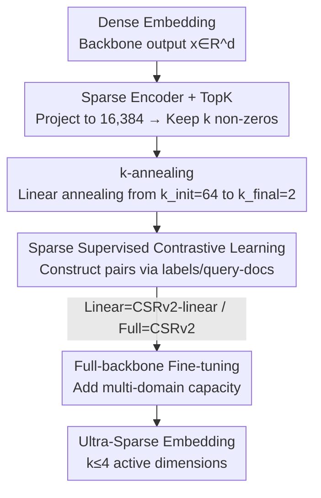

# CSRv2: Unlocking Ultra-Sparse Embeddings

**Conference**: ICLR2026  
**OpenReview**: [https://openreview.net/forum?id=CTpQW4yMUL](https://openreview.net/forum?id=CTpQW4yMUL)  
**Code**: https://github.com/Y-Research-SBU/CSRv2  
**Area**: Self-Supervised / Representation Learning  
**Keywords**: Sparse Embeddings, Ultra-Sparse, k-annealing, Supervised Contrastive Learning, Retrieval Efficiency

## TL;DR
CSRv2 utilizes "progressive k-annealing + sparse supervised contrastive learning + full-backbone fine-tuning" to advance Contrastive Sparse Representation (CSR) into the ultra-sparse range of $k\le 4$. This approach reduces dead neurons from 80% to 20% and achieves a 14% accuracy gain at $k=2$. It enables embeddings with only 2 active dimensions to match the performance of CSR at $k=8$ or MRL at 32 dimensions, providing up to a 300× improvement in computational and memory efficiency compared to dense embeddings.

## Background & Motivation
**Background**: In the era of large models, embedding quality determines the upper bound of downstream retrieval, classification, and recommendation. However, the mainstream still relies on dense embeddings (2k–8k dimensions), which are costly in terms of storage, VRAM, and inference latency. To compress these, industry approaches follow two paths: MRL (Matryoshka Representation Learning), which trains embeddings usable at multiple truncation lengths, and CSR (Contrastive Sparse Representation), which maps dense embeddings to high-dimensional vectors with only $k$ non-zero elements, requiring only $O(k)$ computation and memory during retrieval.

**Limitations of Prior Work**: While CSR approaches the accuracy of full-dimensional embeddings at moderate sparsity ($k=8,16,32$), its performance collapses in the **ultra-sparse range** ($k=2$ or $4$). This range is theoretically the most attractive—potentially offering over 100× retrieval efficiency—but existing methods suffer a 20–40% accuracy drop here, making them impractical.

**Key Challenge**: The authors identify three root causes for the failure of ultra-sparsity. First, **large-scale dead neurons**: at $k=2$, over 85% of hidden neurons are never activated because only the $k$ dimensions selected for a sparse code receive gradients. Once a dimension becomes silent, it never receives further gradient signals, creating a self-reinforcing cycle that locks representation capacity. Second, **mismatch between pre-training objectives and downstream tasks**: CSR relies on pure self-supervised signals (e.g., image crops). When only two or three active dimensions remain, noisy features are easily activated while useful features are lost. Third, **insufficient capacity**: CSR only trains a linear layer on a frozen backbone, which lacks sufficient representation capacity for joint training across multiple datasets or domains.

**Goal**: Is ultra-sparse embedding inherently limited, or is it simply a matter of inadequate training methods?

**Key Insight**: The authors argue that these three problems are "fixable" and that the fixes should be as simple and universal as CSR itself, without introducing new training objectives.

**Core Idea**: By using curriculum-style k-annealing to stabilize sparse learning, replacing noisy self-supervision with natural supervision, and supplementing capacity with full-backbone fine-tuning, the authors provide a reliable recipe to compress modern embeddings to just 2–4 active dimensions with only minor performance degradation.

## Method

### Overall Architecture
CSRv2 maintains the inference structure of CSR: the backbone outputs a dense embedding $x\in\mathbb{R}^d$, which passes through a sparse encoder projecting it to a high-dimensional space (e.g., 16,384 dimensions). A TopK operator then retains only the $k$ largest values and zeros out the rest, producing a $k$-sparse embedding $z$. Retrieval is performed by calculating similarity directly on these sparse vectors. All modifications in CSRv2 occur during **training**: building on CSR's original multi-TopK reconstruction loss and auxiliary loss, it adds three components—**progressive annealing** of the target sparsity $k$, replacing self-supervised contrast with **sparse supervised contrastive learning**, and allowing **fine-tuning of the entire backbone**.

The complete training objective is defined as:

$$\mathcal{L}_{\text{CSRv2}} = \mathcal{L}(k_t) + \tfrac{1}{8}\mathcal{L}(4k_t) + \beta\,\mathcal{L}_{\text{aux}} + \gamma\,\mathcal{L}_{\text{SpSCL}}(k_t),$$

where $k_t$ is the sparsity after annealing at step $t$, $\mathcal{L}(k_t)+\tfrac18\mathcal{L}(4k_t)$ is the multi-sparsity reconstruction loss inherited from TopK SAE, $\mathcal{L}_{\text{aux}}$ is the auxiliary loss to suppress dead neurons, and $\mathcal{L}_{\text{SpSCL}}$ is the new sparse supervised contrastive loss. Two variants are distinguished: **CSRv2-linear**, which only fine-tunes the top linear layer, and **CSRv2**, which fine-tunes the entire backbone.

### Key Designs

**1. k-annealing: Avoid forcing 2 dimensions immediately; start large to keep neurons alive**

Training directly with $k_{\text{final}}=2$ triggers an avalanche of dead neurons—only the 2 selected dimensions receive gradients, while others are never updated. Traditional CSR auxiliary losses fail at ultra-sparsity. CSRv2 adopts a simulated annealing approach: it starts with a sufficiently large initial sparsity $k_{\text{init}}$ (default 64) to allow the model to learn a meaningful latent space under relaxed constraints and activate diverse neurons. Then, $k$ is linearly annealed to the target value:

$$k_t = (1-p_t)\,k_{\text{init}} + p_t\,k_{\text{final}},\qquad p_t = t/T,$$

In practice, annealing occurs during the first 70% of training, followed by training at fixed $k_{\text{final}}$. Large $k_{\text{init}}$ encourages exploration, while progressive tightening sharpens representations for stable convergence in the ultra-sparse zone. Consequently, the final dead neuron ratio is significantly lower than training with $k_{\text{final}}$ from the start.

**2. Sparse Supervised Contrastive Learning: Allocating the few active dimensions to essential features**

Under ultra-sparsity, the model must prioritize high-information features within its limited active dimensions. CSR's self-supervised positive samples (e.g., crops) transfer poorly when downstream tasks require attributes ignored during training. CSRv2 utilizes supervision signals inherent in many retrieval tasks—identical class images in ImageNet or query-document pairs in text retrieval—to construct accurate positive/negative pairs. It replaces CSR's self-supervised contrastive loss with a sparse supervised contrastive loss acting on $k$-sparse embeddings:

$$\mathcal{L}_{\text{SpSCL}}(k) = -\frac{1}{|B|}\sum_{i=1}^{|B|}\log\frac{\sum_{p\in P(i)} e^{z_i^\top z_p}}{\sum_{p\in P(i)} e^{z_i^\top z_p} + \sum_{n\in N(i)} e^{z_i^\top z_n}},$$

where $P(i)$ and $N(i)$ are sets derived from natural supervision. t-SNE visualizations show that supervised sparse features are more inter-class separable. This effectively aligns the selection of the two active dimensions with downstream goals rather than wasting them on noise.

**3. Full-backbone Fine-tuning: Unlocking capacity constraints**

While CSR's advantage was training only a top linear layer, this shallow adaptation lacks capacity during multi-domain joint training. Comparison shows that CSR-linear drops performance significantly across task types on multi-domain data. CSRv2 adopts the MRL approach of applying the TopK operator to the backbone output and fine-tuning the entire network. This recovers performance to levels near domain-specific CSR training. While training costs increase, it yields significant gains in cross-domain generalization, with CSRv2 outperforming MRL by up to 25% under identical conditions.

### Loss & Training
The final objective follows Equation (8): multi-sparsity reconstruction $\mathcal{L}(k_t)+\tfrac18\mathcal{L}(4k_t)$ + auxiliary loss $\beta\mathcal{L}_{\text{aux}}$ + sparse supervised contrast $\gamma\mathcal{L}_{\text{SpSCL}}(k_t)$, with $k_t$ annealed via Equation (6). During inference, the backbone output is projected, TopK values are retained (with others zeroed), and no normalization is applied.

## Key Experimental Results

### Main Results
Using an e5-Mistral-7B backbone with identical configurations across six MTEB task categories, CSRv2 was compared (retrieval time normalized to CSRv2@$k=2$ on a 1M library). Selected ultra-sparse results:

| Active Dims $k$ | Method | Avg Score ↑ | Retrieval Time |
|------|------|------|------|
| 4096 (Full) | e5-Mistral-7B | 69.99 | 306.46× |
| 4 | MRL | 40.83 | 6.29× |
| 4 | CSR | 52.94 | 1.62× |
| 4 | CSRv2-linear | 58.62 | 1.65× |
| 4 | **CSRv2** | **61.01** | 1.63× |
| 2 | MRL | 33.81 | 6.20× |
| 2 | CSR | 44.33 | 1.01× |
| 2 | CSRv2-linear | 53.35 | 1.01× |
| 2 | **CSRv2** | **58.38** | 1.00× |

At $k=2$, CSRv2 averages 58.38, which is 14 percentage points higher than CSR (44.33) and 24 points higher than MRL (33.81), while maintaining the lowest retrieval time. At $k=4$, it outperforms CSR by approximately 8 points.

| Dataset/Model | Setting | Conclusion |
|--------|------|------|
| Qwen3-Embedding-4B (MTEB) | Native MRL support | CSRv2-linear/CSRv2 ranks 1st/2nd across multiple $k$; CSRv2 matches the full-dim backbone average. |
| ImageNet-1k (1-NN acc) | Visual Repr. | k-annealing consistently improves accuracy across all sparsity levels, particularly in the ultra-sparse zone. |

### Ablation Study

| Configuration | Key Observation |
|------|---------|
| CSR (Direct $k_{\text{final}}$ training) | $k=4$ dead neurons ~70%, $k=2$ ~90%. Root cause of collapse. |
| + k-annealing | $k=2$ dead neurons reduced from ~80% to ~20%. Annealing keeps neurons alive. |
| + Sparse Sup. Contrast | Significant accuracy boost in ultra-sparse range; t-SNE shows better class separation. |
| + Full-backbone (→ CSRv2) | Eliminates performance drop in multi-domain linear settings; gains up to 25% over MRL. |

### Key Findings
- **Annealing is critical for ultra-sparsity**: Forcing $k=2$ immediately triggers a dead neuron avalanche (90%), whereas "large-to-small" curriculum annealing suppresses this to 20%.
- **Supervision is vital as dimensions decrease**: When only two or three dimensions remain, assigning them must be guided by task-aligned supervision rather than noisy self-supervision.
- **Simultaneous efficiency and accuracy**: CSRv2@$k=2$ achieves both the highest average score and the lowest retrieval time, proving ultra-sparsity was previously limited by training methods, not inherent capacity.

## Highlights & Insights
- **Treating "Dead Neurons" as a trainability issue**: Using annealing to spread gradients across more neurons before tightening resembles "exploration before exploitation," a concept transferable to any TopK/sparse activation training (SAE, MoE routing, sparse attention).
- **Dimension budget allocation**: In extreme sparsity, contrastive learning's role is to decide the semantic alignment of limited active dimensions.
- **Recipe simplicity**: No additional loss terms are introduced beyond the core objective, ensuring low migration costs and high compatibility with existing backbones like Qwen3 for deployment.
- **Redefining the boundaries of ultra-sparse embeddings**: It transforms "$k\le 4$ is unusable" into a solved training problem, opening design space for memory-sensitive scenarios like edge devices and real-time search.

## Limitations & Future Work
- **Backbone fine-tuning costs**: The strongest CSRv2 variant requires full-backbone fine-tuning, which is more expensive than CSR's original linear adaptation.
- **Dependency on natural supervision**: The gains from supervised contrastive learning rely on existing labels/pairs. The performance in purely unsupervised or high-noise scenarios requires more study.
- **Hyperparameter sensitivity**: Settings like $k_{\text{init}}=64$ and a 70% annealing duration are empirical; their sensitivity across different backbones or modalities is not yet fully analyzed.
- **The ceiling of extreme sparsity**: Even with 20% dead neurons, a gap remains between $k=2$ (58.38) and full dimensions (69.99).

## Related Work & Insights
- **vs. MRL**: MRL relies on truncating dimensions and requires full fine-tuning, but its performance collapses below 100 dimensions. CSRv2 maintains high accuracy and faster retrieval at equivalent active dimensions.
- **vs. CSR (v1)**: CSRv1 fails at ultra-sparsity due to ~90% dead neurons. CSRv2 acts as an "ultra-sparse compatibility patch" for CSR.
- **vs. LlamaScope's k-annealing**: LlamaScope anneals only in the first 10% of training to accelerate SAE convergence; CSRv2 anneals throughout most of training specifically to solve dead neurons for efficient embeddings.
- **vs. Standard Supervised Contrastive (SupCon)**: CSRv2 applies the loss to the $k$-sparse embedding to optimize semantic dimension allocation rather than overall dense layer separability.

## Rating
- Novelty: ⭐⭐⭐⭐ Not a brand-new framework, but diagnoses and solves "unusable ultra-sparsity" through three focused training improvements.
- Experimental Thoroughness: ⭐⭐⭐⭐⭐ Covers text (MTEB, Qwen3, e5-Mistral, GraphRAG) and vision (ImageNet-1k), including neuron analysis and t-SNE.
- Writing Quality: ⭐⭐⭐⭐ Clear structure of problem decomposition and targeted solutions.
- Value: ⭐⭐⭐⭐⭐ Makes extreme sparse embeddings "ready for production," offering direct utility for large-scale retrieval and edge deployment.

<!-- RELATED:START -->

## Related Papers

- [\[ICLR 2026\] Temporal Slowness in Central Vision Drives Semantic Object Learning](temporal_slowness_in_central_vision_drives_semantic_object_learning.md)
- [\[ICLR 2026\] Disentangled representation learning through unsupervised symmetry group discovery](disentangled_representation_learning_through_unsupervised_symmetry_group_discove.md)
- [\[ICLR 2026\] In Context Semi-Supervised Learning](in_context_semi-supervised_learning.md)
- [\[ICLR 2026\] Better Together: Leveraging Unpaired Multimodal Data for Stronger Unimodal Models](better_together_leveraging_unpaired_multimodal_data_for_stronger_unimodal_models.md)
- [\[ICLR 2026\] Bayesian Test-Time Adaptation via Dirichlet feature projection and GMM-Driven Inference for Motor Imagery EEG Decoding](bayesian_test-time_adaptation_via_dirichlet_feature_projection_and_gmm-driven_in.md)

<!-- RELATED:END -->
