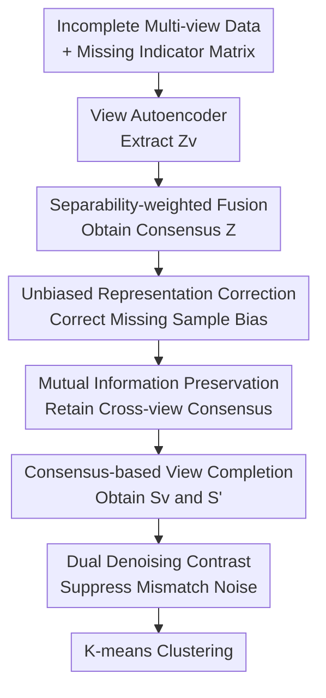

# Debiased and Denoised Representation Learning for Incomplete Multi-view Clustering

**Conference**: ICLR2026  
**OpenReview**: [https://openreview.net/forum?id=Bp3I456do5](https://openreview.net/forum?id=Bp3I456do5)  
**Code**: To be confirmed  
**Area**: Self-Supervised / Representation Learning  
**Keywords**: Incomplete Multi-view Clustering, Debiased Representation, Denoised Contrastive Learning, Consensus Representation, View Completion  

## TL;DR
This paper proposes DDR-IMVC, which uses unbiased consensus representations learned from complete samples to correct the biased representations of missing-view samples, and then employs robust contrastive learning in the form of truncated InfoNCE to suppress completion noise, achieving more stable clustering results on multiple incomplete multi-view clustering datasets.

## Background & Motivation
**Background**: Multi-view clustering (MVC) aims to combine different feature sources of the same object, such as an image having color, texture, and contour views. Complete MVC assumes all views are available for every sample, allowing the model to directly align cross-view semantics and learn consensus representations. However, in real-world collection or storage, some samples often lack certain views. Thus, Incomplete Multi-view Clustering (IMVC) must recover stable cluster structures under conditions of view missing.

**Limitations of Prior Work**: One class of methods directly completes the raw data, such as using GANs, prototype matching, or graph propagation to generate missing views. This approach is intuitive but costly, and recovering raw views is inherently difficult; once completed incorrectly, noise is introduced into the clustering. Another class of methods completes representations in the feature space, which has lower complexity and is closer to the clustering objective. The problem is that they often only focus on "whether documentation is completed" and do not handle the distribution differences after merging complete samples and missing samples.

**Key Challenge**: Missing views do not just represent a missing piece of input; they change the source distribution of the consensus representation. The consensus representation of complete samples is jointly determined by all views, while that of missing samples can only be estimated from visible views, naturally creating a distribution shift between the two. If these two types of representations are directly placed in the same contrastive learning or clustering space, the model may treat the bias caused by missing views as semantic differences, leading to cross-view mismatches and clustering structure noise.

**Goal**: The authors decompose the problem into two steps: first, making the consensus representations of missing samples move toward the "unbiased" representation space of complete samples to reduce distribution shifts caused by missing views; second, after completing view representation completion, avoiding the amplification of completion noise by ordinary contrastive learning, specifically reducing the risk of clustering collapse and noise overfitting.

**Key Insight**: The key observation of the paper is that while complete samples may not necessarily belong to the same class as a specific missing sample, they provide a more reliable cross-view consensus distribution. Instead of blindly generating missing views, it is better for missing samples to "retrieve" representations of complete samples with similar semantics based on their own visible information and use these unbiased representations as a correction direction. Meanwhile, contrastive learning should not unconditionally emphasize hard samples, because in IMVC, hard samples may just be noise created by completion errors or view mismatches.

**Core Idea**: Use unbiased consensus representations of complete samples to correct biased representations of missing samples through an attention mechanism, and then replace overly aggressive InfoNCE with a robust contrastive loss in the form of a truncated power series to jointly learn clusterable consensus representations from both the "debiasing" and "denoising" sides.

## Method

### Overall Architecture
The input of DDR-IMVC is incomplete multi-view data and the corresponding view missing indication matrix, and the output is clustering-friendly representations for K-means. It first uses independent autoencoders for each view to extract view-specific representations, which are then adaptively fused into consensus representations based on view separability. Subsequently, it treats consensus representations of complete samples as unbiased representations and those of missing samples as biased representations, using multi-head attention to extract correction information from the unbiased representations. Finally, debiased and denoised representations are obtained through mutual information constraints and dual contrastive learning.

In this process, the view autoencoders and the final K-means act as scaffolding; the real contributions are concentrated in three locations: separability-based consensus fusion, correcting biased representations with unbiased representations, and transforming ordinary contrastive learning into more noise-resistant dual contrastive constraints. The paper writes the final training objective as a combination of reconstruction loss, maximum mutual information loss, and dual contrastive loss, while K-means is directly performed on the final representation $S'$ during the inference phase.

### Key Designs
**1. Separability-weighted fusion: Instead of simply averaging views, let views with stronger cluster structures speak more.**

When multiple views are missing, simple averaging of all visible views mixes "whether a view exists" with "whether a view is useful." DDR-IMVC first trains independent autoencoders for each view, encoding the $v$-th view as $Z^v=E^v_\theta(X^v)$, while using a decoder to reconstruct the original input to ensure single-view representations do not completely deviate from the original structure. Subsequently, instead of directly averaging $Z^v$, it uses the representation variance of complete samples across views to estimate the clustering separability of each view: views where clusters are more separated typically have a greater degree of dispersion in relevant dimensions.

Specifically, the weight for the $i$-th sample in the $v$-th view is written as $W_{iv}=\operatorname{Var}(Z_C^v) / \sum_{v'=1}^V M_{iv'}\operatorname{Var}(Z_C^{v'})$, where $M_{iv'}$ indicates whether the $v'$-th view of that sample is visible. Consequently, missing views do not enter the denominator, and visible but poorly discriminative views are not over-trusted. The consensus representation is $z_i=\sum_{v=1}^V W_{iv}z_i^v$. The significance of this design is that all subsequent debiasing and denoising operations occur in the consensus space; if the initial consensus space is biased by low-quality views, the subsequent attention correction will also lack reliable anchors.

**2. Unbiased representation correction: Correcting distribution shifts of missing samples using the consensus distribution of complete samples.**

The paper divides the fused consensus representation $Z$ into two parts: $Z_u$ for samples where all views exist (unbiased representations) and $Z_b$ for samples where at least one view is missing (biased representations). "Unbiased" here is not absolute in a statistical sense but relative to missing samples; complete samples have more complete cross-view semantic sources and are thus better suited as a reference distribution for correcting missing samples.

The correction process is completed using multi-head attention. The $l$-th attention head first calculates the affinity between missing and complete sample representations: $A^{(l)}=\operatorname{Softmax}(Z_bW_Q^{(l)}(Z_uW_K^{(l)})^\top / \sqrt{d/L})$. Then, it uses these attention weights to aggregate correction terms from complete sample representations $B^{(l)}=A^{(l)}(Z_uW_R^{(l)})$. After concatenating all heads, $B=[B^{(1)},\ldots,B^{(L)}]$ is obtained. The final shift-corrected consensus representation is written as $S=[Z_u; Z_b]+[0;B]$: complete samples keep their original representations, while missing samples are augmented with correction vectors retrieved from complete samples.

This is softer than directly completing features with nearest neighbors. Attention is not a hard selection of one complete sample but instead learns a semantically weighted combination from a pool of complete samples; the correction term does not replace the missing sample itself but is injected as a residual into $Z_b$. Thus, the model preserves individual information from visible views of missing samples while pulling them back toward the consensus distribution formed by complete samples.

**3. Mutual information preservation and consensus completion: Making corrected representations both align with complete views and feedback into missing view representations.**

Attention correction alone is insufficient, as the corrected $S$ needs to truly preserve multi-view shared semantics rather than becoming an intermediate variable that only smoothes missing samples. DDR-IMVC maximizes the mutual information between the corrected consensus representation $S_C$ and each view representation $Z_C^v$ on complete samples, adding entropy regularization. The loss is written as $L_{MMI}=-\sum_{v=1}^V(I(S_C;Z_C^v)+\alpha(H(S_C)+H(Z_C^v)))$. The negative sign indicates minimization during training, which encourages $S_C$ to share as much clustering-related information as possible with each view.

Afterward, the model uses consensus representations to complete the missing representations of each view: $S^v=Z^v+(1-\tilde{M}^v)\odot S$. If the $v$-th view of a sample is visible, the original $Z^v$ is kept; if invisible, it is filled with the corrected consensus representation $S$. Then, the same variance-based weights are used to fuse the completed view representations into the final representation $S'$. This step reinjects the results of "correcting missing samples with complete samples" into the view level, preventing the model from aligning only in an abstract consensus space without forming complete representations usable for cross-view contrast and final clustering.

**4. Truncated robust contrast: Limiting the dominance of noisy hard samples over training.**

The contrastive learning in DDR-IMVC is divided into two parts. The first part is conventional cross-view contrast: representations of the same sample in different views constitute positive samples, while different samples constitute negative samples, mitigating multi-view heterogeneity. The second part is the paper's more characteristic denoising design: performing robust contrast between the consensus representation $S$ and the completed view representations $S^v$ to prevent completion noise from being excessively amplified by InfoNCE.

The authors start from the power series expansion of InfoNCE. Let $f(s_i,s_j)=\exp(\operatorname{sim}(s_i,s_j)/\tau)/\sum_n\exp(\operatorname{sim}(s_i,s_n)/\tau)$. The standard InfoNCE $-\log f(s_i,s_i^v)$ can be expanded as $\sum_{c=1}^{\infty}(1-f(s_i,s_i^v))^c/c$. The first term approximately corresponds to an MAE-style uniform penalty, which is more noise-resistant; the infinite high-order terms assign greater weight to hard samples, which in IMVC might just be mismatch or completion noise. DDR-IMVC thus truncates to the first $C$ terms: $L_r=\frac{1}{N}\sum_{v=1}^V\sum_{i=1}^N\sum_{c=1}^C(1-f(s_i,s_i^v))^c/c$. When $C=1$, it is close to MAE, and as $C\to\infty$, it degenerates into InfoNCE; taking intermediate values allows for continuous adjustment between discriminability and noise resistance.

### An Illustrative Example
Suppose in a three-view image dataset, a sample has only color and texture views, missing the contour view. Traditional feature completion might try to generate the contour view or replace the complete multi-view representation with the average of color and texture; if the color view happens to have low discriminability for certain classes, this sample is easily pulled toward the wrong cluster.

DDR-IMVC first encodes the three views and estimates "who is better at clustering" based on the variance of each view across complete samples. If the texture view separates categories better on complete samples, it receives a higher weight in the consensus representation of that sample; the missing contour view does not participate in weighting. Next, the biased consensus representation $z_b$ of this sample acts as a query to find reference samples with similar semantics in the unbiased representation pool $Z_u$ of complete samples. Attention may find several complete samples close to it in the combination of color and texture, thus aggregating their consensus representations to form a correction vector $B$, correcting the original $z_b$ to $s_b=z_b+B$.

During training, if the completed contour representation is inconsistent with the consensus representation, cross-view contrast pushes them closer; however, if this inconsistency arises from incorrect completion, the robust contrastive loss does not infinitely amplify this hard case like standard InfoNCE but limits the gradient via the truncation term. Ultimately, the resulting $S'$ is more like a clustering representation that "preserves evidence from visible views + corrects via the complete sample distribution + avoids being led astray by noisy samples."

### Loss & Training
The total objective consists of three parts: $L_{all}=L_{REC}+\lambda_1L_{MMI}+\lambda_2L_{DCL}$. $L_{REC}=\sum_v\lVert X^v-\hat{X}^v\rVert_2^2$ is responsible for training the autoencoders for each view; $L_{MMI}$ ensures the corrected consensus representation on complete samples and the view representations maintain shared information; $L_{DCL}=L_c+L_r$ includes both cross-view contrast and robust consensus contrast.

In terms of implementation details, the paper uses the Adam optimizer with encoder dimensions of $D_v$-1024-1024-1024-128, and decoders symmetric to the encoders; the number of attention heads $L=4$, the entropy regularization coefficient $\alpha=10$, and the robust contrast truncation coefficient $C=9$. After training, no additional clustering head is learned; K-means is run directly on the final fused representation $S'$ to obtain $K$ clusters.

## Key Experimental Results

### Main Results
The paper evaluates on four datasets: HandWritten, Scene-15, ALOI-100, and LandUse-21, using ACC, NMI, and ARI metrics across missing rates of 0.1, 0.3, 0.5, and 0.7. Below are representative results for each dataset at specific missing rates, focusing on whether DDR-IMVC maintains an advantage over strong baselines in complex and high-missing scenarios.

| Dataset | Missing Rate | Metrics | Ours (DDR-IMVC) | Prev. SOTA / Strong Baseline | Gain |
|---------|--------------|---------|-----------------|------------------------------|------|
| Scene-15 | 0.3 | ACC / NMI / ARI | 45.53 / 45.99 / 28.05 | APADC 41.80 / DCP 43.10 / ProImp 25.28 | ACC +3.73, NMI +2.89, ARI +2.77 |
| LandUse-21 | 0.3 | ACC / NMI / ARI | 28.02 / 33.49 / 14.27 | DCP 27.08 / Completer 32.64 / DCP 13.80 | ACC +0.94, NMI +0.85, ARI +0.47 |
| ALOI-100 | 0.5 | ACC / NMI / ARI | 69.87 / 82.34 / 58.09 | ICMVC 67.68 / 78.92 / 53.92 | ACC +2.19, NMI +3.42, ARI +4.17 |
| HandWritten | 0.3 | ACC / NMI / ARI | 96.15 / 91.49 / 91.21 | GHICMC 96.11 / 91.32 / 90.83 | Slight lead: +0.04 / +0.17 / +0.38 |

On Scene-15, the authors report that DDR-IMVC improves by approximately 3.56% in ACC, 1.92% in NMI, and 2.86% in ARI compared to the runner-up, indicating that debiasing and denoising are helpful for complex scenario data. ALOI-100 is a large-scale object image dataset; GHICMC encountered OOM on this dataset, while DDR-IMVC could run completely and outperformed methods like ICMVC and DIMVC across missing rates from 0.1 to 0.7.

However, a counterexample appears on HandWritten at high missing rates: at a missing rate of 0.5, DDR-IMVC's ACC/NMI/ARI are 94.34 / 88.38 / 87.87, lower than GHICMC's 94.88 / 89.16 / 89.10; at a missing rate of 0.7, DDR-IMVC is 90.86 / 82.65 / 81.92, also lower than GHICMC's 92.73 / 85.85 / 84.71. The authors suggest that the inter-class structure of HandWritten is relatively simple, and cascaded graph propagation for data recovery is more advantageous at high missing rates; this also shows that the advantages of DDR-IMVC are more pronounced in complex, highly complementary, or large-scale scenarios.

### Ablation Study
Ablations were conducted on LandUse-21 and Scene-15 at a 0.3 missing rate. In the table, $L_{REC}$ is reconstruction, adaptive correction and mutual information are mainly reflected in $L_{MMI}$, and dual denoising contrast corresponds to $L_{DCL}$ (written as FDCL in original table headers, implying terms related to dual contrastive learning).

| Configuration | LandUse-21 ACC / NMI / ARI | Scene-15 ACC / NMI / ARI | Explanation |
|---------------|----------------------------|---------------------------|-------------|
| $L_{REC}+L_{MMI}$ | 17.54 / 22.97 / 6.08 | 36.06 / 43.69 / 21.88 | Has consensus constraints but lacks denoising contrast; insufficient discriminability |
| $L_{REC}+L_{DCL}$ | 24.16 / 26.09 / 11.06 | 41.96 / 40.00 / 25.94 | Has contrastive constraints but lacks MI/corrected consensus preservation |
| $L_{REC}$ only | 16.78 / 17.96 / 5.63 | 21.53 / 21.61 / 11.48 | Only learns autoencoders; cannot solve bias and mismatch from missing views |
| Full Model | 28.02 / 33.49 / 14.27 | 45.53 / 45.99 / 28.05 | Debiasing, MI preservation, and denoising contrast all active |

From the ablation, using autoencoders alone can hardly complete IMVC. Adding dual contrastive learning improves the ARI on Scene-15 from 11.48 to 25.94, suggesting cross-view consistency and consensus contrast are major contributors. The full model further increases the ACC of LandUse-21 from 24.16 to 28.02 compared to $L_{REC}+L_{DCL}$, showing that unbiased representation correction and MI preservation are not decorative but improve the consensus distribution of missing samples.

### Key Findings
- DDR-IMVC is more stable on complex datasets. Results from Scene-15 and ALOI-100 show that while many methods drop significantly in performance as the missing rate increases, DDR-IMVC's decline is slower, indicating that learning correction directions from complete samples is more reliable than relying solely on the missing samples themselves.
- The value of robust contrastive loss lies in "trusting hard samples less." The gradient analysis of $L_r$ shows that when $C=1$, it is similar to MAE where all samples have close weights; as $C\to\infty$, it returns to InfoNCE where noisy hard samples gain large gradients. The truncation coefficient $C$ offers an intermediate state, allowing the model to distinguish positive and negative samples without being dominated by mismatch noise.
- Parameter sensitivity shows that results are sub-optimal when $\lambda_1$ and $\lambda_2$ are too large or too small; the authors suggest a range of 1 to 10. Convergence curves indicate that loss and clustering metrics stabilize across all four datasets at a 0.3 missing rate.
- t-SNE visualizations at a 0.5 missing rate on HandWritten demonstrate clearer embedding structures, intuitively supporting the explanation that correcting distribution shifts of missing samples helps recover a common cluster structure.

## Highlights & Insights
- The core problem of IMVC is shifted from "completing what is missing" to "missing causes distribution shift, so correct the representations first." This perspective is practical because, in many tasks, generating missing modalities is harder than learning a usable consensus space; feature-space correction is often a more lightweight choice.
- The roles of complete and missing samples are clearly defined. Complete samples are not just part of the training data but serve as anchors for the unbiased consensus distribution; missing samples aggregate signals from this anchor pool via attention. This is more consistent with the data structure of IMVC than treating all samples identically for alignment.
- The idea of truncated InfoNCE can be transferred to other tasks with pseudo-labels, completion, or cross-modal mismatch noise. As long as noise is mixed in hard samples, the strong penalty of standard InfoNCE may have side effects; using $C$ to control a continuous transition from MAE to InfoNCE is a simple yet explainable robustification tool.
- The method does not design complex clustering heads, focusing training effort on representation quality and using K-means as the final step. For unsupervised clustering papers, this setup makes results easier to attribute: performance gains mainly come from representation learning rather than post-processing modules.

## Limitations & Future Work
- The method relies on complete samples as an unbiased reference pool. If a dataset has very few complete samples, or if the distribution of complete samples themselves has a selection bias relative to missing samples, $Z_u$ may not represent the ideal consensus distribution, and attention correction could pull missing samples toward wrong regions.
- The paper mainly validates on classic feature-based multi-view datasets. For modern large-scale multimodal data, such as image-text, audio-video, or medical multimodality, view semantics vary more and missing mechanisms are more complex; the scalability of DDR-IMVC requires further experimentation.
- The truncation coefficient $C$ in robust contrast is fixed at 9. Although the paper provides gradient explanations and parameter analysis, noise levels may vary across different datasets. Future work could consider making $C$ adaptive based on the training stage or sample confidence—more conservative early on and gradually increasing discriminability.
- The current method still requires K-means as the final step and assumes the number of clusters $K$ is known. In real unsupervised scenarios where the number of categories is unknown or cluster sizes are unbalanced, robust cluster number estimation and clustering post-processing are needed alongside representation quality.
- The ablation table does not completely decouple the contributions of mutual information and attention correction. Separately removing attention correction, MI constraints, and variance-weighted fusion would clarify the independent role of each sub-module more clearly.

## Related Work & Insights
- **vs Completer / DCP**: Completer and DCP represent information-theoretic or contrastive prediction routes, focusing on cross-view consistency and missing view prediction. DDR-IMVC similarly uses contrastive and MI ideas but additionally explicitly models the distribution shift between complete and missing samples, thus emphasizing "debias first, then contrast."
- **vs DSIMVC / GHICMC**: Graph propagation methods recover missing views or transmit semantic information through neighborhood structures, which can be strong on simple data and high missing rates (as seen with GHICMC's lead on HandWritten). DDR-IMVC differs by avoiding high-cost cascaded graph construction, opting instead for attention-based correction in the consensus representation space, making it easier to run on large-scale data like ALOI-100.
- **vs ProImp / prototype-based IMVC**: Prototype methods complete missing information by learning category or semantic prototypes, which is structural but sensitive to prototype mismatch. DDR-IMVC does not explicitly learn fixed prototypes but dynamically aggregates correction information from the unbiased representation pool, making it suitable for scenarios with finer sample structures or larger intra-cluster variations.
- **Insights for Self-Supervised Learning**: This paper reminds us that in missing modality or incomplete view scenarios, the construction of positive and negative samples for contrastive learning cannot just look at sample identity but also whether the representation is contaminated by the missing mechanism. Treating "sample completeness" as part of the training signal might be more stable than a uniform InfoNCE application.

## Rating
- Novelty: ⭐⭐⭐⭐☆ Using complete samples as an unbiased correction source and truncated InfoNCE for denoising is well-suited for the IMVC scenario, though core modules are based on common combinations of autoencoders, attention, and contrastive learning.
- Experimental Thoroughness: ⭐⭐⭐⭐☆ Nine baselines, four datasets, four missing rates, and ablation analysis are comprehensive; however, module decoupling could be finer, and validation on modern large-scale multimodal data is missing.
- Writing Quality: ⭐⭐⭐⭐☆ Method formulas and training procedures are clear, and the derivation of robust contrastive loss is insightful; some experimental descriptions in table headers and component mappings are slightly coarse.
- Value: ⭐⭐⭐⭐☆ Relevant for incomplete multi-view clustering and self-supervised learning with missing modalities; the combined idea of "debiasing with complete samples + truncated contrast for noise resistance" is highly transferable.

<!-- RELATED:START -->

## Related Papers

- [\[ICLR 2026\] Unified and Efficient Multi-view Clustering from Probabilistic Perspective](unified_and_efficient_multi-view_clustering_from_probabilistic_perspective.md)
- [\[ICLR 2026\] Relationship Alignment for View-aware Multi-view Clustering](relationship_alignment_for_view-aware_multi-view_clustering.md)
- [\[ICLR 2026\] Uncover Underlying Correspondence for Robust Multi-view Clustering](uncover_underlying_correspondence_for_robust_multi-view_clustering.md)
- [\[ICLR 2026\] Incomplete Multi-View Multi-Label Classification via Shared Codebook and Fused-Teacher Self-Distillation](incomplete_multi-view_multi-label_classification_via_shared_codebook_and_fused-t.md)
- [\[ICLR 2026\] Equivariant Splitting: Self-supervised learning from incomplete data](equivariant_splitting_self-supervised_learning_from_incomplete_data.md)

<!-- RELATED:END -->
