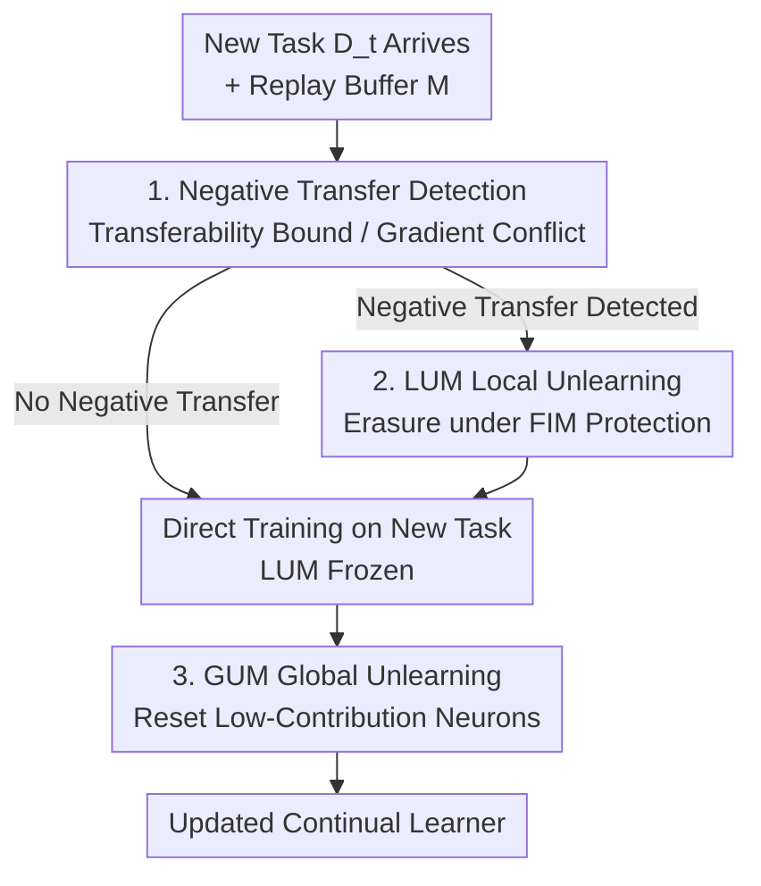

# Detect, Decide, Unlearn: A Transfer-Aware Framework for Continual Learning

**Conference**: ICLR 2026  
**OpenReview**: [https://openreview.net/forum?id=Lej4WvdpFE](https://openreview.net/forum?id=Lej4WvdpFE)  
**Code**: None  
**Area**: Continual Learning / Self-supervised Representation Learning  
**Keywords**: Continual Learning, Negative Transfer, Machine Unlearning, Gradient Conflict, Transferability Bound

## TL;DR
To address the negative transfer issue in continual learning where "remembering outdated knowledge hinders new tasks," this paper proposes the DEDUCE framework. It **detects** negative transfer using transferability bounds or gradient conflict analysis, **decides** whether to trigger unlearning, and finally **selectively erases interfering old knowledge** using batch-level Local Unlearning (LUM) and network-level Global Unlearning (GUM). As a plug-and-play enhancement, it can be integrated into 9 CL baselines, achieving a maximum average performance gain of 4.55%.

## Background & Motivation
**Background**: Continual Learning (CL) requires models to learn new tasks continuously from a data stream. Most mainstream research focuses on "catastrophic forgetting" (CF), with memory-based, architecture-based, and regularization-based methods all aiming to **preserve** as much old knowledge as possible.

**Limitations of Prior Work**: These methods implicitly assume "the more old knowledge preserved, the better," ignoring a converse problem: **retaining obsolete or irrelevant old knowledge can actively interfere with learning new tasks**. The authors cite an assisted driving system: rigidly remembering past lighting conditions can hinder the learning of new traffic patterns. In CL, this manifests as **negative transfer**: when old and new tasks conflict, both forward transfer (learning new tasks) and backward transfer (preserving old tasks) degrade.

**Key Challenge**: The contradiction lies between "preserving knowledge to prevent forgetting" and "outdated knowledge causing task interference." Simply preserving or simply forgetting is insufficient; the key is **what to forget**. Existing Machine Unlearning (MU) research shows that erasing specific data or domain knowledge can improve generalization, but these methods rarely address "**when** to unlearn." Blind unlearning can discard useful information, restricting positive transfer.

**Key Insight**: Taking inspiration from neuroscience, the human brain **actively forgets irrelevant information** when old and new experiences conflict to reduce interference and support knowledge transfer. The authors reframe CL within the transfer learning paradigm: Old tasks = source domain, New task = target domain. They utilize theoretical tools from transfer learning to judge whether "this transfer is negative."

**Core Idea**: Embed "selective unlearning" into the CL training loop: **detect negative transfer first, decide whether to unlearn, and finally erase only the conflicting interfering old knowledge**. This approach improves both forward and backward transfer instead of blindly preserving everything.

## Method

### Overall Architecture
The input to DEDUCE (**DE**tect, **D**ecide, **U**nlearn in **C**ontinual l**E**arning) is a task data stream $D=\{D_1,\dots,D_T\}$ and a replay buffer $M$. The output is a continual learner that **adaptively decides whether to unlearn** as each new task arrives. The pipeline follows the three steps in its name: when a new task $t$ arrives, it first **detects** negative transfer between it and old tasks (choosing between two complementary strategies). if detected, the **Local Unlearning Module (LUM)** is activated to erase interfering old knowledge before learning the current batch. If no negative transfer is detected, LUM stays frozen. Simultaneously, the **Global Unlearning Module (GUM)** runs throughout training, periodically resetting low-contribution neurons to free up network capacity.

The process is divided into four components: "Detection → Decision → Local Unlearning + Global Unlearning."

### Key Designs

**1. Transferability Bound: Judging "Is This Transfer Worth It?" via Domain Adaptation Theory**

To address "when to unlearn," the authors map CL to the transfer learning framework—treating old tasks as the source domain $X_S$ and the new task as the target domain $X_T$. Borrowing Ben-David's domain adaptation error bound, they **estimate the upper bound of target domain error** and compare it with the actual target test error. If the actual error exceeds the bound, the transfer from old to new tasks is deemed "negative," triggering unlearning. Theoretically, the target error is bounded by $E_T(h)\le E_S(h)+\tfrac{1}{2}d_{H\Delta H}(X_S,X_T)+\lambda$. Since the ideal joint hypothesis error $\lambda$ cannot be directly calculated, it is approximated using three estimable metrics: source error $\hat{E}_S(h)$ (evaluated on old tasks), source-target distribution divergence $\hat{d}_{H\Delta H}$, and the transferability from source to target $\hat\lambda$.

The divergence part involves training a domain classifier $h_d$ to distinguish whether samples come from the source or target, using its test error $\hat\epsilon(h_d)$ to approximate $\hat{d}_{H\Delta H}(X_S,X_T)=2|1-2\hat\epsilon(h_d)|$—the more separable the classifier, the larger the distribution shift and negative transfer risk. Transferability $\hat\lambda$ is proxied by the **LEEP score** (Log Expected Empirical Prediction):

$$E(f_{\theta_S},X_T)=\frac{1}{n}\sum_{i=1}^{n}\log\sum_{y_s\in Y_S}P(y_i|y_s)P(y_s|x_i)$$

LEEP measures the alignment between the source model's predicted label distribution and the target domain. It is always negative; a smaller absolute value indicates higher transferability, approximated as $\hat\lambda\approx c|E(f_{\theta_S},X_T)|$. Combining the three terms yields an actionable transferability bound proxy $E_T(h)\le\hat{E}_S(h)+|1-2\hat\epsilon(h_d)|+c|E(f_{\theta_S},X_T)|$. Moving LEEP from offline analysis to task-level compatibility estimation in CL provides a relatively coarse-grained but global judgment.

**2. Gradient Conflict Analysis: Real-time Negative Transfer Signals in Online Scenarios**

The transferability bound requires a full pass over task data (one epoch), which is infeasible in strict online CL (one-pass, immediate decisions). Thus, the authors add a **complementary** strategy: comparing the current mini-batch gradient with the old task gradient direction. The intuition is that when new classes are disjoint from old ones, new gradients often conflict with old ones, causing bidirectional negative transfer if updated forcefully. Based on old task loss on the buffer $M$, $L(f_\theta,M)=\frac{1}{|M|}\sum_{(x,y)\in M}L(f_\theta(x),y)$, **negative transferability** is defined: for a tolerance $\epsilon\in[-1,0]$, if

$$\langle\nabla L(f_\theta,M),\nabla L(f_\theta,D_t)\rangle\le\epsilon\|\nabla L(f_\theta,M)\|_2\|\nabla L(f_\theta,D_t)\|_2$$

the new task is judged to conflict negatively with the old task. When $\epsilon=0$, unlearning is triggered whenever the gradient correlation is negative (obtuse angle). Unlike GEM's "hard constraint to preserve old tasks," this uses gradient conflict as a **detection signal** to trigger unlearning, shifting focus from "rigid preservation" to "adaptive stability-plasticity adjustment." These two strategies (task-level bound and batch-level gradient) can be selected based on the task setting.

**3. LUM Local Unlearning: Erasing Interfering Knowledge under FIM Protection**

Once negative transfer is detected, LUM performs unlearning **before** training on the current batch. Theoretically, unlearning minimizes the KL divergence between the current parameter posterior $\rho_t(\theta)$ and the target "unlearned" posterior $\rho_u(\theta)=e^{-\omega}$ ($\omega=-L_{CL}$). This is equivalent to optimizing an energy functional that **increases the current mini-batch loss**, pushing the model toward the "unlearned" parameter distribution. The unlearning loss is defined as $L_{\text{unlearn}}=-L_{CE}(f_{\theta_t}(x_t),y_t)+\alpha D_\Phi(\theta_t,\theta_t^k)$, where the negative CE loss term realizes unlearning, and the second term $D_\Phi(\theta_t,\theta_t^k)=\|\theta_t-\theta_t^k\|_2^2$ is a regularization term ($\theta_t^k$ is the parameters after learning $k$ batches of the current task) to prevent forgetting early knowledge from the current task.

The key is **how to forget only interfering knowledge**. The authors use the **Fisher Information Matrix (FIM)** to distinguish: parameters with high FIM values are highly sensitive to old tasks and represent useful knowledge to be protected; low FIM parameters are interfering knowledge that can be erased. The unlearning update is derived as:

$$\theta_t'=\theta_t+\delta F^{-1}\big[\alpha\nabla_{\theta_t}D_\Phi(\theta_t,\theta_t^k)-\nabla_{\theta_t}L_{CE}(f_{\theta_t}(x_t),y_t)\big]$$

where $F$ is the diagonal approximation of FIM and $\delta$ is the unlearning rate. $F^{-1}$ ensures updates target low-importance, conflicting old knowledge while protecting high FIM parameters. After unlearning, normal learning takes place on the batch: $L_{\text{learn}}=L_{CE}(f_{\theta_t'}(x_t),y_t)+\beta(\theta_t'-\theta_{t-1})^T F(\theta_t'-\theta_{t-1})$, where the regularization term encourages using parameters unimportant to old tasks to accommodate new knowledge.

**4. GUM Global Unlearning: Resetting Low-Contribution Neurons to Restore Plasticity**

While LUM handles batch-level interference, GUM manages network-level capacity. Model plasticity naturally declines as tasks are learned sequentially. GUM monitors neuron activity, identifying and resetting neurons that have been "largely inactive across recent tasks." To avoid killing sparsely activated but critical neurons, the authors introduce an **importance score**: the activity score measures current impact on output, while the importance score measures historical significance. Only neurons that are **both low-activity and unimportant** are reset. The contribution of the $i$-th neuron in layer $l$ at time $\tau$ is maintained via a moving average with decay rate $\eta$:

$$C_{l,i}^\tau=\Big[(1-\eta)|h_{l,i}^\tau|\sum_{k=1}^{n_{l+1}}|w_{l,i,k}^\tau|+\eta C_{l,i}^{\tau-1}\Big]\sigma(\tilde{F}_{l,i}^\tau)$$

where the gating factor $\sigma(\tilde{F}_{l,i}^\tau)$ is the sigmoid of the normalized importance score. During resetting, output weights are zeroed; to prevent immediate re-resetting (due to zero contribution), a **maturity threshold $m$** is introduced—a neuron must survive $m$ steps to be eligible for reset. Each step resets a small fraction $\phi$ (global unlearning rate) of mature, low-contribution neurons per layer.

### Loss & Training
In the LUM stage, an $F$-weighted unlearning update using $L_{\text{unlearn}}$ yields $\theta_t'$, followed by learning new knowledge using $L_{\text{learn}}$ (CE + FIM regularization) on the same batch. GUM runs throughout to monitor and reset neurons. Three key hyperparameters: local unlearning rate $\delta$, global unlearning rate $\phi$, and tolerance $\epsilon$ for triggering unlearning.

## Key Experimental Results

### Main Results
DEDUCE acts as a plug-and-play enhancement for 9 CL baselines (oEWC, A-GEM, ER, DER++, HAL, PCR, OnPro, MOSE, STAR). Evaluation was conducted on CIFAR-100, CIFAR-10, Tiny-ImageNet, and CORE-50 under CIL and TIL settings with a fixed replay buffer of 500. OUR(B) uses transferability bound detection, while OUR(G) uses gradient conflict detection.

| Baseline + DEDUCE | Dataset | Setting | Baseline ACC | +DEDUCE | Gain |
|--------|------|------|------|------|------|
| HAL w/OUR(G) | CIFAR-100 | CIL | 11.6 | 24.8 | +13.2 |
| HAL w/OUR(G) | CIFAR-100 | TIL | 45.1 | 72.8 | +27.7 |
| DER++ w/OUR(G) | CIFAR-100 | CIL | 36.8 | 39.8 | +3.0 |
| DER++ w/OUR(G) | Tiny-ImageNet | CIL | 15.6 | 22.1 | +6.5 |
| DER++ w/OUR(G) | Tiny-ImageNet | TIL | 51.1 | 55.6 | +4.5 |
| STAR(DER) w/OUR(G) | CORE-50 | CIL | 36.8 | 42.2 | +5.4 |

Weaker baselines (HAL, oEWC) show the most significant gains (HAL increases by over 13% in CIL), while strong baselines like DER++ improve further by 3~6.5%. OUR(G) (gradient/batch-level) generally outperforms OUR(B) (bound/task-level) due to its fine-grained detection and immediate response.

### Ablation Study
Using DER++ as the base, individual components were removed (Table 2):

| Configuration | CIFAR-100 CIL | Tiny-ImageNet CIL | Description |
|------|------|------|------|
| DER++ | 36.8 | 15.6 | Bare baseline |
| w/ LUM | 39.4 | 16.6 | LUM only |
| w/ GUM | 37.7 | 16.3 | GUM only |
| wo/ $L_{\text{reg}}$ | 39.6 | 19.6 | Without FIM regularization |
| w/ OUR(G) (Full) | 39.8 | 22.1 | Complete DEDUCE |

### Key Findings
- **LUM contributes most in CIL**: Task boundaries in CIL are blurred, leading to higher negative transfer risks; erasing interfering knowledge via LUM yields clear gains. GUM provides stable improvements by restoring plasticity.
- **Tolerance $\epsilon=0$ is optimal**: Smaller $\epsilon$ (stricter LUM trigger) leads to performance drops; $\epsilon=0$ yields the best ACC and BWT, suggesting "timely but not excessive" unlearning is key.
- **$\delta$ and $\phi$ show parabolic trends**: Moderate unlearning removes interference while preserving knowledge, whereas excessive unlearning hurts performance.
- **BWT improvement**: DEDUCE improves the BWT of DER++ on CIFAR-100, Tiny-ImageNet, and CORE-50 by +6.4, +9.2, and +2.8 respectively, showing that erasing interfering knowledge mitigates negative backward transfer without worsening CF.
- **Enhanced gain with small buffers**: Even with a buffer size of 100, DEDUCE significantly mitigates degradation, showing value complementary to replay.

## Highlights & Insights
- **Turning "Forgetting" into a Tool**: CL traditionally views forgetting as an enemy. This paper argues that **selective unlearning of interfering knowledge improves both forward and backward transfer**.
- **Decoupled Detection and Unlearning**: Negative transfer detection (bound/gradient) and unlearning mechanisms (LUM/GUM) are independent, allowing flexible combinations for different granularities (online/offline, task/batch).
- **Dual Use of FIM**: The same Fisher Information Matrix is used in LUM to **protect** highly important parameters and **guide** unlearning updates toward low-importance ones.
- **Transferable Trick**: Approximating distribution divergence with domain classifier error and transferability with LEEP scores transforms theoretical transfer learning bounds into online-estimable proxies, applicable to any scenario requiring task compatibility judgment.

## Limitations & Future Work
- **Ours' Outlook**: Future work aims to develop mechanisms that **actively promote beneficial transfer** while suppressing interference.
- **Hyperparameter Sensitivity**: $\delta, \phi, \epsilon$ require manual tuning; the paper lacks an adaptive setting mechanism.
- **Reliability of Theoretical Proxies**: Transferability bounds rely on LEEP and domain classifiers; the scaling factor $c$ and approximation errors require more detail.
- **Computational Overhead**: LUM requires an unlearning update and FIM estimation per batch, while GUM continuously monitors neurons; training costs compared to bare baselines are not quantified.
- **Evaluation Scope**: Experiments are limited to image classification (ResNet-18 / ViT-Base), excluding NLP or Reinforcement Learning.

## Related Work & Insights
- **vs. Traditional CL (Memory/Architecture/Regularization)**: These methods blindly attempt to preserve old knowledge. This paper identifies that over-preservation causes negative transfer and advocates for **selective unlearning**.
- **vs. GEM / A-GEM**: While GEM uses gradient constraints for **hard preservation**, DEDUCE uses gradient conflict as a **detection signal** for unlearning, moving toward adaptive stability-plasticity.
- **vs. Machine Unlearning (MU)**: Traditional MU erases data for privacy/generalization but doesn't address "when." DEDUCE adds the "Detect → Decide" loop for **on-demand unlearning**.
- **vs. Plasticity Recovery (e.g., Continual Backprop)**: While others reset based on inactivity, GUM adds an **importance score** check to avoid killing critical but sparse neurons.

## Rating
- Novelty: ⭐⭐⭐⭐⭐ Framing selective unlearning in the CL loop and using transfer learning theory for detection is novel and consistent.
- Experimental Thoroughness: ⭐⭐⭐⭐ 9 baselines across 4 datasets under 2 settings, though limited to image classification.
- Writing Quality: ⭐⭐⭐⭐ The three-step framework is clear; some proxy approximations could be further detailed.
- Value: ⭐⭐⭐⭐ A plug-and-play enhancement with stable gains, providing a new tool for the "preserve-forget" balance in CL.

<!-- RELATED:START -->

## Related Papers

- [\[ICLR 2026\] Fly-CL: A Fly-Inspired Framework for Enhancing Efficient Decorrelation and Reduced Training Time in Pre-trained Model-based Continual Representation Learning](fly-cl_a_fly-inspired_framework_for_enhancing_efficient_decorrelation_and_reduce.md)
- [\[ICLR 2026\] A Bayesian Nonparametric Framework for Learning Disentangled Representations](a_bayesian_nonparametric_framework_for_learning_disentangled_representations.md)
- [\[ICLR 2026\] Plug-and-Play Compositionality for Boosting Continual Learning with Foundation Models](plug-and-play_compositionality_for_boosting_continual_learning_with_foundation_m.md)
- [\[ICLR 2026\] SplitLoRA: Balancing Stability and Plasticity in Continual Learning Through Gradient Space Splitting](splitlora_balancing_stability_and_plasticity_in_continual_learning_through_gradi.md)
- [\[CVPR 2026\] Learning by Analogy: A Causal Framework for Compositional Generalization](../../CVPR2026/self_supervised/learning_by_analogy_a_causal_framework_for_compositional_generalization.md)

<!-- RELATED:END -->
