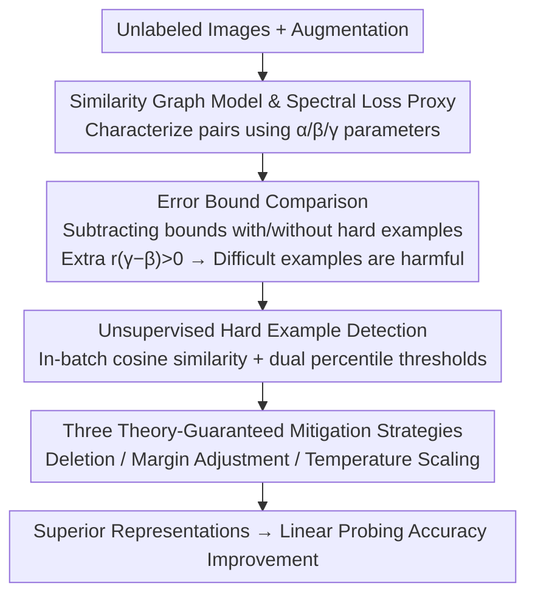

# Difficult Examples Hurt Unsupervised Contrastive Learning: A Theoretical Perspective

**Conference**: ICLR 2026 Oral  
**arXiv**: [2501.01317](https://arxiv.org/abs/2501.01317)  
**Code**: Not disclosed  
**Area**: Self-Supervised Learning / Contrastive Learning / Theoretical Analysis  
**Keywords**: Contrastive Learning, Difficult Examples, Similarity Graph Model, Temperature Scaling, Theoretical Bounds

## TL;DR
This work rigorously proves through similarity graph model theory that "difficult examples" (cross-class high-similarity sample pairs) damage unsupervised contrastive learning performance. It shows that difficult examples strictly deteriorate the generalization error bound and proposes three theory-guided mitigation strategies: deleting difficult examples, adjusting margin, and temperature scaling, leading to up to 10.42% linear probing accuracy improvement on TinyImageNet. This finding is counter-intuitive: while "more data is better" is common in deep learning, meticulously removing difficult examples in contrastive learning is beneficial.

## Background & Motivation
**Background**: Contrastive learning (SimCLR, MoCo) has been highly successful in unsupervised representation learning, but its performance varies significantly across different datasets, lacking theoretical explanation. Joshi & Mirzasoleiman (2023) found that difficult examples contribute the least in contrastive learning but did not notice the potential for performance improvement.

**Limitations of Prior Work**: Hard negative samples (similar to positive samples but from different classes) are considered beneficial in supervised contrastive learning (providing stronger gradients), but their impact in unsupervised contrastive learning is unclear. In the unsupervised setting, there are no labels to distinguish between "hard positives" and "hard negatives."

**Key Challenge**: Deep learning models usually perform better with more training data (lower sampling error), but the authors find that removing certain samples in contrastive learning actually improves performance—this is counter-intuitive.

**Goal**: To theoretically explain why difficult examples hurt unsupervised contrastive learning performance and provide solutions for improvement.

**Core Idea**: Rigorously prove through a similarity graph model that the presence of cross-class difficult examples increases the generalization bound of linear probing error, suggesting they should be specifically handled (deleted, margin-adjusted, or temperature-scaled).

## Method

### Overall Architecture
Instead of proposing a new network, this paper establishes a similarity graph model to formalize "difficult examples" as cross-class high-similarity sample pairs. It then uses the generalization error bound of spectral contrastive loss to rigorously prove that they degrade linear probing error. From the form of the bound, three mitigation strategies with theoretical guarantees—deletion, margin, and temperature scaling—are derived, alongside an unsupervised difficult example detector to apply these strategies. The logic chain of the analysis is: characterize data with three similarity parameters and use an analyzable spectral loss proxy $\to$ derive and compare error bounds with and without difficult examples, concluding "difficult examples are harmful" $\to$ reverse-engineer the bound to find corrections and design a label-independent detector to identify and correct difficult pairs.

### Key Designs

**1. Similarity Graph Model and Spectral Loss Proxy: Formalizing "Difficulty"**

The root cause of performance variance across datasets lies in the fact that previous augmentation graph theories treated all intra-class samples equally. This paper extends the augmentation graph of HaoChen et al. (2021) by modeling the similarity of any sample pair with three parameters: intra-class similarity $\alpha$ is the largest, easy inter-class similarity $\beta$ (far from decision boundary) is the smallest, and difficult inter-class similarity $\gamma$ (near the boundary) is in between, satisfying $\beta < \gamma < \alpha < 1$. Difficult examples are precisely defined as cross-class pairs with similarity near $\gamma$. To match real-world data, the model allows random perturbations $\tilde{a}_{ij} = a_{ij} + \epsilon \cdot \varepsilon_{ij}$ to relax the strict three-value assumption.

The analysis is driven by replacing InfoNCE with the spectral contrastive loss $\mathcal{L}_{\text{Spec}}(f) = -2 \cdot \mathbb{E}_{x,x^+}[f(x)^\top f(x^+)] + \mathbb{E}_{x,x'}[(f(x)^\top f(x'))^2]$ as an analytical proxy. This substitution holds because spectral loss is equivalent to InfoNCE at the population minima and is also equivalent to matrix factorization loss $\|\bar{A} - FF^\top\|_F^2$. This transforms the generalization analysis of contrastive learning into a spectral decomposition problem of the similarity matrix $\bar{A}$, allowing the use of matrix perturbation tools to derive error bounds.

**2. Error Bound Comparison: Rigorous Proof of Harm**

The core step is deriving and comparing the linear probing error bounds with and without difficult examples. Without difficult examples, the bound is $\mathcal{E}_{w.o.} \leq \frac{4\delta}{1 - \frac{1-\alpha}{(1-\alpha)+n\alpha+nr\beta}} + 8\delta$. Once difficult examples are introduced, a term proportional to $r(\gamma-\beta)$ appears in the denominator. Since $\gamma > \beta$, this term is strictly positive and directly pushes the error bound higher. Furthermore, a larger $\gamma - \beta$ (more "difficult" examples) leads to worse deterioration. This proves the counter-intuitive conclusion: while more samples should reduce sampling error, adding difficult samples actually worsens the generalization bound.

**3. Three Theory-Guaranteed Mitigation Strategies**

Since the error deterioration comes from $r(\gamma-\beta)$, the three strategies target different factors of this term. Deleting difficult examples removes pairs in the difficult set $\mathbb{D}_d$, strictly improving the bound when $\gamma - \beta$ is large or the number of difficult samples $n_d$ is small. Margin regulation adds a positive margin to difficult pairs in the loss, equivalent to subtracting a margin matrix $\bar{M}$ from $\bar{A}$. Specifically setting $m \propto \gamma - \beta$ cancels the extra similarity of difficult pairs, restoring the bound. Temperature scaling uses a separate temperature parameter for difficult pairs to suppress their similarity contribution. Unlike deletion, the latter two are smoother and do not lose sample volume. Crucially, the margin and temperature values are derived directly from the error bound, providing theory-guided rather than empirical hyperparameter tuning.

**4. Unsupervised Difficult Example Detection**

To implement these strategies, difficult pairs must be identified without labels. This work uses the in-batch cosine similarity $s_{ij}$ of features before the projection head. A difficult interval is defined using two percentile thresholds, with the indicator $p_{i,j} = \mathbf{1}[Sim_{posLow} \leq s_{ij} < Sim_{posHigh}]$. The upper bound $posHigh \approx 1/(r+1)$ is determined by a rough estimate of classes $r+1$ (obtainable via simple clustering); the lower bound $posLow$ can be near 100% as inclusion of more samples does not hurt. This detector requires no pre-trained models or extra forward passes and is insensitive to threshold variations.

## Key Experimental Results

### Main Results

| Dataset | Baseline SimCLR | + Remove Hard | + Margin | + Temperature | + Combined |
|--------|------------|-------------|---------|--------|--------|
| CIFAR-10 | 87.73% | +0.52% | +0.68% | +0.40% | +1.15% |
| CIFAR-100 | 59.95% | +2.91% | +1.28% | +1.12% | +2.91% |
| STL-10 | 82.18% | +1.13% | +0.96% | +0.60% | +1.52% |
| TinyImageNet | 69.58% | **+10.42%** | +6.28% | +4.53% | **+10.42%** |
| ImageNet-1K | 37.62% | +1.36% | +0.82% | +0.68% | +1.36% |

### Mixed Image Verification

| Dataset | Original | 10%-Mixed | 20%-Mixed | Remove Mixed |
|--------|------|-----------|-----------|----------|
| CIFAR-10 | Baseline | -1.5% | -3.2% | +0.5% |

### Key Findings
- **Significant gains on datasets with higher difficult example ratios**: TinyImageNet, which has more cross-class similar samples, saw a +10.42% gain, while ImageNet-1K with a lower ratio saw +1.36%.
- Strategies can be combined for additive effects, though gains saturate on datasets where the hard sample ratio is already low.
- Temperature scaling and margin regulation are smoother than deletion as they retain the full sample size.
- Mixed-image experiments validated the theory: artificially increasing difficult examples (via mixing) degrades performance, while removing them restores it.

## Highlights & Insights
- **Theory-driven practical improvements**: Hyperparameters are guided by the margin formula $m \propto (\gamma - \beta)$ derived from error bounds.
- **Explaining cross-dataset performance variance**: The proportion of difficult examples is identified as a key factor in explaining why contrastive learning performs differently across datasets.
- **Counter-intuitive yet theoretically supported**: "Less data is better" is rare in deep learning—this paper provides a rigorous theoretical explanation for this phenomenon.
- **Extremely simple detection mechanism**: No labels, no pre-trained models, and no extra computation required—only in-batch cosine similarity.

## Limitations & Future Work
- The similarity graph model assumes a simplified structure ($\alpha, \beta, \gamma$), whereas real-world similarity distributions are more continuous and complex.
- Although not strictly dependent, unsupervised detection still requires a rough estimate of the number of classes ($r+1$).
- Validity was verified only on the SimCLR framework; applicability to MoCo, BYOL, or DINO remains to be explored.
- The theory is based on spectral loss rather than InfoNCE—while minima are equivalent, training dynamics might differ.
- Limited improvement on large-scale data (e.g., full ImageNet), suggesting difficult examples are naturally diluted in massive datasets.

## Related Work & Insights
- **vs HaoChen et al. (2021) Spectral Contrastive Theory**: This work is a natural extension, introducing hard sample modeling to their augmentation graph framework.
- **vs Joshi & Mirzasoleiman (2023) SAS**: While they noted that hard samples contribute least, this work identifies their removal as a core finding for performance improvement and provides theoretical backing.
- **vs Hard Negative Mining**: While hard negatives are beneficial in supervised settings, this paper proves the opposite is true for unsupervised contrastive learning.
- **Insights**: These findings suggest that all self-supervised methods using contrastive learning (including multimodal methods like CLIP) should re-evaluate their strategies for handling difficult examples.

## Rating
- Novelty: ⭐⭐⭐⭐ Clear theoretical analysis with practical guidance; counter-intuitive findings are valuable.
- Experimental Thoroughness: ⭐⭐⭐⭐ Five datasets, three strategies, and mixed-image verification.
- Writing Quality: ⭐⭐⭐⭐⭐ Rigorous theoretical derivation and clear logical flow.
- Value: ⭐⭐⭐⭐ Significant contribution to the theoretical understanding of contrastive learning.

<!-- RELATED:START -->

## Related Papers

- [\[ICLR 2026\] Unsupervised Representation Learning - An Invariant Risk Minimization Perspective](unsupervised_representation_learning_-_an_invariant_risk_minimization_perspectiv.md)
- [\[ICLR 2026\] Maximizing Incremental Information Entropy for Contrastive Learning](maximizing_incremental_information_entropy_for_contrastive_learning.md)
- [\[ICLR 2026\] On the Alignment Between Supervised and Self-Supervised Contrastive Learning](on_the_alignment_between_supervised_and_self-supervised_contrastive_learning.md)
- [\[AAAI 2026\] Improving Sustainability of Adversarial Examples in Class-Incremental Learning](../../AAAI2026/self_supervised/improving_sustainability_of_adversarial_examples_in_class-incremental_learning.md)
- [\[ICLR 2026\] Part-level Semantic-guided Contrastive Learning for Fine-grained Visual Classification](part-level_semantic-guided_contrastive_learning_for_fine-grained_visual_classifi.md)

<!-- RELATED:END -->
