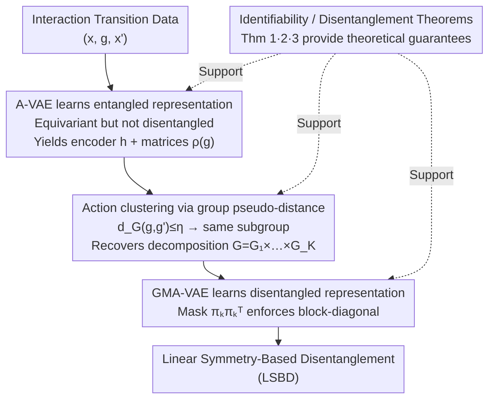

# Disentangled representation learning through unsupervised symmetry group discovery

**Conference**: ICLR2026  
**OpenReview**: [https://openreview.net/forum?id=I6xjMoLY3j](https://openreview.net/forum?id=I6xjMoLY3j)  
**Code**: TBD  
**Area**: Self-supervised / Representation Learning  
**Keywords**: Disentangled Representation, Symmetry Groups, LSBD, Group Decomposition Discovery, Embodied Agents

## TL;DR
This paper enables an embodied agent to automatically discover the underlying symmetry group decomposition of its action space through unsupervised interaction with the environment. It then learns "Linear Symmetry-Based Disentanglement" (LSBD) based on this discovered structure, overcoming the limitation of prior methods requiring manual pre-specification of group structures. The method outperforms existing LSBD approaches across three different group-structured environments.

## Background & Motivation

**Background**: Disentangled representation learning aims to encode the "true latent factors of variation" (position, color, viewpoint, etc.) behind observations into different dimensions of the representation. This is valuable for interpretability, fairness, transfer, and direct manipulation in latent space. The "symmetry-based" approach proposed by Higgins et al. (2018) provides a mathematical definition for disentanglement: environment transformations form a symmetry group $G$. If $G$ can be decomposed into a direct product of subgroups $G = G_1 \times \cdots \times G_K$, and each subgroup only drives changes in a corresponding block of the representation, it is called LSBD (Linear Symmetry-Based Disentanglement). Caselles-Dupré et al. further proved that LSBD cannot be learned from static observations alone and requires "transition triplets" $(x, g, x')$—meaning "applying action $g$ on observation $x$ to get $x'$"—which naturally fits the active interaction setting in reinforcement learning.

**Limitations of Prior Work**: Representative methods along this line—Forward-VAE, SOBDRL, LSBD-VAE, and HAE—all require **prior knowledge of the group structure**. Some require the explicit group decomposition $G = G_1 \times \cdots \times G_K$ and its representation $\rho$ (LSBD-VAE), others hard-constrain action matrices to $SO(2)$ rotations (SOBDRL), and some assume Lie groups requiring an unknown mapping $\varphi(g)$ (HAE). In other words, these methods treat "how many factors of variation exist" and "what group each factor belongs to" as known priors.

**Key Challenge**: A truly autonomous agent **does not know beforehand** which independent axes of variation correspond to its actions. The impossibility result by Locatello et al. (2019) suggests that pure unsupervised disentanglement must introduce additional priors or inductive biases. The question is: can this prior be "the group structure discovered by the agent from interaction data" instead of "a manually provided group structure"?

**Goal**: This is split into two sub-problems: (1) Can the true group decomposition be **proven and recovered** using only transition data $\mathcal{D} = \{(x, g, x')\}$? (2) Can an LSBD representation be learned without assuming specific properties of any subgroup?

**Key Insight**: The authors note that group theory provides algebraic clues (commutativity, inverses, power relations) to determine if "two actions belong to the same subgroup." If an equivariant (but still entangled) representation is learned first, actions can be clustered into subgroups on this representation using group-theoretic metrics, letting the group decomposition emerge.

**Core Idea**: A three-step pipeline: "Learn entangled equivariant representation $\to$ Cluster actions via group-theoretic pseudo-distance to recover group decomposition $\to$ Learn disentangled representation based on the decomposition." This transforms "group structure" from a manual prior into a discoverable object, supported by identifiability theorems.

## Method

### Overall Architecture
The input is a dataset of transition triplets $\mathcal{D} = \{(x, g, x')\}$ collected from agent-environment interaction, where $g$ is the action index (the action set $\mathcal{G} \subseteq G$ is only a subset of the full group and need not contain the identity or be invertible). The output is an LSBD representation consisting of an encoder $h: X \to Z$ and a block-diagonal action representation $\rho$. The pipeline follows three steps: first, an **entangled** representation (A-VAE) is learned, satisfying "existence of group action + equivariance + injective encoder," yielding encoder $h$ and action matrices $\rho_\psi(g)$. Second, a group-theoretic pseudo-distance $d_G$ is used on $h, \rho_\psi$ to compare actions; those with distance below a threshold $\eta$ are grouped into the same subgroup, recovering $G = G_1 \times \cdots \times G_K$. Third, this decomposition is used as a known structure with masks to force the action matrices to be block-diagonal, learning the truly disentangled LSBD representation (GMA-VAE). Each step is supported by an identifiability/disentanglement theorem ensuring that, under ideal conditions, the pipeline recovers the true decomposition and learns an LSBD representation.

### Key Designs

**1. A-VAE: Learning equivariant but entangled representations with "action-conditioned priors"**

The first step addresses the lack of group structure by obtaining a representation where actions are consistently represented in latent space. The authors propose the Action-based VAE (A-VAE). It modifies the standard VAE by conditioning the prior for $z'$ on **both** the previous observation $x$ and action $g$: $p_{\psi,\phi}(z' \mid x, g) = \mathcal{N}\big(\rho_\psi(g)\,\mu_\phi(x),\, I\big)$. Each action matrix $\rho_\psi(g)$ is freely parameterized by $d^2$ learnable scalars (total $|\mathcal{G}| \cdot d^2$ parameters) without structural constraints, where $d$ is the latent dimension. The derived ELBO (Eq. 4) contains an action term $\tfrac{1}{2}\lVert \rho_\psi(g)\mu_\phi(x) - \mu_\phi(x') \rVert^2$, which requires that "applying the action matrix in latent space leads to the encoding of the next observation." This translates **equivariance** $g \cdot_Z f(w) = f(g \cdot_W w)$ into a loss. Following $\beta$-VAE, a coefficient $\lambda_{\text{ACT}}$ balances the action and reconstruction terms: $\mathcal{L} = \mathcal{L}_{\text{REC}} + \lambda_{\text{ACT}}\mathcal{L}_{\text{ACT}}$. This step only guarantees the LSBD requirements of "existence of group action + equivariance + injective encoder" but **not disentanglement**, providing $h$ and $\rho_\psi$ for subsequent steps.

**2. Action clustering via group-theoretic pseudo-distance: Letting decomposition "cluster" itself**

The second step addresses how to determine which actions belong to the same subgroup from a set of free matrices $\rho_\psi(g)$. The insight is that actions in the same subgroup share algebraic relationships (inverses, powers), which can be converted into a computable distance. Defining a semi-norm $\lVert A \rVert_h = \mathbb{E}_x[\lVert A h(x) \rVert]$ and the pseudo-distance (Eq. 6, where $A_g := \rho_\psi(g)$):

$$d_G(g, g') = \min_{u \in \mathcal{G},\, m \in [1,M]} \min\Big\{\lVert A_g A_u^m A_{g'}\rVert_h;\ \lVert A_g A_{g'}A_u^m\rVert_h;\ \lVert A_{g'}A_u^m A_g\rVert_h;\ \lVert A_{g'}A_g A_u^m\rVert_h\Big\}$$

This checks if $g$ and $g'$ can "cancel each other out" by multiplying some action power $A_u^m$, corresponding to the "same subgroup" criterion in Assumption 3. Theorem 2 proves that under specified assumptions—full transition data, finite $W$, and converged A-VAE loss—two actions belong to the same subgroup if and only if $d_G(g, g') \le \eta$, where $\eta$ is calculated from $h, \rho_\psi$. Subgroups are thus recovered unsupervised, using the same hyperparameters across all environments.

**3. GMA-VAE: "Welding" disentanglement into matrices via differentiable masks**

The third step converts the recovered decomposition into a truly disentangled LSBD representation. Instead of manually specifying which dimensions each subgroup occupies, the model **learns the dimension allocation**. Each subgroup $k$ is assigned a binary indicator vector $\pi_k \in \{0,1\}^d$ (where $\sum_k \pi_{k,i} = 1$). An outer product mask $\pi_k \pi_k^\top$ transforms the free matrices $A_g$ into a block-diagonal structure (Eq. 7): $\tilde{A}_g = \pi_{k(g)}\pi_{k(g)}^\top \odot A_g + (1 - \pi_{k(g)}\pi_{k(g)}^\top)\odot I$. Actions in $G_k$ only modify latent dimensions belonging to the $k$-th block. To allow gradient-based training, $\pi_k$ is relaxed using $d$ softmaxes. A disentanglement loss $\mathcal{L}_{\text{DIS}} = \sum_i |H(\pi_{:,i}) - C|$ forces dimension assignment toward binarization. A key engineering detail: directly minimizing entropy $H(\pi)$ causes premature collapse; thus, the target entropy $C$ is **gradually annealed from maximum to zero** to ensure smooth convergence. This is the Group-Masked Action-based VAE (GMA-VAE). Theorem 3 guarantees that GMA-VAE produces an LSBD representation under specified assumptions.

**4. Identifiability and the Three Minimal Assumptions**

These steps are supported by three light assumptions replacing the strong "given group structure" prior: Assumption 1 (Full observability/injective $b$)—Theorem 1 clarifies this is a necessary condition for all SBD methods. Assumption 2 (Decoupled action set, i.e., each action belongs to exactly one subgroup). Assumption 3 (Actions in the same subgroup are related by powers $u^m$). The authors use Figure 4 ($2\times3$ grid vs $6\times1$ grid) to show that Assumption 2 alone cannot uniquely identify the decomposition; Assumption 3 is required for computability while covering common cases (inverses, $G_k = G_k^-$). These theorems turn group recovery from an empirical observation into a guaranteed conclusion.

### Loss & Training
A-VAE uses the ELBO (Eq. 4) with action and reconstruction terms balanced by $\lambda_{\text{ACT}}$. Distributions are implemented via neural networks with reparameterization. GMA-VAE adds the disentanglement loss $\mathcal{L}_{\text{DIS}} = \sum_i |H(\pi_{:,i}) - C|$, with $C$ annealed from max to 0. The clustering threshold $\eta$ is shared across environments.

## Key Experimental Results

### Main Results
Environments: Flatland (FLC/FLP), COIL (COIL2/COIL3), 3DShapes, MPI3D (Lie group). Metrics: Independence (Inde), $\beta$-VAE, MIG, DCI, Modularity (Mod), SAP. Baselines: Supervised (LSBD-VAE), Self-supervised (SOBDRL, LSBD-VAE*), Unsupervised ( $\beta$-VAE, Factor-VAE, etc.).

| Task | Metric | GMA-VAE (Ours) | Supervised LSBD-VAE | Self-supervised SOBDRL |
|---|---|---|---|---|
| Group Decomposition Recovery | Correct Rate | **100%** of runs | — | — |
| Disentanglement (FLC/FLP/COIL/3DShapes) | Median Score | Near perfect, **≈ Supervised** | Upper Bound Ref | Significantly weaker (esp. Permutations) |
| MIG / SAP | Median Score | Lower | Also lower | Also lower |

Note: MIG/SAP require one dimension per factor, while LSBD typically needs $\ge 2$ dimensions per factor, hence the lower scores are a characteristic of the LSBD framework rather than a failure of the method.

### Ablation Study

| Configuration | Key Result | Description |
|---|---|---|
| Action Clustering (Full data) | 100% Correct | Standard setting |
| Action Clustering (Limited data) | Stable recovery for $n_a \ge 2$ | Robustness test; fixed hyperparameters |
| Long-range Prediction (COIL2/3) | Disentangled methods < Entangled methods error | Entangled A-VAE eventually diverges to NaN |
| Generalization i.i.d. | All disentangled methods generalize well | See Table 1 |
| Generalization OOD (One object rotation) | GMA-VAE OOD error diff < 5% | Entangled A-VAE error spikes from 6.7e-5 to 0.05 |
| Lie Group MPI3D ($SO(2)\times SO(2)$) | GMA-VAE ≈ SOBDRL > HAE | Theorem 3' extends to continuous groups |
| Noisy MPI3D | GMA-VAE robust to action noise | Better than or equal to others |

### Key Findings
- **Disentanglement is key for long-range and OOD generalization**: Entangled self-supervised methods (A-VAE, SOBDRL-entangled) perform okay in short-range but diverge (A-VAE reaching NaN) in long sequences. Disentanglement makes $A_g A_{g'} \approx A_{gg'}$, making multi-step prediction as stable as single-step.
- **Permutation groups are the watershed**: SOBDRL forces actions into $SO(2)$ rotations and fails on COIL3 permutation symmetries; the proposed method handles permutations naturally without assuming subgroup properties.
- **Robustness of recovery**: Group decomposition is recovered even with only 2 available actions per state, showing the pseudo-distance criterion is stable.

## Highlights & Insights
- **Discovering Group Structure**: Unlike previous LSBD methods that require "human-in-the-loop" structural priors, this method recovers the structure from interaction, representating a significant step toward "true" unsupervised LSBD.
- **Practical Mask + Annealing**: The use of $\pi_k\pi_k^\top$ to "weld" structure into matrices and target entropy annealing to avoid random assignment is a practical trick transferable to other soft-to-hard assignment tasks.
- **Theoretical Alignment**: The three-step pipeline maps directly to three theorems. It is not an empirical method with "post-hoc" proofs, but an algorithm derived directly from identifiability guarantees.
- **Educational Counter-examples**: The visualization of isomorphic grids in Figure 4 intuitively explains why Assumption 2 alone is insufficient and why Assumption 3 is necessary for decomposition identification.

## Limitations & Future Work
- **Strong Assumptions**: Relies on full observability ($b$ injective), full transition data, and finite $W$. Performance degrades in high-dimensional, partially observable, or sparse environments (as seen in OOD/limited coverage tests).
- **Discrete Clustering**: The clustering step is inherently discrete and relies on finite processes, cannot be directly applied to continuous Lie groups. Lie group experiments (5.6) currently **assume known decomposition** for GMA-VAE.
- **Action Set Requirements**: Requires actions belonging to a single subgroup and power-transformable within subgroups. Not applicable to naturally coupled action spaces.
- **Toy/Synthetic Datasets**: Validated on controlled datasets like Flatland, COIL, and 3DShapes. Scaling to high-dimensional real-world robotic perception remains to be verified.
- **Future Directions**: Extending structure discovery to continuous groups (e.g., clustering in Lie algebras), relaxing observability assumptions, and handling action sets that do not satisfy decoupling assumptions.

## Related Work & Insights
- **vs LSBD-VAE (Tonnaer 2022)**: LSBD-VAE treats $G$ and $\rho$ as known priors; Ours **discovers** them and matches supervised performance.
- **vs SOBDRL (Quessard 2020)**: SOBDRL constrains matrices to $SO(d)$; Ours makes no subgroup assumptions and thus handles permutation symmetries where SOBDRL fails.
- **vs Forward-VAE (Caselles-Dupré 2019)**: Requires pre-specified decomposition; Ours makes Forward-VAE's requirements a discoverable output.
- **vs HAE (Keurti 2023)**: HAE is Lie-group specific; Ours outperforms HAE on MPI3D and is more robust to noise.
- **vs Causal/Object-Centric Representation**: Causal approaches rely on intervention/causal graph assumptions. While both use actions/interventions, the symmetry-based strategy and causal strategy rely on fundamentally different mathematical foundations.

## Rating
- Novelty: ⭐⭐⭐⭐⭐ First to enable unsupervised discovery of symmetry group decomposition for LSBD in embodied agents.
- Experimental Thoroughness: ⭐⭐⭐⭐ Covers various groups and generalization tests, though limited to synthetic datasets.
- Writing Quality: ⭐⭐⭐⭐ Clear alignment between theory and algorithm, though mathematically intensive.
- Value: ⭐⭐⭐⭐ Provides a grounded three-step framework and theoretical guarantees for unsupervised symmetry disentanglement.

<!-- RELATED:START -->

## Related Papers

- [\[ICLR 2026\] Boosting Open Set Recognition Performance through Modulated Representation Learning](boosting_open_set_recognition_performance_through_modulated_representation_learn.md)
- [\[ICLR 2026\] Unsupervised Representation Learning - An Invariant Risk Minimization Perspective](unsupervised_representation_learning_-_an_invariant_risk_minimization_perspectiv.md)
- [\[ICLR 2026\] A Bayesian Nonparametric Framework for Learning Disentangled Representations](a_bayesian_nonparametric_framework_for_learning_disentangled_representations.md)
- [\[ICLR 2026\] Mechanistic Independence: A Principle for Identifiable Disentangled Representations](mechanistic_independence_a_principle_for_identifiable_disentangled_representatio.md)
- [\[CVPR 2026\] Seeing Through the Shift: Causality-Inspired Robust Generalized Category Discovery](../../CVPR2026/self_supervised/seeing_through_the_shift_causality-inspired_robust_generalized_category_discover.md)

<!-- RELATED:END -->
