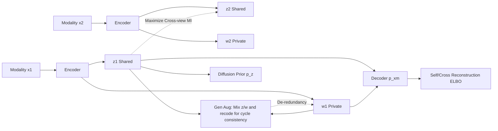

# Disentanglement of Variations with Multimodal Generative Modeling

**Conference**: ICLR 2026  
**OpenReview**: [https://openreview.net/forum?id=DcHGEcqdFf](https://openreview.net/forum?id=DcHGEcqdFf)  
**Code**: To be confirmed  
**Area**: Self-supervised / Multimodal representation learning  
**Keywords**: Multimodal VAE, Shared-private disentanglement, Mutual information regularization, Generative data augmentation, Diffusion prior  

## TL;DR
IDMVAE builds upon the multimodal VAE framework by adding two types of mutual information (MI) regularization—maximizing cross-view MI to extract shared variables and using cycle-consistent generative augmentation to remove redundancy. By replacing Gaussian priors with diffusion models, it achieves clean separation of shared and private information on challenging datasets where likelihood models are insufficient.

## Background & Motivation
**Background**: Multimodal data (image-text, audio-video, multi-omics) naturally contains shared information across modalities and modality-specific (private) information. Recent multimodal generative models (DMVAE, MMVAE+, etc.) generally use two independent latent variables, $z$ (shared) and $w_m$ (private), to model these components respectively, aiming to learn complete and non-redundant representations.

**Limitations of Prior Work**: Truly disentangling $z$ and $w_m$ is difficult. MMVAE+ relies on introducing auxiliary prior variables and blocking "shortcut" paths to prevent shared information from leaking into private encoders. However, these are essentially heuristic methods and are sensitive to the dimension ratio of $z$ and $w$. When likelihood models are weak (e.g., small datasets or target semantics occupying only a few pixels), these methods fail—shared information leaks into private encoders and vice-versa, resulting in poor cross-modal coherence, wasted model capacity, and low generation quality.

**Key Challenge**: Pure likelihood maximization does not guarantee the extraction of sufficient shared variables. Through an information-theoretic decomposition, the authors show that maximizing $I(z_m, w_n; x_n)$ (the objective of MMVAE+) does not guarantee that $I(z_m; x_n)$ is maximized, as there exists a gap $I(w_n; x_n | z_m)$. Therefore, **decoupling cannot be achieved by likelihood/reconstruction alone**.

**Goal**: To derive disentangled representations where "shared = complete" and "private = non-redundant" using rigorous MI regularization explicitly, without relying on domain-specific data augmentation or strong likelihood models.

**Key Insight**: `MI Regularization + Generative Augmentation + Diffusion Prior`—using contrastive MI to extract shared components, using self-generated samples for cycle-consistent de-redundancy, and using diffusion models to enhance the expressivity of the latent space prior. These three components complement each other.

## Method

### Overall Architecture
Given $M$ modalities $X=\{x_1, \dots, x_M\}$, IDMVAE assumes each $x_m$ is generated by a shared $z$ and a private $w_m$. The prior is independent $p(z, \{w_m\}) = p(z) \prod_m p(w_m)$, and the posterior factorizes as $q(z, w_m | x_m) = q(z | x_m) \cdot q(w_m | x_m)$. On top of the MMVAE+ ELBO foundation, two mutual information regularization terms (Cross-view MI and Generative Augmentation) are added, and the Gaussian prior is replaced with a diffusion prior. The encoders, decoders, and diffusion networks are trained jointly end-to-end. The total objective is $\min\ \mathcal{L}_{\text{IDMVAE}} = \mathcal{L}_{\text{MMVAE+}} + \lambda_1 \mathcal{L}_{\text{CrossMI}} + \lambda_2 \mathcal{L}_{\text{GenAug}}$.

### Key Designs

**1. Maximizing Cross-view MI to extract shared variables: Directly increasing $I(z_m; z_n)$ to bypass the likelihood gap.** The authors prove that $I(z_m; z_n)$ is a lower bound of $I(z_m; x_n)$ (since variations in $z_n$ only come from $x_n$, thus $I(z_m; z_n | x_n) = 0$). By directly maximizing the mutual information between shared codes of two modalities, the model forces shared variables to capture common cross-modal factors without relying on the gapped likelihood upper bound. This is implemented via InfoNCE contrastive estimation: $I(z_m; z_n) \approx \mathbb{E} \log \frac{\phi(z_m, z_n)}{\phi(z_m, z_n) + \sum_{j=1}^k \phi(z_m, \bar{z}_n^j)}$, where the affinity function $\phi(z_m, z_n) = \exp(z_m^\top z_n / (\|z_m\| \|z_n\|))$, and negative samples are drawn from unaligned pairs in the minibatch. For $M$ modalities, the average of all modality pairs is taken: $\mathcal{L}_{\text{CrossMI}} = -\frac{2}{M(M-1)} \sum_{m<n} \text{Contrast}(z_m, z_n)$. Experiments show this term is critical for extracting shared variables—when target semantics (like small digits) occupy few pixels, pure likelihood tends to ignore them.

**2. Cycle-consistent Generative Augmentation for de-redundancy: Using model-generated samples to strip shared residues from private codes.** Even if shared codes are clean and self-reconstruction encourages $(z_m, w_m)$ to jointly describe $x_m$, private $w_m$ may still hide shared information. Additional regularization is needed for de-redundancy. The difficulty lies in the fact that private variables lack natural "multi-view" references for cycle consistency. The authors address this by **synthesizing views**: taking the shared code $z_m$ from sample $x_m$ and the private code $w'_m$ from another sample $x'_m$, they generate $x^+_m \sim p(x_m | z_m, w'_m)$ through the decoder, then encode it back to the latent space to enforce consistency between $q(w_m | x^+_m)$ and $q(w_m | x'_m)$, and between $q(z | x^+_m)$ and $q(z | x_m)$. Theoretically, this is equivalent to minimizing $H(w_m | x'_m)$ to find the minimum sufficient private variable. Under Gaussian posteriors, this simplifies to $\ell_2$ mean matching, but in practice, a contrastive loss is more effective: $\mathcal{L}_{\text{GenAug}, w_m} = -\text{Contrast}(w''_m, w'_m)$, where $w''_m \sim q(w_m | x^+_m)$. Symmetrically, $\mathcal{L}_{\text{GenAug}, z_m}$ is defined, and both are combined into $\mathcal{L}_{\text{GenAug}} = \frac{1}{2M} \sum_m (\mathcal{L}_{\text{GenAug}, z_m} + \mathcal{L}_{\text{GenAug}, w_m})$. Unlike Bai et al. (2021) which requires strong domain-specific knowledge for augmentation (like frame shuffling or color jittering), **this augmentation is produced entirely by the model itself with zero domain knowledge**.

**3. Diffusion prior to enhance latent space expressivity: Replacing simple Gaussian priors with a denoising process capable of modeling cluster structures.** Representation learning benefits from a latent space that reflects data structure (e.g., distinct clusters for class information), whereas Gaussian priors are overly smooth. The authors decompose the KL divergence in $\mathcal{L}_{\text{MMVAE+}}$ as $D_{\text{KL}}(q(z|x) \| p(z)) = \mathbb{E}_q [\log q(z|x)] + \mathbb{E}_q [-\log p(z)]$. The second term is modeled by a diffusion model—treating $z \sim q(z|x)$ as "data" and gradually adding noise until it becomes pure noise, then inverting this via a denoising network. Since the latent dimension is low, the reverse process only requires a simple feed-forward network, and DDPM is used to parameterize the mean of $q(z|x)$. Unlike the two-step approach of Palumbo et al. (2024), which learns representations first and then diffusion in input space, this method employs **joint training**, allowing diffusion loss gradients to backpropagate to the encoder.

## Key Experimental Results

### Main Results

**PolyMNIST-Quadrant latent variable linear classification (Average of 5 modalities, Digit = Shared label, Quadrant = Private label):**

| Model | z→Digit ↑ | z→Quad ↓ | w→Quad ↑ | w→Digit ↓ |
|------|-----------|----------|----------|-----------|
| MMVAE | 0.492 | 0.798 | — | — |
| MoPoE-VAE | 0.536 | 0.751 | — | — |
| DMVAE | 0.157 | 0.254 | 0.710 | 0.179 |
| MMVAE+ | 0.382 | 0.355 | 0.999 | 0.341 |
| **IDMVAE (ours)** | **0.983** | 0.271 | 0.999 | 0.162 |
| + Diffusion prior | 0.982 | 0.267 | 0.999 | **0.143** |

The digit prediction from shared codes jumped from 0.382 (MMVAE+) to 0.983, and private codes contain almost no digit information (w→Digit reduced to 0.14-0.16), showing significant separation performance.

**CUB-HQ generation coherence (FID/CLIPScore, Reference: GT Image-Text CLIP=0.762):**

| Model | T2I FID↓ | T2I CLIP↑ | I2T CLIP↑ | I2I FID↓ | I2I CLIP↑ |
|------|----------|-----------|-----------|----------|-----------|
| DMVAE | 104.2 | 0.665 | 0.683 | 70.5 | 0.707 |
| MMVAE+ | 70.2 | 0.691 | 0.693 | 62.5 | 0.712 |
| IDMVAE (ours) | 64.4 | 0.718 | 0.736 | 58.1 | 0.721 |
| + Diffusion prior | **60.5** | **0.721** | **0.737** | 59.7 | 0.716 |

**TCGA multi-omics prediction accuracy (Average of 2 modalities, 5 splits):**

| Model | z ↑ | z+w ↑ |
|------|-----|-------|
| MMVAE+ | 0.692±0.010 | 0.690±0.011 |
| DisentangledSSL | 0.691±0.011 | 0.690±0.011 |
| IDMVAE + Diffusion | **0.714±0.009** | **0.731±0.019** |

### Ablation Study

**Ablations on PolyMNIST-Quadrant (Generation coherence, subset of columns):**

| Configuration | Self-gen Digit↑ | Cross-gen Digit↑ | Unconditional Digit↑ |
|------|---------------|---------------|---------------|
| IDMVAE (full) | 0.898 | 0.881 | 0.070 |
| – $\mathcal{L}_{\text{CrossMI}}$ ($\lambda_1{=}0$) | 0.101 | 0.100 | 0.000 |
| – $\mathcal{L}_{\text{GenAug}}$ ($\lambda_2{=}0$) | 0.670 | 0.671 | 0.008 |
| + Diffusion prior | 0.942 | 0.887 | **0.664** |

### Key Findings
- **CrossMI is the key to shared extraction**: Removing it leads to a crash in z→Digit to 0.11 (PolyMNIST) and zero shared generation coherence, as small digit targets are ignored by pure likelihood at the pixel level.
- **GenAug is responsible for de-redundancy**: Removing it causes cross-classification accuracy to rise (private codes stealing shared info); adding it significantly eliminates redundancy.
- **Diffusion prior contributes most to unconditional generation**: Unconditional coherence surged from 0.07 to 0.664, as it solves the prior-posterior distribution matching problem; for other metrics, it provides only marginal gains.
- The three components are complementary and indispensable; in weak likelihood scenarios like CUB-HQ, generative augmentation remains effective even if outputs are blurry (a DiT denoiser can recover details later).

## Highlights & Insights
- **Clarification of "Likelihood Insufficiency"**: Using the decomposition $I(z_m, w_n; x_n) = I(z_m; x_n) + I(w_n; x_n | z_m)$, the authors cleanly argue why pure reconstruction cannot guarantee sufficient shared variables, providing solid theoretical motivation.
- **Ingenious Generative Augmentation**: Since private variables lack natural multi-views, the authors use the decoder to "create" a view for cycle consistency, shifting data augmentation dependency from "domain knowledge" to "model generative capability," enhancing transferability.
- **Elegant Diffusion Prior Integration**: By decomposing the KL term, diffusion loss is naturally embedded into the ELBO, and joint training allows gradients to flow back to the encoder, distinguishing it from two-step methods.

## Limitations & Future Work
- While IDMVAE supports multiple modalities, Cross-view MI is based on modality pair averages; complexity in computation and negative sample design increases as the number of modalities grows.
- CUB-HQ generation depends on an external DiT denoiser for fine details. IDMVAE's own outputs on small datasets remain somewhat blurry; end-to-end high-fidelity generation remains an open challenge.
- The weights $\lambda_1, \lambda_2$ require tuning on a validation set, and discussions on whether MMVAE+'s sensitivity to $z/w$ dimension ratios is fully mitigated are limited.
- Disentanglement is capped at the "variable level" (Shared vs. Private) and does not address the harder "dimension-wise" disentanglement (shown to be theoretically difficult in unsupervised settings by Locatello et al. 2019).

## Related Work & Insights
- **Multimodal VAE Lineage**: MMVAE (MoE) → MoPoE-VAE → DMVAE → MMVAE+ (auxiliary priors to prevent shortcuts). Ours is a superset of MMVAE+ (reduces to MMVAE+ when $\lambda_1 = \lambda_2 = 0$).
- **Likelihood-free Disentanglement**: DisentangledSSL (Wang et al. 2025) follows the sufficiency logic of Federici et al. (2020) to extract shared/private components in two steps but lacks generative modeling. Ours argues that strong generative models allow likelihood modeling to provide extra benefits for controllable generation.
- **Multimodal Latent Diffusion**: Approaches like SBM-VAE train VAEs separately and then couple latent spaces with diffusion. These lose cross-modal correlations during VAE training and lack shared-private disentanglement. Joint training + disentanglement in Ours enables stronger controllable generation (mixing $z, w$ from different sources).
- **Insight**: The strategy of using model-generated samples to construct "synthetic views" instead of domain-specific augmentation is valuable for other disentanglement or representation learning tasks lacking natural multi-views (e.g., single-modality factor disentanglement).

## Rating
- **Novelty**: ⭐⭐⭐⭐ The combination of Cross-view MI + Generative Cycle-consistent Augmentation + Joint Diffusion Prior for multimodal disentanglement is novel, supported by information-theoretic motivations.
- **Experimental Thoroughness**: ⭐⭐⭐⭐ Covers three heterogeneous datasets (PolyMNIST-Quadrant, CUB-HQ, TCGA) with complete ablations and baseline comparisons; reliance on external DiT for high-fidelity images is a slight drawback.
- **Writing Quality**: ⭐⭐⭐⭐ Clear information-theoretic derivations, logically progressive motivation, and tight alignment between method and experiments.
- **Value**: ⭐⭐⭐⭐ Achieves clean disentanglement on difficult weak-likelihood datasets, providing practical value for multimodal representation learning and controllable generation.

<!-- RELATED:START -->

## Related Papers

- [\[CVPR 2026\] OpenVision 2: A Family of Generative Pretrained Visual Encoders for Multimodal Learning](../../CVPR2026/self_supervised/openvision_2_a_family_of_generative_pretrained_visual_encoders_for_multimodal_le.md)
- [\[CVPR 2026\] Residual Connections Harm Generative Representation Learning](../../CVPR2026/self_supervised/residual_connections_harm_generative_representation_learning.md)
- [\[ICML 2026\] Riemannian Metric Matching for Scalable Geometric Modeling of Distributions](../../ICML2026/self_supervised/riemannian_metric_matching_for_scalable_geometric_modeling_of_distributions.md)
- [\[CVPR 2026\] Suppressing Non-Semantic Noise in Masked Image Modeling Representations](../../CVPR2026/self_supervised/suppressing_non-semantic_noise_in_masked_image_modeling_representations.md)
- [\[CVPR 2026\] Beyond Binary Contrast: Modeling Continuous Skeleton Action Spaces with Transitional Anchors](../../CVPR2026/self_supervised/beyond_binary_contrast_modeling_continuous_skeleton_action_spaces_with_transitio.md)

<!-- RELATED:END -->
