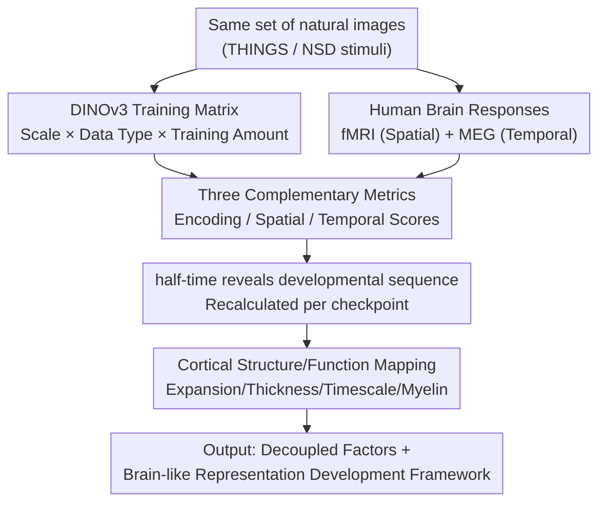

# Disentangling the Factors of Convergence between Brains and DINOv3

**Conference**: ICLR 2026  
**OpenReview**: [https://openreview.net/forum?id=i99ccgfad8](https://openreview.net/forum?id=i99ccgfad8)  
**Code**: None (Based on open-source DINOv3, THINGS-MEG, and Natural Scenes Dataset)  
**Area**: Self-supervised Representation / Neuroscience Alignment / Vision Transformer  
**Keywords**: Brain-model alignment, DINOv3, Self-supervised learning, fMRI/MEG, Representational developmental timing

## TL;DR
The authors train a series of DINOv3 self-supervised vision models with systematically controlled variables from scratch. Using three complementary metrics—"Encoding Score / Spatial Score / Temporal Score"—they align model representations with human fMRI and MEG data. This approach quantitatively disentangles how "model scale, training amount, and image type" independently and interactively drive models to become "brain-like," revealing that the emergence of this similarity follows a timeline highly consistent with human cortical development.

## Background & Motivation
**Background**: Over the past decade, numerous studies have repeatedly observed a striking phenomenon: the internal activations of deep visual networks trained on natural images can predict human brain responses (fMRI, MEG, electrophysiology) to the same images via a linear mapping. This is viewed as evidence that neural networks may share universal representation principles.

**Limitations of Prior Work**: Although "brain-model similarity" is frequently observed, the **exact causes of this similarity** remain unclear. The fundamental reason is that previous studies almost exclusively compared **off-the-shelf pre-trained networks**, which differ simultaneously in training objectives, architectures, and data scales. These three variables are entangled, making it impossible to determine which factor, and in what manner, pushes models toward "brain-like representations."

**Key Challenge**: To answer "which factor leads to alignment," one must hold other factors constant while varying only one. Off-the-shelf models do not permit such controlled comparisons, and models prior to the self-supervised era relied on labels, preventing fair data swaps for non-human-centric images (e.g., satellite or cellular images).

**Goal**: To decouple "model scale, training amount, and image type," quantifying their independent contributions and interactive effects on brain-model similarity, and to characterize **how this similarity gradually emerges** during training.

**Key Insight**: DINOv3, a **self-supervised** vision Transformer, is chosen as the unified foundation. Because it requires no labels, it can be trained from scratch on human-centric, satellite, and cellular images using identical configurations, varying only the data type. It also offers a scale gradient from Small to Giant and a full trajectory of training checkpoints, supporting the isolation of all three factors.

**Core Idea**: By using a training matrix with "identical architecture and pipeline, varying only a single factor" paired with three complementary brain similarity metrics, the phenomenon of brain-model convergence is **decoupled** into attributable factors. Treating the training process as a "developmental trajectory" reveals that it replicates the maturation sequence of the human visual cortex, from sensory areas to the prefrontal cortex.

## Method

### Overall Architecture
The work is essentially a set of **controlled "Neuroscience × Self-supervised Vision" experiments**: on one side is a matrix of systematically varied DINOv3 models; on the other are human brain responses to the same images (fMRI for high spatial resolution, MEG for high temporal resolution). Three "rulers" measure their similarity, and the evolution of this similarity during training is decomposed into the three factors and mapped to the structural and functional properties of the cortex.

The workflow is: First, construct a **DINOv3 training matrix varying a single factor** (8 variants across scale and data type, with saved checkpoints for training amount). For each model and image, activations from all layers are extracted and mapped to brain responses via ridge regression. Three complementary metrics are derived: **Encoding Score** (overall representational similarity), **Spatial Score** (correspondence of hierarchy to cortical spatial levels), and **Temporal Score** (correspondence of hierarchy to MEG temporal dynamics). These metrics are recalculated at every training checkpoint, using **half-time (the training step to reach 50% of the final value)** to characterize the "emergence speed" of each brain region/time window. Finally, this developmental sequence is correlated with four cortical maps: **expansion, thickness, intrinsic timescale, and myelination**.

### Key Designs

**1. Single-factor Controlled DINOv3 Training Matrix: Disentangling Entangled Variables**

To isolate "scale, data type, and training amount," the authors use DINOv3 as a unified foundation and train 8 variants from scratch. For the scale dimension, they fix data and pipeline while training Small (21M), Base (86M), Large (300M), Giant (1.1B), and even 7B models. For the data dimension, they fix the Large architecture and 10M image volume, varying only the type (human-centric / SAT-493M satellite / ExtendedCHAMMI cellular). The training amount is captured via multiple checkpoints. Self-supervised learning is critical here; only label-free models like DINOv3 can be fairly compared across satellite or cellular images with **identical configurations**.

**2. Three Complementary Rulers: Encoding, Spatial, and Temporal Scores**

To capture hierarchical information beyond "overall similarity," three metrics are built on ridge regression. The Encoding Score measures overall similarity: a linear mapping $W\in\mathbb{R}^{d\times m}$ predicts $m$-dimensional brain activity $Y$ from $d$-dimensional model activations $X$, targeting $\arg\min_W \|Y-XW\|_2^2 + \lambda\|W\|_2^2$ (RidgeCV, 5-fold). The Pearson correlation $R=\mathrm{corr}(WX_{\text{test}}, y_{\text{test}})$ is calculated. The Spatial Score tests **spatial hierarchical correspondence**: for each brain region, the best-predicting layer $k^*$ is identified, and its correlation with the region's Euclidean distance from V1 ($m^*$) is computed. The Temporal Score uses MEG to test **temporal hierarchical correspondence**, correlating layer index $k$ with the time $T^{\text{layer}}_{\max}$ where the layer most strongly predicts brain activity.

**3. half-time: Reading Training as a Developmental Sequence**

To track emergence, metrics are recalculated per checkpoint to estimate the **half-time** (the training step reaching 50% of the final score). A clear **chronological order** emerges: Temporal scores mature first (half-time at ~0.7% of training), followed by Encoding scores (~2%), and finally Spatial scores (~4%). Crucially, different brain regions have different half-times: low-level visual areas (V1, V2) align early, while high-level prefrontal areas (IFSp, IFSa) align much later. The correlation between a brain region's half-time and its distance to V1 is $R=0.91$.

**4. Mapping to Cortical Biological Attributes: Indexing Emerging Similarity**

The authors correlated the half-time of each brain region with four cortical maps: **cortical expansion** (surface area growth from infant to adult, $R=0.88$), **cortical thickness** ($R=0.77$), and **intrinsic timescale** ($R=0.71$) all positively correlate with half-time. **Myelin concentration** correlates negatively ($R=-0.85$). In short, the regions that models align with last are those with the greatest developmental expansion, thickest cortex, slowest dynamics, and least myelination—the same regions that mature last in the human brain.

## Key Experimental Results

### Main Results
Alignment of DINOv3 with 7T fMRI (Natural Scenes Dataset) and MEG (THINGS-MEG).

| Metric | Result | Description |
|------|------|------|
| Encoding Score (fMRI Avg) | $R=0.45\pm0.039$ (Peak voxel) | Concentrated in visual pathways: MT ($R=0.34$), VMV2 ($R=0.28$) |
| Encoding Extension | Significantly $>$ chance | Prefrontal areas (BA44/45, IFSa/IFSp) are linearly predictable |
| MEG Onset Time | Rises significantly after ~70 ms | Remains significant until 3s post-stimulus ($p<10^{-3}$) |
| Spatial Score | $R=0.38, p<10^{-6}$ | Shallow layers predict V1; deep layers predict prefrontal cortex |
| Temporal Score | $R=0.96, p<10^{-12}$ | Shallow layers match early MEG; deep layers match late responses |
| Generalization | Consistent across 7 additional models | Conclusions hold beyond DINOv3 |

### Ablation Study
Varying single factors while holding others constant.

| Factor | Key Finding | Data |
|------|----------|------|
| Model Scale | Larger scale leads to higher Encoding Score and faster convergence | $R_{\text{Giant}}=0.107 > R_{\text{Large}}=0.105 > R_{\text{Base}}=0.101 > R_{\text{Small}}=0.096$ |
| Model Scale (Regions) | Gains are primarily in high-level cortex | BA45/IFS improvement significantly greater than V1/V2 |
| Image Type | Human-centric images provide best alignment | Satellite/Cellular images significantly lower ($p<10^{-3}$) |
| Training Amount (half-time) | Metrics emerge in distinct order | Temporal 0.7% → Encoding 2% → Spatial 4% |

### Key Findings
- **Independent and Interactive Factors**: Scale, training volume, and data type all affect alignment. The largest model + human-centric data yields the highest alignment.
- **Developmental Sequence Replication**: Models align with sensory cortex first and prefrontal cortex later.
- **Surprises**: Metrics do **not** emerge simultaneously; Temporal scores rise before Encoding scores. Early in training, Spatial/Temporal scores are **negative** (random deep layers match early brain responses).
- **Efficiency**: Low-level brain representations are learned extremely easily; high-level representations require massive data.

## Highlights & Insights
- **From Correlation to Causal Decomposition**: Moves beyond observing "similarity" to quantifying the specific contributions of scale, training, and data.
- **Synergistic Metric Design**: Combining Encoding, Spatial, and Temporal metrics captures both spatial and temporal resolutions, avoiding the limitations of a single "overall" score.
- **Training as Ontogeny**: The half-time metric translates "training progress" into "cortical maturation order," making the AI training process a computational model for human visual development.
- **Transferable Paradigm**: The "single-factor matrix + half-time analysis" can be applied to other representation convergence studies (e.g., Platonic convergence between different models).

## Limitations & Future Work
- **Single Model Family**: Core conclusions are based on the hierarchical self-supervised DINOv3 architecture.
- **Brain Data Resolution**: fMRI/MEG provide group-level activities and may miss fine-grained neural mechanisms.
- **Adult Brains Only**: True developmental mapping requires longitudinal infant/child data; current work relies on indirect proxies (cortical maps).
- **Human-centric Bias**: It remains unclear if human-centric image superiority stems from low-level statistics or high-level semantics.
- **Passive Viewing**: The effect of task modulation on prefrontal alignment was not explored.

## Related Work & Insights
- **vs. Huh et al. (Platonic Representation)**: While they argue for convergence between models, this work extends convergence to **human neural representations**.
- **vs. Early Alignment (Schrimpf/Yamins)**: Extends alignment to **high-level multimodal areas** like the prefrontal cortex and introduces the **half-time** developmental sequence.
- **vs. Nature vs. Nurture**: Provides a computational framework where architecture provides potential, but ecologically valid data determines the achievement of brain-like representations.

## Rating
- Novelty: ⭐⭐⭐⭐⭐ Decouples convergence into controlled factors and links training to cortical maturation.
- Experimental Thoroughness: ⭐⭐⭐⭐⭐ 8 controlled variants + 7 generalization models, fMRI/MEG dual modalities, and multi-map validation.
- Writing Quality: ⭐⭐⭐⭐ Clear logic, though dense neuroscientific terminology may be a hurdle for ML-only readers.
- Value: ⭐⭐⭐⭐⭐ Provides an operational computational framework for studying human brain development using AI.

<!-- RELATED:START -->

## Related Papers

- [\[ICLR 2026\] On the Alignment Between Supervised and Self-Supervised Contrastive Learning](on_the_alignment_between_supervised_and_self-supervised_contrastive_learning.md)
- [\[NeurIPS 2025\] Disentangling Hyperedges through the Lens of Category Theory](../../NeurIPS2025/self_supervised/disentangling_hyperedges_through_the_lens_of_category_theory.md)
- [\[CVPR 2026\] Teaching DINOv3 About Partial 3D Geometry: A Self-Supervised Geometry-Aware Approach](../../CVPR2026/self_supervised/teaching_dinov3_about_partial_3d_geometry_a_self-supervised_geometry-aware_appro.md)
- [\[ICLR 2026\] Rethinking Unsupervised Cross-Modal Flow Estimation: Learning from Decoupled Optimization and Consistency Constraint](rethinking_unsupervised_cross-modal_flow_estimation_learning_from_decoupled_opti.md)
- [\[ICLR 2026\] SNAP-UQ: Self-supervised Next-Activation Prediction for Single-Pass Uncertainty](snap-uq_self-supervised_next-activation_prediction_for_single-pass_uncertainty_i.md)

<!-- RELATED:END -->
