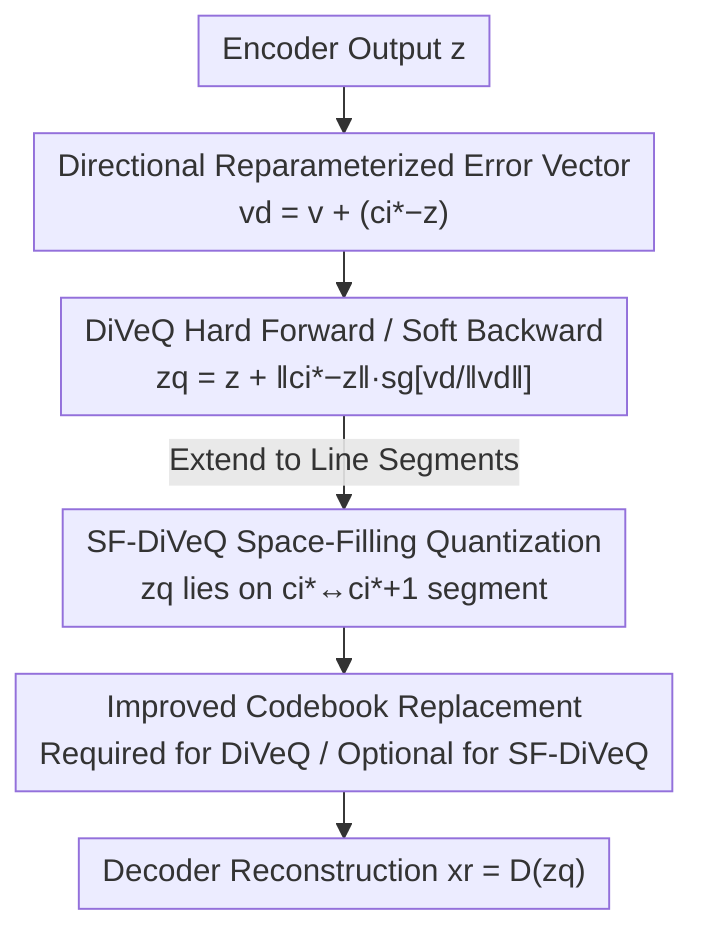

# DiVeQ: Differentiable Vector Quantization Using the Reparameterization Trick

**Conference**: ICLR 2026  
**OpenReview**: [https://openreview.net/forum?id=KRVnpTbx7R](https://openreview.net/forum?id=KRVnpTbx7R)  
**Code**: https://github.com/AaltoML/DiVeQ (also available as PyPI package `diveq`)  
**Area**: Representation Learning / Vector Quantization / Self-Supervised Learning  
**Keywords**: Vector Quantization, Reparameterization Trick, Discrete Representations, Codebook Collapse, VQ-VAE

## TL;DR
DiVeQ reformulates the non-differentiable operation of "mapping latent variables to the nearest codeword" as "adding an error vector to the latent variable, where the vector aligns with the direction of the nearest codeword and its length equals the quantization error." This maintains hard quantization in the forward pass while ensuring smooth gradient flow in the backward pass. Its space-filling variant, SF-DiVeQ, generalizes the quantization target from discrete codewords to line segments between codewords. It achieves higher reconstruction accuracy than STE / EMA / Rotation Trick / Gumbel-Softmax / NSVQ across image compression, generation, and speech coding tasks without requiring auxiliary losses or temperature annealing.

## Background & Motivation
**Background**: Vector Quantization (VQ) is a classic method for discretizing continuous latent representations into a finite codebook. Since its introduction in VQ-VAE, it has become a core module for image, video, and speech generation/compression models (e.g., VQGAN, DAC). A VQ layer maps the encoder output $z$ to the nearest codeword $c_{i^*}=\arg\min_{c_j}\|z-c_j\|_2$ in codebook $C=\{c_1,\dots,c_K\}$ to produce compact discrete tokens.

**Limitations of Prior Work**: The $\arg\min$ operation is non-differentiable; since $\partial \hat z/\partial z$ does not exist, gradients cannot pass through the VQ layer, depriving the encoder of gradients from the reconstruction loss—a phenomenon known as "gradient collapse." Existing patches have significant flaws: STE (Straight-Through Estimator) approximates $\partial \hat z/\partial z=1$, leading to biased gradients and requiring extra codebook/commitment losses with $\alpha, \beta$ tuning; EMA updates the codebook via moving averages rather than end-to-end training; the Rotation Trick performs poorly with small codebooks; Gumbel-Softmax (ST-GS) relies on temperature $\tau$ annealing, causing training-test mismatches; NSVQ simulates quantization error with noise, but the isotropic noise direction often "overshoots" the true error in high dimensions and suffers from a training-test gap.

**Key Challenge**: All methods struggle to balance a "hard forward pass" (precise nearest-neighbor assignment) with a "soft backward pass" (gradient flow). They typically sacrifice either gradient fidelity or forward precision, and are frequently plagued by codebook collapse and "codebook-latent misalignment."

**Goal**: Construct a differentiable surrogate $z_q(z,C)$ that satisfies three criteria: collapses to hard nearest-neighbor assignment as variance approaches zero; provides stable, geometrically faithful gradients for both encoder and codebook; and introduces no auxiliary losses, temperature scheduling, or training-test mismatches.

**Key Insight**: Inspired by the VAE reparameterization trick, quantization is equivalent to "adding a quantization error vector $\xi_Q$ to $z$" ($z_q=z+\xi_Q$). By constructing this error vector such that its direction aligns precisely with the nearest codeword and its length equals $\|z-c_{i^*}\|_2$, the forward output lands exactly on $c_{i^*}$, while the vector itself remains a differentiable function of $z$ and $c_{i^*}$.

**Core Idea**: Replace random noise with a "directionally reparameterized" error vector pulled toward the nearest codeword. This ensures strict hard quantization in the forward pass and smooth, geometrically consistent gradients in the backward pass. Extending this from "points" to "line segments" (SF-DiVeQ) naturally resolves codebook collapse and misalignment.

## Method

### Overall Architecture
DiVeQ maintains the backbone architecture of VQ-VAE / VQGAN / DAC, replacing only the non-differentiable VQ layer. The encoder maps input $x$ to continuous latent $z=E(x)$, the DiVeQ layer quantizes $z$ to $z_q$, and the decoder reconstructs $x_r=D(z_q)$. The mechanism ensures $z_q$ is numerically equal to the nearest codeword $c_{i^*}$ during the forward pass, but represented as a differentiable expression of $z$ and $c_{i^*}$. This allows gradients to flow back to both the encoder and codebook via end-to-end training without auxiliary losses or stop-gradient tricks beyond the formula itself.

### Key Designs

**1. Directional Reparameterization Error Vector: "Twisting" Noise to Align with the Nearest Codeword**

This addresses the "overshooting" issue in NSVQ. NSVQ uses $z_q=z+\|z-\hat z\|_2\cdot v/\|v\|_2$ with $v\sim\mathcal N(0,I)$, causing $z_q$ to land randomly on a hypersphere. In high dimensions, the probability of the noise direction overshooting the true nearest-neighbor error approaches 1. DiVeQ introduces a bias direction $\vec d=c_{i^*}-z$ via the reparameterization trick: $v_d=v+\vec d$ where $v\sim\mathcal N(0, \sigma^2 I)$. As $\sigma^2 \to 0$, $v_d$ aligns strictly with $\vec d$, ensuring precise quantization.

**2. Differentiable Quantization Formula: Hard Forward, Soft Backward**

DiVeQ defines the quantized latent as:

$$z_q = z + \|c_{i^*}-z\|_2 \cdot \mathrm{sg}\!\left[\frac{v_d}{\|v_d\|_2}\right],\qquad c_{i^*}=\arg\min_{c_j}\|z-c_j\|_2.$$

The stop-gradient $\mathrm{sg}[\cdot]$ treats the unit direction as a constant during the forward pass. With small $\sigma^2$ ($\le10^{-2}$), $z_q \approx c_{i^*}$, achieving hard quantization. The length $\|c_{i^*}-z\|_2$ and the direction vector remain differentiable, yielding the gradient:

$$\frac{\partial z_q}{\partial z}=1+a\cdot\frac{z-c_{i^*}}{\|c_{i^*}-z\|_2},\qquad \frac{\partial z_q}{\partial c_{i^*}}=a\cdot\frac{c_{i^*}-z}{\|c_{i^*}-z\|_2},\quad a=\mathrm{sg}\!\left[\frac{c_{i^*}-z}{\|c_{i^*}-z\|_2}\right].$$

Unlike STE, this gradient is derived from a geometrically consistent surrogate, eliminating bias and training-test mismatch.

**3. SF-DiVeQ Space-Filling Quantization: Point-to-Segment Relaxation**

DiVeQ still maps inputs to discrete points, which can lead to codebook collapse. SF-DiVeQ relaxes the target to a random point on the segment connecting adjacent codewords $c_{i^*}$ and $c_{i^*+1}$:

$$z_q=z+\|c_{i^*}-z\|_2\cdot\mathrm{sg}\!\left[\frac{(1-\lambda_{i^*})v_{d_{i^*}}}{\|v_{d_{i^*}}\|_2}\right]+\|c_{i^*+1}-z\|_2\cdot\mathrm{sg}\!\left[\frac{\lambda_{i^*}v_{d_{i^*+1}}}{\|v_{d_{i^*+1}}\|_2}\right],$$

where $\lambda_{i^*}\sim U(0,1)$. This ensures codewords are "pulled" into the data distribution, minimizing misalignment (t-SNE distance reduced from $0.012$ in STE to $3.9\times10^{-5}$ in SF-DiVeQ). The increased degrees of freedom eliminate the need for heuristic codebook replacement.

**4. Improved Codebook Replacement Algorithm**

For methods prone to collapse (STE, EMA, DiVeQ), the authors provide a faster, more stable replacement algorithm that periodically replaces inactive codewords with perturbed versions of active ones. SF-DiVeQ achieves full codebook utilization naturally and does not require this.

### Loss & Training
Ours introduces no VQ-specific auxiliary losses. It utilizes the original objectives of the backbone models: MSE + LPIPS for VQ-VAE; standard GAN losses for VQGAN and DAC. SF-DiVeQ uses a simple initialization where the codebook is initialized with the mean of latent variables from the first few batches.

## Key Experimental Results

### Main Results
Tasks: VQ-VAE Image Compression, VQGAN Image Generation, and DAC Audio Coding on CELEBA-HQ, FFHQ, AFHQ, and VCTK. Reconstruction quality (LPIPS↓) for VQ-VAE on AFHQ (11-bit):

| Dataset (11-bit) | Metric | STE | EMA | RT | NSVQ | DiVeQ | SF-DiVeQ |
|--------|------|------|------|------|------|------|------|
| CELEBA-HQ | LPIPS↓ | 0.373 | 0.362 | 0.388 | 0.473 | 0.355 | **0.349** |
| AFHQ | LPIPS↓ | 0.259 | 0.246 | 0.278 | 0.484 | 0.240 | **0.238** |
| FFHQ | LPIPS↓ | 0.232 | 0.224 | 0.276 | 0.389 | 0.221 | **0.216** |

VQGAN Generation FID↓ on CELEBA-HQ (High learning rate/batch size):

| Method \ bits | 8 | 9 | 10 | 12 |
|------|------|------|------|------|
| STE | 334 (Collapsed) | 7.54 | 7.34 | 9.45 |
| ST-GS | 309 (Collapsed) | 41.1 | 197 | 155 |
| NSVQ | 78.4 | 70.1 | 62.1 | 49.6 |
| DiVeQ | 8.44 | 8.01 | 7.59 | 9.54 |
| SF-DiVeQ | 8.46 | **6.66** | 7.02 | **7.40** |

DiVeQ/SF-DiVeQ prevents the misalignment-induced collapse seen in STE and ST-GS under aggressive training settings.

### Ablation Study

| Configuration | Key Observation |
|------|---------|
| $\sigma^2$ Sensitivity | Performance is marginal for $\sigma^2 \le 10^{-2}$; not a sensitive hyperparameter. |
| No Codebook Replacement | DiVeQ still outperforms others; gains are not solely from replacement. |
| SF-DiVeQ Initialization | Random init performs nearly as well as custom init. |
| Misalignment (t-SNE) | Distances: STE 0.012 vs. SF-DiVeQ **3.9e-5**. |

### Key Findings
- **Small Codebooks are Stress Tests**: Prev. SOTA like STE/ST-GS fail at 8-bit codebooks under high learning rates, whereas Ours remains stable.
- **Misalignment Causes R-D Failure**: t-SNE confirms that performance degradation in larger codebooks is often due to misalignment between $C_z$ and $P_z$, which SF-DiVeQ solves by design.
- **NSVQ Performance**: Isotropic noise leads to significant overshooting, making it the worst-performing baseline in these tasks.

## Highlights & Insights
- **Reparameterization for Quantization**: While VAEs use the trick for sampling, DiVeQ applies it to the nearest-neighbor operation, creating a differentiable discrete bottleneck.
- **Elegant Hard-Soft Balance**: By freezing the unit direction using $\mathrm{sg}[\cdot]$, the output is numerically hard but functionally soft.
- **Line-Segment Extension**: SF-DiVeQ’s shift from points to segments provides a geometric solution to quantization error, codebook utilization, and misalignment simultaneously.
- **Drop-in Compatibility**: No auxiliary losses or complex schedules make DiVeQ extremely easy to integrate into existing VQ architectures like Residual VQ.

## Limitations & Future Work
- SF-DiVeQ depends on the topological ordering of codewords; while dithering is used, optimal high-dimensional topology remains an open question.
- Experiments focus on 256×256 images and audio; scalability to ultra-large codebooks (e.g., LLM tokenizers) is yet to be explored.
- Standard DiVeQ still relies on heuristic replacement to fully avoid collapse.

## Related Work & Insights
- **vs STE / EMA**: Ours provides unbiased, geometrically consistent gradients without auxiliary losses.
- **vs Rotation Trick**: Ours is more stable for small codebooks and requires no rotation-specific tuning.
- **vs Gumbel-Softmax**: Ours avoids temperature annealing and training-test discrepancies.
- **vs NSVQ**: DiVeQ can be viewed as "directionally corrected" NSVQ, fixing high-dimensional overshooting.

## Rating
- Novelty: ⭐⭐⭐⭐⭐ 
- Experimental Thoroughness: ⭐⭐⭐⭐⭐ 
- Writing Quality: ⭐⭐⭐⭐⭐ 
- Value: ⭐⭐⭐⭐⭐ 

<!-- RELATED:START -->

## Related Papers

- [\[AAAI 2026\] Expandable and Differentiable Dual Memories with Orthogonal Regularization for Exemplar-free Continual Learning](../../AAAI2026/self_supervised/expandable_and_differentiable_dual_memories_with_orthogonal_regularization_for_e.md)
- [\[ICLR 2026\] Incomplete Multi-View Multi-Label Classification via Shared Codebook and Fused-Teacher Self-Distillation](incomplete_multi-view_multi-label_classification_via_shared_codebook_and_fused-t.md)
- [\[ICLR 2026\] One-Shot Exemplars for Class Grounding in Self-Supervised Learning](one-shot_exemplars_for_class_grounding_in_self-supervised_learning.md)
- [\[ICLR 2026\] Why Prototypes Collapse: Diagnosing and Preventing Partial Collapse in Prototypical Self-Supervised Learning](why_prototypes_collapse_diagnosing_and_preventing_partial_collapse_in_prototypic.md)
- [\[ICLR 2026\] PredNext: Explicit Cross-View Temporal Prediction for Unsupervised Learning in Spiking Neural Networks](prednext_explicit_cross-view_temporal_prediction_for_unsupervised_learning_in_sp.md)

<!-- RELATED:END -->
