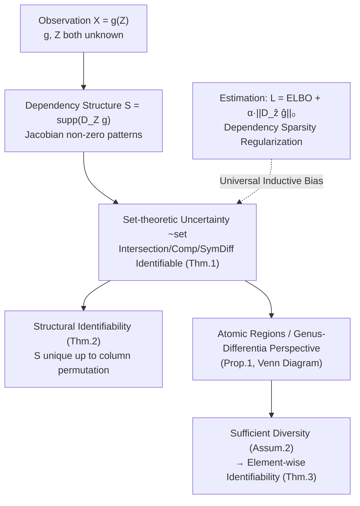

# Diverse Dictionary Learning

**Conference**: ICLR 2026  
**OpenReview**: [https://openreview.net/forum?id=lP4RsdfF6y](https://openreview.net/forum?id=lP4RsdfF6y)  
**Code**: TBD  
**Area**: Representation Learning / Identifiability Theory  
**Keywords**: Identifiability, Nonlinear ICA, Dictionary Learning, Disentangled Representations, Set Theory, Dependency Sparsity, Sparse Autoencoders  

## TL;DR
When the generative process $g$ of observations $X=g(Z)$ and the latent variables $Z$ are both unknown, and one is reluctant to introduce strong assumptions like linearity or auxiliary supervision, this paper proves that the intersection, complement, symmetric difference of latent variable "sets," as well as the latent-observation dependency structure, remain identifiable under minimal assumptions. It identifies that achieving this only requires a universal inductive bias during estimation: adding an L1 sparsity penalty to the Jacobian ("dependency sparsity").

## Background & Motivation
**Background**: The most general form of dictionary learning is $X=f(Z)$, which unifies a large class of latent variable models such as ICA, factor analysis, and causal representation learning. The core requirement is "identifiability"—the ability to uniquely recover the true generative process from observed data. However, this is ill-posed in non-parametric settings, leading most work to revert to **linear dictionary learning** (where observations are sparse linear combinations of latents, e.g., Olshausen & Field, K-SVD) or to introduce auxiliary variables for weak supervision, constrain the form of mixing functions, or rely on intervention/counterfactual data to gain guarantees.

**Limitations of Prior Work**: These strong assumptions are almost impossible to verify in reality, and most theoretical guarantees collapse entirely when assumptions are slightly violated. A pertinent example is the widely used **Sparse Autoencoder (SAE)** in mechanistic interpretability—it is essentially sparse linear dictionary learning. Consequently, it struggles to express the inherent non-linear structures in large model representations and has recently been questioned regarding issues like feature absorption, linear constraints, and high dimensionality.

**Key Challenge**: Theoretically, "trading assumptions for guarantees" yields unverifiable assumptions; practically, users do not care about perfect identifiability under ideal conditions but rather "which inductive biases truly promote recovery and remain robust when the ground truth is unknown." A gap exists between the two.

**Goal**: To make identifiability "operational"—in general settings where full identifiability is unreachable, asking two questions: (1) Which aspects of the latent process can still be recovered with guarantees? (2) What inductive bias should be introduced to guide recovery?

**Key Insight**: **[Local instead of Global]** Instead of pursuing the recovery of all latent variables, a "local + set-theoretic" perspective is adopted—proving that for the support sets of latent variables associated with any set of observations, their **intersection, complement, symmetric difference**, and the latent-observation **dependency structure** can be identified under appropriate uncertainty. These set-theoretic results can be freely combined using set algebra to construct a structured worldview of "genus + differentia"; when the structure is sufficiently diverse, it even implies element-wise identifiability of all latent variables. **[One Bias for All]** All these benefits can be obtained at the estimation end by simply using a dependency sparsity regularizer.

## Method

### Overall Architecture
This paper does not propose a new model but rather provides a "theory of identifiability + a plug-and-play regularizer." It first formalizes the latent-observation relationship as a **dependency structure** $S$ composed of Jacobian supports, then defines a **generalized uncertainty** based on set-theoretic operations to characterize "what can actually be recovered under minimal assumptions." It proves that by adding Jacobian sparsity constraints during estimation, the model is anchored to this set-theoretic identifiability. Finally, it provides a "sufficient diversity" structural condition to upgrade set-level identification to element-wise full identification.

### Key Designs

**1. Dependency Structure: Defining latent-observation relations as Jacobian support**  
To discuss "what to recover," one first needs a relationship characterization independent of parametric forms. This paper defines the non-zero pattern of the Jacobian of the generative function $g$ as the dependency structure $S := \mathrm{supp}(D_Z g; \mathcal{Z}) = \{(i,j)\mid \exists z,\ \partial g_i(z)/\partial z_j \neq 0\}$. it captures "which latent variable functionally affects which observation," representing **functional dependency rather than statistical dependency**—thus it does not require statistical independence of $Z$ components, moving beyond the common independent mixing assumptions in ICA. This Jacobian perspective is the foundation for everything that follows: the identification target, the regularization method, and the sufficiency conditions.

**2. Set-theoretic Uncertainty: Precise language for "recoverability" under minimal assumptions**  
The paper uses observational equivalence $\theta\sim_{obs}\hat\theta$ (two models giving the same $p(x)$) to define the limit of what estimation can see, then introduces **set-theoretic uncertainty** $\theta\sim_{set}\hat\theta$ to characterize "what can still be guaranteed beyond that." For any two sets of observations $X_K, X_V$ and their latent index sets $I_K, I_V$, there exists a permutation $\pi$ such that: latent variables in the intersection $I_K\cap I_V$ cannot be functions of the symmetric difference $I_K\Delta I_V$ (and vice versa), and the two exclusive parts $I_K\setminus I_V$ and $I_V\setminus I_K$ are not entangled. Intuitively, "shared factors (genus) and exclusive factors (differentia) are forced to decouple." Since intersection/complement/symmetric difference form the basis of set algebra, they can be combined to derive practically useful decoupling patterns like object-centric (independent representations for each object), individual-centric (isolation of domain-specific factors), and shared-centric (cross-domain shared factors), allowing each **atomic region** in the Venn diagram to be identified.

**3. One Sparse Regularizer for All Guarantees (Thm.1–2)**  
The main theorem states that under standard conditions of "sufficient nonlinearity" (Assum.1, existence of samples making row Jacobian vectors linearly independent and spanning the support space) and "positivity of $Z$ density everywhere," as long as the estimation satisfies $\|D_{\hat Z}\hat g\|_0 \le \|D_Z g\|_0$, then $\theta\sim_{obs}\hat\theta \Rightarrow \theta\sim_{set}\hat\theta$. Additionally, the dependency structure itself is identifiable up to column permutation (Thm.2). The key point is: this sparsity is **not an assumption about the data generation process** (the truth can be non-sparse), but an inductive bias on the estimation side, corresponding to a connectionist version of Occam's Razor—always pruning redundant relationships. It can be added as long as the model admits a Jacobian, making it compatible with almost any differentiable model.

**4. Sufficient Diversity: Upgrading from set to element-wise identification (Thm.3)**  
Since generalized identifiability can recover every atomic region of the Venn diagram, if the diagram is "rich enough"—where each latent variable exclusively occupies an atomic region—element-wise identifiability follows. This paper formalizes this intuition as **sufficient diversity** (Assum.2): for each $Z_i$, there exists a set of observations $A$ such that the union of their supports covers the full space and certain "exclusivity/deficiency/intersection" conditions hold. It incorporates the structural sparsity condition of Zheng et al. (2022) as one of three sub-conditions (thus being strictly weaker and more general) and emphasizes that **"diverse $\neq$ sparse"**: even if the structure is nearly fully connected, it holds as long as there are differences between connection patterns (even a single edge difference), whereas sparse assumptions like anchor features would exclude dense structures.

## Key Experimental Results

### Main Results Table (Visual Decoupling, FactorVAE↑ / DCI↑, adding "Dependency Sparsity" to three generative paradigms)

| Model Family | Method | Shapes3D DCI | Cars3D DCI | MPI3D DCI |
|---|---|---|---|---|
| VAE | FactorVAE | 0.484 | 0.135 | 0.345 |
| VAE | + Latent Sparsity | 0.477 | 0.113 | 0.325 |
| VAE | **+ Dependency Sparsity** | **0.575** | **0.144** | **0.384** |
| Diffusion | EncDiff | 0.901 | 0.250 | 0.676 |
| Diffusion | + Latent Sparsity | 0.891 | 0.241 | **0.684** |
| Diffusion | **+ Dependency Sparsity** | **0.947** | **0.256** | 0.667 |
| GAN | DisCo | 0.710 | 0.319 | 0.306 |
| GAN | **+ Dependency Sparsity** | **0.712** | **0.320** | **0.324** |

Dependency sparsity (L1 on the Jacobian) consistently outperforms the original methods across most datasets/backbones and also outperforms "latent sparsity" (L1 on $Z$). Notably, EncDiff + dependency sparsity reaches a FactorVAE score of 1.0000 on Shapes3D.

### Ablation Study Table (Synthetic data verifying theory)

| Experiment | Setting | Metric | Conclusion |
|---|---|---|---|
| Generalized Identifiability | Dims 3/4/5, two groups $X_K,X_V$ | $R^2$ (lower = more decoupled) | $R^2$ in Int / SymDiff / Comp directions is significantly lower than Ref; all conditions of Defn.5 satisfied |
| Element-wise Identifiability | Satisfying vs Violating Diversity | MCC | Only datasets satisfying structural conditions achieve high MCC |

### Key Findings
- **Dependency Sparsity > Latent Sparsity**: This is particularly important for mechanistic interpretability—SAE follows the latent sparsity route. The results here provide theoretical and empirical evidence for the "limitations of latent sparsity in SAEs" (feature absorption, linear constraints, high dimensionality).
- Using VAE as a backbone with the objective $\mathcal{L}=\text{ELBO}+\alpha\|D_{\hat z}\hat g\|_0$, constants $\alpha=\beta=0.05$, 10,000 samples, and MLP+LeakyReLU non-linear generation were used without per-dataset hyperparameter tuning, demonstrating the "universal, plug-and-play" nature of the regularizer.

## Highlights & Insights
- **A Different Question**: Shifts from "how to add assumptions to identify all latents" to "what remains identifiable under minimal assumptions," turning unreachable full identifiability into operational local guarantees. This is a rare "complement perspective" in the field.
- **Set Algebra as Building Blocks**: Intersection/complement/symmetric difference can combine into atomic regions, genus-differentia definitions, and object/individual/shared-centric decoupling, unifying various scattered decoupling concepts.
- **Rare Alignment of Theory and Practice**: All guarantees eventually reduce to "L1 on the Jacobian," a regularizer widely used in industry but long lacking theoretical grounding, providing identifiability foundations for a popular empirical trick.
- **Unifying Existing Conditions**: Sufficient diversity includes the structural sparsity of Zheng et al. (2022) as a special case and clearly distinguishes "diversity" from "sparsity," clarifying a common confusion.

## Limitations & Future Work
- Still requires basic regularity conditions such as "sufficient nonlinearity," "positive $Z$ density everywhere," and "$g$ as a $C^2$ diffeomorphism"; pathological cases are excluded. Noise processes are only naturally extended under additive/deconvolutional settings.
- Whether sufficient diversity is a **necessary** condition for element-wise identifiability remains a conjecture and is not fully proven.
- Experimental scale is focused on theoretical verification (synthetic + standard decoupling benchmarks like Shapes3D/Cars3D/MPI3D) and has not yet validated the benefits of dependency sparsity in truly large-scale foundation models or real SAE scenarios.
- Future directions noted by the authors: Introducing generalized identifiability into foundation models—asymptotically, guarantees are becoming increasingly realistic with massive data and compute; identifiability-inspired inductive biases may be an overlooked breakthrough.

## Related Work & Insights
- **Nonlinear ICA / Causal Representation Learning**: Compared to the mainstream route of relying on auxiliary variables, interventions, counterfactuals, or restricted mixing functions, this paper deliberately uses minimal assumptions to ask "what can still be recovered."
- **Block Identifiability (von Kügelgen et al. 2021, etc.)**: The concept of atomic region identification is conceptually similar but does not require multi-view/multi-domain weak supervision. It moves in the opposite direction of the "Identifiable Algebra" in Yao et al. (2024b)—the latter recovers groups using multi-view first then finds intersections, while this paper identifies intersections and complements directly from fundamental assumptions.
- **Structural Sparsity Identifiability (Zheng et al. 2022)**: Incorporated as the third sub-condition of sufficient diversity, making this work strictly more general.
- **Insights for Mechanistic Interpretability**: The empirical evidence that dependency sparsity exceeds latent sparsity provides a theoretically grounded direction to re-examine SAE design (shifting from "latent sparsity" to "dependency/Jacobian sparsity").

## Rating
- **Novelty**: ⭐⭐⭐⭐⭐ — The "local + set-theoretic" complement perspective is rare in identifiability; using set algebra to combine identifiable targets is original and unifies existing concepts.
- **Experimental Thoroughness**: ⭐⭐⭐⭐ — Synthetic data accurately verifies Thm.1/Thm.3, and universal gains of dependency sparsity are verified across three generative paradigms; however, the scale is small-to-medium and does not touch large-scale models or real SAE scenarios.
- **Writing Quality**: ⭐⭐⭐⭐ — Clear motivation, progressive definitions, and consistent intuition using Venn diagrams and genus-differentia make high theoretical density readable; the high volume of formulas and symbols poses a barrier for researchers outside the field.
- **Value**: ⭐⭐⭐⭐⭐ — Provides an identifiability foundation for the widely used but theoretically underspecified "Jacobian sparsity" and offers operational directions for improving SAEs/mechanistic interpretability; carries both theoretical and practical value.

<!-- RELATED:START -->

## Related Papers

- [\[CVPR 2026\] DiverseDiT: Towards Diverse Representation Learning in Diffusion Transformers](../../CVPR2026/self_supervised/diversedit_towards_diverse_representation_learning_in_diffusion_transformers.md)
- [\[ICLR 2026\] Mechanistic Independence: A Principle for Identifiable Disentangled Representations](mechanistic_independence_a_principle_for_identifiable_disentangled_representatio.md)
- [\[CVPR 2025\] UniSTD: Towards Unified Spatio-Temporal Learning Across Diverse Disciplines](../../CVPR2025/self_supervised/unistd_towards_unified_spatio-temporal_learning_across_diverse_disciplines.md)
- [\[ICLR 2026\] A Bayesian Nonparametric Framework for Learning Disentangled Representations](a_bayesian_nonparametric_framework_for_learning_disentangled_representations.md)
- [\[ICLR 2026\] Understanding the Learning Phases in Self-Supervised Learning via Critical Periods](understanding_the_learning_phases_in_self-supervised_learning_via_critical_perio.md)

<!-- RELATED:END -->
