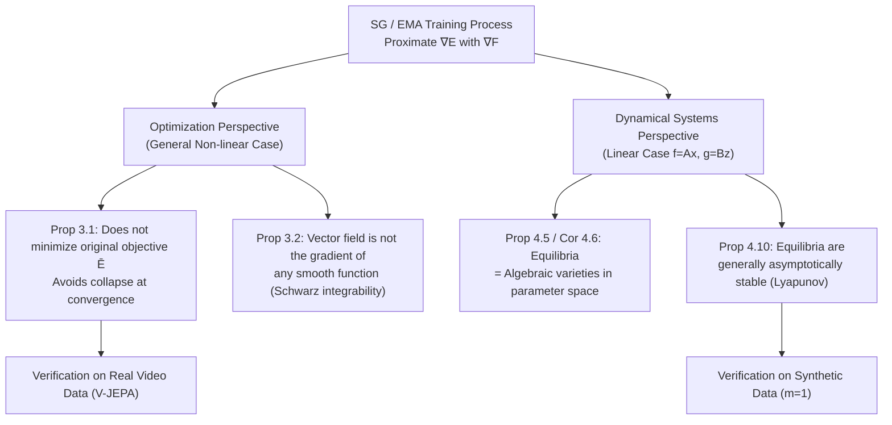

# Dual Perspectives on Non-Contrastive Self-Supervised Learning

**Conference**: ICLR 2026  
**OpenReview**: [https://openreview.net/forum?id=f5MC1G6XhB](https://openreview.net/forum?id=f5MC1G6XhB)  
**Code**: Not released  
**Area**: Self-Supervised Learning / Representation Learning Theory  
**Keywords**: Non-contrastive self-supervised learning, stop-gradient, EMA, representation collapse, dynamical systems, optimization theory  

## TL;DR
This paper rigorously proves from both optimization and dynamical systems perspectives that the stop-gradient (SG) and EMA training processes commonly used in non-contrastive self-supervised learning do not minimize any well-defined objective function. However, they do avoid collapse upon convergence, and their non-trivial equilibria are asymptotically stable in the linear case.

## Background & Motivation

**Background**: Non-contrastive self-supervised learning (BYOL, SimSiam, DINO, V-JEPA, etc.) has become the mainstream in representation learning, often outperforming contrastive methods without requiring negative sample mining. Their core is a teacher/student asymmetric structure: the student uses an "encoder + predictor" to compute a source view to predict the target view computed by the teacher (a frozen copy of the encoder SG, or a delayed copy EMA).

**Limitations of Prior Work**: SG and EMA are key techniques to prevent "representation collapse" (learning constant embeddings) and are extremely effective empirically. However, there is **no obvious connection** between them and "minimizing a specific objective function." The authors of BYOL even conjectured in their original paper that "there exists no loss $\mathcal{L}_{\theta,\xi}$ such that BYOL dynamics are joint gradient descent on it."

**Key Challenge**: Methods that work well in practice remain a "black box" theoretically—it is unknown what they optimize, whether they converge, and if the convergence points are stable. Previous work such as Tian et al. (2021) provided analysis for the linear case, but relied on additional assumptions difficult to verify in practice (e.g., identical conditional distributions of the two views, lower bounds on eigenvalues of certain PSD matrices).

**Goal**: To answer three questions: (a) Do SG/EMA solve an optimization problem? If so, which one? (b) Do they converge, and is non-collapse guaranteed upon convergence? (c) As dynamical systems, are their equilibria stable (avoiding drift back to trivial solutions)?

**Core Idea**: **Use an "optimization perspective" to answer (a)(b) and a "dynamical systems perspective" for (c)**. The optimization perspective proves that SG/EMA are not gradient flows of any smooth function yet avoid collapse; the dynamical systems perspective characterizes equilibria as algebraic varieties in the parameter space in the linear case and proves their asymptotic stability. The two perspectives complement each other to deconstruct the same puzzle.

## Method

### Overall Architecture
The paper does not propose a new algorithm but performs a rigorous theoretical "check-up" of existing SG/EMA training processes. The unified setup is a Siamese network: encoder $f_\theta$, predictor $g_\psi$, with loss $\bar{E}(\theta,\psi)=\mathbb{E}_{x,y}\,l[g_\psi\circ f_\theta(x),\,f_\theta(y)]+\Omega(\theta,\psi)$. To characterize SG/EMA, a target $\bar{F}(\theta,\psi,\xi)$ with extra teacher parameters $\xi$ is introduced, where SG takes $\xi=\theta$ (true Siamese) and EMA maintains a delayed teacher using a moving average $\xi_t=\alpha\xi_{t-1}+(1-\alpha)\theta_t$. The analysis follows two main lines: first using an integrability theorem in the general (non-linear) case to determine if they are gradient fields, then treating them as (discrete/continuous) dynamical systems in the linear case to characterize equilibria and stability.

### Key Designs

**1. Refutation from Optimization Perspective: SG/EMA do not optimize any well-defined function.** The paper first points out in Proposition 3.1 that SG and EMA generally neither minimize the original objective $\bar{E}$ nor land at the zero global minimum corresponding to collapse upon convergence. A stronger conclusion is given by Proposition 3.2: when the loss is half squared Euclidean distance and regularization is $\Omega=\lambda(\|\theta\|^2+\|\psi\|^2)/2$, the vector fields $\mathbb{E}[\nabla_\theta F]$ and $\mathbb{E}[\nabla_\psi F]$ (shown below) upon which updates depend are generally **not gradient fields of any smooth scalar function**, strictly proving the BYOL authors' conjecture.

$$\nabla_\theta F = J_\theta u^\top[u-v]+\lambda\theta,\qquad \nabla_\psi F = J_\psi u^\top[u-v]+\lambda\psi,$$

where $u=g_\psi\circ f_\theta(x)$ and $v=f_\xi(y)$. The key to the proof is the Schwarz integrability theorem: for a vector field to be the gradient of a smooth function, its second-order cross partial derivatives must be symmetric. The paper explicitly calculates these cross derivatives and proves their difference is non-zero in a "generic" sense—meaning it can be made non-zero by an infinitesimal perturbation of the data distribution, thereby excluding the possibility of a gradient field. This step translates "empirically effective but theoretically vague" concerns into a clean impossibility theorem.

**2. Characterizing Equilibria as Algebraic Varieties from a Dynamical Systems Perspective.** Switching to the linear case $f_\theta(x)=Ax,\ g_\psi(z)=Bz,\ f_\xi(y)=Cy$ ($n>m$), SG/EMA become discrete dynamical systems driven by $R(A,B,C)\triangleq BA[xx^\top]-C[yx^\top]$ (Lemma 4.1). Without relying on the additional assumptions of Tian et al., the paper re-derives structural lemmas such as $B^\top B=AA^\top$ and provides a precise characterization of SG equilibria in Proposition 4.5: let $S=A^\top A$, then

$$([xx^\top]S+\lambda I)(S[xx^\top]+\lambda I)=[xy^\top]S[yx^\top],\quad B=A[yx^\top]A^\top W^{-1},\ W=A[xx^\top]A^\top+\lambda I.$$

This constitutes a system of $m(m{+}1)/2$ quadratic equations for the symmetric positive definite matrix $S$, generally having at most $2^{m(m+1)/2}$ solutions. Corollary 4.6 decomposes the set of equilibria into $K$ sub-algebraic varieties $\mathcal{A}_k=\{A:A^\top A=S_k\}$, each of the form $\{U\sqrt{S_k}: U^\top U=I\}$—geometrically a family of explicit algebraic manifolds in parameter space rather than isolated points. Proposition 4.7 further uses the Brouwer fixed-point theorem and implicit function theorem to prove that such full-rank equilibria indeed exist under generic data.

**3. Asymptotic Stability: A "Dynamical Guarantee" against Collapse.** Characterizing equilibria is insufficient—one must also determine if they will "drift" back to trivial solutions. Proposition 4.10 provides the core guarantee: equilibria for SG and EMA are **asymptotically stable** in the generic case, meaning trajectories starting from nearby initial values will converge to and stay at that point. This holds even for $\alpha=1$. The proof invokes classic results (Arnol'd 1992 / Theorem 4.9): if the dynamics are linearized near an equilibrium as $v(x)=Jx+O(\|x\|^2)$, asymptotic stability is guaranteed if all eigenvalues of the Jacobian $J$ have negative real parts. The paper verifies this sufficient condition for linear SG/EMA. This stands in stark contrast to "gradient flow of the original objective necessarily leading to $A\to 0$ collapse" (Lemma 4.3)—it is precisely the SG/EMA "error" in deviating from the true gradient that allows them to bypass collapse and settle at stable, non-trivial equilibria.

**4. Complete Visualization under Scalar Input ($m=1$).** To turn abstract conclusions into visible images, the paper sets the scalar input $m=1$, where $A$ reduces to a vector $a$. Proposition 4.11 provides the necessary and sufficient condition for the existence of non-zero equilibria: $\Delta=\tau^2-4\rho\lambda\ge 0$ ($\rho=[xx^\top],\tau=[yx^\top]$), with equilibria falling on two hyperspheres $S_1, S_2$ centered at the origin with radii $r_{1,2}=(|\tau|\mp\sqrt{\Delta})/2\rho$. The outer sphere $S_2$ is asymptotically stable, while the inner sphere $S_1$ is a saddle point. This setting is both "typical" (the two spheres are concretizations of the algebraic varieties in the general case) and "extremely non-generic" (saddle points only appear when $m=1$ and never when $m>1$), allowing for trajectory plots while highlighting the uniqueness of the 1D case.

## Key Experimental Results

The purpose of the experiments is not to achieve SOTA performance but to **support the theory** using real/synthetic data: whether SG/EMA truly do not minimize $\bar{E}$, whether they truly fail to converge, and how downstream accuracy changes.

### Main Results (Real Video Data)

The V-JEPA code was reused with ViT-S/ViT-B encoders and a ViT-T predictor, trained on Kinetics710 ∪ SSv2 for 1000 epochs (300k iterations), using attention pooling for downstream classification.

| Phenomenon (Fig. 2) | SG | EMA |
|---|---|---|
| Is $\bar{E}(\theta_t,\psi_t)$ minimized? | No, minimum occurs early in training | No ($\bar{F}, \bar{E}$ are similar) |
| Parameter increments $\|\theta_t-\theta_{t-1}\|,\|\psi_t-\psi_{t-1}\|\to 0$ | No, does not converge | No, $\xi$ increment also does not vanish |
| Downstream top-1 accuracy trend | Increases then decreases (late stage) | Increases then reaches a plateau |
| Classification effect under same setting | Lower | Better |

### Synthetic Data Experiments ($m=1$, 10,000 random trials)

| Algorithm | Converged to Outer Sphere $S_2$ (Stable) | Converged to Origin (Trivial) | Converged to Saddle Point $S_1$ |
|---|---|---|---|
| EMA | 92.8% | 7.2% | 0% (Never observed) |
| SG | 82.0% | 18.0% | 0% (Never observed) |

Parameters were uniformly sampled as $\rho\in[0,3],\tau\in[-1,1],\lambda\in[0.01,0.1]$; both algorithms converged in all trials, but $\bar{E}/\bar{F}$ sometimes increased along the trajectory, again confirming they "do not optimize a well-defined objective."

### Key Findings
- **Consistency between Theory and Experiment**: In real V-JEPA training, $\bar{E}$ bottoms out early and parameters do not converge, yet classification accuracy continues to rise, indicating that "it indeed learns something, just not $\bar{E}$."
- **Stable but Potentially Trivial**: In synthetic experiments, the algorithm always converges, overwhelmingly landing on the stable non-trivial outer sphere and never stopping at saddle points; a few cases land at the origin (a trivial equilibrium unique to the linear case).

## Highlights & Insights
- **Turning Engineering Intuition into Theorems**: For the first time (removing Tian et al.'s assumptions), it is rigorously proven that SG/EMA are neither gradient flows of any smooth function nor prone to collapse, validating the long-standing conjecture of the BYOL authors.
- **Clean "Double Perspective" Division**: The optimization perspective "refutes" (it is not optimizing), while the dynamical systems perspective "constructs" (what the equilibria are and their stability), together forming a complete picture.
- **Introduction of Algebraic Geometry**: Characterizing equilibria with algebraic varieties and proving existence with Brouwer/implicit function theorems provides a new mathematical toolbox for SSL theory.
- **Value of Removing Assumptions**: While previous conclusions relied on hard-to-verify conditions, this paper re-proves them using equation structures (Petersen-Pedersen matrix identities), making the conclusions more robust.

## Limitations & Future Work
- **Core Problem Remains Unresolved**: Since SG/EMA do not optimize any objective, the question of "what they are actually learning" remains unanswered—the paper admits "much work remains to be done" in the conclusion.
- **Stability is Local**: Proposition 4.10 only guarantees convergence from nearby initial values, not the existence of non-trivial equilibria or global convergence; global convergence for EMA/SG is not yet proven.
- **Strong Linear Assumption**: The precise characterization in Section 4 is entirely built on linear encoders/predictors; the equilibrium structure of real deep non-linear networks remains open.
- **Experiments are Supportive, not SOTA**: Accuracy was sacrificed for simplicity (lower than reported in original V-JEPA), used only to verify theoretical phenomena rather than to compare downstream performance.

## Related Work & Insights
- **Asymmetric Anti-collapse Theory**: Directly continues the dynamical analysis of linear BYOL/SimSiam by Tian et al. (2021), Wang et al. (2021), and Littwin et al. (2024), with the main contribution being the removal of extra assumptions and completion of the algebraic-geometric characterization of equilibria.
- **Feature Decorrelation Route**: Contrasts with methods like VICReg, Barlow Twins, and SimCLR that prevent collapse through explicit decorrelation; Liu et al. (2022) pointed out that asymmetric methods implicitly perform feature decorrelation, and this paper adds the dynamical systems perspective on why asymmetry is "sufficient."
- **Inspiration**: (1) Using Schwarz integrability to determine "gradient field status" is a general-purpose tool for analyzing other heuristic training processes (e.g., various teacher-student/momentum updates); (2) The paradigm of using algebraic varieties + local linearization to analyze equilibrium stability can be transferred to other "non-standard optimization" scenarios like GANs and contrastive learning.

## Rating
- **Novelty**: ⭐⭐⭐⭐ Proves a long-standing conjecture of BYOL and reconstructs the linear case theory without assumptions using algebraic geometry/dynamical systems, showing high theoretical originality.
- **Experimental Thoroughness**: ⭐⭐⭐ Dual verification with real and synthetic data covers three core questions, but the experiments serve as "theoretical verification" rather than performance benchmarking, thus limited in scale.
- **Writing Quality**: ⭐⭐⭐⭐ Problem statements are clear, the dual-perspective structure is sharp, and propositions correspond closely with illustrations; high theoretical density requires a strong mathematical background from the reader.
- **Value**: ⭐⭐⭐⭐ Provides a solid theoretical understanding of the widely used SG/EMA, clarifying that "avoiding collapse ≠ optimizing an objective," holding long-term reference value for the SSL theory community.

<!-- RELATED:START -->

## Related Papers

- [\[ICLR 2026\] On the Alignment Between Supervised and Self-Supervised Contrastive Learning](on_the_alignment_between_supervised_and_self-supervised_contrastive_learning.md)
- [\[ICML 2025\] Collapse-Proof Non-Contrastive Self-Supervised Learning](../../ICML2025/self_supervised/collapse-proof_non-contrastive_self-supervised_learning.md)
- [\[ICLR 2026\] Understanding the Robustness of Distributed Self-Supervised Learning Frameworks Against Non-IID Data](understanding_the_robustness_of_distributed_self-supervised_learning_frameworks_.md)
- [\[ICLR 2026\] Understanding the Learning Phases in Self-Supervised Learning via Critical Periods](understanding_the_learning_phases_in_self-supervised_learning_via_critical_perio.md)
- [\[ICLR 2026\] Soft Equivariance Regularization for Invariant Self-Supervised Learning](soft_equivariance_regularization_for_invariant_self-supervised_learning.md)

<!-- RELATED:END -->
