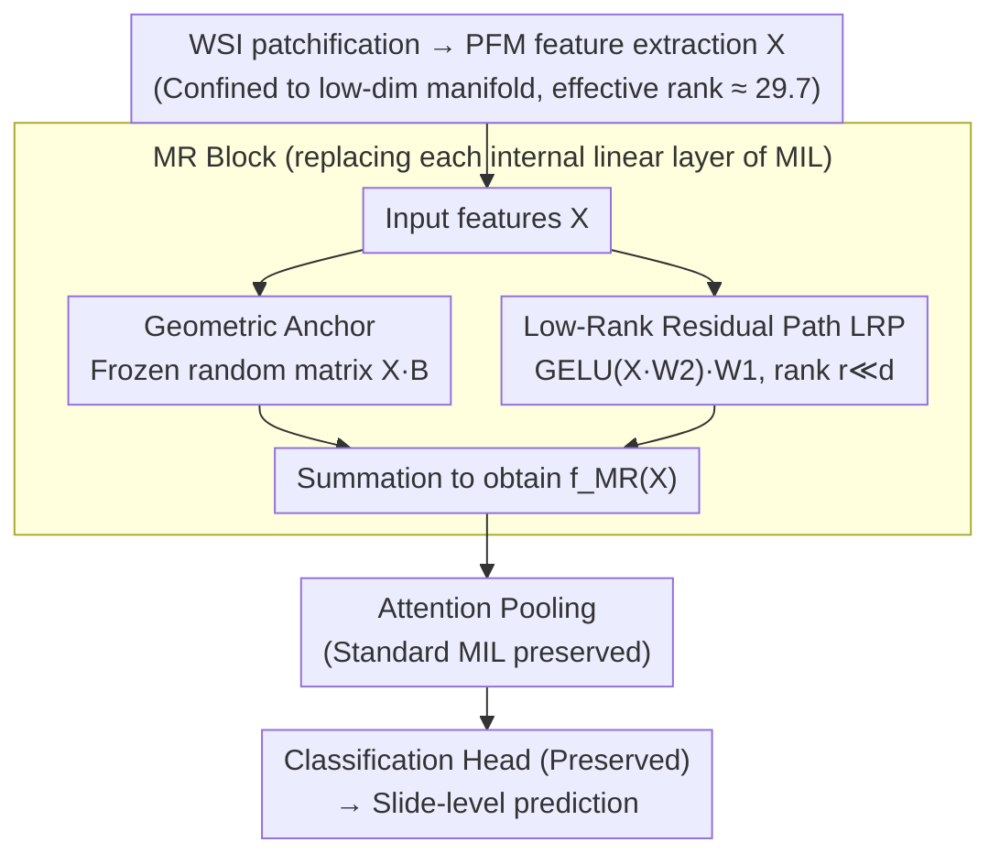

# Exploiting Low-Dimensional Manifold of Features for Few-Shot Whole Slide Image Classification

**Conference**: ICLR 2026  
**arXiv**: [2505.15504](https://arxiv.org/abs/2505.15504)  
**Code**: [GitHub](https://github.com/BearCleverProud/MR-Block)  
**Area**: Medical Imaging/Pathology  
**Keywords**: Whole Slide Images, Few-Shot Classification, Manifold Preservation, Random Projection, Low-Rank Residual

## TL;DR
This paper discovers that features from Pathology Foundation Models (PFMs) possess a low-dimensional manifold geometry (with an effective rank of only 29.7 out of 512 dimensions). Standard linear layers tend to destroy this structure, leading to few-shot overfitting. The authors propose the plug-and-play MR Block, which utilizes a frozen random matrix as a geometric anchor and a low-rank residual path for task adaptation, achieving SOTA performance in few-shot WSI classification.

## Background & Motivation

**Background**: Whole Slide Image (WSI) classification typically follows the Multiple Instance Learning (MIL) paradigm, where gigapixel WSIs are cropped into patches and patch features from PFMs (e.g., CONCH, UNI) are aggregated via attention pooling into slide-level representations.

**Limitations of Prior Work**: Few-shot WSI classification suffers from severe overfitting. This work argues that this is not merely a data-scarcity issue but a geometric one: PFM features reside on low-dimensional curved manifolds (effective rank 29.7 $\ll$ 512), while the pervasive "geometry-unaware" linear layers in MIL models distort these fragile manifold structures.

**Key Challenge**: Tangent space analysis empirically demonstrates that trained linear layers significantly distort manifold curvature (relative to original features), and this geometric distortion is positively correlated with overfitting.

**Key Insight**: Random projection theory guarantees that fixed random matrices approximately preserve Euclidean distances and local geodesic structures. These can serve as "geometric anchors," restricting the trainable low-rank residual path to perform only minimal task adaptation.

## Method

### Overall Architecture
The paper addresses overfitting in few-shot WSI classification through a geometric observation: PFM patch features do not fill the entire 512-dimensional space but are confined to a low-dimensional curved manifold. Standard linear layers, when trained on few-shot data, distort this structure. The MR Block replaces internal linear layers with a dual-path structure—a frozen random projection path to "anchor" the original geometry and a trainable low-rank residual path for minimal task adaptation. The overall transformation is defined as:

$$f_{\text{MR}}(\mathbf{X}) = \text{GELU}(\mathbf{X}\mathbf{W}_2)\mathbf{W}_1 + \mathbf{X}\mathbf{B}$$

where $\mathbf{B}$ is a frozen random matrix (geometric anchor), and $\mathbf{W}_2 \in \mathbb{R}^{d_0 \times r}$, $\mathbf{W}_1 \in \mathbb{R}^{r \times d_1}$ are trainable low-rank residuals with rank $r \ll \min(d_0, d_1)$. While internal linear layers are replaced, the MIL attention pooling and classification head remain unchanged. Additionally, the authors provide manifold analysis tools (effective rank, tangent drift) to both motivate the study and verify that the MR Block preserves the manifold.

### Key Designs

**1. Geometric Anchor: Preserving Manifold Structure via Frozen Random Matrices**
To address the distortion caused by standard linear layers, $\mathbf{B}$ in the MR Block is initialized using Kaiming uniform distribution and frozen throughout training. This is theoretically supported by the Johnson-Lindenstrauss lemma: a fixed random matrix preserves pairwise Euclidean distances and local geodesic structures with high probability. This provides a "geometry-preserving" transformation without the need for complex learned modules. Empirical t-SNE and tangent space analyses confirm that features passing through the random matrix maintain their clustering topology and manifold curvature.

**2. Low-Rank Residual Path (LRP): Task Adaptation within Intrinsic Dimensions**
To incorporate task-specific information, the LRP provides a trainable bottleneck path $\mathbf{X} \to \text{GELU}(\mathbf{X}\mathbf{W}_2) \to \mathbf{W}_1$. The rank $r$ is deliberately kept small to match the low effective rank of the features. This ensures that the model learns the residual required for classification without becoming a full-rank, manifold-distorting linear layer. Furthermore, initializing $\mathbf{W}_1 = \mathbf{0}$ ensures the LRP starts at zero, so training begins with the pure geometry-preserving random projection.

**3. Manifold Analysis Tools: Quantifying Geometric Preservation**
These tools serve as both motivation and diagnostic evidence. Spectral analysis computes the von Neumann entropy $S$ from the Gram matrix of features to derive the effective rank $R_{\text{eff}} = \exp(S)$, measuring the actual dimensionality occupied by features. Tangent space analysis uses k-NN graphs and local PCA to estimate tangent spaces and measure changes in manifold curvature (tangent drift) caused by transformations. Together, they quantitatively prove that the MR Block maintains manifold geometry while standard linear layers significantly increase curvature.

### Loss & Training
Standard cross-entropy loss is used without additional regularization—the zero initialization of the LRP provides sufficient implicit regularization. Only internal linear layers of the MIL model are replaced; the classifier head remains a standard linear layer. The number of trainable parameters is $r(d_0 + d_1) < d_0 d_1$, making it more efficient than full-rank layers.

## Key Experimental Results

### Main Results
Using CONCH features across various MIL models in few-shot settings (k=1, 2, 4), the MR Block consistently improves AUC across three datasets (see original paper for specific gains):

| Dataset | Metric | ABMIL baseline | + MR Block |
|--------|------|-----------|-------------|
| Camelyon16 | AUC | 53.6 | Gain (see paper) |
| NSCLC | AUC | 82.9 | Gain (see paper) |
| RCC | AUC | 96.0 | Gain (see paper) |

### Ablation Study

| Configuration | Performance | Description |
|------|------|------|
| Full MR Block | Optimal | Geometric Anchor + LRP |
| LRP only (No Random Matrix) | Lower | Manifold distortion still present |
| Random Matrix only (No LRP) | Moderate | Preserves geometry but lacks adaptation |
| Standard Linear Layer | Worst | Severe manifold distortion |

### Key Findings
- The MR Block achieves SOTA results with fewer parameters by matching the intrinsic dimensionality of features.
- Performance gains are consistent across various MIL architectures (ABMIL, Transformer, Graph-based), demonstrating universality.
- Tangent space analysis quantitatively illustrates how the MR Block balances geometry preservation and task adaptation.
- Diversity noise provides little benefit, suggesting zero initialization for LRP offers sufficient regularization.

## Highlights & Insights
- **Geometric Perspective on Overfitting**: Redefining few-shot overfitting as "manifold destruction" rather than just "data scarcity" is a novel and empirically supported perspective.
- **Clever Use of Random Matrices**: Instead of learning complex geometry-preserving modules, the method leverages the theoretical guarantees of random projections. Frozen random matrices as geometric anchors are simple yet principled.
- **Distinction from LoRA**: Although structurally similar to LoRA, the motivation differs fundamentally. LoRA focuses on parameter efficiency, whereas the MR Block focuses on manifold preservation. The low rank stems from the feature's intrinsic dimensionality, not parameter compression.

## Limitations & Future Work
- Geometric metrics (effective rank, tangent drift) currently serve as diagnostic tools rather than direct predictors of performance gain.
- The rank $r$ requires manual tuning; while it correlates with effective rank, it is not yet automated.
- Validation is limited to pathology images; other medical domains (e.g., radiology, satellite imagery) are unexplored.
- Lack of in-depth ablation on the choice of initialization distributions for the frozen random matrix.

## Related Work & Insights
- **vs. Standard MIL (ABMIL/TransMIL)**: These use geometry-unaware linear layers; the MR Block is a plug-and-play upgrade.
- **vs. LoRA**: Shares a low-rank structure but differs in motivation—MR Block focuses on manifold preservation rather than parameter efficiency.
- **vs. Prototypical Networks**: While ProtoNets replace the classification head, MR replaces internal layers; the two are orthogonal and can be combined.

## Rating
- Novelty: ⭐⭐⭐⭐⭐ Unique perspective diagnosing and solving few-shot overfitting via manifold geometry.
- Experimental Thoroughness: ⭐⭐⭐⭐ Multiple datasets, various MIL frameworks, and detailed geometric analysis.
- Writing Quality: ⭐⭐⭐⭐⭐ Clear motivational chain and excellent visualizations.
- Value: ⭐⭐⭐⭐ Highly practical for few-shot pathology analysis.

<!-- RELATED:START -->

## Related Papers

- [\[CVPR 2026\] From Few-way to Many-way: Rethinking Few-shot Fine-grained Image Classification](../../CVPR2026/self_supervised/from_few-way_to_many-way_rethinking_few-shot_fine-grained_image_classification.md)
- [\[ICLR 2026\] Bures-Isotropy Alignment: Manifold Learning of Generalized Category Discovery](bures-isotropy_alignment_manifold_learning_of_generalized_category_discovery.md)
- [\[ICLR 2026\] AutoDV: An End-to-End Deep Learning Model for High-Dimensional Data Visualization](autodv_an_end-to-end_deep_learning_model_for_high-dimensional_data_visualization.md)
- [\[ICLR 2026\] MaskCO: Masked Generation Drives Effective Representation Learning and Exploiting for Combinatorial Optimization](maskco_masked_generation_drives_effective_representation_learning_and_exploiting.md)
- [\[ICLR 2026\] Part-level Semantic-guided Contrastive Learning for Fine-grained Visual Classification](part-level_semantic-guided_contrastive_learning_for_fine-grained_visual_classifi.md)

<!-- RELATED:END -->
