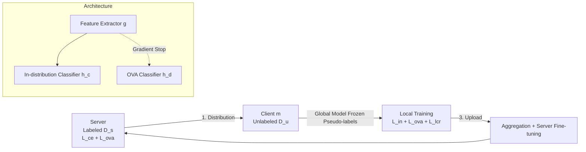

# FedOpenMatch: Towards Semi-Supervised Federated Learning in Open-Set Environments

**Conference**: ICLR 2026  
**OpenReview**: [https://openreview.net/forum?id=5UrPAW3uI1](https://openreview.net/forum?id=5UrPAW3uI1)  
**Code**: TBD  
**Area**: Semi-supervised Learning / Federated Learning / Open-set Recognition  
**Keywords**: open-set, semi-supervised federated learning, OVA classifier, logit adjustment, pseudo-labeling  

## TL;DR
This paper formally introduces the "Open-Set Semi-Supervised Federated Learning" (OSSFL) problem, where unlabeled data at clients contains unknown category samples outside the label space. It proposes FedOpenMatch, the first framework for this task, which employs a one-vs-all (OVA) outlier detector reinforced by "gradient stop + logit adjustment" combined with logit consistency regularization, improving open-set accuracy by up to 14.33% under heterogeneous federated data.

## Background & Motivation
**Background**: Semi-supervised Federated Learning (SSFL) allows a server holding a small amount of labeled data to utilize large amounts of unlabeled data from clients via pseudo-labeling. This paper focuses on the more realistic label-at-server setting (labels only at the server, clients are purely unlabeled) as it does not require labeling capabilities at the client side.

**Limitations of Prior Work**: All SSFL methods assume that unlabeled and labeled data share the same label space. However, since clients collect data independently and privately, it is almost certain that unseen category samples (outliers) will be mixed into the unlabeled sets. Standard SSFL lacks outlier detection and assigns incorrect pseudo-labels to outliers, which both contaminates training and causes misclassification of unknown classes as known during inference, potentially leading to accidents in critical scenarios like autonomous driving.

**Key Challenge**: Centralized Open-Set Semi-supervised Learning (OSSL) can already handle unknown classes in unlabeled sets, but direct application to federated scenarios results in severe degradation. There are three reasons: ① Strict physical isolation between labeled and unlabeled data prevents clients from receiving reliable supervision; ② Local training is easily misled by noisy pseudo-labels; ③ Data heterogeneity (label/feature shift) across clients further amplifies these issues.

**Goal**: Formally define the OSSFL problem (= OSSL in FL) and design a framework capable of stable outlier detection under heterogeneous federated conditions while fully utilizing in-distribution unlabeled samples.

**Core Idea**: Use an OVA outlier detector to generate high-quality in-distribution pseudo-labels, but reinforce it against failure modes specific to "Federated + Open-set"—gradient stop to resolve interference between dual-branch features, logit adjustment to counter the imbalance where in-distribution samples are discarded as outliers, and logit consistency regularization to exploit remaining unlabeled samples. It also uses the global model to freeze pseudo-labels once per round to prevent local training from self-deteriorating.

## Method

### Overall Architecture
FedOpenMatch is a multi-task framework: a shared feature extractor $g$ is followed by two heads—a $K$-dimensional in-distribution classifier $h_c$ and an OVA classifier $h_d$ consisting of $K$ binary classifiers (each determining "whether it belongs to class $k$", outputting $2K$-dimensional logits; $q^k_0/q^k_1$ provide scores for outlier/in-distribution for class $k$). Each communication round alternates through four steps: server training on labeled data → model distribution to randomly selected clients → local client training on unlabeled data → upload and aggregation for a new global model. A key stability technique is generating and freezing pseudo-labels for local unlabeled samples using the **global model** at the start of each round to avoid pseudo-label drift caused by limited local supervision.

### Key Designs

**1. Gradient Stop: Allowing OVA to leverage without destroying the in-distribution feature space**. The OVA classifier and in-distribution classifier share a feature extractor but have opposing optimization goals—the in-distribution classifier pulls the same class closer and pushes different classes away, while the OVA must separate each target class from all others. These goals inevitably interfere in the shared feature space (empirical tests show low gradient similarity between the two branches). Previous OSSL methods used projection layers to map features to task-specific spaces, but disagreement in update directions remains. This paper directly **cuts the gradient flow from the OVA branch back to the feature extractor**. The intuition is that the in-distribution classifier already shapes a feature space that is compact within classes and separable between classes; OVA can perform outlier detection on this existing high-quality space without modifying the features. Ablations show open-set accuracy improves by up to 10.68% and training becomes more stable.

**2. Logit Adjustment: Rescuing true in-distribution samples overwhelmed by outliers**. OVA training is naturally imbalanced—for class $k$, all other $K-1$ classes serve as outlier negative samples. As $K$ increases, the imbalance worsens, pushing binary classifiers to "always predict outliers," causing many true in-distribution samples to be wrongly rejected and resulting in low utilization of unlabeled data. This paper adopts the logic from Menon et al. to perform prior correction on OVA logits: $q^k = q^k + \omega \log \pi$, where $\pi = \{\frac{K-1}{K}, \frac{1}{K}\}$ represents class priors for outliers/in-distribution samples, and $\omega$ is a tunable scaling factor. This amplifies the contribution of in-distribution predictions and offsets the dominance of outlier updates, allowing more in-distribution samples to be identified and utilized in training.

**3. Weak-strong Logit Consistency Regularization (LCR): Aligning decision boundaries at the logit level rather than the probability level**. Even with logit adjustment, many low-confidence in-distribution and outlier samples remain unutilized. Previous work OpenMatch proposed Soft Open-set Consistency Regularization (SOCR), which performs MSE alignment on **softmax probabilities** of weak/strong augmented views. This work finds that removing softmax and **performing consistency directly on raw logits** is significantly more effective: $L^{lcr}_m = \lambda \frac{1}{N_m}\sum_i \big[\mathrm{mse}(q_i, \hat q_i) + \mathrm{mse}(p_i, \hat p_i)\big]$. The authors speculate that logit-level regularization provides a stronger and more direct training signal—it constrains raw scores and thus decision boundaries, whereas probability-level consistency only aligns distributions without ensuring boundary consistency. Ablations show LCR alone brings about a 5% improvement in open-set accuracy.

Regarding the total loss, the server minimizes $L_s = \frac{1}{N_s}\sum_i \ell_{ce}(p_i,y_i)+\ell_{ova}(q_i,y_i)$ (using hard negative sub-classifier sampling for OVA); the client minimizes $L_m = L^{in}_m + L^{ova}_m + L^{lcr}_m$, where $L^{in}_m$ calculates cross-entropy only for samples where "in-distribution confidence $\geq\tau_{in}$ and OVA classifies as in-distribution," and $L^{ova}_m$ calculates binary cross-entropy for OVA pseudo-labels satisfying positive/negative thresholds.

## Key Experimental Results

### Main Results (CIFAR-100, Balanced Accuracy, selected)

| Method | 80/20@10 | 80/20@25 | 50/50@10 | 50/50@25 |
|------|----------|----------|----------|----------|
| OpenMatch (NeurIPS'21→Fed) | 2.11 | 1.74 | 1.97 | 1.99 |
| SSB (ICCV'23→Fed) | 4.06 | 6.40 | 16.95 | 28.62 |
| IOMatch (ICCV'23→Fed) | 28.66 | 37.72 | 42.86 | 49.45 |
| BDMatch (ICML'24→Fed) | 23.19 | 29.38 | 39.15 | 31.14 |
| **FedOpenMatch** | **38.97** | **50.40** | **46.29** | **59.01** |

(Under Dir(0.3) setting) FedOpenMatch leads across the board; on CIFAR100@80@25@Dir(0.1), closed-set/open-set accuracy improved by up to 7.11% / 14.33%. It also leads on CIFAR-10 and SVHN, with a significant advantage under high heterogeneity Dir(0.1).

### Ablation Study (CIFAR100@80@25@Dir(0.1))

| Configuration | Base | +GS | +GS+LA | +GS+LA+LCR |
|------|------|-----|--------|------------|
| Open-set Accuracy | 34.81 | 39.51 | 43.65 | **48.36** |
| Closed-set Accuracy | 45.86 | 46.14 | 45.81 | **50.38** |

The three components added sequentially each bring stable gains, with LCR contributing the most (+4.71 open-set).

### Key Findings
- Directly porting OSSL algorithms into a federated setting is highly unstable: OpenMatch/SSB often fall below the "labeled-only" lower bound. OpenMatch persistently suffers from low utilization as it classifies most samples as outliers due to OVA imbalance; while SSB has high utilization, its pseudo-label accuracy is low.
- FedOpenMatch utilizes "global model frozen pseudo-labels + the three components" to steadily increase data utilization while maintaining high pseudo-label accuracy.
- It remains the best-performing method in scenarios with both feature and label shift (CIFAR100-C) and extreme cases where outliers are highly prevalent (20 known / 80 unknown), demonstrating strong robustness.

## Highlights & Insights
- **The problem definition itself is a contribution**: Formally introduces OSSFL for the first time and clarifies its boundaries with SSFL, OSSL, and FOSR using Tab. 1 across four dimensions—Distributed / Label Scarcity / Open-set Training / Open-set Testing. It also establishes evaluation baselines by adapting multiple OSSL methods for FL.
- **Diagnosis-driven design**: Each component corresponds to a visualized and verified failure mode (low gradient similarity → GS, low utilization → LA, unused remaining samples → LCR), rather than just stacking tricks.
- **Simple and transferable**: Changes like logit-level consistency and logit adjustment incur almost zero additional cost and offer insights for other open-set or imbalanced scenarios.

## Limitations & Future Work
- Experiments are concentrated on standard image benchmarks like CIFAR-10/100 and SVHN, lacking validation on real federated data such as medical or autonomous driving data, which are precisely the high-risk scenarios emphasized in the motivation.
- Logit adjustment relies on the assumption of a "balanced labeled set" to set the prior $\pi$; this assumption might fail in real-world long-tailed federated scenarios.
- Freezing pseudo-labels per round using the global model improves stability but might cause local training to miss rapid convergence information within the round; the trade-off between fixed vs. dynamic updates was not explored in depth.
- No analysis of communication/computation overhead or privacy security (e.g., whether the OVA head leaks distribution information).

## Related Work & Insights
- **Semi-supervised Learning**: The FixMatch series (FlexMatch/FreeMatch/SoftMatch) established the consistency regularization + pseudo-labeling paradigm, though they assume a shared label space.
- **Open-set SSL**: Developed from detect-and-filter to OVA detectors (OpenMatch/SSB/BDMatch); IOMatch reformulated open-set as $(K+1)$ classification. This work follows the OVA path but reinforces it for federated learning.
- **Semi-supervised Federated Learning**: Categorized into label-at-client and label-at-server. This work falls into the latter; the idea of using a global model for pseudo-labels from SemiFL was inherited and strengthened into "frozen pseudo-labels."
- **Insights**: Moving from "centralized methods to distributed" is never a simple direct translation; one must first diagnose failure modes unique to distributed settings (isolated supervision, pseudo-label self-deterioration, heterogeneous imbalance) before applying specific remedies. The observation that "regularization at the logit level instead of the probability level" is a small but effective observation worth reusing in more consistency-based methods.

## Rating
- **Novelty**: ⭐⭐⭐⭐ First to formally propose and systematically solve OSSFL, providing the definition, framework, and baselines together. Although the OVA approach is inherited from OSSL, the federated reinforcement is a genuine new contribution.
- **Experimental Thoroughness**: ⭐⭐⭐⭐ Three datasets × multiple heterogeneities × different labeling budgets × complex corruptions / extreme unknown ratios, with complete ablations; points deducted for lacking real-world federated domain data.
- **Writing Quality**: ⭐⭐⭐⭐ Clear logic from motivation to diagnosis to design, with each component supported by visual evidence and standardized equations/symbols.
- **Value**: ⭐⭐⭐⭐ Fills the gap for SSFL in open-set scenarios, with direct significance for federated applications with unknown classes like autonomous driving and healthcare; components are highly transferable.

<!-- RELATED:START -->

## Related Papers

- [\[CVPR 2026\] PAF: Perturbation-Aware Filtering for Open-Set Semi-Supervised Learning](../../CVPR2026/self_supervised/paf_perturbation-aware_filtering_for_open-set_semi-supervised_learning.md)
- [\[ICLR 2026\] CoLA: Co-Calibrated Logit Adjustment for Long-Tailed Semi-Supervised Learning](cola_co-calibrated_logit_adjustment_for_long-tailed_semi-supervised_learning.md)
- [\[AAAI 2026\] Let the Void Be Void: Robust Open-Set Semi-Supervised Learning via Selective Non-Alignment](../../AAAI2026/self_supervised/let_the_void_be_void_robust_open-set_semi-supervised_learning_via_selective_non-.md)
- [\[CVPR 2026\] SECOS: Semantic Capture for Rigorous Classification in Open-World Semi-Supervised Learning](../../CVPR2026/self_supervised/secos_semantic_capture_for_rigorous_classification_in_open-world_semi-supervised.md)
- [\[ICLR 2026\] Boosting Open Set Recognition Performance through Modulated Representation Learning](boosting_open_set_recognition_performance_through_modulated_representation_learn.md)

<!-- RELATED:END -->
