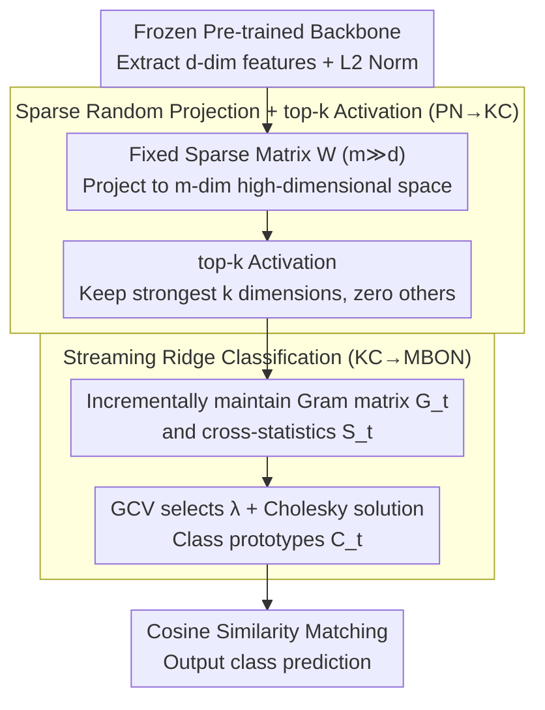

# Fly-CL: A Fly-Inspired Framework for Enhancing Efficient Decorrelation and Reduced Training Time in Pre-trained Model-based Continual Representation Learning

**Conference**: ICLR 2026  
**arXiv**: [2510.16877](https://arxiv.org/abs/2510.16877)  
**Code**: [GitHub](https://github.com/gfyddha/Fly-CL)  
**Area**: Self-Supervised Learning / Continual Learning / Bio-inspired  
**Keywords**: continual learning, fly olfactory circuit, decorrelation, representation learning, prototype

## TL;DR
Inspired by the fruit fly olfactory circuit, this work proposes the Fly-CL framework. It achieves SOTA performance in pre-trained model-based continual learning while significantly reducing training time through a three-stage progressive decorrelation process involving sparse random projection, top-k operation, and streaming ridge classification.

## Background & Motivation

**Background**: Continual Learning (CL) methods using frozen pre-trained models reframe parameter updates as similarity matching problems, performing classification via the cosine similarity of class prototypes. Main approaches include prompt/adapter, hybrid models, and representation-based methods.

**Limitations of Prior Work**: Representation-based methods directly compute class prototypes using frozen pre-trained features, but severe **multicollinearity** (high correlation between class prototypes) exists, leading to a decline in the discriminative power of cosine similarity. Existing solutions (e.g., matrix inversion in RanPAC) incur high computational costs ($\mathcal{O}(lm^3)$) and are unsuitable for low-latency scenarios.

**Key Challenge**: Decorrelation is crucial for classification accuracy, but efficient decorrelation methods are currently lacking.

**Goal**: Design a computationally efficient and effective decorrelation framework.

**Key Insight**: Inspiration is drawn from the fruit fly olfactory circuit—the sparse expansion projection from PN→KC and the dimensionality reduction projection from KC→MBON constitute an efficient decorrelation mechanism.

**Core Idea**: Simulate the three stages of the fruit fly olfactory system—sparse random expansion projection, top-k sparse activation, and streaming ridge regression classification—to achieve progressive decorrelation.

## Method

### Overall Architecture
Fly-CL addresses the issue where class prototypes exhibit severe multicollinearity when using frozen pre-trained models for CL, which degrades cosine similarity performance, while existing decorrelation methods (like matrix inversion) are inefficient. The approach adopts the three-level structure of the fruit fly olfactory circuit to perform "high-dimensional decorrelation + efficient classification." The pipeline is: a frozen backbone extracts $d$-dimensional features with L2 normalization (corresponding to ORN/PN preprocessing); a fixed sparse random matrix projects these to an $m$-dimensional space ($m \gg d$); top-$k$ activation retains only the strongest dimensions for sparse encoding (PN→KC); finally, a streaming ridge classifier learns class weights online and outputs predictions via cosine similarity matching (KC→MBON). The process involves no backpropagation; only minimal statistics are updated incrementally as new tasks arrive.

### Key Designs

**1. Sparse Random Projection + top-k Activation (PN→KC): Disentangling Entangled Low-Dimensional Features**

Frozen features are difficult to separate because prototypes of different classes are highly correlated in $d$-dimensional space. A fixed sparse matrix $\mathbf{W} \in \mathbb{R}^{m \times d}$ projects features to a high-dimensional space—each row contains only $p$ non-zero values sampled from $\mathcal{N}(0,1)$, making the projection computationally efficient. Complexity is reduced from $\mathcal{O}(mnd)$ for dense projection to $\mathcal{O}(mnp)$. Following expansion, top-$k$ activation retains only the $k$ components with the largest responses, simulating winner-take-all sparse activation in the mushroom body to further suppress correlation between dimensions. Two theoretical results support this: Theorem 4.1 proves this sparse random matrix maintains full column rank with probability $1-o(1)$ (invertible, no collapse), while Theorem 4.2 shows that performance degradation from top-$k$ is bounded—when $k=\Omega(m^\alpha)$, the error decays at a polynomial rate, indicating that sparsification achieves decorrelation while preserving discriminative information.

**2. Streaming Ridge Classification (KC→MBON): Online Learning of an Anti-Collinear Classifier in High-Dimensional Sparse Space**

Residual collinearity may still exist in sparse encodings, so the final classification uses a ridge regression classifier with $\ell_2$ regularization to suppress it. It maintains two statistics in a streaming fashion: the Gram matrix $\mathbf{G}_t$ and cross-statistics $\mathbf{S}_t$. The classifier weights are:

$$\mathbf{C}_t = (\mathbf{G}_t + \lambda\mathbf{I}_m)^{-1}\mathbf{S}_t.$$

The regularization strength $\lambda$ is automatically selected using Generalized Cross-Validation (GCV) to adapt to task heterogeneity. The solution is accelerated via Cholesky decomposition. Compared to RanPAC's repeated inversion on all data ($\mathcal{O}(lm^3)$), this reduces single-step complexity to $\mathcal{O}(n_t^2 m)$, leading to a significant reduction in training time.

**3. Biological Correspondence: Stage-by-Stage Equivalence**

The design is a direct mapping of the fruit fly olfactory pathway, not a loose analogy. In the PN→KC stage, the neurons' sparse expansion projection and winner-take-all inhibition correspond to sparse random projection + top-$k$. In the KC→MBON stage, Hebbian learning is equivalent to ridge classification—the paper provides a proof of this equivalence in Section 6. This correspondence explains why the three-stage pipeline provides principled, progressive decorrelation.

### Loss & Training
No backpropagation is required throughout the process. A streaming incremental update strategy is adopted: for each new task, samples are accumulated into the Gram matrix $\mathbf{G}_t$ and cross-statistics $\mathbf{S}_t$, followed by re-solving the ridge classifier. No historical samples are stored, fitting the low-latency, replay-free continual learning setting.

## Key Experimental Results

### Main Results: Class Incremental Learning

| Method | CIFAR-100 (10 steps) | ImageNet-R (10 steps) | Training Time ↓ |
|------|------|------|------|
| SimpleCIL | 70.8 | 71.4 | Baseline |
| RanPAC | 76.4 | 78.6 | Slow |
| Fly-CL | **76.5** | **78.8** | **Several times faster** |

### Ablation Study

| Configuration | Effect | Description |
|------|------|------|
| No Random Projection | Decrease | Multicollinearity unresolved |
| No top-k | Decrease | Interference from noisy dimensions |
| Dense Projection instead of Sparse | Comparable but slower | Sparsity does not lose information |
| Fixed λ instead of Adaptive GCV | Decrease | Task heterogeneity requires adaptation |

### Key Findings
- Pearson correlation coefficient heatmaps clearly demonstrate the three-stage decorrelation effect.
- Training time is significantly reduced while maintaining or exceeding the performance of the strongest baselines.
- The framework is effective across various pre-trained backbones, demonstrating high versatility.

## Highlights & Insights
- Highly creative bio-inspiration: The three-stage decorrelation of the fruit fly olfactory circuit perfectly targets the multicollinearity problem in CL.
- Solid theoretical analysis: Two theorems prove information preservation of sparse projections and bounded top-k degradation.
- High practicality: Significant efficiency gains make it suitable for edge computing and real-time scenarios.

## Limitations & Future Work
- The value of $k$ in top-k requires hyperparameter tuning.
- The projection matrix is currently fixed and random; adaptive learning may provide further improvements.
- Only image classification has been validated; other modalities remain to be explored.

## Related Work & Insights
- **vs RanPAC**: Also uses random projection but at a high computational cost; Fly-CL significantly reduces complexity via sparsity and GCV.
- **vs Prompt/Adapter methods**: Does not rely on specific architectures, offering better generality.
- **vs Fly LSH (Dasgupta et al., 2017)**: Classic bio-inspired work for hashing; this work extends the concept to continual learning.

## Rating
- Novelty: ⭐⭐⭐⭐ Organic combination of bio-inspiration, theoretical analysis, and practical framework.
- Experimental Thoroughness: ⭐⭐⭐⭐ Multiple datasets, backbones, and comprehensive ablations.
- Writing Quality: ⭐⭐⭐⭐ Clear biological analogies and complete theoretical derivations.
- Value: ⭐⭐⭐⭐ Provides an efficient and principled solution for CL.

<!-- RELATED:START -->

## Related Papers

- [\[ICLR 2026\] Test-Time Efficient Pretrained Model Portfolios for Time Series Forecasting](test-time_efficient_pretrained_model_portfolios_for_time_series_forecasting.md)
- [\[CVPR 2026\] Parameter-efficient Continual Learning for Enhancing Plasticity without Forgetting under Limited Model Capacity](../../CVPR2026/self_supervised/parameter-efficient_continual_learning_for_enhancing_plasticity_without_forgetti.md)
- [\[ICLR 2026\] Detect, Decide, Unlearn: A Transfer-Aware Framework for Continual Learning](detect_decide_unlearn_a_transfer-aware_framework_for_continual_learning.md)
- [\[ICLR 2026\] Adaptive Gaussian Expansion for On-the-fly Category Discovery](adaptive_gaussian_expansion_for_on-the-fly_category_discovery.md)
- [\[CVPR 2026\] Representation-Steered Incremental Adapter-Tuning for Class-Incremental Learning with Pre-Trained Models](../../CVPR2026/self_supervised/representation-steered_incremental_adapter-tuning_for_class-incremental_learning.md)

<!-- RELATED:END -->
