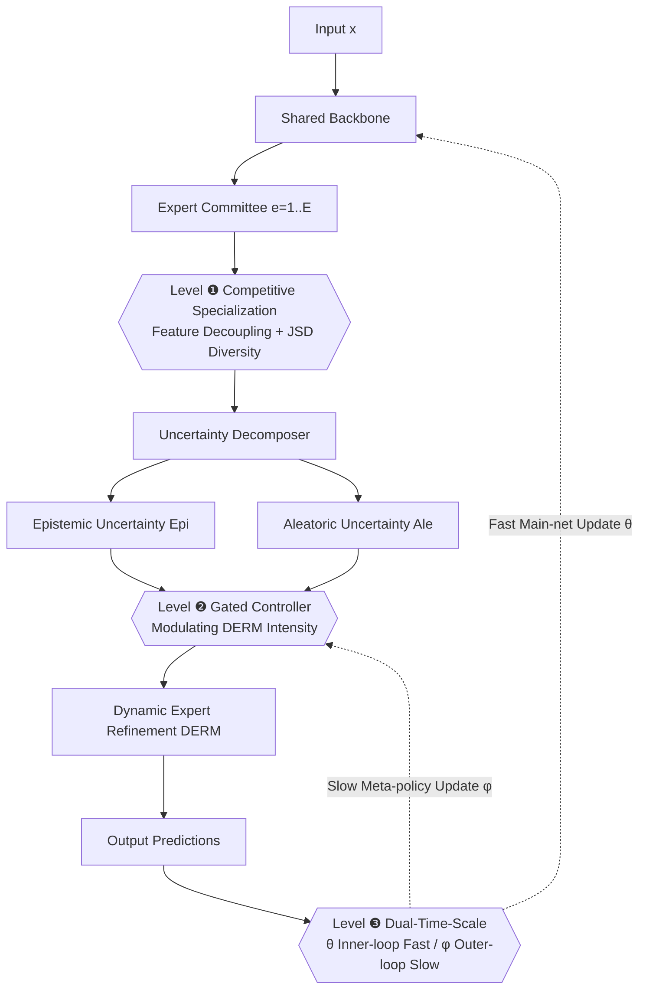

# GUIDE: Gated Uncertainty-Informed Disentangled Experts for Long-tailed Recognition

**Conference**: ICLR 2026  
**OpenReview**: [https://openreview.net/forum?id=jY21fwcrjr](https://openreview.net/forum?id=jY21fwcrjr)  
**Code**: To be confirmed  
**Area**: Long-tailed Recognition / Multi-expert Representation Learning  
**Keywords**: Long-tailed recognition, Multi-expert models, Uncertainty decomposition, Meta-learning, Representation disentanglement

## TL;DR
GUIDE systematically dismantles the three-level "representation-decision-optimization" entanglement prevalent in multi-expert long-tailed recognition. It employs competitive specialization to force experts to learn distinct features, utilizes epistemic/aleatoric uncertainty decomposition to diagnose difficult samples for targeted refinement, and implements dual-time-scale updates to isolate the optimization of the main task from the meta-strategy, setting new SOTA results across five long-tailed benchmarks.

## Background & Motivation
**Background**: Multi-expert architectures (RIDE, SADE, BalPoE, etc.) are currently the mainstream paradigm for Long-Tailed Recognition (LTR). By letting a "committee of experts" cover different class intervals from head to tail, these models prove more robust than single-model approaches. However, the authors observe that this research trajectory is approaching a performance ceiling, with incremental gains becoming increasingly difficult.

**Limitations of Prior Work**: The authors attribute this bottleneck to an **entangled dependency chain** across three levels:
- **Representation-Decision Entanglement**: Existing methods only create diversity indirectly at the decision layer (e.g., via different logit adjustments) without decoupling representation learning from the dominance of head-class gradients. Strong head-class gradients pull all experts toward the same "head-centric" feature space, causing **homogeneity collapse** and rendering specialization meaningless.
- **Cause-Symptom Entanglement**: Once expert functions converge, they fail to provide diverse diagnoses for difficult samples. Current adaptive methods rely on "high training loss," a vague signal, to increase learning efforts. This treats the "symptom" as the "cause"—it fails to distinguish whether a difficult sample arises from **model ignorance (epistemic uncertainty)** or **intrinsic data ambiguity (aleatoric uncertainty)**, leading to persistent misallocation of learning resources.
- **Learning-Meta-learning Entanglement**: The optimization of meta-strategies (slow, requiring cautious updates) and the main recognition task (fast, high variance) inherently conflict. High-variance gradients from the main task drown out minor updates to the meta-strategy, preventing the system from converging to a stable self-organized strategy.

**Key Challenge**: These three levels of entanglement are not isolated but **interdependent**—representation collapse weakens diagnostic capacity, and diagnostic failure exacerbates optimization instability. Any single-point modification is offset by upstream entanglement.

**Goal**: Propose a unified framework capable of systematically dismantling these three layers of entanglement "in order of dependency" to release the suppressed potential of the multi-expert paradigm.

**Core Idea**: **Hierarchical Disentanglement**—First, establish a foundation of "true expert diversity" at the representation layer via competitive specialization. Next, perform precise diagnosis and intervention at the policy layer using uncertainty decomposition. Finally, protect meta-strategy convergence at the optimization layer using dual-time-scale updates. These three stages are inextricably linked.

## Method

### Overall Architecture
GUIDE (Gated Uncertainty-Informed Disentangled Experts) decomposes the learning process into three dependent layers and applies interventions sequentially: Level ❶ forces feature-decision separation and eliminates homogeneity collapse; Level ❷ performs epistemic/aleatoric uncertainty decomposition based on the "high-fidelity expert disagreement" provided by ❶, driving a gated controller to modulate the Dynamic Expert Refinement Module (DERM); Level ❸ splits parameters into "fast variables $\theta$ (main network)" and "slow variables $\phi$ (meta-strategy)," isolating the two optimization loops with differential learning rates. Each level serves as a prerequisite for the next.

### Key Designs

**1. Competitive Specialization: Making diversity an explicit optimization objective rather than a byproduct.** The core insight of Level ❶ is that "true diversity must be actively enforced." Starting from Theorem 1 (diversity-driven bound tightening), the ensemble's negative log-likelihood (NLL) is upper-bounded by the average NLL of experts, where the gap is proportional to the prediction diversity measured by Jensen-Shannon Divergence (JSD). Accordingly, two complementary competitive regularizations are added atop the standard logit-adjusted cross-entropy loss $L_{main}$: first, **representation decoupling**, which minimizes the cosine similarity between different expert feature vectors $L_{decouple}=\frac{2}{E(E-1)}\sum_{i<j}\frac{f_i(x)^\top f_j(x)}{\|f_i(x)\|\|f_j(x)\|+\varepsilon}$; and second, **prediction diversity**, which explicitly maximizes the JSD of each expert's temperature-scaled distribution. These combine into $L^{(1)}_{total}=L_{main}+\lambda_{dec}L_{decouple}-\lambda_{div}\,\mathrm{JSD}(\{p_{e,T}\})$. Collaboration and competition are orchestrated simultaneously, pushing experts into distinct functional niches and transforming expert disagreement into high-fidelity diagnostic signals for Level ❷.

**2. Uncertainty Diagnosis + Dynamic Expert Refinement (DERM): Diagnosing the cause before prescribing medicine.** With truly diverse experts, Level ❷ can reliably decompose predictive uncertainty: aleatoric uncertainty is the mean of individual expert entropies $Ale_T(x)=\frac{1}{E}\sum_e H(p_{e,T}(\cdot|x))$, and epistemic uncertainty is the entropy of the mean distribution minus the aleatoric term $Epi_T(x)=H(\bar p_T(\cdot|x))-Ale_T(x)$. DERM consists of a shared foundation path $F_{found}$ and expert-specific refinement paths $F_{refine,e}$, fused via adaptive residual mixing: $f_e(x;c)=F_{found}(x)+g_{e,c}\cdot(F_{refine,e}(F_{found}(x))-F_{found}(x))$. The refinement intensity gate $g_{e,c}$ is determined by the exponential moving average of class-level uncertainties: $\tilde g_{e,c}=\alpha_e\bar{Epi}_{T,c}-\beta_e\bar{Ale}_{T,c}+\gamma_e$, and scaled to $[g_{min},g_{max}]$ via sigmoid. Theorem 2 (Policy Monotonicity) ensures refinement intensity increases with epistemic uncertainty and decreases with aleatoric uncertainty—meaning "the model learns more when ignorant but stays robust when data is ambiguous," replacing chaotic error-driven reactions with principled capacity allocation.

**3. Dual-Time-Scale Updates: Providing a protected optimization channel for the meta-strategy.** Level ❸ separates learnable parameters into two groups by function: **fast variables $\theta$** (backbone and DERM paths $F_{found}, F_{refine,e}$) are updated every step with learning rate $\eta_\theta$ in the inner loop $\theta_{k+1}=\theta_k-\eta_\theta\nabla_\theta L_{GUIDE}$; **slow variables $\phi$** (gate parameters $\{\alpha_e,\beta_e,\gamma_e\}$, i.e., the meta-strategy) are updated only every epoch with a smaller learning rate $\eta_\phi$ on a validation set in the outer loop $\phi_{t+1}=\phi_t-\eta_\phi\nabla_\phi\mathbb{E}_{V}[L_{main}]$. Proposition 1 states that as long as $\eta_\phi \ll \eta_\theta$, the process satisfies Two-Time-Scale Stochastic Approximation (TTSA) conditions, isolating meta-strategies from high-variance main task gradients and allowing the policy to converge safely. After sequential solving of the three layers, the entire framework is guided toward a robust self-organized equilibrium.

## Key Experimental Results

### Main Results (Top-1 Accuracy %, standard training schedule)

| Method | CIFAR-100-LT IR=10 | IR=50 | IR=100 | ImageNet-LT | iNat 2018 | Places-LT |
|---|---|---|---|---|---|---|
| RIDE (3 experts) | 61.8 | 51.7 | 48.0 | 56.3 | 71.8 | 40.3 |
| SADE | 63.6 | 53.8 | 48.8 | 58.8 | 72.7 | 40.9 |
| BalPoE | 64.8 | 56.3 | 52.0 | 59.3 | 75.0 | 40.8 |
| PRL | 65.6 | 57.3 | 52.8 | 60.8 | 75.1 | 41.6 |
| LOS (2025) | **69.7** | 58.8 | 54.9 | 54.4 | 70.8 | - |
| **GUIDE** | 69.2 | **60.3** | **56.4** | **62.5** | **76.1** | 42.2 |

Under longer training schedules, GUIDE further improves to 57.7 on CIFAR-100-LT IR=100, 63.4 on ImageNet-LT, 77.8 on iNat, and 43.1 on Places-LT, achieving SOTA across nearly all benchmarks.

### Few-shot Breakdown (CIFAR-100-LT IR=100, ResNet-32)

| Method | Many | Medium | Few | Overall |
|---|---|---|---|---|
| BalPoE | 65.3 | 51.1 | 28.0 | 52.0 |
| PRL | 68.7 | 55.3 | 31.2 | 52.8 |
| **GUIDE** | **71.3** | **59.1** | **36.0** | **56.4** |

Gains primarily originate from medium and few-shot class intervals (Few segment +4.8% minimum), directly addressing the core difficulty of long-tailed recognition.

### Ablation Study

| ❶ | ❷ | ❸ | Overall |
|---|---|---|---|
| - | - | - | 45.8 (Entangled Baseline) |
| ✓ | | | 50.4 (+4.6) |
| | ✓ | | 51.3 (+5.5) |
| | | ✓ | 49.9 |
| ✓ | ✓ | | 52.8 |
| **✓** | **✓** | **✓** | **56.4** |

Mechanism-level analysis: The two diversity losses in Level ❶ independently contribute approximately +1.7~1.9% each, jumping to 50.4 when combined (significant synergy). Regarding the gating strategy in Level ❷, the "GUIDE strategy (uncertainty decomposition)" at 56.4 significantly outperforms the "total uncertainty agnostic" (54.9), "static inverse frequency" (53.6), and "non-adaptive" (52.1) approaches.

### Key Findings
- **Three levels are indispensable and synergistic**: While Level ❷ yields the largest individual gain, the combination of all three (56.4) far exceeds any pair, validating the "hierarchical dependency" hypothesis.
- **OOD Robustness**: On the Backward-LT distribution (reversed training frequency), GUIDE leads all prior methods by a large margin in the most difficult scenarios, suggesting that hierarchical disentanglement learns a more fundamental understanding of tail classes independent of training priors.
- **Adjustable Inference**: The default two-step inference provides +2.1% on CIFAR-100-LT and +2.4% on ImageNet-LT few-shot performance compared to single-pass, at the cost of roughly doubling latency, allowing for trade-offs depending on the context.

## Highlights & Insights
- **Elegant "dependency chain" perspective**: Unifying disparate pain points (expert homogeneity, misjudged hard samples, unstable meta-learning) into a sequential entanglement chain and designing a "layer-by-layer" solution is logically sound and explanatory.
- **First structural adaptive strategy driven by epistemic/aleatoric uncertainty**: While uncertainty is often used for auxiliary tasks, this is the first instance of using decomposed uncertainty to drive gated expert refinement. The monotonicity of "increased effort for ignorance, conservative approach for ambiguity" is supported by theoretical proofs.
- **Theoretical grounding for every mechanism**: Theorem 1 (JSD ensemble bound), Theorem 2 (Gate monotonicity), and Proposition 1 (TTSA conditions) provide a self-consistent theoretical framework by combining established theories for the long-tailed problem.

## Limitations & Future Work
- **High complexity and numerous hyperparameters**: The three layers involve multiple regularization weights ($\lambda_{dec}, \lambda_{div}$), gate ranges ($g_{min}, g_{max}$), and dual learning rates ($\eta_\theta, \eta_\phi$). Parameter tuning and reproducibility remain concerns, as the authors rely on empirical ablation rather than theoretical prescription.
- **Inference overhead**: Default two-step inference roughly doubles latency, which is unfriendly for real-time deployment, while the single-pass mode suffers performance drops.
- **Restricted to image classification**: Whether the method generalizes to long-tailed detection/segmentation or non-visual modalities (text, tabular) has not yet been verified.
- **Theory as "motivation" rather than "guarantee"**: Theorem 1 provides an upper bound and Proposition 1 provides condition satisfaction, but they do not prove global convergence or optimality. The "necessary order" of hierarchical disentanglement is primarily supported by experiments.

## Related Work & Insights
- **Multi-expert LTR** (RIDE / SADE / BalPoE / MDCS): These methods create diversity indirectly at the decision layer. GUIDE applies competitive specialization to both feature and decision layers, pointing out that "representation-decision entanglement" is a source of subsequent failure. MDCS uses consistency self-distillation for diversity, which is complementary to but only covers a single layer compared to GUIDE.
- **Uncertainty-guided adaptation** (Bayesian Deep Learning like Kendall & Gal): GUIDE is the first to use epistemic/aleatoric decomposition for differentiated structural adaptive strategies rather than just auxiliary prediction.
- **Meta-learning for LTR** (Meta-Weight-Net / L2RW): These often suffer from interference between the "fast main task vs. slow meta-strategy." GUIDE uses the differential learning rates of TTSA (Borkar 1997) to isolate the two loops, providing a clean engineering paradigm for stable training of meta-policy long-tailed models.
- **Insight**: This methodology of "diagnosing the dependency chain and dismantling it layer by layer" may be transferable to other training problems with objective coupling, such as multi-task learning or stability-plasticity trade-offs in continual learning.

## Rating
- **Novelty**: ⭐⭐⭐⭐ — The "hierarchical disentanglement of dependency chains" characterization combined with uncertainty-driven gating is new, even if individual components draw from existing theories.
- **Experimental Thoroughness**: ⭐⭐⭐⭐ — Comprehensive coverage across five benchmarks, dual schedules, few-shot breakdowns, OOD testing, and mechanism-level ablations.
- **Writing Quality**: ⭐⭐⭐⭐ — Clear narrative across the three levels with mapped motivations and theorems, though the high density of terms and hyperparameters makes it a dense read.
- **Value**: ⭐⭐⭐⭐ — Successfully pushes the performance ceiling of the multi-expert route and offers a transferable "disentanglement" methodology for future work.

<!-- RELATED:START -->

## Related Papers

- [\[CVPR 2026\] Trust-calibrated Collaborative Learning for Long-Tailed Visual Recognition](../../CVPR2026/self_supervised/trust-calibrated_collaborative_learning_for_long-tailed_visual_recognition.md)
- [\[AAAI 2026\] BCE3S: Binary Cross-Entropy Based Tripartite Synergistic Learning for Long-tailed Recognition](../../AAAI2026/self_supervised/bce3s_binary_cross-entropy_based_tripartite_synergistic_learning_for_long-tailed.md)
- [\[NeurIPS 2025\] Long-Tailed Recognition via Information-Preservable Two-Stage Learning](../../NeurIPS2025/self_supervised/long-tailed_recognition_via_information-preservable_two-stage_learning.md)
- [\[ICLR 2026\] Mini-cluster Guided Long-tailed Deep Clustering](mini-cluster_guided_long-tailed_deep_clustering.md)
- [\[ICLR 2026\] Learning Dynamics of Logits Debiasing for Long-Tailed Semi-Supervised Learning](learning_dynamics_of_logits_debiasing_for_long-tailed_semi-supervised_learning.md)

<!-- RELATED:END -->
