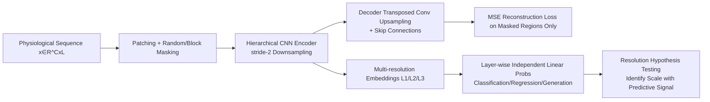

# HiMAE: Hierarchical Masked Autoencoders Discover Resolution-Specific Structure in Wearable Time Series

**Conference**: ICLR 2026  
**OpenReview**: [https://openreview.net/forum?id=iPAy5VpGQa](https://openreview.net/forum?id=iPAy5VpGQa)  
**Code**: TBD  
**Area**: Self-Supervised Representation Learning / Wearable Physiological Time Series  
**Keywords**: Masked Autoencoders, Hierarchical Convolution, U-Net, Multi-resolution Representations, PPG, Edge Inference  

## TL;DR
HiMAE integrates masked autoencoders into a U-Net-style hierarchical 1D CNN, allowing intermediate layers to naturally correspond to embeddings at different temporal resolutions. This transforms "resolution" from a hyperparameter into a probe-based diagnostic tool, while the model is small enough to perform sub-millisecond inference on smartwatch CPUs.

## Background & Motivation
- **Background**: Wearable sensors (PPG/ECG/accelerometer) generate massive amounts of unlabeled physiological time series. Self-supervised learning (especially masked autoencoders, such as Google’s LSM series) has become the mainstream paradigm for representation learning in this field.
- **Limitations of Prior Work**: Mainstream approaches default to Transformers, implicitly assuming "capacity and global attention outweigh inductive bias." However, while physiological signals are long, they are essentially low-dimensional, highly structured signals driven by a few biological mechanisms; global attention may not only overfit but also **smear out structures at different time scales**. Furthermore, Transformer parameters often reach hundreds of millions, making them impossible to deploy on watches.
- **Key Challenge**: Should modeling use a single "universal resolution," or do different clinical/behavioral tasks rely on **different scales** of features? Existing flat masking methods collapse all scales into a single latent space, leaving this question unanswered and providing almost zero interpretability.
- **Goal**: To verify the "resolution hypothesis"—that temporal granularity is a **fundamental dimension** of physiological representation learning rather than a noise hyperparameter—and to provide a self-supervised framework light enough to run on edge devices.
- **Core Idea**: **Couple masked autoencoding with a hierarchical convolutional encoder-decoder**, making each level of the hierarchy correspond to a temporal granularity. Independent linear probes are then used to measure which scale the predictive signal is concentrated in—**upgrading representation learning from a "pre-training mechanism" to a "discovery tool."**

## Method

### Overall Architecture
Given an input sequence $x \in \mathbb{R}^{C\times L}$, HiMAE segments it into $N=L/P$ non-overlapping patches, randomly or contiguously masks them according to a ratio $r$, and feeds them into a U-Net-style 1D CNN encoder-decoder to reconstruct the masked regions. Each layer of the encoder uses stride-2 convolutions to halve the temporal resolution and double the receptive field; thus, **shallow layers retain local details while deep layers capture long-range dependencies**. The activations of intermediate layers naturally form a set of multi-resolution embeddings. After pre-training, the encoder is frozen, and a linear probe is trained for each embedding layer to determine which resolution provides the strongest signal for downstream tasks.

### Key Designs

**1. Hierarchical Masked Autoencoder Backbone: Explicitly modeling "scale" with convolutional pyramids.** The encoder $f_\theta$ is composed of residual convolutional blocks, each containing two layers of kernel=5 convolutions + BatchNorm + GELU, with stride-2 for downsampling. The decoder $g_\phi$ mirrors this, using transposed convolutions for upsampling and concatenating fine-grained features from corresponding encoder layers via skip connections. The final layer uses tanh to constrain the output to $[-1,1]$ to match the normalized input. Training calculates loss only on masked regions $L_{\text{MSE}}(\theta,\phi)=\frac{\|(\hat{x}-x)\odot m'\|_2^2}{\sum_t m'_t}$, estimating $p(x_M|x_O)$ to prevent the model from directly copying visible inputs. Choosing a convolutional U-Net over a Transformer is motivated by the strong local dependencies (PPG waveforms, ECG peaks) and naturally nested time scales (heartbeats in ms, rhythms in seconds) in physiological signals; hierarchical CNNs with limited receptive fields and skip connections encode this inductive bias directly into the architecture, remaining orders of magnitude smaller than Transformers.

**2. Receptive Field Expansion Approximating Global Context: $O(L)$ complexity nearing attention.** Unlike Transformers that capture global dependencies via $O(L^2)$ self-attention, HiMAE achieves a similar effect at $O(L)$ complexity through hierarchical spatial contraction. The effective receptive field of the $d$-th layer grows exponentially as $R_d = R_{d-1} + (k-1)\cdot\prod_{i=1}^{d-1}s_i$ (where $k$ is kernel size and $s$ is stride). By the bottleneck layer, the receptive field covers most of the sequence $L$—deeper layers aggregate coarse-grained long-range context, while skip connections inject high-resolution local features back into the decoder. This "local-to-global" inductive bias achieves competitive representation capability with far lower FLOPs than ViT, which is the fundamental reason for its sub-millisecond inference on watch-level CPUs (HiMAE-Small has only 307k parameters, Base has 1.2M, compared to LSM-Base at 110M).

**3. Resolution Probes: Turning resolution from a hyperparameter into an interpretable diagnostic dimension.** This is the core design of the paper. Instead of collapsing embeddings into a single token, HiMAE exposes the **entire multi-resolution embedding sequence** along the temporal dimension, training an independent linear classifier for each scale (following Alain & Bengio’s probing approach). This allows for a systematic test of "whether the predictive signal is concentrated in fine, intermediate, or coarse resolutions," and the answer varies by clinical task. Consequently, the benchmarks serve not just as transfer learning evaluations but as **controlled experiments** for the resolution hypothesis—revealing resolution-specific structures in signals that are difficult even for human experts to identify. Patch length $P=5$ and kernel size 5 were selected via ablation as the optimal balance between local fidelity and receptive field expansion.

## Key Experimental Results

**Pre-training Scale**: Approximately 80,000 hours of Samsung green-light PPG, covering 47,644 participants across 7 types of wearable devices and 7 free-living studies; 100Hz sampling, 10s windows ($L=1000$), patch=5, masking ratio $r=0.8$; converged in 12 hours on 4 T4 GPUs.

### Main Results

Generative Benchmarks (MSE, lower is better, 80% masking rate excerpt):

| Method | Random Imputation | Temporal Interpolation | Temporal Extrapolation |
|---|---|---|---|
| Linear Int. | 0.153 | 0.403 | 0.526 |
| MAE-1D (ViT) | 0.041 | 0.299 | 0.356 |
| CNN | 0.040 | 0.278 | 0.343 |
| **HiMAE** | **0.026** | **0.201** | **0.211** |

In the most difficult temporal extrapolation task, HiMAE's $R^2$ at 30%/50%/80% missingness was 0.138/0.102/0.062, respectively, being one of the few methods to maintain a positive $R^2$ (all other baselines were negative).

Linear Probe Classification AUROC (%, comparison with SSL baselines, excerpt):

| Model | Params (M) | Hyptn(lab) | PVC | Platelets | Light |
|---|---|---|---|---|---|
| MSN | 2.5 | 55.2 | 56.4 | 45.9 | 57.8 |
| MAE (ViT) | 110.6 | 43.2 | 72.2 | 56.1 | 63.8 |
| **HiMAE** | **1.2** | **65.1**∗∗ | **80.2**∗ | **68.5**∗∗ | **66.8** |

Compared to SOTA wearable/time-series foundation models (PaPaGei-SRA, Swin-Transformer 110M, etc.), HiMAE achieves optimal or suboptimal results on most tasks with only 1.2M parameters.

### Ablation Study

| Removed Component | Effect |
|---|---|
| Remove skip connection | Generative error increases, scaling worsens |
| Remove hierarchical design | Reconstruction error increases |
| Remove both (Degraded) | Still comparable to larger Transformers |

### Key Findings
- **Scaling on parameter dimensions is counter-intuitive**: HiMAE reaches low loss with few parameters, whereas Transformers require scaling up by several orders of magnitude to catch up—confirming the importance of inductive bias in low-capacity regimes.
- Predictive signals for different tasks are indeed concentrated in **different resolution layers**, validating the resolution hypothesis.
- Even when degraded (losing hierarchy/skips), HiMAE remains competitive with Transformers having 100x the parameters.

## Highlights & Insights
- **Using "resolution" as a probe-based diagnostic tool** is the true conceptual innovation: while others treat it as a hyperparameter, this work treats it as an interpretability probe capable of discovering scale-based structures invisible to experts.
- Using U-Net receptive field expansion to approximate global attention at $O(L)$ provides a clear theoretical foundation for why "small models can be strong."
- With 307k–1.2M parameters and sub-millisecond inference on watch CPUs, it establishes a viable path for edge wearable deployment, showing high engineering value.
- The use of an industrial-grade PPG corpus (80,000 hours, 47,644 people) makes the conclusions far more credible than those based on small academic datasets.

## Limitations & Future Work
- The primary focus is on PPG; other modalities like ECG are only verified in the appendix (due to non-passive collection and smaller data scale), and cross-modal generalization is not fully explored.
- The convolutional receptive field is determined by stride/padding/kernel designs; while "which scale is significant" is not forced, it is still constrained by these hyperparameters, meaning resolution discovery is not entirely data-driven.
- All downstream evaluations use linear probes and binary classification/reconstruction, lacking systematic assessment of end-to-end fine-tuning and more complex tasks (multi-class, regression, sequence prediction).
- The clinical interpretability of the resolution hypothesis remains at "signal concentration in certain layers," far from providing physician-readable physiological explanations.

## Related Work & Insights
- **Masked Autoencoder Lineage**: From ViT-MAE and BERT to wearable LSM series, HiMAE differentiates itself by using a hierarchical architecture to explicitly integrate multi-scale features rather than a flat single scale.
- **Contrastive Learning Route** (SimCLR, Apple ECG/PPG FM, PaPaGei, SleepFM): These rely on positive/negative samples and augmentation heuristics, being sensitive to augmentations and lacking interpretability; HiMAE bypasses augmentation challenges via the masking route.
- **Multi-scale Time Series Modeling** (N-HiTS, Pyraformer, Scaleformer, Pathformer): Mostly use fixed hierarchies or task-specific refinement; HiMAE allows scales to "emerge" through self-supervised reconstruction as independently probeable embedding layers.
- **Insight**: In domains with structured, low-dimensional but long sequences, **the right inductive bias > blindly stacking Transformer capacity**, and the architecture itself can serve as a tool for scientific discovery.

## Rating
- **Novelty**: ⭐⭐⭐⭐ — The perspective of "turning resolution into a probe" is novel; while the components (MAE+U-Net) are not strictly new, the combination and interpretation angle are insightful.
- **Experimental Thoroughness**: ⭐⭐⭐⭐ — Industrial-grade corpus + 12 classification tasks + 3 types of generative benchmarks + multi-axis scaling + ablation; very solid, though fine-tuning and cross-modal studies are slightly lacking.
- **Writing Quality**: ⭐⭐⭐⭐ — Clear arguments, natural progression of motivation, well-organized charts, and the resolution hypothesis consistently ties the paper together.
- **Value**: ⭐⭐⭐⭐ — Outstanding value for edge wearable deployment (sub-millisecond inference + small model), providing convincing evidence for "when to use convolutional inductive bias."

<!-- RELATED:START -->

## Related Papers

- [\[ICLR 2026\] Test-Time Efficient Pretrained Model Portfolios for Time Series Forecasting](test-time_efficient_pretrained_model_portfolios_for_time_series_forecasting.md)
- [\[ICLR 2026\] Spatial Structure and Selective Text Jointly Facilitate Image Clustering](spatial_structure_and_selective_text_jointly_facilitate_image_clustering.md)
- [\[ICLR 2026\] Spatially Informed Autoencoders for Interpretable Visual Representation Learning](spatially_informed_autoencoders_for_interpretable_visual_representation_learning.md)
- [\[ECCV 2024\] Efficient Image Pre-Training with Siamese Cropped Masked Autoencoders](../../ECCV2024/self_supervised/efficient_image_pre-training_with_siamese_cropped_masked_autoencoders.md)
- [\[ICCV 2025\] From Linearity to Non-Linearity: How Masked Autoencoders Capture Spatial Correlations](../../ICCV2025/self_supervised/from_linearity_to_non-linearity_how_masked_autoencoders_capture_spatial_correlat.md)

<!-- RELATED:END -->
