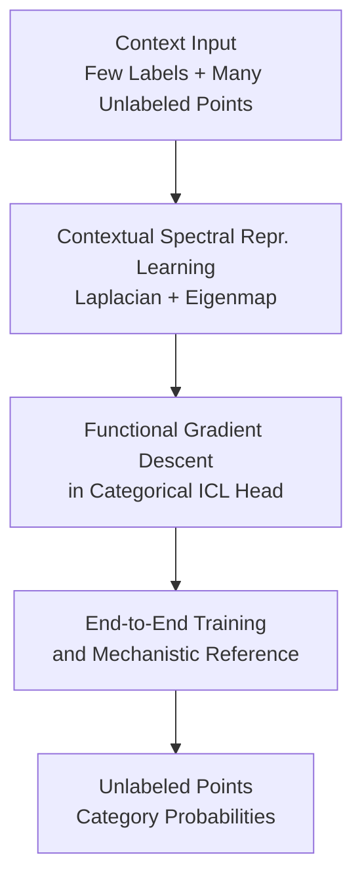

# In Context Semi-Supervised Learning

**Conference**: ICLR2026  
**OpenReview**: [https://openreview.net/forum?id=lqrpmqrTnH](https://openreview.net/forum?id=lqrpmqrTnH)  
**Code**: https://github.com/Jason-fan20/ICL_Semi  
**Area**: Semi-Supervised Learning / In-Context Learning / Representation Learning  
**Keywords**: Semi-supervised learning, in-context learning, Transformer, Laplacian Eigenmaps, spectral representation learning  

## TL;DR
This paper introduces the In-Context Semi-Supervised Learning (IC-SSL) problem and constructs a two-stage Transformer. It first learns geometric spectral representations from a large number of unlabeled samples within the same context, then executes categorical ICL with a few labels during forward propagation, significantly improving classification accuracy and cross-geometric generalization in low-label scenarios.

## Background & Motivation
**Background**: Theoretical research on the In-Context Learning (ICL) of Transformers has recently focused on the idea that "given several labeled examples, the model equivalently executes a learning algorithm during forward propagation." In settings such as linear regression, RKHS non-linear functions, and categorical outputs, existing works have proven or explained how attention layers simulate gradient descent to infer latent functions using input-output pairs in the context.

**Limitations of Prior Work**: Most of these analyses assume that context samples are explicitly labeled or treat each unlabeled query as an independent prediction target. Real-world semi-supervised scenarios are often the opposite: labels are scarce while unlabeled points are abundant, and these unlabeled points themselves contain structures such as clusters, manifolds, and local neighborhoods. If ICL only considers a few labels without utilizing the geometric structure formed by these unlabeled points, the most critical information in semi-supervised learning is wasted.

**Key Challenge**: The classic assumption of semi-supervised learning is that "neighboring points or points on the same manifold should share label structures," but standard ICL contexts are usually organized as independent demonstrations. Thus, the question becomes: Can a Transformer construct representations from an unlabeled context and propagate a few labels along this representation space directly in a single forward pass, without offline preprocessing?

**Goal**: The authors formalize this problem as IC-SSL: given $n$ input points where the first $m$ are labeled and the remaining $n-m$ are unlabeled at test time, the model needs to utilize all inputs $x^{(1)},\ldots,x^{(n)}$ and a few labels $y^{(1)},\ldots,y^{(m)}$ simultaneously to predict the categories of the remaining samples. The key is not fine-tuning Transformer parameters but completing a semi-supervised learning process within the context.

**Key Insight**: The paper approaches the problem through spectral geometry and graph semi-supervised learning. Traditional methods construct an adjacency graph and graph Laplacian from all samples, compute Laplacian Eigenmaps as manifold representations, and then perform classification with a few labels. The authors observe that RBF attention naturally expresses local similarity, while linear attention is suitable for simulating power iteration. Therefore, the Transformer architecture has the potential to map this spectral representation learning pipeline into its forward pass.

**Core Idea**: Use a Transformer to first compute geometry-aware Laplacian Eigenmap representations $\phi(X)$ within the context, then implement functional gradient descent of categorical cross-entropy on these representations using attention, allowing the unlabeled context to transform from "prediction targets" into "training signals for constructing representations."

## Method

### Overall Architecture
The proposed method can be understood as an end-to-end trained two-stage Transformer with an explicit algorithmic interpretation. The first stage, `TFrep`, only looks at all input points without labels, with the goal of recovering the manifold structure among samples within the context. The second stage, `TFsup`, attaches the few labels to these representations and uses a categorical ICL head to output prediction probabilities for all unlabeled points. The two stages are combined into a single Transformer and trained end-to-end using IC-SSL cross-entropy.

Specifically, the input context is $C=\{(x^{(1)},y^{(1)}),\ldots,(x^{(m)},y^{(m)})\}\cup\{x^{(m+1)},\ldots,x^{(n)}\}$. The first stage produces context-dependent representations $\phi^{(i)}$ based on all $x$, so $\phi^{(i)}$ is not just a single-point encoding of $x^{(i)}$ but a representation dependent on the entire batch $X$. The second stage updates an implicit classification function $f$ in the $\phi$ space based on the few labels and obtains $P(y^{(i)}\mid X)$ via a softmax form.

The key to this framework is that the paper does not treat Laplacian Eigenmap as external feature engineering. The authors first provide a constructability argument: certain attention/MLP configurations can approximately implement graph Laplacian construction, eigenvector extraction, and categorical gradient descent. During actual training, these modules are optimized end-to-end, allowing the model to deviate from strict algorithms to achieve better empirical performance.

### Key Designs
**1. Contextual Spectral Representation Learning: Letting Unlabeled Points Determine the Representation Space First**

In standard ICL, a query often enters the model only when it is being "predicted," making it difficult to influence the representation itself. The first step here is to use all input points to construct a graph: an RBF similarity $A_{ij}=\exp(-\|x^{(i)}-x^{(j)}\|_2^2/(2h))$ is defined for any two points, and the normalized Laplacian $\hat L=I-AD^{-1}$ is obtained from the degree matrix $D$. This process explicitly writes the local smoothness assumption of semi-supervised learning into the contextual representation: even if a point has no label, it changes the spectral structure of the entire graph through adjacency.

The authors further show that RBF attention can directly produce a similarity normalization matrix similar to $AD^{-1}$. Thus, a simple Transformer sub-module `TFL` can form the Laplacian during forward propagation. The subsequent `TFϕ` uses linear attention to simulate block power iteration, approximating the bottom eigenvectors of $\hat L$ to form Laplacian Eigenmaps. Consequently, each sample receives a $\phi^{(i)}$ that naturally carries information about "where it is located within the current context manifold."

**2. Functional Gradient Descent in Categorical ICL Head: Propagating Few Labels along Spectral Representations**

With $\phi^{(i)}$, the problem becomes predicting unlabeled samples using a few labels. The paper adopts a functional gradient descent perspective, assuming the classification function $f(\phi)$ lies in an RKHS, and models label probabilities using category embeddings $w_c$ and softmax: $P(y^{(i)}\mid X)\propto \exp(w_{y^{(i)}}^\top f(\phi^{(i)}))$. Performing gradient descent on the cross-entropy of labeled samples yields functional updates for all samples:

$$
f^{(i)}_{\ell+1}=f^{(i)}_{\ell}+\alpha\sum_{j=1}^{m}\left[w_{y^{(j)}}-E(w\mid f^{(j)}_{\ell})\right]\kappa(\phi^{(i)},\phi^{(j)}).
$$

The meaning of this equation is intuitive: only the first $m$ labeled samples provide supervision residuals $w_y-E(w\mid f)$, but these residuals are propagated to every unlabeled point via the kernel similarity $\kappa(\phi^{(i)},\phi^{(j)})$. Attention layers are perfectly suited for this "weighted aggregation by similarity" update, while subsequent MLPs handle non-linear updates such as the softmax expectation $E(w\mid f)$. Compared to direct ICL on raw coordinates, the advantage here is that label propagation occurs in the spectral representation space, where propagation paths align closely with the data manifold rather than Euclidean accidental distances.

**3. End-to-End Training and Mechanistic Reference: Turning Structured Construction into Optimizable Models**

The construction is not a hard-coded fixed Laplacian solver. The authors combine `TFL`, `TFϕ`, and `TFsup` into one model, compute the IC-SSL loss using ground-truth labels (visible during training) for the unlabeled parts, and jointly optimize all parameters. This preserves the inductive bias of spectral methods while allowing the model to learn data-dependent representations better suited for the task than manual Laplacians.

This design also serves as a reference for understanding common Transformers. In experiments, the authors compare the structured model, a standard Transformer baseline, and offline Eigenmap representations. They analyze not only accuracy but also representation alignment metrics such as separation score, mutual kNN, Cycle, and LCS. Results show that standard Transformers gradually learn neighborhood structures similar to spectral representations as training data increases, while the structured model acquires this structure much earlier in low-data regimes.

### Loss & Training
During training, although the input format treats the last $n-m$ samples as unlabeled, their true labels are known in the training set. The authors thus compute cross-entropy only at these query/unlabeled positions:

$$
L(\theta;C)=\frac{1}{n-m}\sum_{i=m+1}^{n}\log\frac{\exp(w_{y^{(i)}}^\top f(\phi(x^{(i)})))}{\sum_{c=1}^{C}\exp(w_c^\top f(\phi(x^{(i)})))}.
$$

The parameters $\theta$ include the representation module, supervised ICL module, and category embeddings $w_c$. Note that $\phi$ and $f$ are not trainable parameters stored per task but are dynamically generated by the context during the Transformer forward pass.

## Key Experimental Results

### Main Results
The experiments cover four scenarios: ImageNet100 real image features, five low-dimensional synthetic manifolds, a five-factor product manifold, and a high-dimensional image manifold generated via Stable Diffusion latent interpolation. Baselines include `ORIG+E2E-ICL` (Ours), `EIG+ICL` (offline spectral features + ICL), spectral logistic regression, raw coordinate RBF logistic regression, raw coordinate ICL, and a standard Transformer baseline (~1.4M parameters).

| Scenario | Setting | Ours (ORIG+E2E-ICL) | Primary Comparison | Conclusion |
|----------|---------|---------------------|--------------------|------------|
| ImageNet100 | VGG-29 features, 3% labels | Higher than standard TF; separation rises earlier | Standard TF, Orig+ICL, EIG+ICL | Spectral bias is more sample-efficient in low data |
| Cylinder ID | Cylinder manifold, varying labels | $\sim90\%$ at 25% labels | EIG+ICL is 5-7% lower | Consistently leads even on simple manifolds |
| Product manifold | Cartesian product of 5 manifolds | Leads by 8-10% across label ratios | EIG+ICL | Superior performance in complex high-D geometry |
| Image manifold OOD | Train on synthetic, test on SD images | $\sim77\%$ at 15% labels; $>62\%$ at 3% | Multiple baselines 10-20% lower | Learned geometric algorithms are cross-modal |

On ImageNet100, at 3% labels and dataset size = 5000, representation alignment metrics show:

| Representation Pair | mNN ↑ | Cycle ↑ | LCS ↑ | Interpretation |
|---------------------|-------|---------|-------|----------------|
| Ours - Standard TF | 0.302 | 0.289 | 0.193 | Significant overlap in learned neighborhood structures |
| EIG - Ours | 0.304 | 0.295 | 0.195 | Ours is closest to spectral reference |
| EIG - Standard TF | 0.269 | 0.262 | 0.177 | Standard TF also approaches spectral structure but less so |

### Ablation Study
Ablations on the Laplacian predictor and PE refinement (5-factor product manifold):

| Context size | Lap+PE 1 Layer | Our Model | Lap Linear | Note |
|--------------|----------------|-----------|------------|------|
| 3 | 0.534 ± 0.008 | 0.663 ± 0.031 | 0.479 ± 0.009 | Full spectral module yields max gain at low labels |
| 10 | 0.567 ± 0.015 | 0.720 ± 0.016 | 0.465 ± 0.010 | Single-layer non-iterative PE is insufficient |
| 40 | 0.608 ± 0.009 | 0.744 ± 0.007 | 0.536 ± 0.005 | Stable gap remains as labels increase |

### Key Findings
- Representation learning is the primary source of gain. `ORIG+ICL` blindly performing ICL on raw coordinates is significantly weaker than `ORIG+E2E-ICL`.
- Standard Transformer baselines exhibit a phase transition: performance is poor with <1000 training tasks but jumps at ~1200 as the model begins to learn separable contextual geometry.
- OOD results show the model learns a generic neighborhood/spectral calculation rather than just memorizing a specific coordinate system.

## Highlights & Insights
- The most valuable insight is clarifying the role of "unlabeled context": it is not just more prompt length, but a signal to construct a contextual representation $\phi(X)$.
- The two-stage construction bridges semi-supervised learning, spectral geometry, and ICL theory. It provides more mechanistic clarity than simply saying "Transformers use context."
- The structured model serves as an interpretable reference to observe whether standard Transformers eventually learn algorithms like Laplacian Eigenmaps.

## Limitations & Future Work
- Experimental scale is limited to episode-style contexts ($n=100$) and VGG features rather than end-to-end large-scale SSL.
- Dependence on manifold assumptions: if the neighborhood structure is unrelated to labels, spectral bias might propagate errors.
- The analysis uses idealized components (RBF attention, linear power iteration modules). Whether standard Transformers naturally learn these exactly needs more verification.

## Related Work & Insights
- **vs. Traditional Graph SSL**: Instead of offline graph construction, this process is internalized into the forward pass, making representations dynamic per context.
- **vs. Supervised ICL Theory**: Extends the "gradient descent in attention" view to semi-supervised settings where queries participate in representation learning.
- **vs. Many-shot / Unsupervised ICL**: Unlike methods relying on pseudo-label selection, this directly extracts geometric structure from unlabeled tokens.

## Rating
- Novelty: ⭐⭐⭐⭐⭐ (Integrates SSL into ICL framework with a spectral mechanism).
- Experimental Thoroughness: ⭐⭐⭐⭐ (Strong manifold and OOD tests; needs more large-scale real-world data).
- Writing Quality: ⭐⭐⭐⭐ (Logical flow, though mathematical details in the appendix are dense).
- Value: ⭐⭐⭐⭐⭐ (Provides a reusable modeling approach for few-label episode classification).

<!-- RELATED:START -->

## Related Papers

- [\[ICLR 2026\] CoLA: Co-Calibrated Logit Adjustment for Long-Tailed Semi-Supervised Learning](cola_co-calibrated_logit_adjustment_for_long-tailed_semi-supervised_learning.md)
- [\[ICLR 2026\] FedOpenMatch: Towards Semi-Supervised Federated Learning in Open-Set Environments](fedopenmatch_towards_semi-supervised_federated_learning_in_open-set_environments.md)
- [\[AAAI 2026\] Explanation-Preserving Augmentation for Semi-Supervised Graph Representation Learning](../../AAAI2026/self_supervised/explanation-preserving_augmentation_for_semi-supervised_graph_representation_lea.md)
- [\[ICLR 2026\] Learning Dynamics of Logits Debiasing for Long-Tailed Semi-Supervised Learning](learning_dynamics_of_logits_debiasing_for_long-tailed_semi-supervised_learning.md)
- [\[ICLR 2026\] SCAD: Super-Class-Aware Debiasing for Long-Tailed Semi-Supervised Learning](scad_super-class-aware_debiasing_for_long-tailed_semi-supervised_learning.md)

<!-- RELATED:END -->
