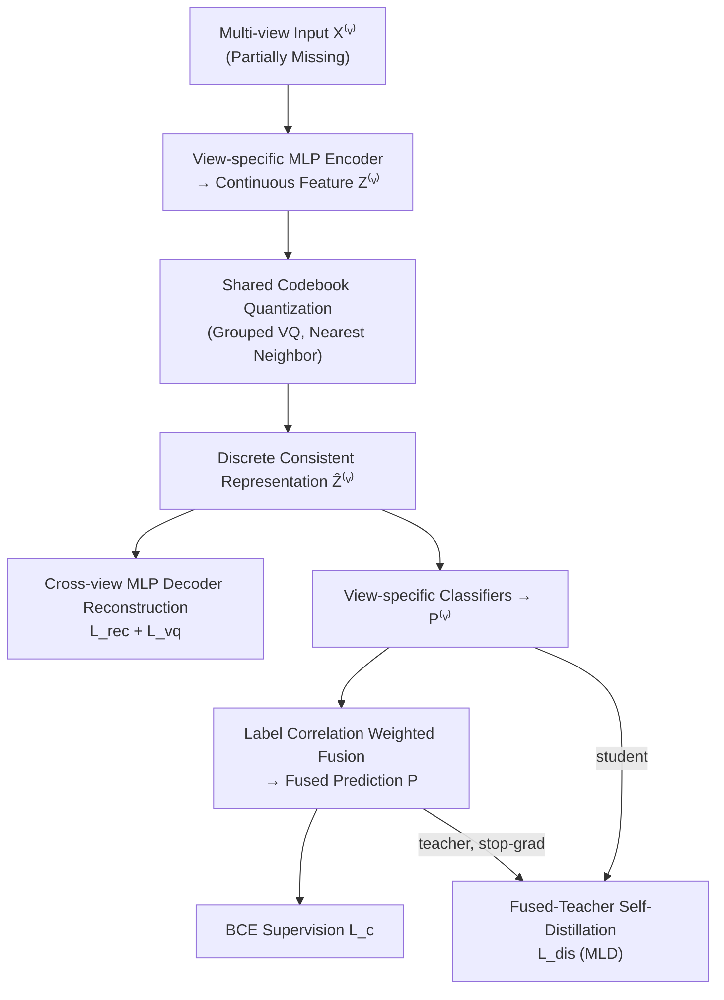

# Incomplete Multi-View Multi-Label Classification via Shared Codebook and Fused-Teacher Self-Distillation

**Conference**: ICLR 2026  
**OpenReview**: [https://openreview.net/forum?id=LAuep7N7rF](https://openreview.net/forum?id=LAuep7N7rF)  
**Code**: [https://github.com/xuy11/SCSD](https://github.com/xuy11/SCSD)  
**Area**: Multi-View Multi-Label Learning / Representation Learning  
**Keywords**: Incomplete Multi-View, Multi-Label Classification, Vector Quantization, Shared Codebook, Self-Distillation, Label Correlation  

## TL;DR
Addressing the "dual-missing" scenario where both views and labels are absent, SCSD utilizes a cross-view shared discrete codebook to quantize and align various views into a consistent representation. It further achieves robust multi-view multi-label classification through weighted fusion based on label correlation and self-distillation using "fused predictions as teachers."

## Background & Motivation
**Background**: Multi-view multi-label learning (where a single sample is described by multiple modalities/features and carries multiple labels) has been extensively studied. Prevailing approaches utilize contrastive learning (DICNet) or Information Bottleneck (SIP) to learn consistent representations across views, followed by decision fusion using average, learnable weights, or quality discriminators.

**Limitations of Prior Work**: In practice, "complete views + full label annotation" is nearly impossible—sensor failures, occlusions, and privacy constraints lead to missing views, while expensive fine-grained annotation leads to missing labels. When **view missing** and **label missing occur simultaneously** (dual-missing), methods designed for a single missing type often fail.

**Key Challenge**: Existing consistent representation learning relies on **loss-based soft constraints** (contrastive loss, minimization of non-shared information regularization) and lacks explicit structural constraints. Consequently, models are prone to under-representation or over-regularization when views are missing, making it difficult to learn stable and discriminative shared semantics. Moreover, most fusion strategies ignore the structural information inherent in label correlations, and learnable weights or quality discriminators introduce additional training overhead.

**Goal**: To learn consistent representations under dual-missing conditions using a more "structured" mechanism and to design a fusion and training paradigm without additional networks to improve generalization.

**Core Idea**: (1) **Discretized Alignment** — utilizing a cross-view shared codebook to quantize continuous features into a finite codebook embedding space, naturally aligning different views and reducing redundancy; (2) **Structure-Aware Fusion** — weighting views based on their ability to maintain label correlation structures; (3) **Fused-Teacher Self-Distillation** — feeding the fused prediction back to individual view branches as a teacher.

## Method

### Overall Architecture
SCSD (Shared Codebook + Self-Distillation) is divided into two stages: the upper stage involves **multi-view consistent discrete representation learning**, consisting of view encoding → shared codebook quantization → cross-view reconstruction; the lower stage involves **multi-view prediction fusion + self-distillation**, where individual view classifications are weighted by label correlation for fusion, and the fused prediction acts as a teacher to distill knowledge back to each view. Missing views/labels are zero-filled and masked by indicator matrices $W$ (views) and $G$ (labels) in all loss functions.

### Key Designs

**1. Shared Codebook + Cross-view Reconstruction: Structural Alignment via Discrete Bottleneck.** Since raw dimensions $d_v$ vary across views, view-specific MLP encoders first map them to a unified dimension $Z^{(v)}=E^{(v)}(X^{(v)})$. The critical step is **Vector Quantization**: a learnable codebook $V=\{e_i\}_{i=1}^{k}$ shared across all views is defined. Each sample feature is divided into $g$ segments, and each segment is replaced by a codebook embedding using $\ell_2$-normalized nearest neighbor lookup $t^*=\arg\min_j \|\ell_2(z_t)-\ell_2(e_j)\|_2^2$, then concatenated back into the discrete representation $\hat{Z}^{(v)}$. Because all views share the same finite codebook, different views are naturally aligned within the same discrete space with compressed redundancy. To further strengthen consistency, the authors employ **cross-view reconstruction**—using the decoder of view $j$ to reconstruct the representation of view $v$, i.e., $\hat{X}^{(j,v)}=D^{(j)}(\hat{Z}^{(v)})$. The reconstruction loss $\mathcal{L}_{rec}$ is calculated only when both views exist ($W_{i,j}W_{i,v}=1$). The non-differentiable quantization issue is resolved via straight-through gradient estimation $z_t=\text{sg}[z_t-\hat{z}_t]+\hat{z}_t$, and the codebook learning objective $\mathcal{L}_{vq}$ includes codebook and commitment terms for bilateral alignment. This discrete bottleneck replaces the soft constraints of contrastive/Information Bottleneck methods, providing explicit structural constraints.

**2. Label Correlation-guided Weighted Fusion: Empowering "Label-Structure Aware" Views.** This design avoids any additional networks or learnable weights, instead using **label correlation matrices** to evaluate the prediction quality of each view. First, a global correlation matrix $S_{i,j}=\frac{Y_{:,i}^\top Y_{:,j}}{Y_{:,i}^\top Y_{:,i}+\varepsilon}$ (the probability of label $j$ appearing given label $i$) is calculated from the ground truth labels of the training set. Then, a corresponding $S^{(v)}$ is calculated using the current batch predictions $\hat{P}^{(v)}$ of each view. After symmetrization and row normalization, the Frobenius norm is used to measure the view's ability to maintain the global correlation structure. The quality score is defined as $q^{(v)}=-\|\hat{S}^{(v)}-\hat{S}\|_F$, which is then processed via temperature softmax to obtain weights $w_i^{(v)}=\frac{\exp(q^{(v)}/\tau)\cdot W_{i,v}}{\sum_u \exp(q^{(u)}/\tau)\cdot W_{i,u}}$. The fused prediction is $P_{i,:}=\sum_v w_i^{(v)}P_{i,:}^{(v)}$. $S^{(v)}$ is updated batch-wise with predictions, and weights adaptively change through the training stages. Views consistent with global label dependencies are prioritized, while noisy views are suppressed. The fused prediction is supervised by masked BCE (where $G$ masks missing labels).

**3. Fused-Teacher Self-Distillation + Multi-Label Logit Distillation (MLD): Back-feeding Global Knowledge to Single Views.** The fused prediction $P$, which aggregates information from all views, acts as the **teacher** (with stop-gradient), while individual view predictions $P^{(v)}$ serve as **students**. The distillation loss $\mathcal{L}_{dis}=\frac{1}{\sum W}\sum_i\sum_v\big[\lambda D_{KL}(\text{sg}[P_{i,:}]\,\|\,P_{i,:}^{(v)})+(1-\lambda)\mathcal{L}_{bce}(P_{i,:}^{(v)},Y_{i,:})\big]W_{i,v}$ is balanced by an imitation coefficient $\lambda$ between "learning from the teacher" and "learning from the ground truth." Note that traditional distillation assumes class probabilities sum to 1, which does not hold in multi-label scenarios. The authors therefore adopt **Multi-Label Logit Distillation (MLD)**, which decomposes the task into multiple binary classifications using a one-versus-all approach and aligns teacher-student probabilities label-by-label, making distillation effective for multi-label settings. This ensures single-view branches absorb global knowledge from fused predictions while retaining their own characteristics, enhancing consistency and generalization.

The total loss is $\mathcal{L}=\mathcal{L}_c+\mathcal{L}_{dis}+\alpha\mathcal{L}_{rec}+\mathcal{L}_{vq}$, where overall complexity is dominated by the encoder-decoder and scales linearly with the number of samples $n$.

## Key Experimental Results

### Main Results (50% Missing Views + 50% Missing Labels + 70% Training, AP Metric)

| Dataset | DICNet | SIP | RANK | DRLS(Sub-optimal) | **SCSD** |
|--------|--------|-----|------|-----------|----------|
| Corel5k | 0.378 | 0.416 | 0.425 | 0.433 | **0.447** |
| Pascal07 | 0.502 | 0.550 | 0.554 | 0.567 | **0.578** |
| Espgame | 0.299 | 0.310 | 0.314 | 0.326 | **0.345** |
| Iaprtc12 | 0.327 | 0.331 | 0.347 | 0.356 | **0.385** |
| Mirflickr | 0.586 | 0.615 | 0.606 | 0.630 | **0.634** |

SCSD achieves an average rank (Ave.R) of **1.0** across all 5 datasets. On Espgame and Iaprtc12, which have more complex label spaces, it improves by **5.83% / 8.15%** over the sub-optimal DRLS. Compared to DICNet (contrastive) and SIP (Information Bottleneck), the average AP across 5 datasets increases by **14.94% / 8.65%**. In the "complete views + complete labels" setting, SCSD still achieves optimality in most metrics, indicating that the representation capability of the shared codebook mechanism is not limited to missing scenarios.

### Ablation Study (Corel5k / Pascal07, AP)

| Variant | Corel5k | Pascal07 |
|------|---------|----------|
| **SCSD (Full)** | **0.447** | **0.578** |
| w/o $\mathcal{L}_{dis}$ (No self-distillation) | 0.376 | 0.560 |
| w/o $\mathcal{L}_{dis}$ KL (No KL imitation term) | 0.411 | 0.572 |
| w/o $\mathcal{L}_{rec}$ (No cross-view reconstruction) | 0.439 | 0.560 |
| w/o VQ (No quantization, continuous features) | 0.430 | 0.565 |
| w/o cross-view rec (Single-view reconstruction) | 0.442 | 0.553 |
| w/o S fusion (Masked average fusion) | 0.445 | 0.570 |

### Key Findings
- **Self-distillation + Shared Codebook contribute most**: Removing $\mathcal{L}_{dis}$ causes AP to drop sharply from 0.447 to 0.376 on Corel5k; removing VQ also leads to a significant decline, confirming the foundational role of the discrete codebook in learning consistent representations.
- **Fusion is more effective with more labels**: Removing S fusion has a more pronounced impact on Pascal07 (20 labels) because more labels result in a more reliable correlation matrix $S$, facilitating better identification of view quality.
- **Hyperparameter Insensitivity**: Temperature $\tau$ has minimal impact over a wide range; $\alpha$ and $\lambda$ are stable within reasonable ranges. The codebook is configured with $k=2048$, embedding dimension $d_c=4$, and k-means initialization.

## Highlights & Insights
- **Replacing Soft Alignment Constraints with Discrete Bottlenecks**: SCSD shifts "consistent representation learning" from loss constraints (contrastive/Information Bottleneck) to an **explicit structural constraint** via a shared codebook. The finite codebook naturally forces different views into the same discrete space, providing a more robust approach for handling missing views.
- **"Zero Extra Parameters" for Fusion Weights**: By using the Frobenius difference of label correlation structures as a proxy for view quality, the method eliminates the need for quality discriminators or learnable weight networks, while allowing for batch-level adaptive updates.
- **Directly Addressing Multi-Label Distillation Challenges**: The paper explicitly notes that the "sum probability equals 1" assumption in traditional KL distillation fails in multi-label contexts. Introducing MLD's one-vs-all label-wise alignment is key to correctly implementing self-distillation in multi-label scenarios.

## Limitations & Future Work
- **Codebook Overhead**: Storing and updating codebook embeddings consumes memory, and calculating distance matrices between features and the codebook during quantization increases computational costs.
- **Weakened Alignment at High Missing Rates**: The quantization module assumes views can align in a shared latent space. When view missing rates are extremely high, the cross-view information available for alignment decreases sharply, potentially weakening the codebook's generalization capacity.
- **Future Directions**: Exploring adaptive codebook sizes, alignment compensation mechanisms for extreme omission, and extending discrete codebook consistency to more complex view-missing patterns.

## Related Work & Insights
- **Consistent Representation Learning**: DICNet (contrastive learning for cross-view positive pairs), SIP (Information Bottleneck for maximizing shared information) — SCSD provides a third "structured" route via discrete codebooks.
- **Multi-View Fusion**: AIMNet (average fusion), LMVCAT (learnable weights), RANK (view quality sub-network) — SCSD performs parameter-free quality assessment using label correlations.
- **Vector Quantization / Self-Distillation**: Adapted from VQ-VAE’s straight-through estimation and grouped quantization, alongside self-distillation frameworks and MLD, tailored for the dual-missing multi-view multi-label setting.
- **Insight**: When soft alignment is unstable due to missing data, introducing a "finite discrete bottleneck" as an explicit structural constraint is a transferable paradigm; structural information in supervision signals (label correlation) can serve as a "free" quality metric.

## Rating
- **Novelty**: ⭐⭐⭐⭐ Combines shared codebook discrete bottlenecks, parameter-free label correlation fusion, and multi-label fused-teacher self-distillation for dual-missing scenarios. The logic is clear and well-motivated despite the components originating from existing techniques.
- **Experimental Thoroughness**: ⭐⭐⭐⭐ Validated on 5 standard datasets with 8 baselines and 6 metrics, covering both complete and missing settings with ablation and hyperparameter analyses. However, it lacks a systematic scan across varying missing rates beyond the 50% mark.
- **Writing Quality**: ⭐⭐⭐⭐ The flow from motivation to method to experiments is smooth. Formulas and framework diagrams are clear, and design trade-offs are well-explained.
- **Value**: ⭐⭐⭐⭐ Dual-missing is a common real-world scenario with relatively little research. The method is stable and open-sourced, providing practical reference value for the multi-view multi-label learning community.

<!-- RELATED:START -->

## Related Papers

- [\[ICLR 2026\] Relationship Alignment for View-aware Multi-view Clustering](relationship_alignment_for_view-aware_multi-view_clustering.md)
- [\[CVPR 2026\] GaussianMatch: Semi-Supervised Regression with Pseudo-Label Filtering via Multi-View Gaussian Consistency](../../CVPR2026/self_supervised/gaussianmatch_semi-supervised_regression_with_pseudo-label_filtering_via_multi-v.md)
- [\[ICLR 2026\] Equivariant Splitting: Self-supervised learning from incomplete data](equivariant_splitting_self-supervised_learning_from_incomplete_data.md)
- [\[ICLR 2026\] Adaptive Test-Time Training for Predicting Need for Invasive Mechanical Ventilation in Multi-Center Cohorts](adaptive_test-time_training_for_predicting_need_for_invasive_mechanical_ventilat.md)
- [\[ICLR 2026\] PromptHub: Enhancing Multi-Prompt Visual In-Context Learning with Locality-Aware Fusion, Concentration and Alignment](prompthub_enhancing_multi-prompt_visual_in-context_learning_with_locality-aware_.md)

<!-- RELATED:END -->
