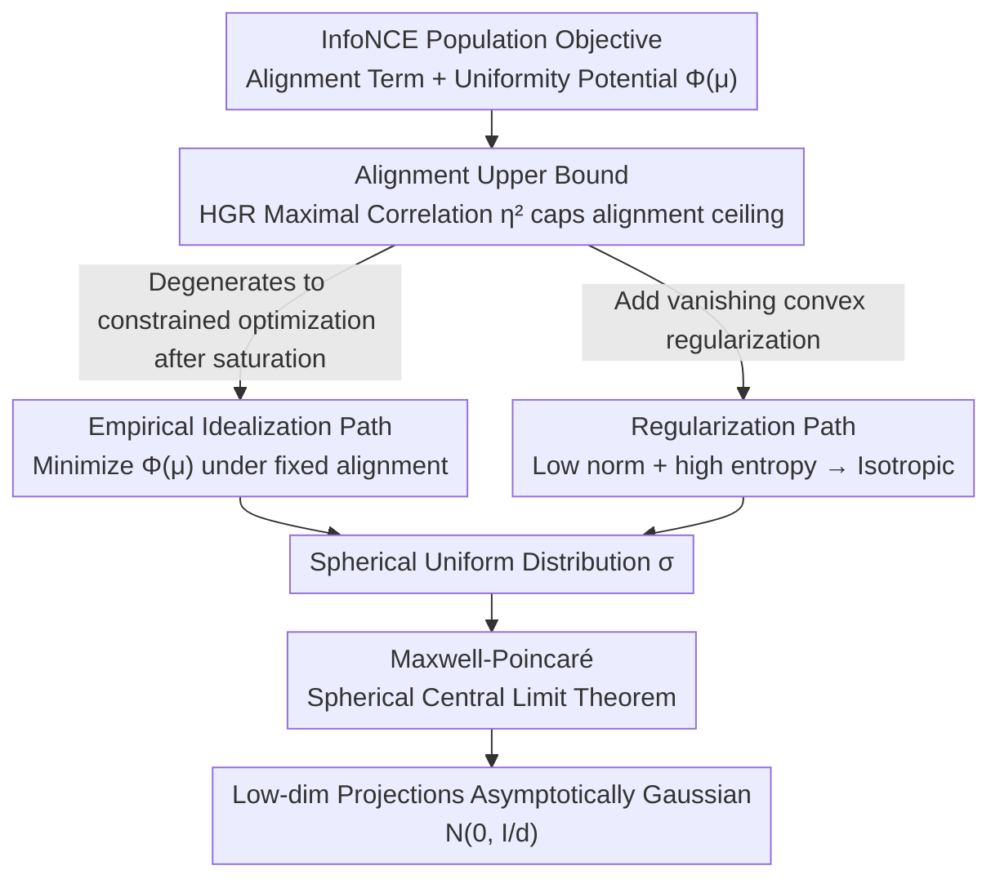

# InfoNCE Induces Gaussian Distribution

**Conference**: ICLR 2026 Oral  
**arXiv**: [2602.24012](https://arxiv.org/abs/2602.24012)  
**Code**: None  
**Area**: Self-Supervised Learning / Contrastive Learning / Theoretical Analysis  
**Keywords**: InfoNCE, contrastive learning, Gaussian distribution, uniformity, representation learning

## TL;DR
This paper theoretically demonstrates that the InfoNCE loss induces representations to converge toward a Gaussian distribution through two complementary mechanisms: an empirical idealization path (alignment + spherical uniformity → Gaussian) and a regularized path (vanishing regularization → isotropic Gaussian). These findings are validated using synthetic data and CIFAR-10.

## Background & Motivation

**Background**: Contrastive learning (SimCLR, MoCo, CLIP, etc.) utilizes the InfoNCE loss to train encoders, focusing on the balance between positive pair alignment and representation uniformity. Recent empirical observations have noted that trained contrastive representations approximately follow a Gaussian distribution.

**Limitations of Prior Work**: While many practical applications directly exploit this approximate Gaussian property (for classification, uncertainty estimation, or anomaly detection), a theoretical explanation has been lacking—specifically, why InfoNCE specifically drives representations toward a Gaussian structure.

**Key Challenge**: The Gaussian assumption is widely used without theoretical support, effectively building applications on unproven premises.

**Goal**: To explain why InfoNCE produces Gaussian representations at the population level, providing a theoretical foundation for the Gaussian assumption used in practice.

**Key Insight**: The authors leverage a classic mathematical result—the Maxwell-Poincaré Theorem (a central limit theorem for spheres)—which states that fixed-dimensional projections of a uniform distribution on a high-dimensional sphere approach a Gaussian distribution. Thus, by proving that InfoNCE pushes representations toward spherical uniformity, the Gaussian property naturally follows.

## Method

### Overall Architecture

Rather than proposing a new model, this paper theoretically explores "why InfoNCE induces Gaussian representations." The analysis focuses on the InfoNCE population objective:

$$\mathcal{L}(\mu,\pi) = -\alpha\, \mathbb{E}_{(u,v)\sim\pi}[u \cdot v] + \Phi(\mu),$$

where the first term is the **alignment term** that pulls positive pairs $(u,v)$ closer, and the second term $\Phi(\mu)=\mathbb{E}_{u}\log\mathbb{E}_{v}\exp(\alpha\,u\cdot v)$ is the **uniformity potential** that penalizes representation collapse, depending solely on the marginal distribution $\mu$. The proof follows a main logic: first, quantify the maximum achievable alignment; then, prove that once alignment is saturated, InfoNCE becomes a "spherical uniformity" optimization problem; finally, use the Maxwell-Poincaré Theorem to translate "spherical uniformity" into "projected Gaussianity." The authors provide two complementary paths—one following training dynamics (empirical idealization) and one independent of dynamic assumptions (regularization)—both converging to the same spherical uniform distribution $\sigma$.

### Key Designs

**1. Alignment Upper Bound (Proposition 1): Framing the bounds of alignment**

While increasing alignment is desirable, data augmentation determines that positive pairs cannot overlap perfectly, creating an alignment "ceiling." The authors introduce an augmentation mildness parameter $\eta_2 = \rho_m^2(X, X_0)$, where $\rho_m$ is the HGR (Hirschfeld–Gebelein–Rényi) maximal correlation between the original sample $X_0$ and its augmentation $X$. Proposition 1 proves the alignment term is capped by $\eta_2$: milder augmentation (higher $\rho_m$) allows for higher reachable alignment, while aggressive augmentation lowers the ceiling. This is the first work to use HGR maximal correlation to characterize alignment strength in contrastive learning.

**2. Empirical Idealization Path: Following training dynamics to spherical uniformity**

This path addresses the difficulty of direct global minima analysis by examining behavior in late-stage training. Once the alignment term reaches its upper bound (saturation), alignment effectively becomes a constant, and InfoNCE reduces to a **constrained uniformity optimization**: minimizing the uniformity potential $\Phi(\mu)$ under fixed alignment. The authors prove that the uniform distribution on the sphere $\mathbb{S}^{d-1}$ is the unique minimizer. Applying the Maxwell-Poincaré theorem to this distribution yields asymptotic Gaussianity in low-dimensional projections. This path aligns with empirical observations where alignment saturates before uniformity fully converges.

**3. Regularization Path: Population-level proof independent of training dynamics**

To remove the "alignment saturation" assumption, the authors add a vanishing convex regularization term (encouraging low norm and high entropy) to create an $\epsilon$-regularized population objective. They prove that as $\epsilon \to 0$, the minimizer of the regularized problem converges to an isotropic spherical uniform distribution. This path is more general than the empirical path as it holds at the population level without assumptions on optimization trajectories, though it introduces the regularization term as an analytical tool.

**4. Maxwell-Poincaré Theorem: Translating spherical uniformity to Gaussianity**

This is the core bridge connecting "spherical uniformity" and "Gaussianity." The theorem states that for high dimension $d$, any $k$-dimensional fixed projection of a uniform distribution on $\mathbb{S}^{d-1}$ asymptotically follows:

$$\mathcal{N}\!\Big(0, \tfrac{1}{d} I_k\Big).$$

As both paths prove InfoNCE pushes representations toward spherical uniformity, this theorem ensures that projections onto any low-dimensional subspace converge to an isotropic Gaussian. Higher dimensionality $d$ increases the accuracy of this asymptotic behavior, explaining why Gaussianity strengthens with representation dimension in experiments.

## Key Experimental Results

The paper quantifies "Gaussianity" using three diagnostics: Coefficient of Variation of the norm ($\mathrm{CV}=\mathrm{std}(\|z\|)/\mathrm{mean}(\|z\|)$, where smaller indicates norm concentration on a thin shell), the Anderson-Darling (AD) test (null hypothesis of normality not rejected if statistic $<0.752$), and the D'Agostino-Pearson (DP) test ($p>0.05$ indicates normality).

### Synthetic Data + CIFAR-10 Gaussianity Diagnostics

| Setting | CV ↓ | AD Mean (<0.752) | AD Compliance | DP Mean (>0.05) | DP Compliance | Gaussian? |
|------|------|------------------|-----------|------------------|-----------|-------|
| Synthetic Laplace (Linear) | 0.08 | 0.38 | 100% | 0.49 | 100% | ✓ |
| Synthetic GMM (Linear) | 0.08 | 0.39 | 100% | 0.46 | 100% | ✓ |
| Synthetic Binary (Initial E0) | 0.36 | 1.64 | 30% | 0.02 | 15% | ✗ |
| Synthetic Binary (Trained E100) | 0.09 | 0.42 | 97% | 0.46 | 98% | ✓ |
| CIFAR-10 Supervised (ResNet-18) | 0.50 | 3.30 | 6.2% | 0.041 | 3.9% | ✗ |
| CIFAR-10 Contrastive (ResNet-18) | 0.09 | 0.43 | 96.1% | 0.39 | 94.5% | ✓ |

Using the same architecture (ResNet-18) and initialization, InfoNCE compresses the norm to CV≈0.09 and passes normality tests for nearly all coordinates, whereas supervised learning shows divergent norms and failed normality tests. This suggests the Gaussian structure originates from the contrastive objective itself.

### Pre-trained Large Models (MS-COCO)

| Model | Training Strategy | AD Mean (<0.752) | DP Compliance | Gaussian? |
|------|---------|------------------|-----------|-------|
| ResNet-34 | Supervised | 10.01 | 0% | ✗ |
| DenseNet | Supervised | 2.98 | 49% | ✗ |
| DINO (ViT-B/32) | Self-Supervised | 0.44 | 99% | ✓ |
| CLIP Image (ViT-L/14) | Self-Supervised | 0.47 | 99.6% | ✓ |
| CLIP Text (ViT-L/14) | Self-Supervised | 0.53 | 99.4% | ✓ |

### Key Findings
- Representations trained with InfoNCE exhibit strong coordinate-wise Gaussianity and norm concentration across synthetic data, CIFAR-10, and large-scale models (CLIP/DINO), whereas supervised representations do not.
- Even with strongly non-Gaussian inputs (GMM or discrete binary), trained representations converge to Gaussian. Binary data lacks an invertible mapping to continuous Gaussian, excluding the possibility that the model is simply recovering latent Gaussian variables.
- Larger dimensionality $d$ and batch size $N$ yield smaller CV and higher test compliance, consistent with asymptotic analysis error rates ($O(d^{-1})$ for projection deviation and $O(N^{-1/2})$ for empirical vs population minima).

## Highlights & Insights
- HGR maximal correlation is applied to contrastive alignment analysis for the first time, offering potential for analyzing other loss functions.
- Two complementary analytical paths are provided: the empirical path is intuitive, while the regularized path is more general.
- Provides a principled theoretical foundation for the Gaussian assumptions used in practical downstream tasks.

## Limitations & Future Work
- The results are asymptotic ($d \to \infty$); a rigorous finite-dimensional convergence rate analysis is missing.
- The regularization path relies on an additional regularization term.
- Analysis focuses on the marginal distribution rather than class-conditional distributions.
- Extension to non-contrastive self-supervised methods (e.g., BYOL, MAE) remains to be explored.

## Related Work & Insights
- **vs Wang & Isola (2020)**: They proposed the alignment+uniformity framework but did not derive the specific distribution form.
- **vs Baumann et al. (2024)**: Empirically utilized the Gaussian assumption for classification; this work provides the theoretical basis.
- **vs Maxwell-Poincaré Theorem**: A classic mathematical result innovatively linked to contrastive learning theory.

## Rating
- Novelty: ⭐⭐⭐⭐⭐ First theoretical explanation of why InfoNCE induces Gaussian distributions.
- Experimental Thoroughness: ⭐⭐⭐⭐ Validated across synthetic and real data with multiple architectures.
- Writing Quality: ⭐⭐⭐⭐⭐ Rigorous theoretical derivation and clear logic.
- Value: ⭐⭐⭐⭐⭐ Provides an important foundation for contrastive learning theory and practice.

<!-- RELATED:START -->

## Related Papers

- [\[ICML 2026\] When Softmax Fails at the Top: Extreme Value Corrections for InfoNCE](../../ICML2026/self_supervised/when_softmax_fails_at_the_top_extreme_value_corrections_for_infonce.md)
- [\[NeurIPS 2025\] Asymptotic and Finite-Time Guarantees for Langevin-Based Temperature Annealing in InfoNCE](../../NeurIPS2025/self_supervised/asymptotic_and_finite-time_guarantees_for_langevin-based_temperature_annealing_i.md)
- [\[ICLR 2026\] Adaptive Gaussian Expansion for On-the-fly Category Discovery](adaptive_gaussian_expansion_for_on-the-fly_category_discovery.md)
- [\[ICML 2026\] Understanding Self-Supervised Learning via Latent Distribution Matching](../../ICML2026/self_supervised/understanding_self-supervised_learning_via_latent_distribution_matching.md)
- [\[ECCV 2024\] FlowCon: Out-of-Distribution Detection using Flow-Based Contrastive Learning](../../ECCV2024/self_supervised/flowcon_out-of-distribution_detection_using_flow-based_contrastive_learning.md)

<!-- RELATED:END -->
