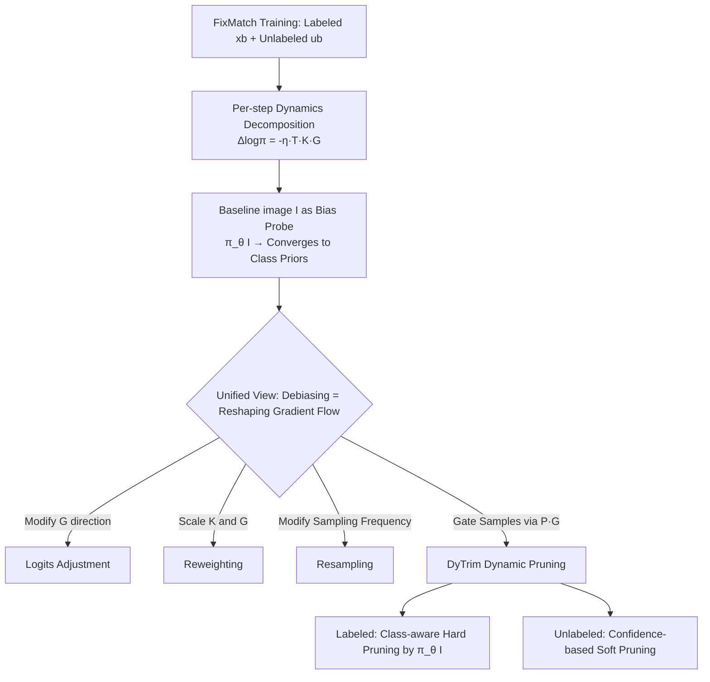

# Learning Dynamics of Logits Debiasing for Long-Tailed Semi-Supervised Learning

**Conference**: ICLR 2026  
**OpenReview**: [https://openreview.net/forum?id=e15SYMcsTs](https://openreview.net/forum?id=e15SYMcsTs)  
**Code**: [https://jiajun0425.github.io/DyTrim](https://jiajun0425.github.io/DyTrim)  
**Area**: Semi-supervised Learning / Long-tailed Recognition / Representation Learning  
**Keywords**: Long-tailed semi-supervised learning, learning dynamics, logits debiasing, dynamic pruning, baseline image, eNTK  

## TL;DR
This paper provides a unified explanation of various debiasing methods in Long-Tailed Semi-Supervised Learning (LTSSL) from the perspective of "learning dynamics"—demonstrating that they all essentially reshape gradient flows. Based on this, it proposes DyTrim, a training-efficient dynamic pruning framework that performs class-aware hard pruning for labeled data and confidence-based soft pruning for unlabeled data to reallocate the gradient budget toward samples that actually rectify bias.

## Background & Motivation

**Background**: Semi-supervised learning (SSL) methods like FixMatch and ReMixMatch typically assume balanced distributions for both labeled and unlabeled data, whereas real-world data is often long-tailed. Numerous LTSSL methods have emerged, including distribution alignment, data rebalancing, logits adjustment, and foundation model-based approaches (LADaS). Among these, using the logits of a "task-agnostic baseline image" to measure classifier bias (CDMAD) has gained significant attention.

**Limitations of Prior Work**: Although these methods are effective, the **underlying mechanism of "why they debias" remains unclear**. While it is known that modifying logits, weights, or sampling can mitigate bias, the specific effects of these operations on training dynamics and their interrelationships have not been articulated. Without understanding the mechanism, it is impossible to design more robust methods from first principles.

**Key Challenge**: In semi-supervised scenarios, the label imbalance bias of labeled data **spreads to pseudo-labels via the classifier**, which is then accumulated and amplified through consistency losses on unlabeled data. This creates a negative feedback loop: "bias $\rightarrow$ incorrect pseudo-labels $\rightarrow$ stronger bias." Small pseudo-label errors at a single step accumulate into catastrophic bias across iterations rather than being averaged out.

**Goal**: To characterize how class bias arises in LTSSL and how existing methods mitigate it from the perspective of learning dynamics, and to derive a new debiasing method with theoretical guarantees under this unified framework.

**Key Insight**: **(1) Unified Perspective**: Interpret logits adjustment, reweighting, and resampling as different ways of reshaping per-step gradient dynamics; **(2) Bias Probe**: Prove that the logits of a solid-color baseline image converge to class priors, serving as an observable indicator of the model's cumulative bias; **(3) Data-level Intervention**: Propose DyTrim to perform dynamic pruning at the sample selection level (rather than the loss or sampling level) to more directly shift the gradient budget to corrective samples.

## Method

### Overall Architecture

The paper first establishes a set of per-step learning dynamics decomposition tools (Proposition 1-4), decomposing "how a single gradient update changes model confidence at an observation point" into a product of three factors. It then uses these tools to analyze how LA, reweighting, and resampling modify these factors. Finally, it introduces DyTrim—a plug-and-play framework guided by the baseline image that separately prunes labeled and unlabeled data.

### Key Designs

**1. Per-step Learning Dynamics Decomposition: Decomposing "One Update" into Three Factors**  
Drawing from Ren & Sutherland (2025), the paper expresses the influence of a single gradient update on the prediction of observation point $x_o$ as $\Delta\log\pi_\theta^t(y|x_o) = -\eta\, T^t(x_o)\,K^t(x_o,x_b)\,G^t(x_b,y_b) + O(\eta^2)$. Here, $T^t(x_o)=I-\mathbf{1}\pi_{\theta^t}^\top(x_o)$ depends only on the current prediction (output sensitivity), $K^t(x_o,x_b)$ is the empirical Neural Tangent Kernel (eNTK) characterizing similarity between samples, and $G^t=\nabla_z L$ is the loss gradient providing "energy and direction." Crucially, the FixMatch update is naturally decomposed into a supervised term (driven by $(x_b,y_b)$) and a consistency term (driven by $(u_b,\hat q_b)$) (Proposition 2). Visualizations on MNIST (Figure 1) confirm that when pseudo-labels are correct, the consistency term reinforces the supervision; when incorrect, it reduces the probability of the correct class. In long-tailed settings, imbalance **masks** the impact of pseudo-label accuracy, continuously pushing the classifier toward majority classes.

**2. Baseline Image as an Observable Probe for Cumulative Bias**  
Single-step dynamics only show individual sample impacts, not global bias. This paper replaces the observation point $x_o$ with a task-agnostic solid-color baseline image $I=k\cdot\mathbf{1}_d$. By analyzing a two-layer MLP with normalization (BatchNorm/LayerNorm absorbing bias into affine parameters), it proves **Invariance** (Proposition 3): the logits of a solid-color image are independent of pixel value $k$ and collapse to $h(I)=b,\ \pi_\theta(I)=\text{Softmax}(b)$. Furthermore (Theorem 1), at the point of minimum total risk for cross-entropy, the baseline prediction exactly equals the "conditional class distribution under a normalized zero-feature state," i.e., $\hat p^\star(I)=\text{Softmax}(b^\star)=P(y\,|\,\text{normalized feature}=0)$, **precisely capturing class priors induced by the long-tailed training distribution**. Tracking $\pi_\theta^t(I)$ during training provides a direct, interpretable measure of cumulative class bias.

**3. Unified Perspective: Three Debiasing Methods Reshape the Same Gradient Flow**  
Using the baseline-image dynamics decomposition as a scale, the paper rewrites three categories of methods: **Logits Adjustment** is equivalent to modifying the gradient term to $\tilde G_{LA}=\pi_\theta(\alpha(u_b)|A(u_b))-\pi$ (correcting the gradient direction with class prior $\pi=\pi_\theta(I)$); **Reweighting** uses class weights $w_c$ to scale both the kernel and gradient $\tilde K_{rw}=w_c K,\ \tilde G_{rw}=w_c G$; **Resampling** changes the frequency of classes in training. Their commonality is that they **only modify gradient signals or sampling measures while keeping the sample set unchanged**, meaning redundant head-class samples still dominate the dynamics—hence the motivation for DyTrim to intervene at the data selection level.

**4. DyTrim: Dual-path Dynamic Pruning Guided by Baseline**  
DyTrim defines a step-dependent pruning probability $P_t(x)$ to gate sample participation, where the single-step decomposition becomes $\tilde G_{dytr}(x,y)=P_t(x)G^t(x,y)$. This effectively zeros out kernel-gradient interactions $K^t(I,x)G^t(x,y)$ for inefficient samples. For distribution mismatch, DyTrim uses two complementary mechanisms: **Labeled Data** uses class-aware hard pruning, where pruning ratios $r_c=\pi_\theta(I)_c$ are calibrated by the baseline logits, pruning $r_c\times N_c$ lowest-scoring samples per class based on supervised loss $L_{sup}$. **Unlabeled Data** uses label-agnostic soft pruning for samples satisfying $H_t^u(u_b)<\bar H_t^m$ and debiased confidence $p^*(u_b)\geq\tau$ with a random rate $r$, introducing stochasticity to counter pseudo-label uncertainty. The method is plug-and-play and can be added to FixMatch/FlexMatch/FreeMatch without extra computational overhead.

## Key Experimental Results

Datasets: CIFAR10-LT, CIFAR100-LT, STL10-LT, ImageNet-127; Metrics: bACC (balanced Accuracy) / GM (Geometric Mean).

### Main Results (CIFAR-10-LT, $\gamma=\gamma_l=\gamma_u$ known)

| Method | γ=50 bACC | γ=100 bACC | γ=150 bACC |
|------|-----------|------------|------------|
| FixMatch | 79.2 | 71.5 | 68.4 |
| CoSSL | 86.8 | 83.2 | 80.3 |
| CDMAD (Prev. SOTA) | 87.3 | 83.6 | 80.8 |
| **DyTrim** | **88.0** | **84.8** | **82.0** |

Compared to CDMAD, DyTrim improves bACC by 1.2% and GM by 1.4% on average with no additional overhead. When added to FlexMatch/FreeMatch, the average gain is 2–3%. 

### Ablation Study (CIFAR-10-LT, Table 14)

| Labeled Pruning | Unlabeled Pruning | Rescaling | γ=50 | γ=100 | γ=150 |
|:---:|:---:|:---:|:---:|:---:|:---:|
| | | | 87.3 | 83.6 | 80.8 |
| ✓ | | | 87.5 | 84.4 | 81.3 |
| ✓ | ✓ | | 87.7 | 84.0 | 81.4 |
| ✓ | ✓ | ✓ | **88.0** | **84.8** | 81.4+ |

### Key Findings
- **Robustness under unknown/inconsistent imbalance ($\gamma_l\neq\gamma_u$)**: DyTrim still leads CDMAD by ~2% on CIFAR-10-LT and STL-10-LT.
- **Effective with ViT backbone**: At $\gamma_l=\gamma_u=100$, DyTrim is 0.6% higher than CDMAD and ~4% higher than FixMatch.
- **Qualitative Debiasing**: Classifiers trained with DyTrim show more balanced predictions on baseline images, and tail-class accuracy significantly improves.

## Highlights & Insights
- **From "How" to "Why"**: First to use a unified per-step dynamics decomposition to reduce three different debiasing categories to "reshaping the same gradient flow."
- **Theorizing the Baseline Image**: While CDMAD used solid-color images empirically, this paper proves via invariance and risk minimum analysis that they converge to class priors.
- **Debiasing via Data Selection**: Identifies the blind spot of "keeping the sample set fixed" in existing methods and moves the debiasing focus to sample participation gating.
- **Zero Overhead + Plug-and-Play**: Pruning actually reduces the number of samples in training, making it easily applicable to any SSL baseline.

## Limitations & Future Work
- **Dependency on task-agnostic baseline images**: This is a core assumption. If the normalization structure changes or the bias term is absorbed elsewhere, the probe's effectiveness may decrease.
- **Linearized Analysis**: Theoretical analysis is based on simplified two-layer MLPs; deep network rigor relies more on empirical validation.
- **Hyperparameters**: Unlabeled soft pruning introduces a random rate $r$ and thresholds, requiring further validation across datasets.

## Related Work & Insights
- **SSL Baselines**: FixMatch, FlexMatch, FreeMatch, ReMixMatch.
- **LTSSL Debiasing**: DARP, CReST, ABC, CoSSL, CDMAD, Logits Adjustment.
- **Learning Dynamics**: Ren & Sutherland (2025) per-step decomposition, eNTK (Jacot 2018).
- **Inspiration**: The paradigm of using "probes + dynamics decomposition" to understand black-box training can be transferred to other scenarios with cumulative bias, such as noisy labels or domain shift.

## Rating
- **Novelty**: ⭐⭐⭐⭐ Unified dynamics perspective + theorizing baseline probes.
- **Experimental Thoroughness**: ⭐⭐⭐⭐ Covers various datasets, backbones, and imbalance settings.
- **Writing Quality**: ⭐⭐⭐⭐ Solid theoretical progression (Prop 1→4 + Theorem 1), though high density of formulas.
- **Value**: ⭐⭐⭐⭐ Provides both a unified understanding and a high-performance, zero-overhead method.

<!-- RELATED:START -->

## Related Papers

- [\[ICLR 2026\] SCAD: Super-Class-Aware Debiasing for Long-Tailed Semi-Supervised Learning](scad_super-class-aware_debiasing_for_long-tailed_semi-supervised_learning.md)
- [\[ICLR 2026\] CoLA: Co-Calibrated Logit Adjustment for Long-Tailed Semi-Supervised Learning](cola_co-calibrated_logit_adjustment_for_long-tailed_semi-supervised_learning.md)
- [\[ICLR 2026\] Mini-cluster Guided Long-tailed Deep Clustering](mini-cluster_guided_long-tailed_deep_clustering.md)
- [\[ICLR 2026\] FedOpenMatch: Towards Semi-Supervised Federated Learning in Open-Set Environments](fedopenmatch_towards_semi-supervised_federated_learning_in_open-set_environments.md)
- [\[ICLR 2026\] In Context Semi-Supervised Learning](in_context_semi-supervised_learning.md)

<!-- RELATED:END -->
