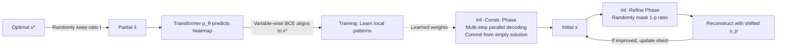

# MaskCO: Masked Generation Drives Effective Representation Learning and Exploiting for Combinatorial Optimization

**Conference**: ICLR 2026  
**OpenReview**: [https://openreview.net/forum?id=psUjNnLhl9](https://openreview.net/forum?id=psUjNnLhl9)  
**Code**: [https://github.com/Thinklab-SJTU/MaskCO](https://github.com/Thinklab-SJTU/MaskCO)  
**Area**: self_supervised  
**Keywords**: Neural Combinatorial Optimization, Masked Generation, Self-Supervised Learning, Representation Learning, TSP, CVRP, MIS  

## TL;DR
MaskCO redefines "learning to solve combinatorial optimization" as "masked self-supervision on optimal solutions"—masking a part of the optimal solution for the model to complete. This fissions a single (instance, solution) pair into exponential local learning signals and utilizes a "mask-reconstruct" loop during inference to iteratively refine solutions. It reduces the optimality gap by 99%+ on TSP/CVRP/MIS and achieves approximately 10x speedup.

## Background & Motivation
- **Background**: Neural Combinatorial Optimization (NCO) has long been dominated by two paradigms: construction (autoregressive/non-autoregressive one-time construction) and improvement (neural-guided local search). Recently, diffusion models and tree searches have pushed heatmap-based soft-constraint solving to competitive levels on problems like TSP and MIS.
- **Limitations of Prior Work**: Existing methods treat a solution as a **monolithic** object and only impose objective constraints on the final output. This wastes fine-grained decision patterns inherent in the **recurring local sub-structures** of optimal solutions (e.g., efficient sub-paths in routing, node clusters in graph problems), leading to low data efficiency and poor scalability. Obtaining reliable supervision signals (optimal solutions) in CO is expensive, making it inefficient to use a solution only once.
- **Key Challenge**: NLP and CV previously struggled with heavy dependence on task labels until self-supervised pre-training (GPT's next-token, BERT/MAE's masked autoencoding) revolutionized these fields by mining latent patterns from raw data. The CO solution space is discrete, non-sequential, and requires high scalability—precisely the strengths of masked generation—yet this paradigm was rarely applied to CO training objectives.
- **Goal**: To find a **foundational, scalable, and problem-agnostic** training paradigm for NCO, similar to masked autoencoding, that enables models to learn transferable solution structure representations rather than memorizing entire solutions.
- **Core Idea**: **[Masking as Fission]** Randomly mask a portion of the optimal solution $x^\star$ to obtain a partial solution $\hat{x}$, training the model to complete masked variables from context. A single solution can sample exponentially many partial solutions, decomposing global supervision into massive "local decision" signals. This forces the model to internalize fine-grained structural dependencies. During inference, this capability is transformed into an efficient searcher via "mask-reconstruct."

## Method

### Overall Architecture
MaskCO is a minimalist, problem-agnostic encoder-decoder Transformer framework where training and inference share the same masking mechanism. The training phase involves random masking of optimal solutions and learning completion via variable-wise BCE. Inference consists of two stages: multi-step parallel decoding from an empty solution to grow an initial solution, followed by iterative refinement via "randomly mask 1-p portion $\rightarrow$ reconstruct this portion."

### Key Designs

**1. Solution-level self-supervised training.** Given an optimal solution $x^\star \in \Omega(G)$, a retention ratio $t \sim D_t$ (default uniform) is sampled, and $\lceil t \cdot |x^\star| \rceil$ variables are uniformly kept to form a partial solution $\hat{x}$. The model outputs selection probabilities $p_\theta(G, \hat{x}) \in [0,1]^{|U(G)|}$. Binary Cross Entropy (BCE) is applied variable-wise using $x^\star$ as the target: $\mathcal{L} = \mathrm{BCE}(p_\theta(G, \hat{x}), x^\star) = -\sum_{u} [x^\star_u \log p_{\theta,u} + (1 - x^\star_u) \log (1 - p_{\theta,u})]$. Each masked position represents an independent judgment of whether a variable belongs to the optimal solution. Since different subsets are masked in each iteration, the model encounters numerous reasoning paths, learning a robust **置信度 estimator for arbitrary partial states**.

**2. Multi-step parallel decoding.** The inference construction stage reuses completion capabilities without extra search. A monotonic scheduling function $\gamma$ with $\gamma(0)=0, \gamma(1)=1$ (default linear $\gamma(t)=t$) controls the growth rate. For problems with fixed cardinality $m$ (e.g., TSP with $m$ edges), starting from $\hat{x}^{(0)}=0$, step $i$ uses a greedy selection function $f_G$ to pick variables with the highest confidence in the heatmap that remain feasible, ensuring the count reaches $\lceil \gamma(i/K) \cdot m \rceil$: $\hat{x}^{(i)} \leftarrow f_G(\hat{x}^{(i-1)}, p_\theta(G, \hat{x}^{(i-1)}), \lceil \gamma(i/K) \cdot m \rceil)$. For variable cardinality (e.g., MIS), the scale is estimated via $m_\theta(\hat{x}) = \sum_u p_{\theta,u}$ before scheduling.

**3. Mask-and-reconstruct refinement.** To avoid irreversible early errors in deterministic decoding, a refinement stage is introduced. Given current solution $x$, a portion is randomly masked with retention rate $p$ to get $\hat{x}$. It is then reconstructed using a **shifted schedule** $\gamma_p(r) = p + (1-p) \cdot \gamma(r)$. The retained portion acts as "contextual anchors," while masked regions are explored probabilistically. $p$ controls the exploration-exploitation trade-off: small $p$ allows for major re-optimization, while large $p$ enables local refinement. Inference is defined as one construction plus $\lfloor T/K \rfloor - 1$ refinement rounds.

**4. Minimalist and problem-agnostic Transformer backbone.** Standard encoder-decoder Transformer is used. Node features are linearly projected. Edge connectivity is injected into attention logits via a 0-1 adjacency matrix $A$ as an **additive bias**: $Z = Q^\top K + A$. Node-level decisions project features to 1D logits; edge-level decisions use dot products of node embeddings to calculate compatibility. This design minimizes problem-specific components.

## Key Experimental Results

### Main Results Table
On TSP, MaskCO achieves near-zero gaps and outperforms diffusion methods in speed:

| Method | TSP-100 GAP / Time | TSP-500 GAP / Time | TSP-1000 GAP / Time |
|------|------|------|------|
| LKH-3 | 0.00% / 33m | 0.00% / 46.3m | 0.00% / 2.57h |
| DIFUSCO (Ts=100) | 0.06% / 30m | 0.87% / 19.1m | 1.31% / 51.9m |
| Fast T2T | 0.01% / 8.3m | 0.21% / 6.9m | 0.42% / 18.3m |
| LEHD (RRC1000) | 0.0019% / 7.87m | 0.175% / 37.5m | 0.726% / 3.35h |
| **MaskCO (T=2560)** | **0.0000% / 1m0s** | **0.0007% / 43s** | **0.0027% / 2m8s** |

CVRP and MIS performance:

| Problem | Prev. SOTA | MaskCO | Gain |
|------|------|------|------|
| CVRP-1000 | LEHD 1.859% (1.83h) | 0.438% (7m33s, T=10240) | gap↓ ~76%, faster |
| MIS RB-[200-300] | Fast T2T 2.89% (4.7m) | 0.10% (23m, T=32k) | Beats gen. SOTA by 94% |
| MIS ER-[700-800] | T2T 7.72% (27.8m) | 0.62% (43m, T=32k) | gap↓ ~92% |

### Ablation Study Table
Refinement (mask-and-reconstruct) is central to performance on TSP-500:

| Configuration | OBJ. | GAP | Time |
|------|------|------|------|
| w/o corr. (T=K=1) | 16.689 | 0.8656% | <1s |
| w/o corr. (T=K=320) | 16.554 | 0.0520% | 6s |
| **w/ corr. (T=320, K=1)** | **16.546** | **0.0020%** | 6s |

Architecture: Transformer backbone significantly outperforms GCN (0.0020% vs 0.0212% on TSP-500).

### Key Findings
- **Quality-Compute Trade-off**: MaskCO's gap decreases monotonically with forward passes $T$, providing a smooth quality-time curve.
- **Transferable Representations**: Models trained with the masked objective can be swapped into autoregressive or consistency-based decoding, maintaining low gaps.
- **Strong Generalization**: Models trained on 100 nodes achieve a 0.033% gap on TSPLIB (50-200 nodes), an 88.2% improvement over previous SOTA.

## Highlights & Insights
- **Paradigm Shift**: Introduces solution-level self-supervised masked generation as a foundational NCO paradigm, addressing the bottleneck of expensive labels and wasted local structures.
- **Training-Inference Isomorphism**: Masked completion serves as the training loss, parallel decoding op, and local search operator, unifying the framework.
- **Data Efficiency Leverage**: Fissioning one optimal solution into exponential partial solutions maximizes the value of expensive supervision.
- **Scalability through Simplicity**: Minimal problem-specific design allows a single framework to cover node selection, edge selection, and hard-constrained problems.

## Limitations & Future Work
- **Compute Trade-off**: Achieving extreme gaps requires large $T$ (e.g., 23-43 mins for MIS), requiring balance in real-time scenarios.
- **Dependence on Optimal Supervision**: The objective relies on existing high-quality reference solutions; transferability to problems without such references remains to be verified.
- **Hard Constraints in CVRP**: Feasibility in hard-constrained problems partially relies on external 2-opt heuristics.
- **Future Work**: The internalized local dependencies provide a base for multi-task and cross-problem scaling.

## Related Work & Insights
- **NCO Categories**: Distinguishes itself from construction (Kool/POMO, DIFUSCO) and improvement (NeuOpt) by focusing on local sub-structures.
- **Generative Lineage**: Translates the "masking + non-autoregressive parallel decoding" lineage from BERT, MAE, and MaskGIT into the discrete CO domain.

## Rating
- **Novelty**: ⭐⭐⭐⭐⭐
- **Experimental Thoroughness**: ⭐⭐⭐⭐⭐
- **Writing Quality**: ⭐⭐⭐⭐
- **Value**: ⭐⭐⭐⭐⭐

<!-- RELATED:START -->

## Related Papers

- [\[ICLR 2026\] Self-Predictive Representations for Combinatorial Generalization in Behavioral Cloning](self-predictive_representations_for_combinatorial_generalization_in_behavioral_c.md)
- [\[ICLR 2026\] Temporal Slowness in Central Vision Drives Semantic Object Learning](temporal_slowness_in_central_vision_drives_semantic_object_learning.md)
- [\[CVPR 2026\] Learning from Semantic Dictionaries: Discriminative Codebook Contrastive Learning for Unified Visual Representation and Generation](../../CVPR2026/self_supervised/learning_from_semantic_dictionaries_discriminative_codebook_contrastive_learning.md)
- [\[ICLR 2026\] Exploiting Low-Dimensional Manifold of Features for Few-Shot Whole Slide Image Classification](exploiting_low-dimensional_manifold_of_features_for_few-shot_whole_slide_image_c.md)
- [\[ICLR 2026\] Rethinking Unsupervised Cross-Modal Flow Estimation: Learning from Decoupled Optimization and Consistency Constraint](rethinking_unsupervised_cross-modal_flow_estimation_learning_from_decoupled_opti.md)

<!-- RELATED:END -->
