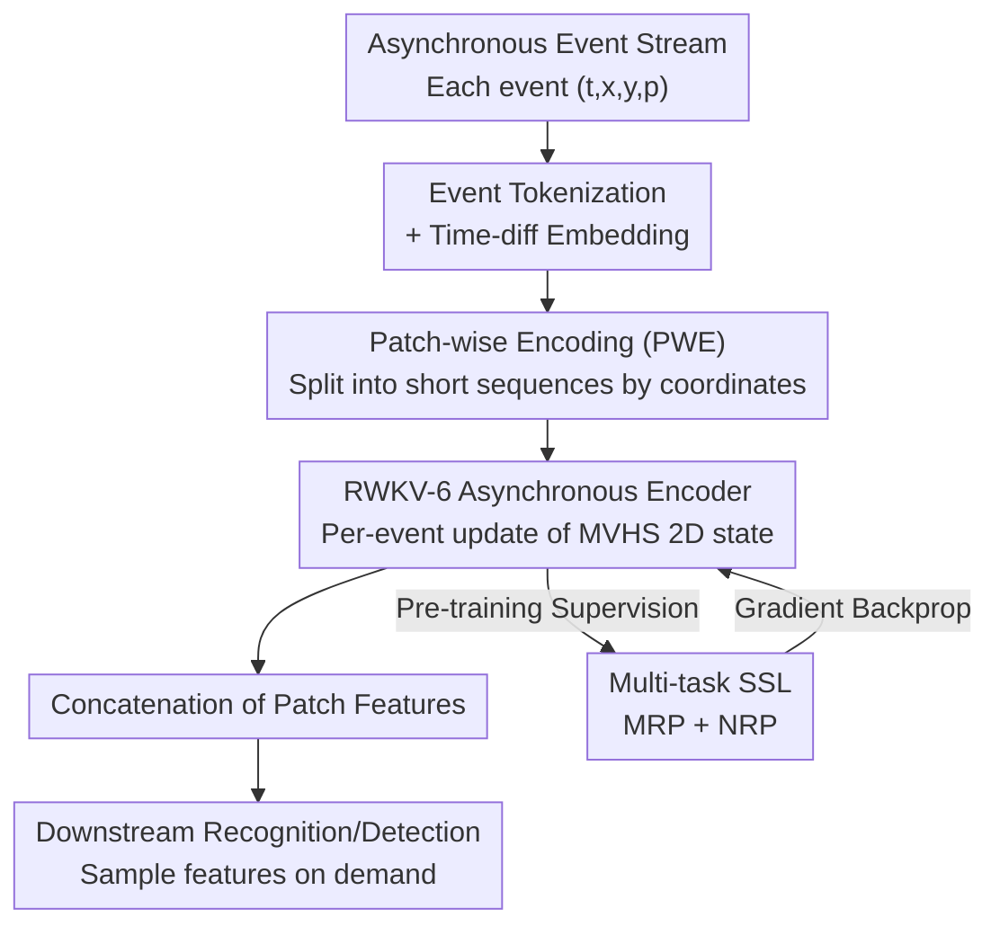

# Maximizing Asynchronicity in Event-based Neural Networks

**Conference**: ICLR 2026  
**arXiv**: [2505.11165](https://arxiv.org/abs/2505.11165)  
**Code**: [github.com/haohq19/eva](https://github.com/haohq19/eva)  
**Area**: Event cameras/Efficient inference  
**Keywords**: Event cameras, Asynchronous processing, Linear attention, Self-supervised learning, RWKV-6, A2S

## TL;DR
The EVA framework is proposed, treating events as language tokens and utilizing a RWKV-6 based linear attention asynchronous encoder for event-by-event feature updates. Combined with Multi-Representation Prediction (MRP) and Next-Representation Prediction (NRP) self-supervised learning, it acquires generalizable features, successfully achieving high-difficulty object detection tasks in the Asynchronous-to-Synchronous (A2S) paradigm for the first time (0.477 mAP on Gen1 dataset).

## Background & Motivation

**Characteristics and Challenges of Event Cameras**: Event cameras output asynchronous sparse event streams with high temporal resolution (up to 1μs), low latency, and low spatial redundancy. However, standard ML algorithms require tensor-like inputs; the asynchronous and sparse nature of event data fundamentally contradicts existing methods.

**Emergence of the A2S Paradigm**: The Asynchronous-to-Synchronous (A2S) framework bridges the gap between asynchronous data and synchronous algorithms by designing an efficient asynchronous encoder to update tensor-like features event-by-event, which are then sampled as needed for downstream synchronous ML algorithms.

**Limitations of Prior Work**: (1) Insufficient encoder expressiveness—ALERT-Transformer uses EventNet (point-cloud based) without hierarchical learning, limited to simple recognition tasks; (2) End-to-end supervised learning leads to task-specific features lacking cross-task generalization; (3) On complex detection tasks, A2S methods significantly underperform compared to dense synchronous methods.

**Key Insight: Analogy between Events and Language**: Two key similarities exist—(i) both are organized sequentially, and (ii) both contribute information incrementally (events record incremental brightness changes, words incrementally build semantics). This inspires migrating linear attention and self-supervised learning techniques from NLP to event processing.

**Key Differences between Events and Language**: (i) Information density—a single language token has rich semantics, while a single event only records pixel-level brightness changes and requires aggregation to be meaningful; (ii) Spatial locality—events possess spatial attributes (pixel coordinates) which language lacks. These differences guide the architectural adjustments.

**Goal**: Design a more expressive asynchronous encoder and self-supervised learning method, enabling the A2S framework to not only surpass prior A2S methods but also successfully tackle high-difficulty detection tasks for the first time.

## Method

### Overall Architecture

EVA (Event-as-lAnguage) processes event streams as language sequences: raw events are first tokenized and embedded as vectors, then sliced into multiple short sequences (PWE) based on spatial patches. Each sequence is fed into a RWKV-6 based asynchronous linear attention encoder, which updates a 2D Matrix-Valued Hidden State (MVHS) as the feature output per event. Features from each patch are concatenated and passed to downstream recognition or detection algorithms. The encoder is independent of downstream labels and is trained via two self-supervised tasks: Multi-Representation Prediction (MRP) and Next-Representation Prediction (NRP). During inference, the encoder incrementally updates internal states as each event arrives, allowing downstream algorithms to sample the current features at any time—implementing the "asynchronous encoding, synchronous downstream" A2S paradigm.

### Key Designs

**1. Event Tokenization and Time-diff Embedding: Translating Asynchronous Events into Learnable Vectors**

To enter the encoder, each event $e_i = (t_i, x_i, y_i, p_i)$ must be transformed into a vector $\bm{x}_i \in \mathbb{R}^D$. Spatially, a bijective mapping $\text{Tok}(x, y, p) = p \times H \times W + y \times W + x$ compresses "coordinates + polarity" into a unique token. The vocabulary size is $2 \times H \times W$, ensuring each spatial position and polarity combination corresponds to an independent learnable embedding. Temporally, absolute timestamps are avoided; instead, the time difference between adjacent events $\Delta t_i = t_i - t_{i-1}$ is sinusoidally encoded. The final embedding is the sum of spatial and temporal embeddings. Using time differences addresses the issue of unbounded absolute timestamps in long-running event cameras, which would otherwise lead to extrapolation failures similar to those in LLMs.

**2. Patch-wise Encoding (PWE): Exploiting Spatial Locality for Efficiency and Resolution Invariance**

EVA leverages the spatial attributes of events: for a sensor resolution of $(H_{\text{sensor}}, W_{\text{sensor}})$, events are partitioned into $H_{\text{sensor}} \times W_{\text{sensor}} / P^2$ independent sequences based on a patch size $P$. A separate encoder instance runs for each patch, and features are concatenated for the downstream stage. This shortens individual sequences, reduces computational overhead, allows for parallelization, and enables model scaling with the number of patches. Crucially, it provides resolution invariance—the encoder trained on fixed-size patches can be applied to cameras with different resolutions without retraining.

**3. Matrix-Valued Hidden State (MVHS) as Output: Using 2D States to Compensate for Low Event Information**

A single event records brightness change at only one pixel, resulting in much lower information density than a language token. Thus, a traditional 1D vector output $\bm{y} \in \mathbb{R}^{D}$ is insufficient. EVA utilizes the 2D matrix hidden state $\bm{S} \in \mathbb{R}^{N \times D_{\text{head}} \times D_{\text{head}}}$ from RWKV-6 linear attention as the output feature. The recurrence relation of RWKV-6, $\bm{S}_i = \text{diag}(\bm{w}_i) \bm{S}_{i-1} + \bm{v}_i \bm{k}_i^T$, naturally accumulates global information up to the current moment, compensating for the lack of information in a single event. Combined with a multi-head mechanism (where each head has dimension $D_{\text{head}} = D/N$), the MVHS expands feature capacity without increasing model width $D$. This is lightweight for real-time inference while its 2D structure facilitates learning fine-grained spatial features.

**4. Multi-task SSL (MRP+NRP): Learning Transferable Features without Downstream Labels**

To avoid task-specific features caused by end-to-end supervision, EVA trains the encoder using two self-supervised objectives. Multi-Representation Prediction (MRP) forces the encoded feature $\mathcal{F}_i = \mathcal{M}_\theta(\{e_j\}_{j \leq i})$ to simultaneously predict multiple handcrafted representations like Event Count (EC) and Time Surface (TS), with the objective: $\arg\max_{\theta, \Theta} \mathbb{E}_i \prod_{k=1}^{K} \textbf{Pr}(\mathcal{R}_i^k | \mathcal{F}_i; \theta_k)$. Different representations capture various facets of event information, forcing the model to learn comprehensive, generalizable features. Next-Representation Prediction (NRP) mimics next-token prediction in NLP, requiring the model to predict representations for a future time window $\Delta T$ from current features: $\arg\max_{\theta, \Theta'} \mathbb{E}_i \prod_{k=1}^{K'} \textbf{Pr}(\mathcal{R}^k(\{e | t_i < t(e) \leq t_i + \Delta T\}) | \mathcal{F}_i; \theta_k')$. This forces the model to understand motion dynamics rather than just memorizing history. Both tasks use aggregated representations as targets because individual events are too noisy and unpredictable.

## Key Experimental Results

### DVS128-Gesture Recognition

| Model | Encoder Param | Classifier Param | MAC/Event | Latency | SA | FVA |
|------|------------|------------|---------|------|-----|-----|
| ALERT-Tr. (+RM) | 1.41M | 13.96M | 1.22M | 5.8ms | 84.6% | 94.1% |
| ALERT-Tr. (+LMM) | 0.04M | 0.57M | 0.004M | 3.9ms | 72.6% | 89.2% |
| **Ours (+ResNet-14)** | **0.62M** | **2.83M** | **0.60M** | **14.7ms** | **92.9%** | **96.9%** |

### Gen1 Object Detection

| Model | Type | mAP (%) |
|------|------|---------|
| NVS-S | End-to-end Asynchronous (A) | 8.6 |
| AEGNN | End-to-end Asynchronous (A) | 14.5 |
| DAGr-L | End-to-end Asynchronous (A) | 32.1 |
| FARSE-CNN | End-to-end Asynchronous (A) | 30.0 |
| ASTMNet | Synchronous Dense (S) | 46.7 |
| RVT-B | Synchronous Dense (S) | 47.2 |
| GET | Synchronous Dense (S) | 47.9 |
| **Ours (+RVT-B, D=128)** | **A2S** | **47.5** |
| **Ours-L (+RVT-B, D=192)** | **A2S** | **47.7** |

### Ablation Study

| MVHS | Time Embedding | FVA | SA |
|------|---------|-----|-----|
| ✓ | ✓ | **98.1%** | **94.7%** |
| ✓ | ✗ | 87.8% | 81.1% |
| ✗ | ✓ | 97.4% | 94.1% |

## Key Findings

- **A2S Paradigm Succeeds in Detection for the First Time**: EVA achieves 47.7 mAP on Gen1, outperforming the synchronous SOTA method RVT-B (47.2). This is the first time an A2S method has delivered competitive results in detection.
- **MVHS Significantly Improves Expressiveness**: Removing MVHS drops SA from 94.7% to 94.1%, while removing time embeddings has a much larger negative impact (SA drops to 81.1%), highlighting the necessity of temporal modeling in event processing.
- **MRP Representations Mutually Benefit Learning**: Learning only one representation (EC) results in a higher EC loss (0.701 vs 0.366), indicating positive transfer effects across multiple representations.
- **NRP Gains are Independent of MRP**: Removing NRP drops FVA from 98.1% to 96.8% and SA from 94.7% to 94.4%, suggesting that predicting future representations helps the model learn beyond simple history memorization.
- **Smaller Patches Yield Better Performance**: Increasing patch size from 16 to 128 drops SA from 94.7% to 89.3%, despite larger patches having lower pre-training loss due to higher sparsity.

## Highlights & Insights

- **Systematic Event-Language Analogy**: Moving beyond simple comparison, the work analyzes similarities (sequential structure, incremental info) and differences (info density, spatial locality), leading to specific architectural adjustments—MVHS for density and PWE for locality.
- **First Successful Application of RWKV-6 to Event Domain**: The combination of parallel training and recurrent inference in linear attention matches the needs of the A2S paradigm. RWKV-6's data-dependent decay and gating are well-suited for continuous dynamic data.
- **Paradigm Shift from 1D to 2D Features**: Using matrix hidden states instead of vector outputs is a novel approach to expand expressiveness without increasing model width, while the 2D structure naturally aligns with vision tasks.
- **Generalization of Self-Supervised Features**: Encoder features pre-trained on Gen1 can be used directly for the N-Cars classification task (96.3% accuracy), validating feature generalization.

## Limitations

- **Latency Constraints in High-Resolution Scenarios**: The event rate in Gen1 (0.618M/s) already exceeds the throughput of EVA-L (0.541M/s). While PWE mitigates this, challenges remain for higher resolution sensors like Gen3 (1280×720).
- **SSL Objectives Rely on Handcrafted Representations**: Supervision signals for MRP and NRP come from EC and TS, which may lose certain event information, potentially limiting the learning ceiling.
- **Validated Only in the Event Domain**: While the framework is theoretically general, experiments are limited to event camera data; its applicability to other asynchronous sequences (e.g., neural spikes) has not been explored.
- **Higher Encoder Latency**: Due to its hierarchical learning architecture, EVA's per-event inference latency (14.7ms for 8192 events) is higher than ALERT-Tr., though total processing time is shorter.

## Related Work & Insights

### vs ALERT-Transformer (Martin-Turrero et al., 2024)
Previously the strongest A2S method, using EventNet for asynchronous encoding. EVA improves FVA by 2.8% and SA by 8.3% on DVS128-Gesture. More importantly, ALERT-Tr. failed to provide detection results, whereas EVA achieves 47.7 mAP. The key difference lies in EVA using RWKV-6 for hierarchical learning and MVHS for expanded expressiveness.

### vs RVT-B (Gehrig & Scaramuzza, 2023)
A SOTA synchronous dense method, achieving 47.2 mAP on Gen1. EVA-L surpasses this with 47.7 mAP using only 6 input feature channels (vs 20 for RVT-B). This indicates that the A2S paradigm can match or exceed synchronous methods through better asynchronous encoders while retaining asynchronous low-latency advantages.

### vs DAGr (Gehrig & Scaramuzza, 2024)
An end-to-end asynchronous Graph Neural Network method with 32.1 mAP on Gen1. EVA's 47.7 mAP is a massive improvement (+15.6), demonstrating that the "encoding + dense downstream" A2S paradigm is more effective than pure asynchronous methods, which are often limited by graph methods' temporal accumulation capabilities.

## Rating

| Dimension | Rating | Reason |
|------|------|------|
| Novelty | ⭐⭐⭐⭐ | Systematic event-language analogy and MVHS design are novel, though core components (RWKV-6, SSL) are established. |
| Technical Depth | ⭐⭐⭐⭐ | Design is well-justified with comprehensive ablations and a complete logical chain from analogy to architecture. |
| Experimental Thoroughness | ⭐⭐⭐⭐ | Covers recognition, detection, and timing analysis, though tests on more datasets/tasks would be beneficial. |
| Value | ⭐⭐⭐⭐⭐ | First A2S method to conquer detection; PWE supports any resolution; open-source code has direct value for real-time applications. |

<!-- RELATED:START -->

## Related Papers

- [\[ICLR 2026\] PredNext: Explicit Cross-View Temporal Prediction for Unsupervised Learning in Spiking Neural Networks](prednext_explicit_cross-view_temporal_prediction_for_unsupervised_learning_in_sp.md)
- [\[CVPR 2026\] Robust Spiking Neural Networks by Temporal Mutual Information](../../CVPR2026/self_supervised/robust_spiking_neural_networks_by_temporal_mutual_information.md)
- [\[CVPR 2026\] On the Role of Temporal Granularity in the Robustness of Spiking Neural Networks](../../CVPR2026/self_supervised/on_the_role_of_temporal_granularity_in_the_robustness_of_spiking_neural_networks.md)
- [\[AAAI 2026\] Spikingformer: A Key Foundation Model for Spiking Neural Networks](../../AAAI2026/self_supervised/spikingformer_a_key_foundation_model_for_spiking_neural_networks.md)
- [\[ICLR 2026\] Maximizing Incremental Information Entropy for Contrastive Learning](maximizing_incremental_information_entropy_for_contrastive_learning.md)

<!-- RELATED:END -->
