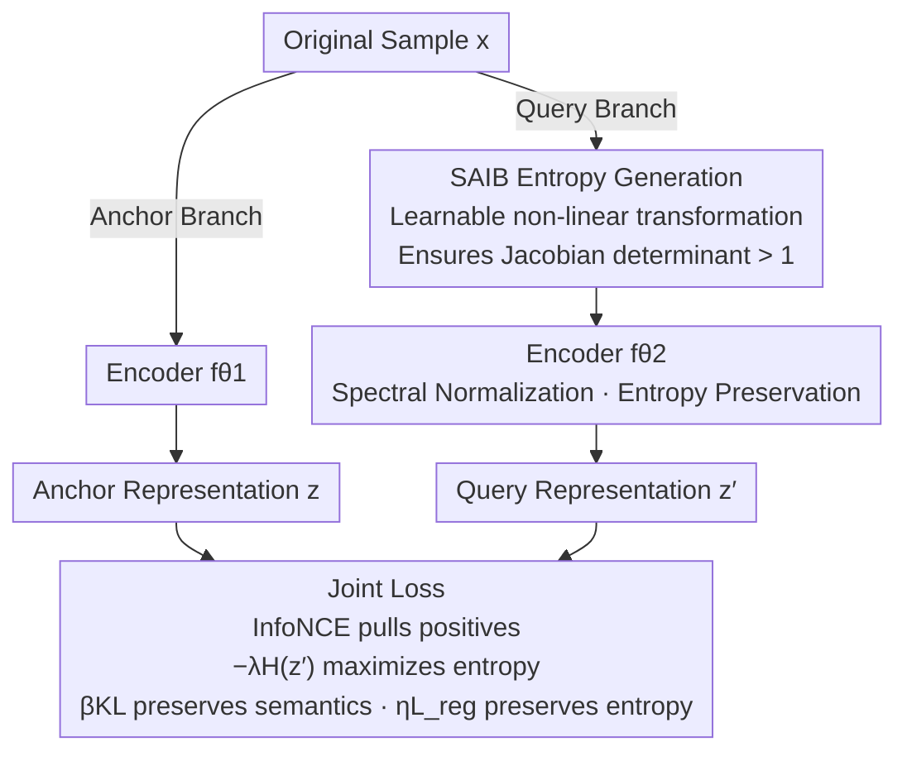

# Maximizing Incremental Information Entropy for Contrastive Learning

**Conference**: ICLR2026  
**arXiv**: [2603.12594](https://arxiv.org/abs/2603.12594)  
**Code**: Pending confirmation  
**Area**: Self-supervised  
**Keywords**: Contrastive Learning, Information Entropy, Incremental Entropy, Information Bottleneck, Learnable Transformation

## TL;DR
The IE-CL (Incremental-Entropy Contrastive Learning) framework is proposed to explicitly optimize the entropy gain between augmented views (rather than just maximizing mutual information). By treating the encoder as an information bottleneck and jointly optimizing learnable transformations (entropy generation) with encoder regularizers (entropy preservation), it consistently improves contrastive learning performance on CIFAR-10/100, STL-10, and ImageNet under small-batch settings. The core modules can be integrated into existing frameworks as plug-and-play components.

## Background & Motivation

**Background**: Self-supervised contrastive learning has become a core paradigm for representation learning, typically based on mutual information maximization (e.g., InfoNCE) to learn invariant features between augmented views. Methods such as SimCLR, MoCo, and BYOL have achieved significant success.

**Limitations of Prior Work**:
   - Static data augmentation strategies (random cropping, color jittering, etc.) maintain a fixed distribution during training and cannot adaptively adjust the augmentation difficulty based on learning progress.
   - Rigid invariance constraints require the encoder to produce identical representations for all augmentations, which may lead to excessive compression of useful information—resulting in a "bottleneck that is too tight."
   - While the goal of mutual information maximization is intuitive, it ignores the impact of the information increment introduced by the augmentation process itself on representation quality.

**Key Challenge**: Stronger data augmentations introduce more informational changes, which theoretically help in learning robust features; however, excessively strong augmentations may exceed semantic preservation boundaries, destroying the semantic consistency of positive pairs. There is a lack of a unified framework to balance "entropy generation" and "semantic preservation."

**Goal**: To design a theoretically guided contrastive learning framework that maximizes the information entropy gain between augmented views while maintaining semantic consistency.

**Key Insight**: Redefining the encoder as an information bottleneck and restructuring the optimization objective from "mutual information maximization" to "incremental information entropy maximization," thereby decoupling entropy generation and preservation into two independently optimizable sub-objectives.

**Core Idea**: Using learnable transformations to adaptively generate information entropy + using encoder regularization to preserve entropy → Breaking the dual limitations of static augmentation and rigid invariance.

## Method

### Overall Architecture

IE-CL follows the dual-stream structure of contrastive learning but re-evaluates the purpose of augmentation. Its core assertion is that representation quality is determined not only by how much information is shared between two views (mutual information) but also by **how much new uncertainty is injected during the augmentation phase and whether this new information can be retained by the encoder**. Consequently, it explicitly splits the information flow into "Entropy Generation → Entropy Preservation" stages, each controlled by an optimizable parameter.

Specifically, the original sample $x$ enters two branches simultaneously: the anchor branch uses encoder $f_{\theta_1}$ to directly encode the anchor representation $z$; the query branch first passes through a learnable non-linear transformation module SAIB (Sample Augmentation Incremental Block, $g_\phi$) to create a view $x'$ with higher incremental entropy, which is then encoded into the query representation $z'$ by encoder $f_{\theta_2}$. During training, the system jointly optimizes: InfoNCE to pull positive pairs together and push negative pairs apart; an entropy term $-\lambda H(z')$ to encourage the query representation to be more divergent (preserving the entropy generated by SAIB); encoder regularization (spectral normalization) to prevent $f_{\theta_2}$ from compressing the incremental information; and a KL term to pull the query distribution back toward the anchor distribution to avoid augmentations exceeding semantic boundaries. Thus, "mutual information maximization" is reformulated as "controllably generating information increments and then transmitting them intact to the representation space."

### Key Designs

**1. Incremental Information Entropy Decomposition: The Encoder as a Critical Bottleneck**

Traditional contrastive learning is equivalent to maximizing the mutual information $I(Z;Z^+)$ (proven via Donsker–Varadhan as $\min L_{\text{InfoNCE}}\Leftrightarrow\max I(Z;Z^+)$), yet it treats augmentation as a fixed, stochastic black box where the degree of variation is uncontrollable. IE-CL decomposes this process: it first defines incremental information entropy at the input stage as $\Delta H(X)=H(X')-H(X)$, proving that for a linear transformation $A$, $\Delta H=\log|\det A|$. This formula exposes the weakness of traditional augmentations—rotations, crops, and flips are isometric transformations where $|\det A|=1$, thus $\Delta H=0$. They only increase diversity at the batch level without raising the entropy of individual samples. Furthermore, by the Data Processing Inequality, the encoder as a deterministic function $f$ satisfies $H(f(X))\le H(X)+\mathbb{E}[\log|\det J_f|]$. If the Jacobian term is a large negative value, the entropy generated at the input will be lost. This leads to the core proposition of the paper: robustly increasing representation entropy $H(Z')$ requires satisfying both "input entropy generation" and "encoder entropy preservation."

**2. SAIB: Active Entropy Generation via Learnable Non-linear Transformations**

Since isometric augmentations cannot generate entropy ($\Delta H=0$), a non-isometric transformation with $|\det A|>1$ is required. IE-CL designs SAIB for this purpose: the input $X\in\mathbb{R}^{3\times H\times W}$ is partitioned into patches with positional encodings, similar to a ViT, then passed through a non-linear residual stack of $1\times1\text{-Conv}\to3\times3\text{-Conv}\to1\times1\text{-Conv}$ (channel expansion ratio of 2). With two skip connections and a final reshape combined with a third skip connection, the output is $X'=X+\text{reshape}(P')$. This "channel expansion + residual" structure ensures that the local Jacobian of SAIB satisfies $|\det A|>1$ almost everywhere, guaranteeing a positive entropy increment $\Delta H(P)>0$. Crucially, SAIB only acts on the query branch and is trained end-to-end with the encoder, allowing the "difficulty" to adapt to the representation capacity.

**3. Spectral Normalization for Preservation + KL Constraint for Semantics**

To ensure the entropy generated by SAIB effectively increases representation entropy, the encoder bottleneck must be mitigated without allowing the augmentation to lose semantic meaning. The former is achieved via spectral normalization (Lipschitz constraint) on encoder $f_{\theta_2}$, providing a lower bound for $\mathbb{E}[\log|\det J_{f_\theta}|]$ and preventing excessive compression. The latter is addressed using a Kullback–Leibler (KL) divergence constraint: since SAIB only modifies the query branch, aggressive entropy generation might cause the query distribution to deviate from the anchor distribution. Penalizing $D_{KL}(p_\phi\,\|\,q)$ (where $p_\phi$ is the transformed query distribution and $q$ is the anchor distribution) pulls the augmentation back within semantic boundaries.

**4. Plug-and-Play: Decoupling Modules from the Backbone**

The SAIB and encoder regularization are designed as components decoupled from specific frameworks. They do not rely on negative sample queues or momentum encoders, allowing them to be directly applied to SimCLR, MoCo, or BYOL without modifying the backbone. Experiments show consistent improvements across frameworks; since the informational difference in each positive pair is actively amplified, the supervision becomes denser, which is particularly effective in small-batch settings (128–512) where negative samples are insufficient.

### Loss & Training

The final objective integrates the terms into a weighted end-to-end loss:

$$L_{\text{final}} = L_{\text{InfoNCE}} + \beta\, D_{KL}(p_\phi\,\|\,q) - \lambda\, H(Z') + \eta\, L_{\text{reg\_encoder}} + \gamma\, R(g_\phi)$$

Where $L_{\text{InfoNCE}}$ drives the primary representation learning; $D_{KL}$ ensures semantic consistency of the SAIB transformation; $-\lambda H(Z')$ directly optimizes representation diversity; $\eta L_{\text{reg\_encoder}}$ (spectral normalization) implements entropy preservation; and $\gamma R(g_\phi)$ is optional weight decay for SAIB parameters. All weights $\lambda,\beta,\eta,\gamma>0$.

## Key Experimental Results

### Main Results: Performance Gains in Small-Batch Contrastive Learning

| Dataset | Method | Batch=128 | Batch=256 | Batch=512 |
|--------|------|-----------|-----------|-----------|
| CIFAR-10 | SimCLR | 90.1 | 91.3 | 92.0 |
| CIFAR-10 | **SimCLR+IE-CL** | **91.8** | **92.5** | **93.0** |
| CIFAR-100 | SimCLR | 63.2 | 65.1 | 66.8 |
| CIFAR-100 | **SimCLR+IE-CL** | **65.9** | **67.0** | **68.3** |
| STL-10 | SimCLR | 85.6 | 87.2 | 88.1 |
| STL-10 | **SimCLR+IE-CL** | **87.4** | **88.5** | **89.2** |

IE-CL shows the most significant improvements (1.5-2.7%) in small-batch settings, narrowing the performance gap between small and large batches.

### Comparison with Other Contrastive Learning Methods

| Method | CIFAR-10 (Linear Eval) | CIFAR-100 (Linear Eval) | ImageNet (Top-1) |
|------|-------------------|---------------------|-----------------|
| SimCLR | 91.3 | 65.1 | 69.3 |
| MoCo v2 | 91.8 | 66.4 | 71.1 |
| BYOL | 92.0 | 67.2 | 74.3 |
| **IE-CL (SimCLR)** | **92.5** | **67.0** | **70.8** |
| **IE-CL (MoCo)** | **92.9** | **68.1** | **72.4** |

As a plug-and-play module, IE-CL brings consistent improvements to both SimCLR and MoCo, verifying its framework-agnostic nature.

### Ablation Study

| Component | CIFAR-100 Acc |
|------|--------------|
| Baseline (SimCLR) | 65.1 |
| + Entropy Generation Module | 66.3 (+1.2) |
| + Entropy Preservation Regularization | 66.0 (+0.9) |
| + Both combined | **67.0 (+1.9)** |

Each component is effective individually, and their combined use yields the best results, indicating a synergistic effect.

## Highlights & Insights
- **Innovation from an Information Theory Perspective**: Reformulating the contrastive learning objective from "mutual information maximization" to "incremental information entropy maximization" provides a more refined optimization direction—focusing not only on shared info between views but also explicitly modeling information changes introduced by augmentation.
- **Small-batch Friendly**: Contrastive learning usually relies heavily on large batches (4096+). IE-CL compensates for the lack of negative samples by increasing the informational difference in each sample pair, showing significant gains at 128-512 batch sizes.
- **Plug-and-Play**: Core modules can be seamlessly integrated into SimCLR/MoCo/BYOL, lowering the barrier to application.
- **Bridge between Theory and Practice**: While Information Bottleneck theory is often used as a post-hoc explanatory tool, IE-CL elevates it to a front-end design principle.

## Limitations & Future Work
- **Semantic Safety of Learnable Transformations**: The security boundary of SAIB ($g_\phi$) relies solely on the KL divergence constraint; it lacks more explicit semantic preservation guarantees, risking semantic drift during aggressive entropy generation.
- **Limited Gains on ImageNet**: The improvement on large-scale datasets (~1.5%) is less pronounced than on small datasets, likely because the diversity of large datasets already provides sufficient informational variation.
- **Computational Overhead**: The learnable transformation module increases the computational cost of forward propagation, though the paper does not report detailed training time comparisons.
- **Future Directions**: Exploring adversarial augmentation generation and integration with masked self-supervised methods like MAE.

## Related Work & Insights
- **vs SimCLR/MoCo**: These methods use fixed augmentation strategies + mutual information maximization. IE-CL replaces these with learnable augmentation + incremental entropy maximization, which is theoretically superior as it directly optimizes information gain.
- **vs AdCo/HardCL**: AdCo increases difficulty via adversarial negative sample generation, while HardCL improves efficiency through hard positive sample mining. IE-CL provides a unified explanation from an information-theoretic perspective—essentially, these methods all increase the amount of informational variation.
- **vs VICReg/Barlow Twins**: These methods prevent representation collapse through variance/redundancy regularization. IE-CL’s entropy preservation regularization offers a complementary view—not only preventing collapse but actively retaining useful variations.

## Rating
- Novelty: ⭐⭐⭐⭐ The incremental information entropy perspective is novel, elevating the information bottleneck from an analytical tool to a design principle.
- Experimental Thoroughness: ⭐⭐⭐⭐ Validated across multiple datasets and frameworks with insightful small-batch analysis, though large-scale experiments could be more extensive.
- Writing Quality: ⭐⭐⭐⭐ Clear theoretical framework and well-articulated motivation.
- Value: ⭐⭐⭐⭐ Provides a new optimization perspective for contrastive learning with strong practical utility due to its plug-and-play nature.

<!-- RELATED:START -->

## Related Papers

- [\[ICLR 2026\] Contrastive Predictive Coding Done Right for Mutual Information Estimation](contrastive_predictive_coding_done_right_for_mutual_information_estimation.md)
- [\[ICLR 2026\] Maximizing Asynchronicity in Event-based Neural Networks](maximizing_asynchronicity_in_event-based_neural_networks.md)
- [\[AAAI 2026\] BCE3S: Binary Cross-Entropy Based Tripartite Synergistic Learning for Long-tailed Recognition](../../AAAI2026/self_supervised/bce3s_binary_cross-entropy_based_tripartite_synergistic_learning_for_long-tailed.md)
- [\[CVPR 2026\] Robust Spiking Neural Networks by Temporal Mutual Information](../../CVPR2026/self_supervised/robust_spiking_neural_networks_by_temporal_mutual_information.md)
- [\[ICLR 2026\] On the Alignment Between Supervised and Self-Supervised Contrastive Learning](on_the_alignment_between_supervised_and_self-supervised_contrastive_learning.md)

<!-- RELATED:END -->
