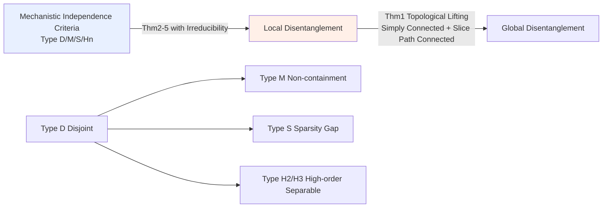

# Mechanistic Independence: A Principle for Identifiable Disentangled Representations

**Conference**: ICLR 2026  
**OpenReview**: [https://openreview.net/forum?id=0VVdai71xb](https://openreview.net/forum?id=0VVdai71xb)  
**Code**: To be confirmed  
**Area**: Representation Learning / Disentangled Representations / Identifiability Theory  
**Keywords**: Disentangled representations, identifiability, mechanistic independence, nonlinear ICA, subspace identifiability  

## TL;DR
This paper proposes "mechanistic independence" as a unifying principle for the identifiability of disentangled representations. It defines factors by how they **act on observations** through a generator (rather than how they are distributed), providing a family of subspace identifiability theorems that are invariant to latent density re-weighting and hold even under nonlinear, non-invertible mixing.

## Background & Motivation
**Background**: Disentangled representation learning aims to recover latent factors of variation that generate observed data. The classic route to identifiability assumes **statistical independence** of latent factors (ICA / ISA). However, Hyvärinen & Pajunen (1999) proved that statistical independence alone is insufficient for identifiability in general nonlinear mixing, leading many works to add **extra distributional assumptions** such as temporal structure, auxiliary variables, multi-view data, or interventions.

**Limitations of Prior Work**: Another complementary route constrains the **generative mechanism** itself (sparsity, additive structure, Jacobian orthogonality i.e., IMA, etc.). However, these results remain isolated and lack a unified framework. Crucially, most still **couple** statistical independence with mechanistic constraints, meaning identifiability results fail if the latent distribution changes—once statistical dependencies appear between factors, true factors may misalign with any statistically independent subspace.

**Key Challenge**: Should identifiability be anchored in "how factors are distributed" or "how factors act on observations"? The former is sensitive to density and fragile under dependence; the latter is intuitively closer to "causal/mechanistic structure" but has lacked abstraction as a self-consistent organizing principle.

**Goal**: To establish mechanistic independence as an **independent and self-consistent organizing principle**, providing a subspace identifiability theory that is independent of any statistical assumptions, invariant to latent density re-weighting, and applicable to non-invertible generators and multi-dimensional factors.

**Core Idea** (**Mechanistic Independence**): Factors are characterized by the way they act on the observation manifold through the generator $g$. This paper proposes a family of mechanistic independence criteria ranging from strong to weak (Type D / M / S / Hₙ), proves that each criterion paired with a corresponding "irreducibility" yields an identifiability theorem, and establishes a hierarchy and graph-theoretic characterization between these criteria.

## Method

### Overall Architecture
The data generation process is defined as $g: S \to X \subseteq \mathbb{R}^{d_x}$, mapping a latent configuration space $S \subseteq S_1 \times \cdots \times S_K$ (where each $S_i$ is a positive-dimensional subspace and the latent distribution $P_s$ is strictly positive on $S$) to an observation manifold $X = g(S)$. Disentanglement is defined as: a decoder $\hat g$ is disentangled relative to $g$ if and only if $g = \hat g \circ h$ where $h$ is a **decomposable mapping** (each target factor depends only on its corresponding source factor). The paper first uses topological arguments to lift "local disentanglement" to "global disentanglement," and then provides a family of mechanistic independence criteria based on the generator's Jacobian to certify local disentanglement at the local level.

### Key Designs
**1. From Local to Global: The Topological Lifting Theorem (Theorem 1) states that "local disentanglement implies global disentanglement."** The strategy is as follows: the real challenge lies in proving local disentanglement, while global properties are essentially a "topological free lunch." Theorem 1 shows that if the source space $S$ is simply connected, every $(K{-}1)$-slice (the subspace obtained by fixing all but $k$ factors) is path-connected, $g$ is continuous and locally injective, and $\hat g$ is a covering map, then local disentanglement propagates along paths to global disentanglement. The intuition is that each factor can vary independently, local injectivity prevents branching, and thus local decompositions can be stitched into a global decomposition without ambiguity. In common cases like convex open sets in $\mathbb{R}^n$, these topological conditions are automatically satisfied, allowing the paper to focus on **local** identifiability, with conclusions also holding for non-invertible generators.

**2. Type D / M: Relaxing overlap from "coordinate disjoint" to "non-containment."** The strongest Type D independence requires different factors to act on **disjoint observation coordinates**—formally $D_i g_s(u) \bullet D_j g_s(v) = 0$ (where $\bullet$ is the Hadamard product), meaning each factor controls a non-overlapping set of pixels. Rewriting using the support of the Jacobian column vectors $\Omega_i(s) := \mathrm{supp}(Dg_s(u_i))$, this means $\forall a\in C_i, b\in C_j:\ \Omega_a(s)\cap\Omega_b(s)=\varnothing$. Type M relaxes this to **non-containment** $\Omega_a(s)\pitchfork\Omega_b(s)$ (they can intersect, but neither is contained in the other), allowing for pixel overlaps such as partial occlusion, shadows, or reflections. Type M identifiability (Theorem 3) additionally requires a sparsity constraint $\lVert J_{\hat g}(z)\rVert_0 \le \lVert J_g(s)\rVert_0$, which directly inspires a sparsity regularization term and generalizes the 1D results of Zheng & Zhang (2023) to multi-dimensional factors.

**3. Type S: Characterizing the limit relaxation for aligned bases via "Sparsity Gap."** Type S independence shifts the perspective to the Jacobian as a dictionary: define $\rho^+_B(s)$ as the minimum $\ell_0$ norm of the $Dg_s$ matrix when the basis is aligned with the true decomposition $B=\bigoplus_i T_{s_i}S_i$, and $\rho^-_B(s)$ as the $\ell_0$ infimum over all bases that **do not** respect $B$. It requires $\rho^+_B(s) < \rho^-_B(s)$. The meaning is that the sparsest dictionary is achieved precisely when the basis aligns with the true factor decomposition; any misalignment strictly increases the support. This is much weaker than Type D—it can hold even with significant support overlap (in the 1D case, as long as the shared pixel ratio does not exceed half, misaligned bases will increase the count of non-zero elements even if they perfectly cancel shared elements). Type S thus becomes the theoretical limit capturing "all potential cancellations," but since $\ell_0$ optimization is intractable, practice relies on compositional contrast as a proxy loss.

**4. Type Hₙ: Unifying additive and asymmetric interactions via vanishing high-order cross-derivatives.** Type Hₙ independence requires all cross-block $n$-order derivatives to vanish, $D^n_{i,j}g_s=0$. For $n=2$, this means all cross-Hessian blocks are zero, equivalent to an additive structure $g(s)=\sum_i g^{(i)}(s_i)$ (Lachapelle et al. 2023); $n>2$ further relaxes this. Combined with "$n$-order separability" (requiring the image of $D^n_{i,i}g_s$ to have trivial intersection with the space spanned by other blocks and lower-order derivatives), Theorem 5 provides identifiability. A key improvement in this paper is the explicit requirement for source factors to be **irreducible**, eliminating dependence on $(n{+1})$-order derivatives (which might not exist) and unifying the asymmetric interaction principle of Brady et al. (2024) as a special case.

**5. Hierarchy and Graph-theoretic Characterization: Equating "independent and irreducible factors" to connected components.** The four criteria form a natural hierarchy (Fig. 1): Type D is the strongest and implies the others; differentiating Type D yields Type H₂, then H₃, etc.; disjointness is a special case of non-containment, thus implying Type M; under the sparsest integrated basis, Type D also implies Type S. The paper further provides a graph-theoretic characterization: define an edge in graph $G_D(s,B)$ as $D g_s(u_i)\bullet Dg_s(u_j)\neq 0$; then Type D independent and irreducible factors **correspond exactly to the connected components of $G_D$**. An aligned basis reaches at most $K$ connected components, while any misaligned basis has strictly fewer. This unifies "sparsity gap" with "connected component count gap" and incorporates existing results like local isometry and conformal mapping into the same graph perspective.

## Key Experimental Results
Ours is primarily theoretical; experiments serve only to verify the feasibility of proxy losses (synthetic data, replicating the setup of Brady et al. 2023).

### Main Results Setup

| Item | Configuration |
|------|------|
| Generator | Invertible MLP, Jacobian constructed with specified support structure |
| Latent Variables | Standard normal sampling |
| Loss | $\mathcal{L}=\mathcal{L}_{recon}+\lambda C_{comp}$ (Reconstruction + compositional contrast) |
| Slot number | $L=K\in\{2,3,5\}$ |
| Reg. Strength | $\lambda\in\{10^{-2},1\}$, 5 random seeds |
| Metric | Slot Identifiability Score (SIS) |

Where compositional contrast is $C_{comp}(\hat g,z)=\sum_{n=1}^{d_x}\sum_{i=1}^{K}\sum_{j=i+1}^{K}\big|\frac{\partial \hat g_n}{\partial z_i}\big|\big|\frac{\partial \hat g_n}{\partial z_j}\big|$, acting as a proxy loss for Type S independence.

### Key Findings
- **Proxy loss is reliable with small overlap**: When the observation dimensions affected by different slots have small overlaps, $C_{comp}$ reliably acts as a proxy for Type S independence, resulting in high SIS and good identifiability.
- **Degradation with large overlap**: As the overlap ratio increases, optimization more easily falls into bad local minima, leading to a decrease in identification quality; finding more robust proxy losses is listed as an open problem.
- **0% overlap is the only point satisfying Type D**: Only complete disjointness falls into the strongest Type D; other intervals require weaker criteria like Type S for coverage.

## Highlights & Insights
- **Thoroughness of Perspective Shift**: By moving identifiability entirely from "latent distribution" to "generative mechanism," the conclusions are invariant to any re-weighting of the latent density—factors are identified even if statistical dependencies exist between or within factors, marking a fundamental departure from the ICA/ISA lineage.
- **Strong Unification**: A single framework simultaneously covers and generalizes disjoint supports in object-centric learning (Brady 2023), asymmetric interactions (Brady 2024), additive decoders (Lachapelle 2023), and partially includes elements of sparsity-based nonlinear ICA (Zheng 2022/2023) that do not depend on statistical independence; Jacobian orthogonality in IMA also becomes an instance in this taxonomy.
- **Irreducibility is an Underestimated Key**: Elevating "factor irreducibility" to the same status as "independence" both excludes spurious solutions where factors are arbitrarily split and recombined and eliminates the need for $(n{+1})$-order derivatives, making the theory valid for non-invertible generators.
- **Self-consistency of Three Equivalent Perspectives**: Sparsity gap ⇔ connected component count gap ⇔ mechanistic independence provides algebraic, graph-theoretic, and geometric languages for the same phenomenon.

## Limitations & Future Work
- **Weak Practical Operability**: The $\ell_0$ sparsity gap of Type S cannot be directly optimized and must be approximated by compositional contrast, which fails when overlaps are large.
- **Explicit but Restricted Physical Failure Modes in Images**: Type D fails with shadows, reflections, transparency, or occlusions; Type H₂ holds only under strictly additive mixing; high-order Hₙ is theoretically broader but high-order derivatives are practically uncomputable.
- **Small Experimental Scale**: Tested only on synthetic data with invertible MLPs, without validation on real images or large-scale scenarios; a gap remains between theory and practice.
- **Combining Statistics and Mechanism is the Future Direction**: The authors note that strong identification for 1D factors still requires extra distributional assumptions; graph construction could serve as a tool to fuse mechanistic and statistical independence to recover multi-dimensional factors.

## Related Work & Insights
- **Response to ICA/ISA Lineage**: While the classic route relies on statistical independence plus temporal/auxiliary/multi-view/interventional constraints, Ours relies on generator properties, making it valid for a broad range of latent densities.
- **Unification of Mechanistic Constraint Lineage**: Post-nonlinear, near-linear, local isometry, piecewise affine, sparse, additive, conformal/orthogonal, and Jacobian constraints (IMA) are brought under a single taxonomy, with mechanistic independence acting as their "greatest common divisor."
- **Theoretical Explanation for Sparse VAEs**: Provides a theoretical basis for the empirical phenomenon where Rhodes & Lee (2021) broke rotational symmetry by penalizing the decoder Jacobian with $\ell_1$; synthetic datasets in Moran et al. (2021) can also be proven to satisfy the theorems in this paper.
- **Inspiration**: The idea of "anchoring identifiability in mechanism rather than distribution" can be transferred to causal representation learning and subspace identification in object-centric learning, especially when statistical independence assumptions do not hold in real-world data.

## Rating
- **Novelty**: ⭐⭐⭐⭐⭐ High originality in abstracting mechanistic independence as a standalone principle and proposing a family of identifiability criteria, hierarchy, and graph-theoretic characterizations, unifying multiple disparate lines of work.
- **Experimental Thoroughness**: ⭐⭐ Purely theory-oriented; only small synthetic experiments were used to verify proxy losses, lacking real-world and large-scale validation.
- **Writing Quality**: ⭐⭐⭐⭐ Conceptual levels are clear, and the hierarchy and graph-theoretic characterizations are self-consistent; however, definitions and theorems are dense with heavy notation, posing a high barrier for readers without an identifiability background.
- **Value**: ⭐⭐⭐⭐ Represents a significant unification and generalization of identifiability theory for disentangled representations, providing a principled foundation for future methods and regularizers that do not rely on statistical independence.

<!-- RELATED:START -->

## Related Papers

- [\[ICLR 2026\] A Bayesian Nonparametric Framework for Learning Disentangled Representations](a_bayesian_nonparametric_framework_for_learning_disentangled_representations.md)
- [\[ICLR 2026\] GUIDE: Gated Uncertainty-Informed Disentangled Experts for Long-tailed Recognition](guide_gated_uncertainty-informed_disentangled_experts_for_long-tailed_recognitio.md)
- [\[ICLR 2026\] Diverse Dictionary Learning](diverse_dictionary_learning.md)
- [\[ICLR 2026\] OrthoRF: Exploring Orthogonality in Object-Centric Representations](orthorf_exploring_orthogonality_in_object-centric_representations.md)
- [\[ICLR 2026\] Self-Predictive Representations for Combinatorial Generalization in Behavioral Cloning](self-predictive_representations_for_combinatorial_generalization_in_behavioral_c.md)

<!-- RELATED:END -->
