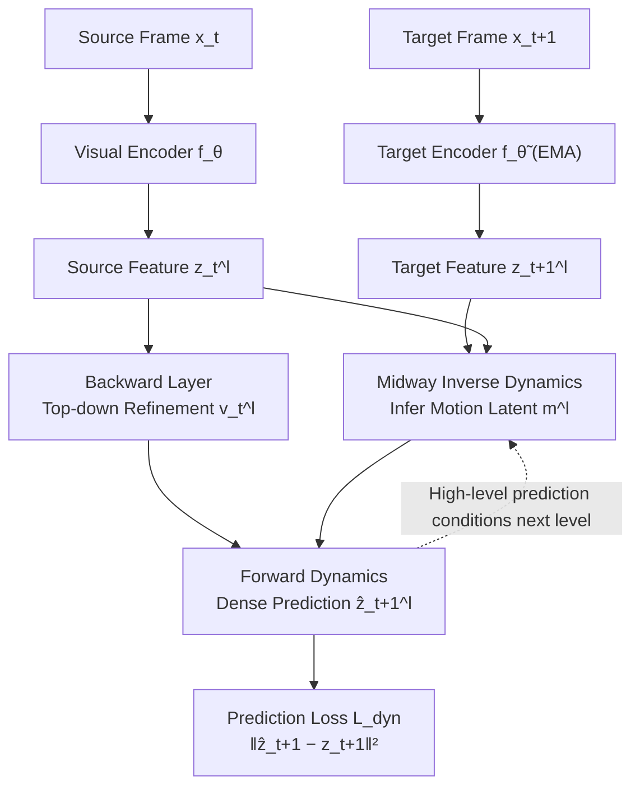

# Midway Network: Learning Representations for Recognition and Motion from Latent Dynamics

**Conference**: ICLR 2026  
**OpenReview**: [https://openreview.net/forum?id=ZenwrTwNcj](https://openreview.net/forum?id=ZenwrTwNcj)  
**Code**: Provided in the paper (New York University, Chris Hoang & Mengye Ren)  
**Area**: Self-Supervised Representation Learning / Video Representation Learning  
**Keywords**: Self-Supervised Learning, Latent Space Dynamics, Inverse/Forward Dynamics, Optical Flow, Semantic Segmentation, Natural Video  

## TL;DR
Midway Network transfers "latent dynamics modeling" from decision-making domains to natural videos. By employing a **midway top-down path** to infer latent motion variables between frames, combined with **dense forward prediction** and a **hierarchical structure**, it is the first method to successfully learn both "object recognition (semantic segmentation)" and "motion understanding (optical flow)" representations using only natural videos.

## Background & Motivation
- **Background**: Visual Self-Supervised Learning (SSL) can extract strong representations from unlabeled data, but most methods serve either recognition **or** motion. Image-based SSL (DINO/iBOT/MAE) learns semantics from curated "iconic" images but lacks temporal information for motion; motion-based methods (optical flow/cross-view reconstruction) often yield poor semantics.
- **Limitations of Prior Work**: Few works attempt SSL on natural videos. Some **fail to utilize motion transformations** (DoRA, Walking Tours), while others **rely on external supervised optical flow networks** to provide motion as an off-the-shelf signal (FlowE, PooDLe). MC-JEPA, which considers both semantics and motion, still relies on curated iconic image training.
- **Key Challenge**: Recognition and motion are complementary in perception—recognition establishes correspondences across views, while motion links the same object through time and space to learn invariant attributes. However, learning both simultaneously using **purely natural videos** has not been achieved.
- **Goal**: Jointly learn image-level representations transferable to both recognition and motion tasks using only natural videos (no labels, no external flow networks, no iconic images).
- **Key Insight**: **"Introduce latent dynamics modeling into natural video SSL"**—drawing from neuroscientific predictive coding (inverse dynamics = recognition, forward dynamics = generative prediction) and latent dynamics in decision-making (DynaMo/Dreamer). The framework uses inverse dynamics to infer motion latents and forward dynamics for prediction, with two key adaptations for complex "multi-object scenes" in natural videos: **dense forward prediction** (instead of global features) and a **hierarchical refinement architecture**.

## Method

### Overall Architecture
Midway Network takes a pair of source/target video frames $x_t, x_{t+1}$ and encodes them into multi-level features $z_t=f_\theta(x_t)$ and $z_{t+1}=f_{\tilde\theta}(x_{t+1})$ using a student-teacher setup (where target $\tilde\theta$ is an EMA of student $\theta$). The core is a loop across multiple feature levels $l=1..L$: a **midway path** infers motion latents $m$ top-down, a **backward layer** refines source features $v_t$ via lateral connections, and a **forward predictor** predicts dense target features $\hat z_{t+1}$ conditioned on $v_t$ and $m$. The prediction error $\mathcal{L}_{\text{dyn}}$ jointly trains all components at every level.

### Key Designs

**1. Midway Top-Down Motion Latents: Incorporating "Hierarchical Flow Refinement" into Inverse Dynamics.** The midway path is a Transformer that takes the motion latent from the previous layer $m^{l+1}$, source features $z_t^l$, and target features $z_{t+1}^l$ to output and **incrementally accumulate** the current level's latent: $m^l = \text{midway}(m^{l+1}, z_t^l, z_{t+1}^l) + m^{l+1}$. The initial latent is a learnable token. Crucially, except at the highest level, the midway path uses the predicted $\hat z_t^l$ from the forward path instead of the true $z_t^l$, **refining motion top-down conditioned on high-level predictions**. This design is borrowed from classical optical flow networks (PWC-Net, UFlow), which use intermediate flow estimates to warp features and calculate cost volumes for low-level refinement.

**2. Dense Forward Prediction Target: Adapting SSL for Multi-Object Natural Scenes.** Latent dynamics in decision-making (e.g., DynaMo) often predict global features, which works for single-object simulations but fails in complex natural scenes. Midway shifts the target to **dense features**. The forward dynamics (Transformer) processes backward features $v_t^l$ and motion latents $m^{l+1}$ (concatenated spatially) to predict dense features of the target frame. The loss is a normalized per-position MSE: $\mathcal{L}^l_{\text{dyn}} = \lVert \bar{\hat z}^l_{t+1} - \bar z^l_{t+1}\rVert_2^2$, with a total loss summed across levels: $\mathcal{L}_{\text{dyn}}=\sum_{l=1}^{L-1}\mathcal{L}^l_{\text{dyn}}$. Combined with the backward layer (cross-attention where low-level features query high-level backward features), this creates "hierarchical refinement," offloading low-level detail encoding from high-level semantic features.

**3. Forward Prediction Gating: Breaking the "Identity Bias" of Transformer Residuals.** Standard Transformer blocks have residual connections that pass input tokens through unchanged, biasing the model toward an identity mapping (assuming objects haven't moved). However, the model must learn whether an object moved and if its features can be computed from other spatial locations. Thus, **learnable gating** $g$ (an MLP outputting a 0~1 vector weight per token) is added to the residuals in the forward dynamics Transformer: $h = g(x)\cdot x + \text{Attention}(x)$. Gating is omitted in the first block and for the motion latent $m$ to ensure sufficient initial information and complete propagation of motion signals. Experiments show gating improves both semantic quality and dynamic interpretability. Additionally, a PooDLe-style **DINO invariance objective** (on small crops via joint-embedding) is used as a regularizer.

## Key Experimental Results

Pre-training data: BDD100K (70k dashcam videos) and Walking Tours-Venice (first-person walking videos). Downstream: Semantic Segmentation (BDD/Cityscapes/WT-Sem/ADE20K for recognition) and Optical Flow (FlyingThings/MPI-Sintel for motion). Metrics: mIoU/Acc (higher is better), EPE (End-point error, lower is better).

### Main Results (BDD100K Pre-trained, 224×224, ViT-S)

| Method | BDD Linear mIoU | BDD UperNet mIoU | FlyingThings EPE(f) | MPI-Sintel EPE(f) |
|---|---|---|---|---|
| iBOT (ViT-S) | 27.2 | 35.5 | 18.0 | 13.7 |
| DINO (ViT-S) | 36.7 | 49.3 | 13.8 | 10.8 |
| CroCo v2 | 21.2 | 31.9 | 9.4 | 5.8 |
| DoRA | 30.4 | 40.8 | 15.1 | 11.9 |
| DynaMo† | 36.8 | 47.4 | — | — |
| **Midway (ViT-S)** | **39.7** | **50.4** | **6.8** | **4.9** |
| **Midway (ViT-B)** | **48.2** | **55.2** | 6.4 | 4.8 |

Key takeaway: **Midway is the only model strong in both semantic segmentation and optical flow**. DINO (semantic-focused) fails at flow; CroCo v2 (motion-focused) fails at semantics. Midway outperforms all baselines on BDD segmentation and leads significantly in optical flow.

### Ablation Study (BDD Linear mIoU / MPI-Sintel Flow EPE)

| Variant | mIoU↑ | EPE↓ |
|---|---|---|
| Base model | 28.3 | 6.2 |
| + Latent Dynamics | 30.4 | 4.4 |
| Full model | 31.5 | 4.1 |
| No backward | 30.4 | 3.7 |
| No multi-level | 30.3 | 5.2 |
| No refinement | 30.8 | 5.1 |

Key takeaway: Latent dynamics provide the largest single improvement (Semantics +2.1, Flow -1.8). **Multi-level structures and top-down refinement are critical**; removing them degrades both semantics and motion performance.

### Key Findings
- **Enc. Only Experiment**: If pre-trained midway/forward weights are not used (randomly initialized), optical flow performance drops sharply—proving the dynamics model learns features useful for motion estimation beyond just the encoder.
- **Scalability**: Downstream performance improves consistently from ViT-S to ViT-B (BDD linear: 39.7 → 48.2).
- **Forward Feature Perturbation Analysis**: Perturbing forward features demonstrates that Midway’s dynamics capture **high-level semantic correspondences** between frames.

## Highlights & Insights
- **Elegant Paradigm Transfer**: Successfully migrates latent dynamics (inverse + forward) from decision-making/world models to "pure natural video SSL" without requiring ground-truth actions or rewards.
- **Neuroscientific Alignment**: The split between "recognition = inverse dynamics" and "generation = forward dynamics" in Friston’s predictive coding maps perfectly to recognition and motion representations.
- **Abstracting Engineering Wisdom**: Hierarchical refinement and warp-then-refine patterns from optical flow are abstracted into the Midway architecture rather than hard-coded.
- **Gating Design**: Identifying the identity bias in Transformer residuals as a hindrance to detecting motion is a clever insight, improving both performance and interpretability.

## Limitations & Future Work
- **Compute Constraints**: WT was pre-trained only on the Venice subset; model scales were limited to ViT-B, leaving larger scales and longer sequences unexplored.
- **Pair-wise Training**: Only adjacent frame pairs were used for dynamics, ignoring longer temporal windows and long-term motion or occlusion modeling.
- **ViT-B Flow vs CroCo v2**: At the ViT-B scale, pure motion tasks (flow) are still slightly behind specialized cross-view reconstruction methods.
- **Readout Dependency**: Flow requires finetuning and semantics require linear/UperNet readouts; the zero-shot capability of the dynamics representation is not fully demonstrated.

## Related Work & Insights
- **Predictive Coding**: PredNet, Friston’s theory → Midway implements hierarchical prediction of sensory inputs in a latent feature space for natural videos.
- **Dynamics Modeling / World Models**: DynaMo, V-JEPA 2, DINO-WM → These rely on actions/rewards or simulations. Midway removes these dependencies for natural videos using dense hierarchical layers.
- **Visual SSL**: DINO/iBOT (iconic), DoRA/PooDLe (natural video but PooDLe relies on external flow), CroCo v2 (motion only) → Midway's differentiator is "pure natural video + simultaneous mastery of both".
- **Inspiration**: Abstracting iterative refinement/hierarchical biases from one domain into latent modeling of another is a methodology worth replicating.

## Rating
- **Novelty**: ⭐⭐⭐⭐ — First to jointly learn recognition + motion via latent dynamics on natural videos with a novel midway path/gated dense prediction.
- **Experimental Thoroughness**: ⭐⭐⭐⭐ — Covers multiple datasets and tasks with strong baselines, limited only by the lack of larger-scale model testing.
- **Writing Quality**: ⭐⭐⭐⭐ — Clear connection to neuroscientific motivations and clear architectural descriptions.
- **Value**: ⭐⭐⭐⭐ — Provides a feasible paradigm for unified perceptual representation learning without labels, external flow, or iconic image biases.

<!-- RELATED:START -->

## Related Papers

- [\[ICLR 2026\] Regularized Latent Dynamics Prediction is a Strong Baseline for Behavioral Foundation Models](regularized_latent_dynamics_prediction_is_a_strong_baseline_for_behavioral_found.md)
- [\[ICLR 2026\] Learning Dynamics of Logits Debiasing for Long-Tailed Semi-Supervised Learning](learning_dynamics_of_logits_debiasing_for_long-tailed_semi-supervised_learning.md)
- [\[ICLR 2026\] A Bayesian Nonparametric Framework for Learning Disentangled Representations](a_bayesian_nonparametric_framework_for_learning_disentangled_representations.md)
- [\[ICLR 2026\] Mechanistic Independence: A Principle for Identifiable Disentangled Representations](mechanistic_independence_a_principle_for_identifiable_disentangled_representatio.md)
- [\[ICLR 2026\] OrthoRF: Exploring Orthogonality in Object-Centric Representations](orthorf_exploring_orthogonality_in_object-centric_representations.md)

<!-- RELATED:END -->
