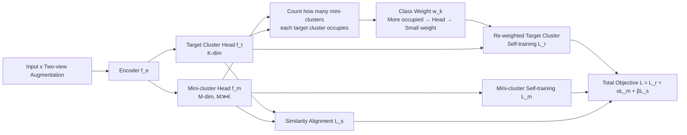

# Mini-cluster Guided Long-tailed Deep Clustering

**Conference**: ICLR 2026  
**OpenReview**: [https://openreview.net/forum?id=3JlljaiQwR](https://openreview.net/forum?id=3JlljaiQwR)  
**Code**: [https://github.com/LZX-001/MiniClustering](https://github.com/LZX-001/MiniClustering)  
**Area**: Self-Supervised / Deep Clustering / Long-tailed Learning  
**Keywords**: Deep Clustering, Long-tailed Distribution, Unsupervised Re-weighting, mini-cluster, Self-labeling  

## TL;DR
This paper proposes MiniClustering, which utilizes an auxiliary "fine-grained over-clustering" head to estimate how many mini-clusters each target cluster occupies. Under **purely unsupervised** conditions, it infers head/tail attributes for each class to re-weight the self-training loss, systematically introducing the re-weighting concept from supervised long-tailed learning into deep clustering for the first time.

## Background & Motivation
- **Background**: Deep clustering has made significant progress. Mainstream approaches either use contrastive learning/autoencoders for representation followed by K-means, or employ a clustering head with self-labeling self-training. However, almost all methods assume **class-balanced** data.
- **Limitations of Prior Work**: Real-world data commonly follows a **long-tailed distribution**—many samples for head classes and few for tail classes. Models tend to bias towards head classes and suppress tail classes, causing significant performance degradation. While supervised long-tailed learning (re-sampling / re-weighting / logit adjustment) is mature, it **entirely relies on label frequency** as a prior.
- **Key Challenge**: Deep clustering is **purely unsupervised** and lacks label frequencies, making it impossible to directly apply supervised long-tail balancing strategies. Estimating "which classes are head/tail and what weights to assign" without labels remains an open challenge.
- **Goal**: To estimate training weights for each class in an unsupervised setting and apply re-weighted self-training loss to long-tailed deep clustering to mitigate model bias.
- **Key Insight**: **Over-clustering exposes long-tailed structures**—when data is clustered into far more groups than the actual number of classes (mini-clusters), head classes occupy **more** mini-clusters due to their larger embedding space, while tail classes are squeezed into **fewer**. Consequently, the count of mini-clusters associated with a target cluster serves as an unsupervised proxy for head/tail attributes, which can be converted into re-weighting factors.

## Method

### Overall Architecture
MiniClustering is built on the self-labeling clustering head paradigm. The network consists of three components: a shared encoder $f_e$ (pretrained via unsupervised representation learning like BYOL), a **target cluster head** $f_t$ with an output dimension equal to the actual class count $K$, and a **mini-cluster head** $f_m$ with an output dimension $M \gg K$. Both heads share embeddings but differ in granularity: $f_m$ performs fine-grained over-clustering to expose long-tailed structures, while $f_t$ produces final cluster predictions. Training is driven by three joint losses: mini-cluster self-training, re-weighted target cluster self-training, and a similarity loss to align both heads.

### Key Designs
**1. Exposing Long-tailed Structures via Over-clustering: Mini-cluster Head**　The authors first observe three phenomena: on long-tailed CIFAR-10, head classes occupy larger embedding spaces and are split into multiple clusters by K-means, while tail classes share clusters with others (Phenomenon 1); clustering data into more groups than actual classes improves overall purity (Phenomenon 2); the number of mini-clusters assigned to head classes is consistently higher than for tail classes, a pattern robust across representation methods, $M$ values, and thresholds $\delta$ (Phenomenon 3). $f_m$ is trained using confidence-based self-labeling cross-entropy: $L_m = -\frac{1}{|S^m_\tau|}\sum_{i\in S^m_\tau}\sum_{j=1}^{M} y^m_{i,j}\log(p^m_{i,j})$, where $S^m_\tau=\{i\mid c^m_i>\tau\}$ keeps only high-confidence samples. Theorem 1 states: when mini-cluster minimum purity $\rho > \frac{N_j S_{\max}}{(N_i-\epsilon_i)S_{\min}}$, classes with more samples occupy more mini-clusters. This upgrades the empirical observation to a conditionally valid theorem, explaining why high-quality pretrained representations are necessary.

**2. Unsupervised Weight Estimation and Re-weighted Self-training**　This is the core transition from supervised to unsupervised long-tail learning. For target cluster $k$, the number of mini-clusters it "occupies" (where target cluster $k$ samples exceed threshold $\delta$ within that mini-cluster) is counted. The weight is defined as $w_k = \frac{M}{\max\left(\sum_{j=1}^{M}\mathbb{1}\left(\frac{|T_{k,j}|}{|T_j|}>\delta\right),\, 0.5\right)}$, where $T_{k,j}$ is the set of samples predicted as target cluster $k$ and mini-cluster $j$. A larger denominator (head class) leads to smaller weights, while a smaller denominator (tail class) leads to larger weights; the lower bound 0.5 prevents division by zero. This is a soft assignment—if $\delta<0.5$, one mini-cluster can be counted by multiple target clusters. Weights are then injected into the target cluster head loss: $L_r = -\frac{1}{|S^t_\tau|}\sum_{i\in S^t_\tau}\sum_{j=1}^{K} w_{\hat{y}^t_i}\, y^t_{i,j}\log(p^t_{i,j})$, rebalancing gradient contributions to mitigate head bias.

**3. Similarity Alignment to Prevent Divergence**　Since $f_t$ and $f_m$ are updated by different losses, they might lose synchronization, causing weights and clusters to be based on mismatched features. The authors align them via similarity maps: the self-similarity matrices of in-batch prediction matrices $P^t\,(N\times K)$ and $P^m\,(N\times M)$ should be consistent. Samples close in target clusters should also be close in mini-clusters. Alignment is achieved via Frobenius norm MSE: $L_s = \frac{1}{N^2}\lVert P^t P^{t\top} - P^m P^{m\top}\rVert_F^2$. Total objective: $L = L_r + \alpha L_m + \beta L_s$.

## Key Experimental Results

### Main Results
On CIFAR-10 / CIFAR-20 / STL-10 with imbalance ratios (IR) = 5 and 10, compared against SOTA like SCAN, SeCu, LFSS, and ConMix. Metrics: ACC/CAA/NMI/ARI (%).

| Dataset (IR) | Method | ACC | CAA | NMI | ARI |
|---|---|---|---|---|---|
| CIFAR-10 (5) | ConMix | 61.6 | 65.4 | 59.8 | 45.6 |
| CIFAR-10 (5) | BYOL (Baseline) | 60.4 | 66.4 | 62.0 | 46.5 |
| **CIFAR-10 (5)** | **MiniClustering** | **74.3** | **72.6** | **69.9** | **62.1** |
| CIFAR-10 (10) | LFSS | 56.3 | 59.7 | 57.9 | 43.0 |
| CIFAR-10 (10) | BYOL (Baseline) | 51.9 | 55.2 | 56.3 | 41.7 |
| **CIFAR-10 (10)** | **MiniClustering** | **64.6** | **61.4** | **63.9** | **56.7** |
| **STL-10 (5)** | **MiniClustering** | **54.7** | **52.7** | **54.4** | **42.8** |
| **CIFAR-20 (10)** | **MiniClustering** | **44.3** | **41.5** | **47.2** | **30.4** |

Ours achieves the best performance across all settings and metrics; compared to the BYOL baseline, ACC gains on CIFAR-10 (IR=5/10) are 13.9%/12.7% and ARI gains are 15.6%/15.0%.

### Ablation Study
CIFAR-10, imbalance ratio = 10.

| Configuration | ACC | CAA | NMI | ARI |
|---|---|---|---|---|
| BYOL | 51.9 | 55.2 | 56.3 | 41.7 |
| Self-labeling only | 55.6 | 57.6 | 66.3 | 52.5 |
| w/o Threshold τ | 54.1 | 55.1 | 58.5 | 45.6 |
| Only $L_r$ | 59.9 | 58.1 | 63.5 | 52.0 |
| w/o $L_r$ | 46.7 | 39.0 | 51.1 | 26.7 |
| w/o $L_m$ | 46.7* | 39.0* | 51.1 | 26.7 |
| w/o $L_s$ | 56.0 | 57.6 | 63.5 | 40.0 |
| **Full MiniClustering** | **64.6** | **61.4** | **63.9** | **56.7** |

### Key Findings
- **Re-weighting strategy is the primary performance driver**: Training a single target cluster head with self-labeling outperforms the baseline, but ACC/CAA remain significantly lower than the full method, proving the effectiveness of mini-cluster guided re-weighting.
- **$L_m$ prevents tail classes from being absorbed**: Removing $L_m$ results in higher NMI but a sharp drop in CAA to 39.0, indicating that pure self-labeling tends to merge tail samples into other clusters; $L_m$ helps isolate tail classes.
- **$L_r$ and $L_s$ are both essential**: Without $L_r$, weights are not updated and performance collapses (ARI 26.7); without $L_s$, head synchronization is lost (ARI 40.0).
- **Plug-and-play**: When using SimCLR or MoCo as the pre-training framework, MiniClustering consistently exceeds respective baselines.

## Highlights & Insights
- **Converting Long-tail Detection into Over-clustering Counting**: Instead of estimating label frequency directly, the method uses mini-cluster occupancy as an observable proxy, elegantly bypassing the "no-label" constraint.
- **Three-stage Closed Loop**: Starting from observed phenomena, to Theorem 1 for conditions, and finally implementing it via pre-training design. The logic is self-consistent.
- **Paradigm Contribution**: It is the first to systematically transfer class-level re-weighting from supervised learning to deep clustering. It acts as a general downstream plug-in and "adapts" various supervised losses into unsupervised versions.

## Limitations & Future Work
- **Dependency on Pre-trained Representations**: Theorem 1 suggests that poor representation quality (low $\rho$, high $\epsilon$) invalidates the "head occupies more" rule; the method is sensitive to encoder quality.
- **Hyperparameter Overhead**: Parameters like mini-cluster count $M$, threshold $\delta$, $\tau$, and $\alpha/\beta$ require tuning. While robust to $M/\delta$, general settings across datasets require experience.
- **Class Count $K$ remains a Known Prior**: Like most deep clustering work, it assumes the number of actual classes is known.
- **Large-scale and Extreme Long-tails**: Main experiments utilize IR $\le 10$. Results on ImageNet-LT or Tiny-ImageNet are in the appendix and could be further explored.

## Related Work & Insights
- **Deep Clustering**: Divided into representation-based (IDFD, ProPos) and cluster-head-based (SCAN, SeCu, CC); Ours belongs to the latter and explicitly addresses long-tails.
- **Supervised Long-tailed Learning**: Re-sampling, re-weighting, and logit adjustment—Ours adopts the "frequency-based weighting" core but replaces label frequency with mini-cluster counts.
- **Mechanism**: When a supervised prior (label frequency) is unavailable, finding an **observable proxy** exposed by the model's own structure (occupancy count in over-clustering) is a powerful paradigm for handling class imbalance.

## Rating
- **Novelty**: ⭐⭐⭐⭐⭐ First systematic introduction of supervised re-weighting to unsupervised deep clustering using mini-cluster proxies.
- **Experimental Thoroughness**: ⭐⭐⭐⭐ 5 datasets, multiple imbalance ratios, comparison with 10 SOTAs, and extensive ablation studies.
- **Writing Quality**: ⭐⭐⭐⭐ Narrative from phenomena to theorem to method is clear; tables are well-structured.
- **Value**: ⭐⭐⭐⭐⭐ High practical value as a plug-and-play module that addresses the specific pain point of deep clustering failure on real-world long-tailed data.

<!-- RELATED:START -->

## Related Papers

- [\[CVPR 2026\] Nonparametric Deep Fine-grained Clustering with Low-Rank Guided Vision-Language Model](../../CVPR2026/self_supervised/nonparametric_deep_fine-grained_clustering_with_low-rank_guided_vision-language_.md)
- [\[ICLR 2026\] GUIDE: Gated Uncertainty-Informed Disentangled Experts for Long-tailed Recognition](guide_gated_uncertainty-informed_disentangled_experts_for_long-tailed_recognitio.md)
- [\[ICLR 2026\] Learning Dynamics of Logits Debiasing for Long-Tailed Semi-Supervised Learning](learning_dynamics_of_logits_debiasing_for_long-tailed_semi-supervised_learning.md)
- [\[ICLR 2026\] CoLA: Co-Calibrated Logit Adjustment for Long-Tailed Semi-Supervised Learning](cola_co-calibrated_logit_adjustment_for_long-tailed_semi-supervised_learning.md)
- [\[CVPR 2026\] Reframing Long-Tailed Learning via Loss Landscape Geometry](../../CVPR2026/self_supervised/reframing_long-tailed_learning_via_loss_landscape_geometry.md)

<!-- RELATED:END -->
