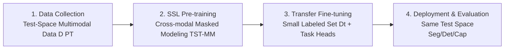

# Multimodality as Supervision: Self-Supervised Specialization to the Test Environment via Multimodality

**Conference**: ICLR 2026  
**OpenReview**: [https://openreview.net/forum?id=4dMlAKBwrA](https://openreview.net/forum?id=4dMlAKBwrA)  
**Code**: [https://tst-vision.epfl.ch](https://tst-vision.epfl.ch)  
**Area**: Self-Supervised Representation Learning / Multimodal Learning  
**Keywords**: cross-modal learning, self-supervised pre-training, test-space specialization, multimodal masked modeling, knowledge distillation  

## TL;DR
By treating "pre-training data originating entirely from the deployment environment itself" as a sandbox, this paper proposes Test-Space Training (TST): performing cross-modal self-supervised pre-training using multimodal data collected within a single test space. The resulting model outperforms universal models trained on internet-scale data (e.g., DINOv2, CLIP, 4M-21) on segmentation, detection, and captioning tasks within that specific environment.

## Background & Motivation
- **Background**: The prevailing paradigm in visual self-supervision (MAE, DINOv2, CLIP, 4M) is to "pre-train a universal model on massive, diverse internet data and then transfer it to various downstream scenarios," trading data scale and diversity for generalization.
- **Limitations of Prior Work**: Many real-world AI devices (home robots, AR/VR glasses, home assistants) effectively **spend their entire lifespan within a fixed space**. They need to perform optimally within that specific house rather than generalizing to every other house in the world. Serving an internet-scale universal model for such scenarios is both wasteful and potentially sub-optimal.
- **Key Challenge**: There is a mismatch between the mainstream pursuit of "universal agents (solving problems everywhere)" and the fact that most deployment scenarios possess a limited operational context. Furthermore, these devices are equipped with rich sensors (depth, normals, IMU), providing multimodal signals that are readily available but underutilized as supervisory signals.
- **Goal**: To answer a core question within a controlled sandbox: if an agent's "entire world" is restricted to a single building, how strong a representation can be learned using only local multimodal data via cross-modal self-supervision? Can it replace or exceed internet-scale universal models?
- **Core Idea**: **[Multimodality as Supervision]** Cross-modal learning (using one modality to predict others) serves as a self-supervised signal requiring no external labels; **[Test-Space Specialization]** Restricting pre-training data entirely to the deployment space and using multimodal "richness" to substitute for data "scale."

## Method

### Overall Architecture
TST is a four-stage pipeline: collecting multimodal sensory data within the test space → cross-modal self-supervised pre-training via multimodal masked modeling → transfer fine-tuning with task heads on a small external dataset → deployment and evaluation back within the same test space. A critical constraint is that the pre-training data ($D_{PT}$) and the labeled transfer set ($D_t$) come from **different distributions**, and no task labels from the test space are leaked during pre-training, making the "same-space pre-training + evaluation" valid under the self-supervised framework.

### Key Designs
**1. Test-Space Sandbox (Problem Setting): Shrinking the "Whole World" to a Single Building** The authors intentionally restrict the user device to a single physical space, assuming both pre-training and downstream evaluation occur there. This constraint offers three-fold value: it serves as a controlled sandbox for manipulating data scale and diversity; it aligns with developmental psychology where infants develop efficient representations in limited physical environments without seeing the whole world; and it reflects real-world deployment where devices do not leave the premises. Formally, given a sampling function $x \sim p_{\text{space}}(x)$ for the space, a pre-training set $D_{PT}=\{x_i\}$ is collected to learn an encoder $f: X \to h$ mapping RGB to representations.

**2. Cross-modal Masked Modeling TST-MM: Predicting One Modality from Another** The pre-training objective utilizes multimodal masked modeling (following MultiMAE / 4M). An encoder-decoder Transformer is trained where each modality is converted into tokens using a modality-specific tokenizer. After random masking, the model reconstructs masked modalities from visible ones. This implements "cross-modal learning": supervision comes entirely from time-locked correspondences between modalities without external labels. The backbone uses ViT-S/B (8/12 layers). A practical detail is that mixing in RGB images from the transfer set (without labels) during pre-training benefits performance. The framework is also compatible with unimodal objectives (TST-MAE, TST-DINO) as baselines, though the multimodal version is superior.

**3. Two-Layer Expansion of the Modality Dictionary: From Hardware Sensors to Pseudo-label Distillation** Modality selection determines representation quality. The authors expand the dictionary in two steps. **Bottom Layer (No External Access)**: Uses 4 hardware-available sensory modalities—RGB, depth, surface normals, and Canny edges (the latter two derived from RGB/depth). This "bare configuration" covers nearly half the gap between training from scratch and supervised upper bounds, competing with DINOv2 but remaining insufficient to replace SOTA universal models. **Top Layer (Pseudo-modalities)**: Outputs from existing pre-trained networks are treated as additional "pseudo-modalities"—CLIP/ImageBind feature maps, SAM edges, ViTDet boxes, and Mask2Former segmentation masks. This is equivalent to "distilling teachers only on test-space data to specialize them to the environment," avoiding direct access to external training data. Interestingly, TST-MM eventually **outperforms all the distilled pseudo-label teachers**.

**4. Adaptation through TST: Pulling Universal Models into the Test Space** Beyond training from scratch, TST serves as an adaptation mechanism: using a pre-trained 4M-21 as an initialization and continuing masked modeling on test-space multimodal data yields TST-MM (adapted), which significantly outperforms the original 4M-21 within the test space. This demonstrates TST as both an independent specialization method and a general means for spatial adaptation of internet-scale models.

## Key Experimental Results

### Main Results
Using a ViT-B backbone across three datasets (Scannet++ / ProcTHOR / Replica) for three tasks (mIoU / mAP / CIDEr):

| Category | Method | Seg Scannet++ | Seg ProcTHOR | Seg Replica | Det Scannet++ | Det ProcTHOR | Cap CIDEr |
|------|------|---------------|--------------|-------------|---------------|--------------|-----------|
| No Pre-training | Unimodal Scratch | 7.49 | 28.62 | 9.23 | 2.35 | 24.59 | 17.1 |
| No Pre-training | Multimodal Scratch | 7.82 | 26.29 | 10.03 | 3.76 | 19.19 | 11.0 |
| General Purpose | MAE / 4M(RGB) | 13.74 | 46.29 | 18.18 | 18.31 | 37.17 | 30.4 |
| General Purpose | 4M-21 | 27.59 | 53.24 | 26.30 | 25.91 | 41.43 | 36.2 |
| General Purpose | DINOv2 | 30.60 | 54.50 | 26.72 | 23.67 | 40.28 | 14.7 |
| General Purpose | CLIP | 23.19 | 48.66 | 20.92 | 19.75 | 38.47 | 18.4 |
| Task Experts | Task-Specific (SAM/ViTDet/LLaVA) | 34.75 | 56.72 | 28.51 | 23.59 | 44.10 | 40.6 |
| **Ours** | **TST-MM** | **34.49** | **60.85** | **32.87** | **31.54** | **49.38** | 34.3 |
| **Ours** | **TST-MM (adapted)** | **36.44** | 60.59 | **34.53** | **35.83** | **51.25** | 39.9 |

In segmentation and detection, TST-MM comprehensively outperforms internet-scale models and matches or exceeds task experts. For the captioning task, despite **never seeing text during pre-training**, it matches 4M-21 (trained on CC12M) and the adapted version approaches LLaVA-1.5.

### Ablation Study
Analysis of modality contributions and scalability (ViT-S):

| Analysis | Key Finding |
|------|----------|
| No external access (4 sensory modalities) | TST-MM (Sensors) competes with DINOv2 (142M images) in Scannet++ Seg/Det and outperforms unimodal TST-MAE. |
| Modality scaling vs. Data scaling (Fig.4) | Adding modalities within the test space (1→9) yields higher gains than adding unimodal data from external spaces (5→3000 spaces). |
| Remove single modality (ALL−X) | Removing SAM edges only drops performance by 1.5%, yet adding it individually to RGB increases it by 7.8%—no single modality is irreplaceable; gains come from collective synergy. |
| Modality number scaling (Fig.6) | Performance rises steadily with the number of modalities, while variance between different combinations decreases. |

### Key Findings
- **Effectiveness of Multimodality as Supervision**: Cross-modal self-supervision is viable under test-space specialization; when combined with pseudo-label modalities, it achieves SOTA within the test space.
- **Modality can Substitute for Data Scale**: Expanding modalities within a test space is more efficient than expanding unimodal data from external sources—richness > scale.
- **Specialization-Generalization Tradeoff**: Given the same number of samples, the source of pre-training data determines whether the model specializes in a specific space or generalizes to held-out spaces; this is a tunable trade-off.

## Highlights & Insights
- **Counter-mainstream Inquiry**: While the field focuses on "larger and messier data for generalization," this work asks "what is the most efficient solution for localized performance," proving that small and specialized can beat large and general.
- **Existing Models as Modalities, Not Just Teachers**: Treating outputs of CLIP/SAM/ViTDet as tokens for reconstruction is a clever form of specialized distillation where the student can eventually exceed all teachers in the localized domain.
- **Robustness of Multimodality**: Removing any single modality results in negligible performance loss, indicating that performance stems from synergy rather than a "star" modality, reducing the engineering burden of selecting optimal combinations.
- **Complementarity with TTT**: TST specializes to a "space" rather than an "instance." It is orthogonal to Test-Time Training (TTT) and can be combined with it.

## Limitations & Future Work
- **Strong Sandbox Assumption**: Requires pre-training and evaluation to occur in the same space with the ability to collect multimodal data freely; how to handle "space drift" or moving to new buildings is an open question.
- **Pseudo-modality Dependence**: The top-tier SOTA results rely heavily on internet-pre-trained teachers (CLIP/SAM). The pure sensory version (no external access) still lags behind general-purpose models, meaning internet priors are not yet fully discarded.
- **Limited Task and Data Scope**: Evaluation focuses on indoor scenes (Scannet++/Replica/ProcTHOR). Whether this generalizes to outdoor, dynamic, or long-sequence scenarios is unknown.
- **Future Directions**: Incorporating more physical modalities (IMU, Audio, LiDAR, Tactile) and turning the "specialization-generalization tradeoff" into a deployable knob are natural extensions.

## Related Work & Insights
- **Self-Supervised Learning** (MAE / DINOv2 / SimCLR / 4M): The fundamental difference is the shift from pursuing large-scale generalization to local specialization.
- **Multimodal Learning** (MultiMAE / 4M-21): Inherits the technical core of multimodal masked modeling but replaces internet data sources with deployment-space sensory data.
- **Pre-training Data Source Research** (El-Nouby et al.): Echoes findings that pre-training directly on target task images can rival large external data; this work reveals the role of data source in "specialization" vs "generalization."
- **Test-Time Adaptation/TTT**: Clarifies the boundary between specializing to a space versus adapting to an instance.
- **Insights**: For deployed AI with limited runtime contexts, "localized multimodal specialization" may be a more efficient paradigm than "invoking universal large models," warranting exploration in robotics, AR/VR, and IoT.

## Rating
- **Novelty**: ⭐⭐⭐⭐⭐ Reformulating "test-space specialization" as a controlled sandbox and demonstrating "richness over scale" is counter-intuitive and impactful.
- **Experimental Thoroughness**: ⭐⭐⭐⭐ Solid comparisons against universal models and task experts across three datasets/tasks. Ablations on scaling and modality synergies are robust, though limited to indoor static scenes.
- **Writing Quality**: ⭐⭐⭐⭐ Clear argumentation (layered progression from sensors to pseudo-labels) with a good balance between developmental psychology motivation and engineering evidence.
- **Value**: ⭐⭐⭐⭐⭐ Provides a viable "small and specialized" path for deployed AI in restricted contexts, directly inspiring robotics and edge device applications.

<!-- RELATED:START -->

## Related Papers

- [\[ICLR 2026\] On the Alignment Between Supervised and Self-Supervised Contrastive Learning](on_the_alignment_between_supervised_and_self-supervised_contrastive_learning.md)
- [\[CVPR 2026\] TeFlow: Enabling Multi-frame Supervision for Self-Supervised Feed-forward Scene Flow Estimation](../../CVPR2026/self_supervised/teflow_enabling_multi-frame_supervision_for_self-supervised_feed-forward_scene_f.md)
- [\[ICLR 2026\] Soft Equivariance Regularization for Invariant Self-Supervised Learning](soft_equivariance_regularization_for_invariant_self-supervised_learning.md)
- [\[ICLR 2026\] Equivariant Splitting: Self-supervised learning from incomplete data](equivariant_splitting_self-supervised_learning_from_incomplete_data.md)
- [\[ICLR 2026\] One-Shot Exemplars for Class Grounding in Self-Supervised Learning](one-shot_exemplars_for_class_grounding_in_self-supervised_learning.md)

<!-- RELATED:END -->
