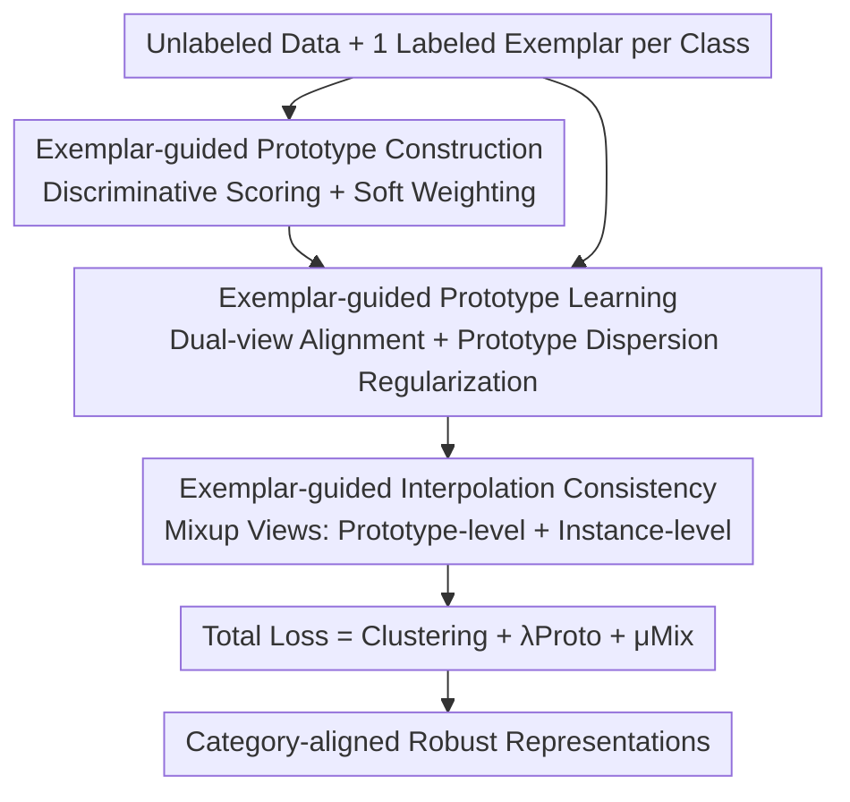

# One-Shot Exemplars for Class Grounding in Self-Supervised Learning

**Conference**: ICLR 2026  
**OpenReview**: [https://openreview.net/forum?id=Anv4gdNFaL](https://openreview.net/forum?id=Anv4gdNFaL)  
**Code**: None  
**Area**: Self-Supervised / Representation Learning  
**Keywords**: Self-Supervised Learning, Class Grounding, One-Shot Annotation, Prototype Learning, Interpolation Consistency

## TL;DR
This paper proposes the OSESSL (One-Shot Exemplar SSL) setting—providing only one labeled image per class to "ground" self-supervised features into the real class space. The method constructs class prototypes using labeled exemplars and discriminative neighbors to align unlabeled data, while employing interpolation consistency to smooth decision boundaries. On CIFAR-100 and ImageNet-100, k-NN accuracy improves by approximately 3% and 6% over the Prev. SOTA.

## Background & Motivation
**Background**: Clustering-based self-supervised learning (SwAV, DINO, ReSA, etc.) is currently mainstream. These methods cluster different augmented views of the same image onto the same clusters/prototypes, showing strong performance in downstream tasks like classification, detection, and segmentation.

**Limitations of Prior Work**: Such methods **do not specify a category space** during pre-training—the model only learns "which samples should be close" without knowing the appearance of real semantic classes. Consequently, the emerging clusters are not guaranteed to align with human-defined real categories. Once a downstream task has an inherent category structure (as most classification tasks do), the quality of the learned representations is compromised.

**Key Challenge**: A natural gap exists between self-generated supervision signals and real semantic categories. This echoes the "No Free Lunch" theorem in machine learning—without any information about the target classes, representations cannot be guaranteed to converge in the correct semantic direction. However, incorporating category information through traditional semi-supervised or supervised approaches requires an annotation volume that grows linearly with sample size, which is too costly.

**Goal**: Can the gap be bridged with **minimal** annotation (independent of sample scale)? This is decomposed into two sub-problems: (1) How to expose the real category space with only one labeled image per class; (2) How to **propagate** this sparse supervision to massive unlabeled data without overfitting or collapse.

**Key Insight**: In practical scenarios, the number of categories grows much slower than the number of samples. Therefore, the total annotation complexity of "one label per class" is $O(1)$ relative to the sample size, making it nearly negligible. The authors propose an extreme one-shot setting, treating this single image as a "semantic anchor" for the class.

**Core Idea**: Construct "grounded" class prototypes using one labeled exemplar per class, then diffuse this sparse supervision to all unlabeled data through alignment and interpolation consistency.

## Method

### Overall Architecture
The method addresses "how to ground self-supervised representations to real categories using one labeled image per class." The overall pipeline involves: first selecting discriminative neighbors from unlabeled data to assemble **class prototypes** (ensuring prototypes are rooted in real classes and representative of the data distribution); then using these prototypes to **align** the assignment distributions of two augmented views of unlabeled data, propagating supervision from exemplars to the unlabeled bulk while adding dispersion regularization to prevent prototype collapse; finally extending the exemplar guidance to the **interpolation space**, applying consistency constraints on mixup samples to smooth decision boundaries. Three loss components are added to the base clustering loss for joint training, resulting in category-aligned and more discriminative representations.

### Key Designs

**1. OSESSL Setting: Exposing Real Class Space with One Labeled Exemplar per Class**

This is the problem-level contribution. Given an unlabeled set $D_u=\{x_u^{(1)},\dots,x_u^{(N)}\}$ and a labeled set with only one image per class $D_l=\{x_l^{(1)},\dots,x_l^{(C)}\}$ ($C$ is the number of classes), the goal is to utilize both during pre-training. The authors distinguish this from existing paradigms: semi-supervised learning uses labels to **directly train classification boundaries**, and few-shot learning focuses on **classifying unseen categories**. OSESSL treats a single exemplar only as a **semantic anchor** to expose the class space and guide representation learning. The annotation scale grows with the number of classes rather than samples, keeping complexity at $O(1)$. This minimal setting addresses the "No Free Lunch" problem by augmenting SSL with the missing class prior at minimal cost.

**2. Exemplar-guided Prototype Construction: Grounding and Representativeness**

Using a single labeled image directly as a prototype results in poor representativeness and high noise. The authors maintain a FIFO memory bank $\mathcal{M}=\{m^{(1)},\dots,m^{(M)}\}$ of historical unlabeled embeddings and select neighbors for each class using a **discriminative score**:

$$s^{(c)}(j) = \alpha\langle z_l^{(c)} \cdot m^{(j)}\rangle - (1-\alpha)\max_{c'\neq c}\langle z_l^{(c')}\cdot m^{(j)}\rangle$$

The first term requires samples to be **similar** to the class exemplar, while the second penalizes similarity to the nearest exemplar of other classes (i.e., being "like this class" and "unlike others"). The top-$k$ neighbors $S_c$ are combined with the exemplar into a set $P^{(c)}=\{z_l^{(c)}\}\cup\{m^{(j)}\mid j\in S_c\}$ ($|P^{(c)}|=k+1$). To suppress false positives, soft weights $\pi^{(c,j)}=\mathrm{softmax}(\langle z_l^{(c)}\cdot q^{(c,j)}\rangle)$ are calculated based on similarity to the exemplar. The final prototype is $c^{(c)}=\sum_j \pi^{(c,j)} q^{(c,j)}$. Unlike prototypes emerging purely from unsupervised clustering (like SwAV/DINO), these prototypes are **explicitly grounded in exemplars**, naturally aligning with real categories.

**3. Exemplar-guided Prototype Learning: Propagating Sparse Supervision**

For a pair of unlabeled embeddings $z,z'$, assignment distributions $p^{(i,c)},p'^{(i,c)}$ are calculated over $C$ prototypes with temperatures $\tau_s,\tau_t$. The views are aligned using cross-entropy: $L_{align}=-\frac1n\sum_i\sum_c p'^{(i,c)}\log p^{(i,c)}$. The authors derive the gradient as $\nabla_z L_{align}=(\mathbb{E}_p[c]-\mathbb{E}_{p'}[c])/\tau_s$, indicating that each unlabeled embedding is **pulled toward the prototype centroid defined by the exemplar-guided target distribution**. This is the mechanism for "propagating" sparse supervision. To prevent **prototype collapse**, a contrastive dispersion regularization $L_{disp}=\frac{1}{C(C-1)}\sum_{c\neq c'}\langle c^{(c)}\cdot c^{(c')}\rangle/\tau_s$ is added. The combined loss is $L_{proto}=L_{align}+L_{disp}$.

**4. Exemplar-guided Interpolation Consistency: Smoothing Decision Boundaries**

Sparse exemplars may lead to insufficient guidance near **decision boundaries**, causing unstable assignments. The authors extend guidance to the interpolation space: mixup is performed as $x_m=\beta x+(1-\beta)\tilde{x}'$ with $\beta\sim\mathrm{Beta}(\zeta,\zeta)$. Two complementary perspectives constrain the mixed samples. The **prototype perspective** $L_{mix\text{-}proto}$ enforces consistency between the mixed sample's assignment and the linear interpolation of the two views' assignments $p_m'^{(i)}=\beta p^{(i)}+(1-\beta)\tilde p'^{(i)}$. The **instance perspective** $L_{mix\text{-}ins}$ uses mini-batch index pseudo-labels $y_m=\beta y+(1-\beta)\tilde y$ to constrain similarity. Combined, $L_{mix}=L_{mix\text{-}proto}+L_{mix\text{-}ins}$ diffuses exemplar semantics at both semantic and instance levels, smoothing decisions in uncertain regions.

### Loss & Training
The total loss consists of the base clustering alignment loss, prototype learning loss, and interpolation consistency loss:

$$L = L_{cluster} + \lambda L_{proto} + \mu L_{mix}$$

where $\lambda,\mu$ are positive weight coefficients. Implementation uses ReSA as the clustering baseline with ResNet and ViT backbones. For prototype construction, $k=8$ neighbors are selected, temperatures are $\tau_s=0.1, \tau_t=0.04$, and $\alpha=0.75$.

## Key Experimental Results

### Main Results
Linear and k-NN (k=5) accuracy for ResNet-18 trained on CIFAR (1000 epochs) and ImageNet-100 (400 epochs):

| Dataset | Metric | Ours | ReSA (Prev. SOTA) | Gain |
|--------|------|------|----------|------|
| CIFAR-10 | k-NN | 94.20 | 93.02 | +1.2 |
| CIFAR-100 | linear | 75.47 | 72.21 | +3.3 |
| CIFAR-100 | k-NN | 69.89 | 66.83 | +3.1 |
| ImageNet-100 | linear | 83.88 | 82.24 | +1.6 |
| ImageNet-100 | k-NN | 80.42 | 74.56 | +5.9 |

On ImageNet-1K (ResNet-50, linear evaluation), the method leads consistently: reaching 74.6% (256 batch, 200 epochs) and 76.4% (1024 batch, 800 epochs), surpassing ReSA and MoCoV3. It even outperforms semi-supervised methods like PAWS / Suave using 1% labels (12,811 labels), while this method uses only 1,000. With 1% labels (`Ours*`), it reaches 76.8%. ViT-S/16 results (74.7 linear / 70.9 k-NN) also show optimality.

### Ablation Study
Transfer and semi-supervised validation (ResNet-50, ImageNet-1K pre-trained):

| Setting | Metric | Ours | ReSA | Description |
|------|------|------|------|------|
| Semi-supervised 1% | top-1 | 61.3 | 56.4 | Fine-tune 1% subset |
| Semi-supervised 10% | top-1 | 72.5 | 70.4 | Fine-tune 10% subset |
| Transfer Food-101 | k-NN(20) | 64.2 | 61.3 | Fine-grained, +2.9 |
| Transfer CUB-200 | k-NN(20) | 60.5 | 59.9 | Fine-grained |
| Transfer Pets-37 | k-NN(20) | 88.3 | 87.5 | Fine-grained |

### Key Findings
- Gains are more pronounced in **k-NN** metrics (ImageNet-100 k-NN +5.9 vs linear +1.6), indicating that class grounding primarily improves **neighborhood consistency/separability**.
- Surpassing semi-supervised methods using ~13x fewer labels validates the high cost-effectiveness of the "one exemplar per class" setting.
- Improvements are more significant in fine-grained transfer tasks (e.g., Food-101), suggesting grounded representations are more sensitive to subtle class differences.

## Highlights & Insights
- **Problem setting as a contribution**: OSESSL utilizes $O(1)$ annotation complexity to leverage class grounding, a concept with high transfer value—it removes the linear scaling constraint of labels in semi-supervised learning.
- **Discriminative neighbor selection**: The formula $\alpha\langle\text{intra}\rangle-(1-\alpha)\max_{c'}\langle\text{inter}\rangle$ simultaneously encodes "similarity to class" and "dissimilarity to others," which is more effective than pure similarity for building discriminative prototypes.
- **Gradient derivation explains propagation**: Simplifying $\nabla_z L_{align}$ to a "pull toward grounded centroids" transforms the intuition of supervision diffusion into a verifiable mechanism.
- **Dual-view interpolation**: Applying constraints from both prototype (global semantic) and instance (local discriminative) perspectives for mixup samples is a robust regularization strategy.

## Limitations & Future Work
- The method relies on the "at least one **clean** exemplar per class" assumption; performance may degrade in noisy label scenarios.
- A single exemplar may be insufficient for "highly multi-modal" classes. While neighbors help, their quality depends on the initial features, posing a cold-start risk.
- ImageNet weight $\mu=0.25$ suggests interpolation sensitivity.
- Future work: Upgrade single exemplars to "prototype distributions" to cover intra-class diversity or introduce robustness to noisy exemplars.

## Related Work & Insights
- **vs. Clustering SSL (SwAV / DINO / ReSA)**: These emerge prototypes purely from unsupervised clustering without grounding; the Ours prototypes are explicitly rooted in exemplars, making them more stable for tasks with inherent category structures.
- **vs. Supervised Contrastive / Semi-supervised (SupCon / PAWS / Suave)**: These assume abundant labels proportional to sample size; Ours uses one exemplar as an anchor, decoupling cost from sample size while outperforming them at low label budgets.
- **vs. Few-Shot Learning**: Few-shot focuses on unseen classes; Ours uses exemplars to ground the "known class space," correcting the mismatch between SSL and semantic reality.

## Rating
- Novelty: ⭐⭐⭐⭐⭐ (OSESSL is a clean and effective new setting)
- Experimental Thoroughness: ⭐⭐⭐⭐ (Broad coverage, though some ablation values are in appendices)
- Writing Quality: ⭐⭐⭐⭐ (Clear chain from motivation to mechanism)
- Value: ⭐⭐⭐⭐⭐ (Significant gains for extremely low cost)

<!-- RELATED:START -->

## Related Papers

- [\[ICLR 2026\] On the Alignment Between Supervised and Self-Supervised Contrastive Learning](on_the_alignment_between_supervised_and_self-supervised_contrastive_learning.md)
- [\[ICLR 2026\] Two-Way is Better Than One: Bidirectional Alignment with Cycle Consistency for Exemplar-Free Class-Incremental Learning](two-way_is_better_than_one_bidirectional_alignment_with_cycle_consistency_for_ex.md)
- [\[ICLR 2026\] Understanding the Learning Phases in Self-Supervised Learning via Critical Periods](understanding_the_learning_phases_in_self-supervised_learning_via_critical_perio.md)
- [\[ICLR 2026\] Equivariant Splitting: Self-supervised learning from incomplete data](equivariant_splitting_self-supervised_learning_from_incomplete_data.md)
- [\[ICLR 2026\] Soft Equivariance Regularization for Invariant Self-Supervised Learning](soft_equivariance_regularization_for_invariant_self-supervised_learning.md)

<!-- RELATED:END -->
