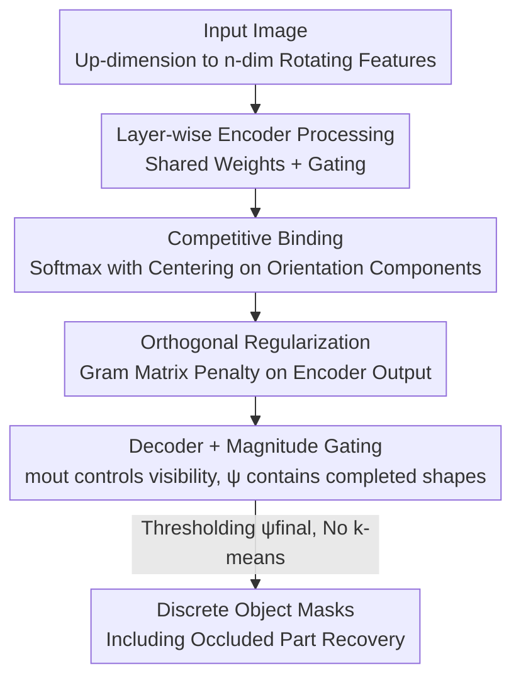

# OrthoRF: Exploring Orthogonality in Object-Centric Representations

**Conference**: ICLR 2026  
**OpenReview**: [https://openreview.net/forum?id=GjQ5JXpRQF](https://openreview.net/forum?id=GjQ5JXpRQF)  
**Code**: TBD  
**Area**: Self-Supervised / Representation Learning / Object-Centric Learning / Unsupervised Object Discovery  
**Keywords**: Object-Centric Learning, Synchronous Binding, Rotating Features, Orthogonality Constraint, Occlusion Completion

## TL;DR
Building on unsupervised object discovery frameworks like Rotating Features (RF) that "bind objects via phase synchrony," OrthoRF enforces orthogonality in an $n$-dimensional orientation space through softmax competitive binding and an inner-product orthogonal loss. This allows objects to occupy distinct dimensions, eliminating the need for post-hoc k-means clustering. The method matches or exceeds existing techniques in overlapping, noisy, or out-of-distribution scenarios and can recover occluded object parts within the intermediate representations.

## Background & Motivation

**Background**: Decomposing scenes into individual objects (Object-Centric Learning, OCL) is a classic computer vision problem focused on the "binding problem"—how to integrate scattered features like color, shape, and texture into a unified object perception. Current research follows two main paradigms: 1) **Slot-based** (e.g., Slot Attention), which uses a set of discrete slot vectors where each slot corresponds to an object, yielding naturally discrete outputs; 2) **Synchrony-based**, inspired by neuroscience's "neural synchrony," which encodes object identity into the **phase** of complex-valued or vector-valued activations. By leveraging constructive/destructive interference, features of the same object align in phase while those of different objects separate. Representative works include the Complex Autoencoder (CAE) and its vector-valued successor, **Rotating Features (RF)**.

**Limitations of Prior Work**: Although synchrony-based methods are flexible, they produce **distributed representations**—information about a single object is scattered across multiple orientation dimensions. To recover objects, **post-hoc k-means clustering** must be performed in the phase space. This pipeline is fragile: one object might span multiple dimensions (redundancy/blurred boundaries), and in **overlapping regions**, features often drift from cluster centers, leading to uncertain assignments. Consequently, many evaluations exclude overlapping areas—the very places where robust binding is most needed.

**Key Challenge**: There is a contradiction between the flexibility of distributed encoding and the requirements for direct usability and reliability in overlapping regions. RF implements binding through a gating mechanism with poor interpretability; improved versions like cosine binding are transparent but incur high memory costs due to storing numerous similarity pairs.

**Key Insight**: Evidence suggests that **orthogonality** enhances representation efficiency and promotes decoupling. If orthogonal constraints are imposed on the orientation space of RF, forcing each object to "collapse" into a single dimension of an $n$-dimensional space, it might preserve RF’s advantages (phase synchrony, occlusion cues) while eliminating redundancy, removing the need for clustering, and turning overlap uncertainty into a reliable signal for occlusion recovery.

**Core Idea**: Apply an orthogonal inductive bias in the orientation space of Rotating Features—using softmax competition to drive each object into a single orientation component (approximated one-hot encoding) and an inner-product loss to force 90° orthogonality between different object orientation axes.

## Method

### Overall Architecture

OrthoRF is built upon the RF autoencoder. The foundation of RF involves "up-aligning" scalar features into $n$-dimensional vectors $z_{rotating}\in\mathbb{R}^{n\times d}$, where the **magnitude** $m=\|z_{rotating}\|_2$ represents standard neural activation (presence of a feature) and the **orientation** encodes object identity. Each layer processes inputs using weights $w$ shared across $n$ components, and a gating mechanism allows features with similar orientations to reinforce each other while suppressing dissimilar ones (Eqs. 1–5). The image is reconstructed using the pixel-wise magnitude of the final activation, trained via a simple MSE reconstruction loss $L_{REC}$. Object discovery traditionally relies on k-means on $z_{final}$.

OrthoRF introduces two changes and one loss to this framework: **(i) Competitive Binding**—a softmax is added across orientation components in each layer to turn the "object-to-component" assignment into a discrete competition; **(ii) Orthogonal Regularization**—an inner-product loss at the encoder output penalizes similarity between different orientation components. Together, these force same-object features into a single dimension, creating a one-hot-like object encoding that **obviates post-hoc clustering** and allows the intermediate representation $\psi_{final}$ to reveal occluded object shapes.

### Key Designs

**1. Competitive Binding in Orientation Space: Using Centered Softmax to Drive Objects into Single Components**

To address the issue where objects are scattered across dimensions, OrthoRF borrows from multi-class softmax and Slot Attention's competition mechanism. A softmax is applied across orientation components at **each layer** to create "winner-take-all" assignments. Specifically, after obtaining the intermediate output $\psi\in\mathbb{R}^{n\times d}$ (where row $i$ is the orientation component and column $j$ is the feature), a softmax is performed for each feature $j$ across components after subtracting the mean logit:

$$\psi'_{ij}=\frac{\exp(\psi_{ij}-\bar\psi_j)}{\sum_{k=1}^{n}\exp(\psi_{kj}-\bar\psi_j)},\qquad \bar\psi_j=\frac1n\sum_{k=1}^{n}\psi_{kj}.$$

**Centering** (applied only to encoder outputs) is the key stabilizer: direct softmax often leads to "component collapse," where all features map to a single component while others remain idle. Subtracting the per-feature mean removes biases that favor a single component (a trick adapted from DINO's centering), preventing collapse and ensuring all components are utilized.

**2. Inner-Product Orthogonal Regularization: Forcing 90° Separation via Gram Matrix**

Competition alone is insufficient to "align" objects. An orthogonal loss is added at the encoder output, where features are globally aggregated and computationally cheaper. For encoder output $z\in\mathbb{R}^{bs\times n\times z_{dim}}$, centering is performed along the orientation components to get $\tilde z$. For each sample, the $n$ orientation vectors are stacked as rows of $\tilde Z_i\in\mathbb{R}^{n\times z_{dim}}$ to construct a Gram matrix $G_i=\tilde Z_i\tilde Z_i^\top\in\mathbb{R}^{n\times n}$. The off-diagonal elements $(G_i)_{k\ell}$ represent the inner products between different components $k$ and $\ell$, which should approach 0. The loss penalizes the squared magnitude of these off-diagonal terms:

$$L_{ortho}=\frac{1}{bs\,n(n-1)}\sum_{i=1}^{bs}\sum_{k\neq\ell}(G_i)^2_{k\ell}.$$

This forces cross-component similarity to zero, decorrelating embeddings and achieving orthogonality. The total objective is: $L_{total}=L_{REC}+\lambda L_{ortho},\ \lambda>0$. This transforms the "one object = one orthogonal axis" tendency into an explicit constraint.

**3. Occlusion Completion via Magnitude Gating: Turning Uncertainty into Occlusion Cues**

This is an emergent property of OrthoRF. In the final binding step (Eq. 5) $z_{out}=m_{out}\odot\frac{\psi}{\|\psi\|_2}$, the magnitude $m_{out}$ acts as a **visibility gate**: visible areas pass through, while occluded ones are suppressed. Crucially, the content **before gating**, $\psi$, retains the **completed shape after occlusion recovery**. This occurs because $\psi$ is predicted from learned shape priors under the reconstruction target, filling in parts behind occluders, while $m_{out}$ only encodes "what is visible." This selective behavior relies on the softmax competitive binding to yield clean gating. Consequently, discrete masks can be obtained by thresholding $\psi_{final}$ at 0.1, **eliminating k-means** and enabling the recovery of occluded parts—a feat not demonstrated by slot-based or prior synchrony-based methods.

Furthermore, since weights are shared across orientation components and each component is processed identically, OrthoRF maintains **permutation equivariance** $f(\Pi x)=\Pi f(x)$, similar to Slot Attention.

### Loss & Training
The total loss is the reconstruction MSE plus the orthogonal term: $L_{total}=L_{REC}+\lambda L_{ortho}$. $\lambda$ ranges between 0.08–0.8 depending on the dataset. Implemented with a convolutional autoencoder, optimized via Adam with a batch size of 16 for 100–200k steps, using CosineAnnealingLR. Experiments were conducted on a single NVIDIA Tesla T4 (16GB) using PyTorch.

## Key Experimental Results

### Main Results

On the 4Shapes dataset, comparing visible object discovery and shape completion ($MBO^{OV}_i$ measures whole-object recovery including overlap), OrthoRF matches RF in visibility but significantly leads in shape completion:

| Setting / Model | n | ARI-BG ↑ | MBOi ↑ | MBO$^{OV}_i$ ↑ |
|------|---|---------|--------|---------|
| RF (k-means, $z_{final}$) | 5 | 0.975 | 0.934 | 0.805 |
| OrthoRF (k-means, $z_{final}$) | 5 | 0.9995 | 0.989 | 0.820 |
| OrthoRF (Threshold $\psi_{final}$) | 5 | 0.993 | 0.984 | **0.983** |

The key is in the last column: using thresholded $\psi_{final}$, OrthoRF achieves an $MBO^{OV}_i$ of ~0.98 at $n=5$, whereas $z_{out}$ metrics for RF/OrthoRF are only ~0.80. This is because k-means forces a single label per pixel, causing overlaps to be assigned to only one object; thresholding $\psi_{final}$ allows multi-label assignments in overlapping regions. Additionally, OrthoRF remains stable when $n$ is much larger than the number of objects (e.g., $n=20$), whereas RF degrades.

Cross-dataset results are also superior:

| Dataset | Model | ARI-BG ↑ | MBOi ↑ |
|--------|------|---------|--------|
| SEM (No Noise) | RF / OrthoRF | 0.955 / **0.991** | 0.683 / **0.717** |
| SEM (With Noise) | RF / OrthoRF | 0.694 / **0.761** | 0.415 / **0.564** |
| Shapes (2–4 obj, n=8) | RF / OrthoRF | 0.744 / **0.833** | 0.780 / **0.865** |
| MNIST&Shape | RF / OrthoRF | 0.972 / **0.996** (ARI-BG) | — |

On SEM (stacked semiconductor materials with heavy occlusion), OrthoRF shows strong OOD generalization: clean training → noisy testing ARI-BG drops only slightly (0.991 to 0.984). The reverse (noisy training → clean testing) shows a larger drop (0.836 to 0.761), likely because training on noise learns smoothed boundaries that underfit sharp edges. On MNIST&Shape, SA and DBM fail (SA due to MNIST digits exceeding receptive fields and difficulty with grayscale inputs).

### Ablation Study

Dissecting "Softmax Centering (SC)" and "Orthogonal Loss (λ)" on 4Shapes:

| SC | λ | MSE ↓ | ARI ↑ | MBOi ↑ | Description |
|----|---|-------|-------|--------|------|
| No | 0 | 0.0005 | 0.975 | 0.934 | RF Baseline |
| No | 0.1 | 0.0002 | 0.853 | 0.868 | Ortho loss only (Performance drops) |
| Yes | 0 | 0.0034 | 0.628 | 0.688 | Competitive softmax only (Collapses) |
| Yes | 0.1 | 0.0002 | **0.9995** | **0.9887** | Both (Nearly perfect) |

### Key Findings
- **Strong synergy between components**: Adding softmax competition (ARI 0.628) or orthogonal loss (ARI 0.853) individually performs worse than the RF baseline. Only together do they achieve near-perfect metrics (ARI 0.9995). Competition pushes objects into single components, while orthogonality ensures these components are properly separated.
- **Orthogonality is successfully encoded**: In phase space, the average pairwise cosine angle for OrthoRF on 4Shapes is 86.86°±4.39 (near 90°), while RF is only 69.28°±13.91. Intra-class angles for OrthoRF are just 1.09° (tight clusters) compared to the massive variance in RF.
- **Occlusion recovery is a direct benefit of removing k-means**: Converting "uncertainty in overlapping regions" into readable completed shapes via $\psi$ is a unique capability not seen in slot-based or previous synchrony-based methods.

## Highlights & Insights
- **Complete removal of post-hoc clustering**: Eliminating k-means from the pipeline is a significant simplification. OrthoRF forces objects to occupy specific axes during training, allowing masks to be obtained by simple thresholding.
- **Turning overlapping uncertainty into occlusion cues**: Rather than treating overlapping areas as noise to be excluded, the authors read completed shapes from $\psi$ before gating, turning a historical weakness into a feature.
- **Centering trick to prevent collapse**: The use of per-feature mean logit subtraction (borrowed from DINO) to prevent component collapse is a transferable technique for any unsupervised competitive assignment task.
- **Orthogonality as a simple inductive bias**: Without complex modules, just an inner-product loss and a softmax layer convert distributed encoding into near one-hot discrete encoding, proving orthogonality is a cheap yet effective prior for synchrony-based OCL.

## Limitations & Future Work
- Evaluation is limited to synthetic/semi-synthetic data (4Shapes, MNIST&Shape, SEM). Generalization to natural images with complex textures remains unverified.
- The orientation dimension $n$ needs to roughly match the number of objects; when $n$ is smaller than the object count, OrthoRF's performance drops below RF's distributed representation.
- $\lambda$ requires manual tuning (0.08–0.8) for different datasets, and the distinction between "background and objects" is not perfectly symmetric in the constraint.
- Significant degradation when moving from noisy training to clean testing suggests sensitivity to the boundary sharpness of the training distribution.

## Related Work & Insights
- **vs RF (Rotating Features)**: Both use vector-valued features and gating, but RF yields distributed representations requiring k-means and performs poorly on overlaps. OrthoRF discretizes representations, removes clustering, and handles overlaps better.
- **vs CAE (Complex Autoencoder)**: CAE uses 2D phase planes; OrthoRF extends this to $n$-dimensional space and explicitly orthogonalizes it, outperforming CAE on 4Shapes/MNIST&Shape.
- **vs Slot Attention**: SA is naturally discrete but relies on attention competition rather than phase synchrony. OrthoRF achieves slot-like discrete properties within a synchrony framework and adds occlusion completion.
- **vs AKOrN / ItrSA**: Synchrony methods based on Kuramoto oscillators. OrthoRF performs better on Shapes (ARI-BG 0.833 vs 0.713) where object counts and shapes vary randomly.

## Rating
- Novelty: ⭐⭐⭐⭐ Using orthogonality as an inductive bias for synchrony-based OCL to eliminate clustering and unlock occlusion recovery is a clear, grounded contribution.
- Experimental Thoroughness: ⭐⭐⭐⭐ Four datasets plus extensive hyperparameter sweeps and quantitative separation analysis, though lacking natural image validation.
- Writing Quality: ⭐⭐⭐⭐ Logical flow from motivation to method and properties; excellent integration of formulas and qualitative figures.
- Value: ⭐⭐⭐⭐ Provides a simple, reusable orthogonal prior for synchrony-based discovery; occlusion recovery has practical implications for industrial applications like SEM.

<!-- RELATED:START -->

## Related Papers

- [\[CVPR 2026\] Towards Stable Self-Supervised Object Representations in Unconstrained Egocentric Video](../../CVPR2026/self_supervised/towards_stable_self-supervised_object_representations_in_unconstrained_egocentri.md)
- [\[ICLR 2026\] Mechanistic Independence: A Principle for Identifiable Disentangled Representations](mechanistic_independence_a_principle_for_identifiable_disentangled_representatio.md)
- [\[ICLR 2026\] A Bayesian Nonparametric Framework for Learning Disentangled Representations](a_bayesian_nonparametric_framework_for_learning_disentangled_representations.md)
- [\[ICLR 2026\] Self-Predictive Representations for Combinatorial Generalization in Behavioral Cloning](self-predictive_representations_for_combinatorial_generalization_in_behavioral_c.md)
- [\[ICLR 2026\] Midway Network: Learning Representations for Recognition and Motion from Latent Dynamics](midway_network_learning_representations_for_recognition_and_motion_from_latent_d.md)

<!-- RELATED:END -->
